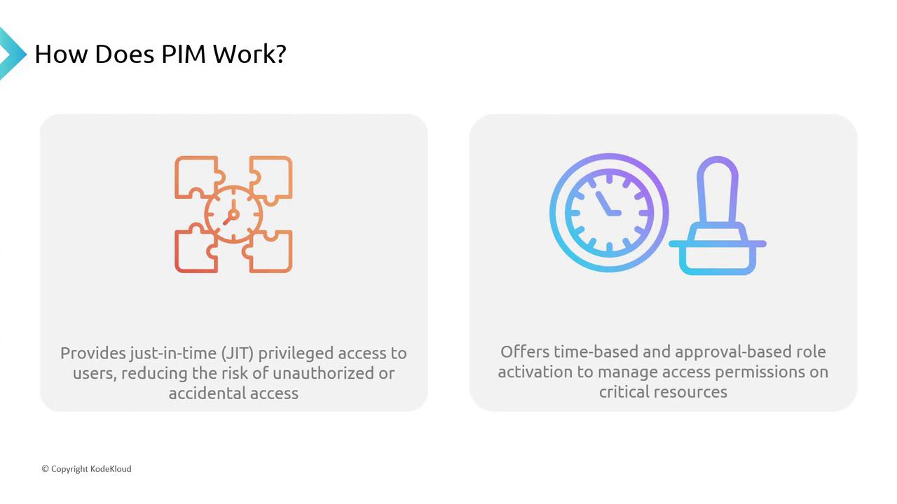
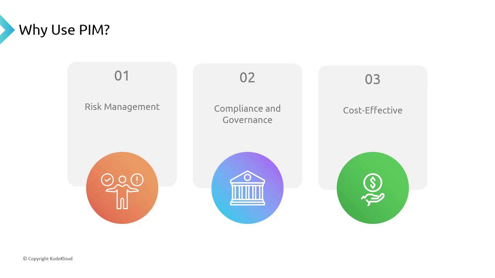

# Generate embeddings for each row in the 'text' column
df = df.assign(embedding=df["text"].apply(lambda x: text_embedding(x)))
```

<Callout icon="lightbulb">
  Generating embeddings for a large dataset may take some time. For 121 rows, expect multiple API calls.
</Callout>

Inspect the new `embedding` column:

```python theme={null}
df.head()
```

Example output:

```text theme={null}
   year_film  year_ceremony  ceremony                    category                     name                      film  winner                                               text                                           embedding
10639      2022            2023        95       actor in a leading role           Austin Butler                    Elvis   False                 Austin Butler got nominated under the category...                [–0.0378, –0.0199, …]
10640      2022            2023        95       actor in a leading role         Colin Farrell       The Banshees of Inisherin   False                 Colin Farrell got nominated under the category...                [–0.0082, –0.0100, …]
…          …               …       …                                 …                          …                         …      …                                               …                                               …
```

To view a specific example:

```python theme={null}
df["text"].iloc[100]
# Output:
# 'Viktor Prášil, Frank Kruse, Markus Stembler, Lars Ginzel and Stefan Korte got nominated under the category, sound, for the film All Quiet on the Western Front but did not win'
```

## 2. Define a Similarity Function

We'll use the dot product to measure vector similarity:

```python theme={null}
import numpy as np

def vector_similarity(vec1, vec2):
    return np.dot(np.squeeze(np.array(vec1)), np.squeeze(np.array(vec2)))
```

## 3. Querying the DataFrame with Similarity Search

When asking a question (e.g., “Who won the Best Picture award?”), follow these steps:

1. **Embed the query**
2. **Compute similarity** against each row
3. **Select top candidates**

```python theme={null}
# 1. Embed the query
query = "Who won the Best Picture award?"
query_embedding = text_embedding(query)

# 2. Compute similarity for each row
df["similarity"] = df["embedding"].apply(lambda x: vector_similarity(x, query_embedding))

# 3. Retrieve top 20 matches
top_res = df.nlargest(20, "similarity")
```

## 4. Build the Context Block

Concatenate the top candidates into one string:

```python theme={null}
context = "\n".join(top_res["text"])
print(context)
```

Now craft the prompt and call the API:

````python theme={null}
prompt = f"""
From the data provided in three backticks, respond to the question: {query}
```{context}```
"""

result = get_word_completion(prompt)
print(result)
```text

Expected output:

````

The film "Everything Everywhere All at Once" won the Best Picture award at the 95th Oscar awards.

````text theme={null}

<Callout icon="triangle-alert" color="#FF6B6B">
Keep an eye on token limits when concatenating many text entries into `context`.
</Callout>

## 5. Try a Different Question

For example, “Who is the lyricist for RRR?”:

```python
query = "Who is the lyricist for RRR?"
query_embedding = text_embedding(query)

# Recompute similarities and get top matches
df["similarity"] = df["embedding"].apply(lambda x: vector_similarity(x, query_embedding))
top_res = df.nlargest(20, "similarity")
context = "\n".join(top_res["text"])

# Craft prompt and call API
prompt = f"""
From the data provided in three backticks, respond to the question: {query}
```{context}```
"""

result = get_word_completion(prompt)
print(result)
````

Expected response:

```text theme={null}
The lyricist for RRR is Chandra Bose.
```

## 6. Resources and References

| Resource                         | Description                            | Link                                                                                                                                             |
| -------------------------------- | -------------------------------------- | ------------------------------------------------------------------------------------------------------------------------------------------------ |
| pandas DataFrame                 | Data manipulation and analysis         | [https://pandas.pydata.org/](https://pandas.pydata.org/)                                                                                         |
| OpenAI Embeddings API            | Generate vector embeddings             | [https://openai.com/embeddings](https://openai.com/embeddings)                                                                                   |
| NumPy                            | Numerical computing in Python          | [https://numpy.org/](https://numpy.org/)                                                                                                         |
| Best Practices for Prompt Design | Tips for crafting effective AI prompts | [https://platform.openai.com/docs/guides/chat/completions-prompt-design](https://platform.openai.com/docs/guides/chat/completions-prompt-design) |

***

This workflow—building dynamic context from a DataFrame using embeddings, then crafting prompts on the fly—unlocks powerful generative AI applications with OpenAI.

<CardGroup>
  <Card title="Watch Video" icon="video" href="https://learn.kodekloud.com/user/courses/mastering-generative-ai-with-openai/module/cf879fc5-dcc3-4470-830d-4393645105c9/lesson/ad69eb15-6828-4cde-8497-48ae10cfce23" />

  <Card title="Practice Lab" icon="installation" href="https://learn.kodekloud.com/user/courses/mastering-generative-ai-with-openai/module/cf879fc5-dcc3-4470-830d-4393645105c9/lesson/ccfb6f10-72b1-43e1-a9a7-c0836f996463" />
</CardGroup>


# Azure AD Privileged Identity Management

Source: https://notes.kodekloud.com/docs/Microsoft-Azure-Security-Technologies-AZ-500/Azure-AD-Privileged-Identity-Management/Azure-AD-Privileged-Identity-Management/page

Azure AD Privileged Identity Management is a service for managing, controlling, and monitoring access to critical resources across various platforms.

Azure AD Privileged Identity Management (PIM) is a robust service that empowers organizations to manage, control, and monitor access to critical resources across Azure, Azure AD, Office 365, and various SaaS applications. In this article, we delve into the fundamentals of PIM, exploring how it operates and why it transforms security management for enterprises.

## Key Features of PIM

PIM's primary goal is to significantly reduce the number of users with permanent access to secure information. Consider an IT administrator who needs temporary access to a confidential database. With PIM, only authorized individuals are granted temporary privileges, effectively reducing the risk of security breaches.

### Just-in-Time (JIT) Access

PIM leverages just-in-time privileged access to provide elevated permissions only when they are necessary and for a limited duration. This means that once an IT administrator is granted access to a resource, the privileges are automatically revoked after a designated period, thereby reducing the risk of unauthorized or accidental exposure.

### Time-Based and Approval-Based Role Activation

Another major advantage of PIM is its support for both time-based and approval-based activations. For instance, when a developer requires access to a critical service, their request is reviewed and approved by a designated administrator. The access is then activated for a pre-determined time frame—such as 2 or 8 hours—ensuring that elevated permissions are strictly temporary.

<Frame>
  
</Frame>

<Callout icon="lightbulb">
  PIM's design is aligned with the principle of least privilege, ensuring that users obtain only the minimum necessary access to perform their tasks.
</Callout>

## Why Use PIM?

PIM introduces an additional layer of security by replacing direct, permanent access assignments with temporary, controlled permissions. Below are the key benefits:

| Benefit                   | Description                                                                                        |
| ------------------------- | -------------------------------------------------------------------------------------------------- |
| Risk Management           | Mitigates internal and external threats by reducing excessive or inappropriate access.             |
| Compliance and Governance | Ensures adherence to regulatory standards such as GDPR and HIPAA, protecting both data and assets. |
| Cost-Effectiveness        | Centralizes and automates access control, reducing administrative overhead and associated costs.   |

<Frame>
  
</Frame>

**Risk Management:** PIM minimizes the chance of data breaches by limiting the duration and scope of privileged access, aligning with the zero trust security model—always verify and assume breach.

**Compliance and Governance:** By implementing temporary access and strict approval processes, PIM helps organizations meet regulatory requirements and maintain strong governance practices.

**Cost-Effectiveness:** Automating and centralizing the management of privileged access cuts down administrative costs, allowing organizations to allocate resources more effectively.

<Callout icon="lightbulb">
  When setting up PIM, ensure that both time-based and approval-based role activations are configured correctly to fully leverage PIM's security benefits.
</Callout>

## Next Steps

This overview provides a high-level understanding of Azure AD Privileged Identity Management and its benefits. In the upcoming sections, we will explore the PIM workflow in detail, define its scope, and offer insights into best practices for implementation.

Thank you for reading.

<CardGroup>
  <Card title="Watch Video" icon="video" href="https://learn.kodekloud.com/user/courses/microsoft-azure-security-technologies-az-500/module/4c177d01-df52-459d-8089-073ff3170c4f/lesson/d9ac2d3f-12c3-442e-ab8c-ca30fbf895fc" />
</CardGroup>
