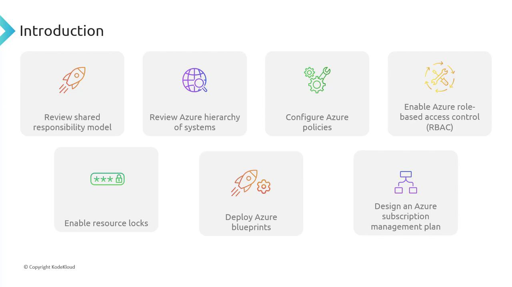

# Introduction

Source: https://notes.kodekloud.com/docs/Microsoft-Azure-Security-Technologies-AZ-500/Enterprise-Governance/Introduction/page

This lesson introduces a module on Enterprise Governance, covering key topics for managing and securing your Azure environment.

Welcome back! In this lesson, we’re launching our new module on Enterprise Governance. This comprehensive module covers several pivotal topics for managing and securing your Azure environment. You will learn about:

* The Shared Responsibility Model
* Azure Hierarchy
* Azure Policies
* Role-Based Access Control (RBAC)
* Resource Logs
* Azure Blueprints
* Subscription Management

<Frame>
  
</Frame>

<Callout icon="lightbulb">
  The topics outlined provide a solid foundation for understanding enterprise governance in Azure and are essential for optimizing cloud security and compliance.
</Callout>

Let’s begin by exploring the Shared Responsibility Model.

<CardGroup>
  <Card title="Watch Video" icon="video" href="https://learn.kodekloud.com/user/courses/microsoft-azure-security-technologies-az-500/module/3c48a4f2-a6f3-45fd-87d7-c53f36f2fb2a/lesson/910c8404-01c3-494a-af3b-a7d66305b1bd" />
</CardGroup>
