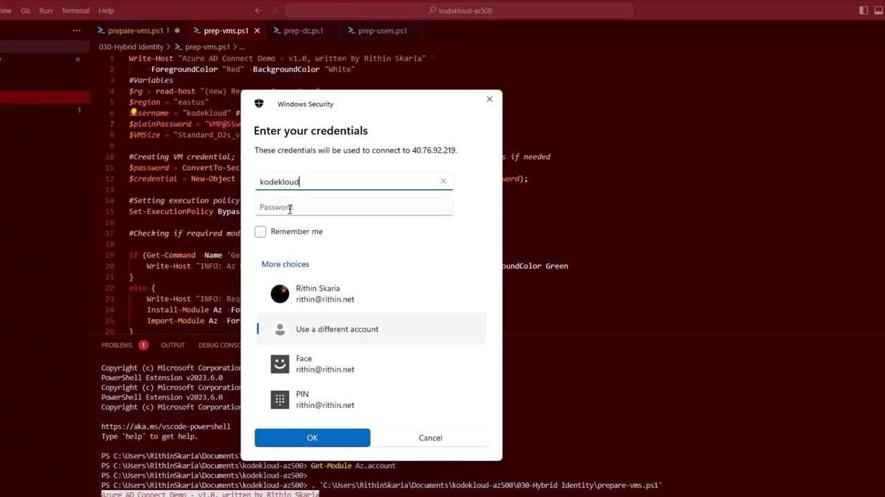
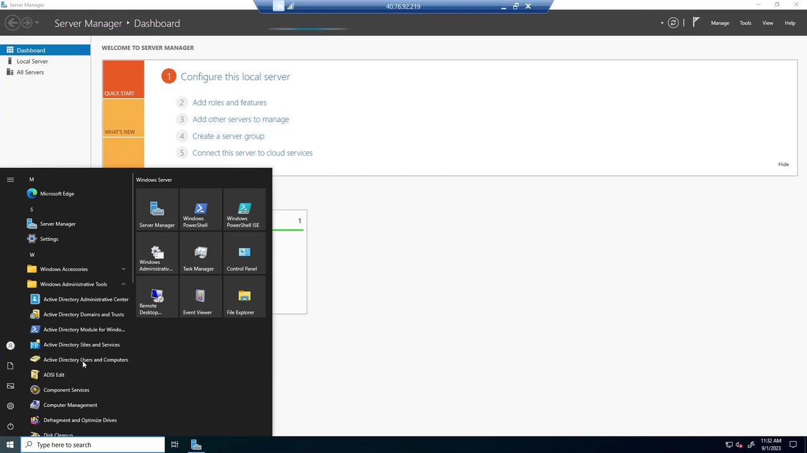
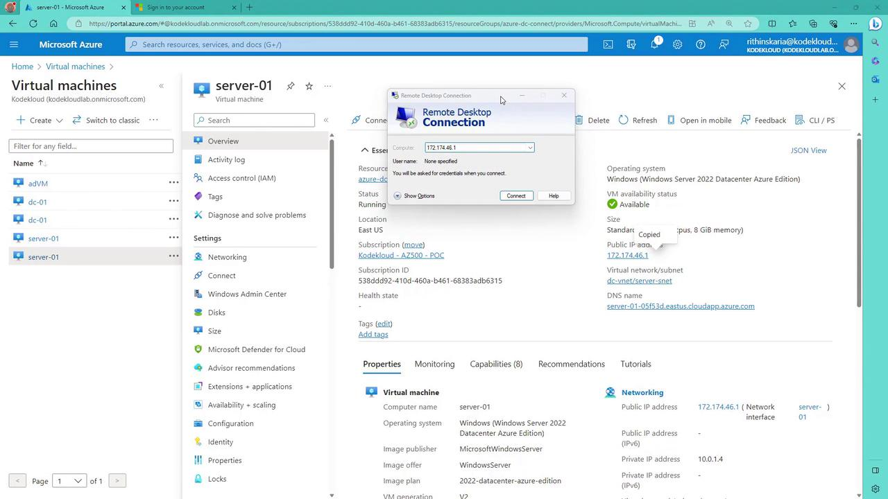
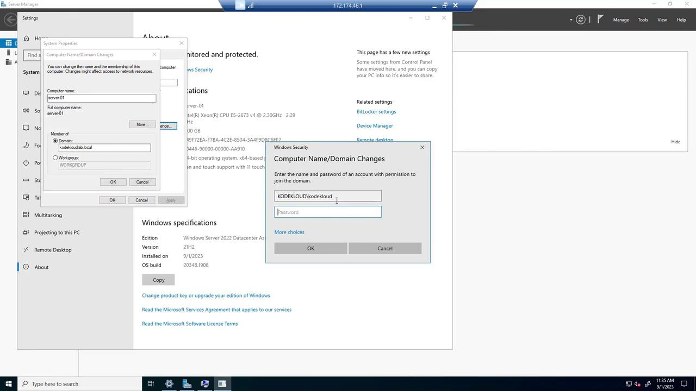
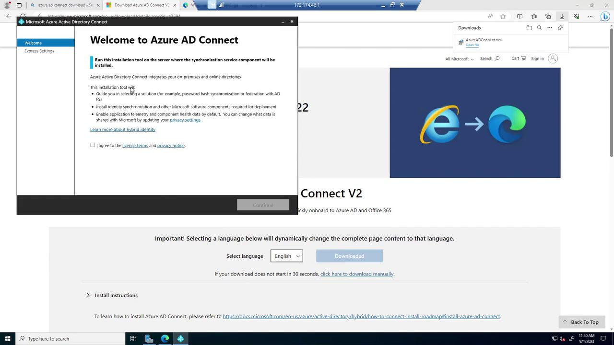
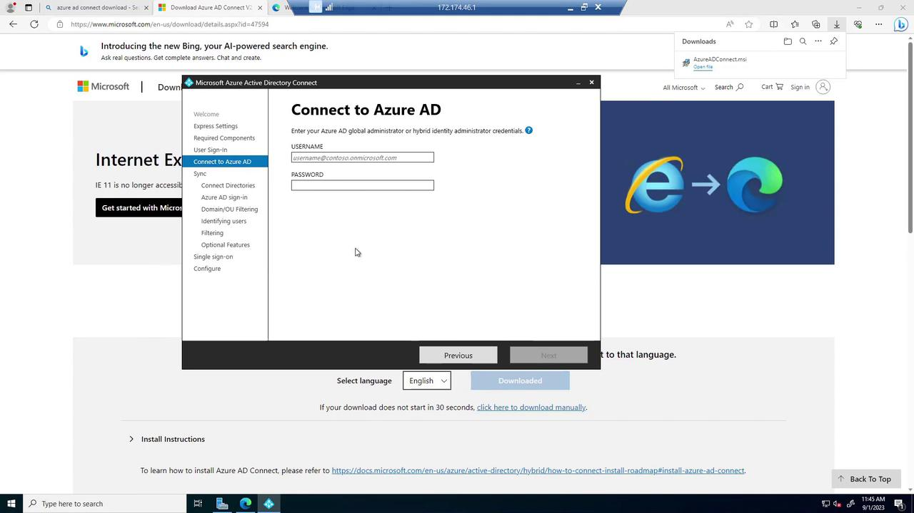
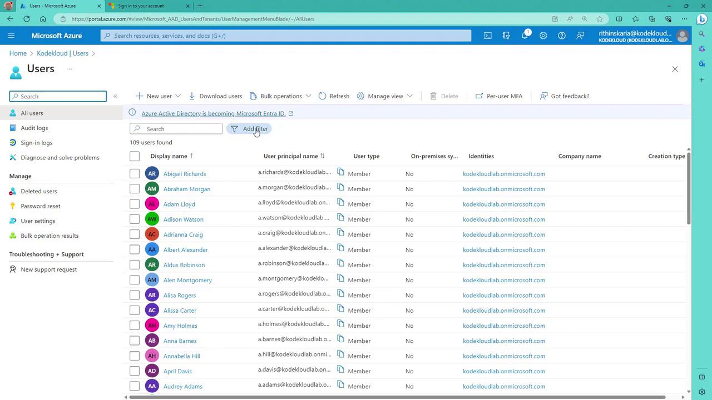
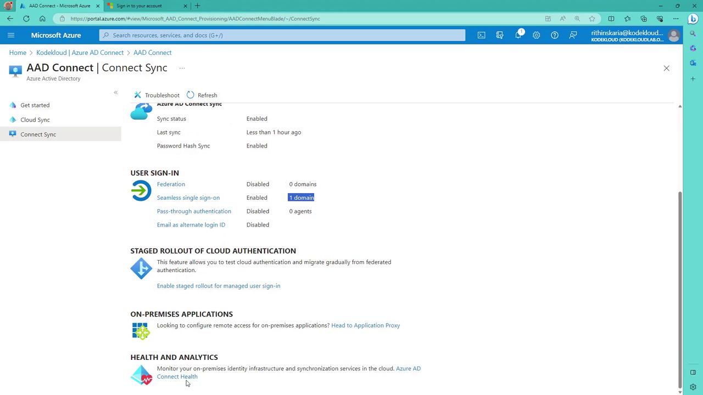
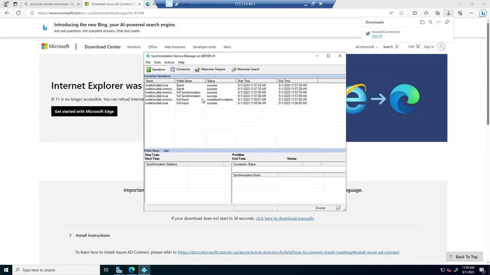

# Variables
$rg = Read-Host "New Resource Group Name"
$region = "eastus"
$username = "kodekloud#username for the VM"
$plainPassword = "V@P5$w0rd"  # Your VM password
$VMSize = "Standard_D2s_v3"

# Create VM credential
$password = ConvertTo-SecureString $plainPassword -AsPlainText -Force
$credential = New-Object System.Management.Automation.PSCredential ($username, $password)

# Set execution policy
Set-ExecutionPolicy Bypass

# Check if required modules are installed
if (Get-Command -Name 'Get-AzContext' -ErrorAction SilentlyContinue) {
    Write-Host "INFO: Az Module is already installed, skipping to next step" -ForegroundColor Green
} else {
    Write-Host "INFO: Requires installation of Az module" -ForegroundColor Yellow
    Install-Module Az -Force -AllowClobber
    Import-Module Az -Force
}
```

After the script runs, you should see confirmation of module installation:

```plaintext theme={null}
Copyright (c) Microsoft Corporation.
PowerShell Extension v2022.6.0
PS C:\Users\RithinSkaria\Documents\kodekloud-az500> Get-Module Az
PS C:\Users\RithinSkaria\Documents\kodekloud-az500> Get-Module Az.Account
```

A Windows Security prompt will then appear to verify your credentials for RDP connectivity.

<Frame>
  
</Frame>

Once logged into the server, allow time for Server Manager to launch. Open "Active Directory Users and Computers" (found in Windows Administrative Tools) to view the domain users created by the script.

<Frame>
  
</Frame>

## Creating User Accounts with the "prep-users" Script

The "prep-users" script uses a loop to generate user accounts with preset credentials. Below is an example snippet:

```powershell theme={null}
# Set values for your environment
$Users = 10
$UserPrefix = "KodeKloud-User"
$PassWord = "UserP@ssw0rd"
$UserDomain = "KodeKloudlab.local"  # Update with your custom domain name

# Import the AD Module
Import-Module ActiveDirectory

# Convert the password to a secure string
$UserPass = ConvertTo-SecureString $PassWord -AsPlainText -Force

# Add the users
for ($i = 1; $i -le $Users; $i++) {
    $newUser = $UserPrefix + $i
    New-ADUser -Name $newUser -SamAccountName $newUser -UserPrincipalName "$newUser@$UserDomain" -GivenName $newUser `
    -Surname $newUser -DisplayName $newUser -AccountPassword $UserPass -ChangePasswordAtLogon $false -PasswordNeverExpires $true -Enabled $true
}
```

After verifying the new users in Active Directory, return to the Azure portal and log into the client machine (e.g., "vc01") using its public IP address. Use the same credentials specified during VM creation.

<Frame>
  
</Frame>

## Joining the Domain and Installing Azure AD Connect

### Joining the Domain

On the client machine, complete the following steps:

1. Open System Properties (Advanced system settings) and change the computer name.
2. Join the domain by entering "kodekloud.local" as specified in the prep DC module.

The domain join script typically resembles the following:

```powershell theme={null}
Set-NetFirewallProfile -Profile Domain,Public,Private -Enabled False
$admKey = "HKLM:\SOFTWARE\Microsoft\Active Setup\Installed Components\{A59801A3-37EF-41B3-8CFC-4F3A74784073}"
Set-ItemProperty $admKey -Name "Installed" -Value 0
Add-WindowsFeature RSAT-ADDS-Tools
Install-WindowsFeature AD-Domain-Services -IncludeManagementTools
$pwd = Read-Host -AsSecureString
Install-ADDSForest -DomainName "kodekloud.local" -SafeModeAdministratorPassword $pwd -Confirm:$false -InstallDns:$true -DomainNetbiosName Kodekloud -NoRebootOnCompletion
Start-Sleep 5
Restart-Computer
```

After the computer reboots, you should receive a welcome message for the "KodeKloud lab.local" domain. Verify the client machine appears in the Computers container via "Active Directory Users and Computers" on the domain controller.

<Frame>
  
</Frame>

### Installing Azure AD Connect

With the client machine now domain joined, proceed to install Azure AD Connect:

1. Open Microsoft Edge and search for [Azure AD Connect download](https://www.microsoft.com/en-us/download/details.aspx?id=47594).
2. Download the installer, launch it, and agree to the licensing terms.

<Frame>
  
</Frame>

Choose the "Customize" option during installation. This allows you to review the components to be installed, such as a SQL Server Express instance (if you don’t already have one). For the sign-on methods, select Password Hash Synchronization (PHS) and enable Single Sign-On. Connect to Azure AD by entering the global administrator credentials for your tenant (note that lab environments might not grant global administrator privileges).

<Frame>
  
</Frame>

Next, configure the connection to your on-premises directory. Provide the custom domain name (e.g., "CloudCloudLab.local") and enter the corresponding enterprise admin credentials. After the directory schema is retrieved, the default setting for matching on-premises user principal names (UPNs) with Azure AD is applied.

<Frame>
  
</Frame>

Optional filtering (e.g., synchronizing specific Organizational Units) is available, though the defaults suit most greenfield single OU environments. You can also enable features like password writeback for disaster recovery and verify that Single Sign-On is active by providing the relevant domain credentials.

Once the configuration checks are complete, the installation and initial synchronization begin. When finished, click "Exit" to close the wizard.

## Verifying Synchronization

After installation, return to the Azure portal to confirm that on-premises users are synchronized. You can run a PowerShell script to filter and display only those accounts that have the "on-premises sync enabled" flag set to "Yes"—this will exclude the service account created during synchronization.

<Frame>
  
</Frame>

Keep in mind that the service account should not be modified or deleted. Additionally, you can monitor Azure AD Connect health metrics and sync errors from the Azure portal:

<Frame>
  
</Frame>

If necessary, you can trigger an immediate synchronization using PowerShell instead of waiting for the default 30-minute interval. The Synchronization Service Manager provides detailed logs for each sync operation.

<Frame>
  
</Frame>

## Final Thoughts

In this guide, you learned how to deploy Azure AD Connect, join client machines to a domain, and synchronize on-premises users with Azure AD using automated PowerShell scripts. This approach allows for both rapid lab deployment and further customization for production environments.

Feel free to ask questions in our community or try the lab yourself if you have your own tenant. Happy synchronizing!

<CardGroup>
  <Card title="Watch Video" icon="video" href="https://learn.kodekloud.com/user/courses/microsoft-azure-security-technologies-az-500/module/ec3dd1c7-a3f1-4d9a-ae3c-59b398091a52/lesson/fb2477a1-eea8-4a8b-a4a8-33c0bc1feaab" />
</CardGroup>


# Configure Password Hash Synchronization PHS

Source: https://notes.kodekloud.com/docs/Microsoft-Azure-Security-Technologies-AZ-500/Hybrid-Identity/Configure-Password-Hash-Synchronization-PHS/page

This article explains Password Hash Synchronization for securely synchronizing user credentials between on-premises Active Directory and Azure Active Directory.

Password Hash Synchronization (PHS) is a core method for synchronizing user credentials between on-premises Active Directory and Azure Active Directory (Azure AD). With PHS, users can seamlessly sign in to both on-premises and cloud-based applications using the same password, ensuring a secure and consistent authentication process.

## Overview of the PHS Workflow

PHS works by synchronizing user password hashes from your on-premises Active Directory to Azure AD. This synchronization process allows Azure AD to validate user credentials entirely in the cloud, as it holds the necessary password hash values. Below is an outline of the PHS workflow:

1. **Azure AD Connect Server Integration**
   * An Azure AD Connect server, which is domain-joined, works in conjunction with your on-premises Active Directory.
   * Active Directory stores user passwords as hash values rather than plaintext.

2. **Regular Synchronization via MS DRSR Protocol**
   * The Azure AD Connect server queries your domain controller every two minutes using the MS DRSR (Directory Replication Service Remote) protocol to retrieve password hashes.

3. **Hash Transformation Process**
   * Within Active Directory, user passwords are stored as MD4 hashes.
   * Upon a query, the Domain Controller re-hashes the MD4 value to MD5, adding a salt derived from the RPC session key. This method ensures that the Azure AD Connect server only processes the MD4 hash and never the plaintext password.

4. **Secure Transmission and Reversion**
   * The MD5 hash is transmitted securely from the Domain Controller to the Azure AD Connect server via RPC.
   * The server then converts the MD5 hash back into the original MD4 format.

5. **Final Hash Generation with Enhanced Security**
   * The MD4 hash is expanded to 64 bytes and mixed with a per-user salt, followed by the addition of a 10-byte salt.
   * The combined value is processed using a PBKDF2 function with 1,000 iterations of HMAC SHA-256, resulting in a final SHA-256 hash.
   * This SHA-256 hash is then securely transmitted to Azure AD over TLS.

<Callout icon="lightbulb">
  * The MD4 hash from on-premises Active Directory is transformed into a SHA-256 hash stored in Azure AD.
  * The distinct transformation means a pass-the-hash attack cannot leverage the Azure AD hash back on-premises.
  * Azure AD Connect never accesses the plaintext password.
  * The process incorporates 1,000 iterations of HMAC SHA-256 along with mechanisms like smart lockout and IP lockout for enhanced security.
  * Azure AD Identity Protection monitors credentials for exposure on malicious websites or the dark web.
</Callout>

## Authentication Flow Using PHS

When a user sends an authentication request (for example, to access SharePoint Online, which uses Azure AD as its identity provider), the process unfolds as follows:

* The authentication request is redirected to Azure AD.
* The user is prompted to enter their username and password.
* The password entered is validated against the SHA-256 hash that was synchronized from the on-premises Active Directory.
* If the hashed values match, the user gains access; otherwise, the sign-in attempt is denied.

<Frame>
  
</Frame>

## Advantages of Password Hash Synchronization

By handling the entire authentication process in the cloud, PHS simplifies the login experience while maintaining robust security measures. Its ease of implementation makes PHS an attractive option for organizations looking to secure their authentication infrastructure.

## Next Steps: Exploring Pass-Through Authentication (PTA)

For a deeper understanding, our next section will delve into Pass-Through Authentication (PTA), which employs a more complex process than PHS. Stay tuned to learn how PTA compares with Password Hash Synchronization and when it might be the appropriate choice for your environment.

<CardGroup>
  <Card title="Watch Video" icon="video" href="https://learn.kodekloud.com/user/courses/microsoft-azure-security-technologies-az-500/module/ec3dd1c7-a3f1-4d9a-ae3c-59b398091a52/lesson/bad76575-1b6d-494a-b334-cb7309e31f24" />
</CardGroup>
