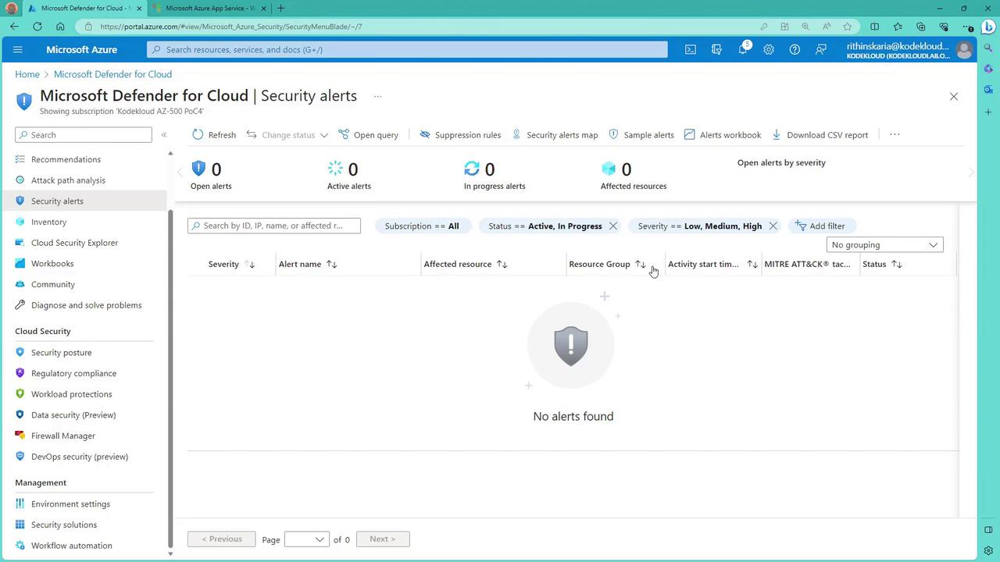
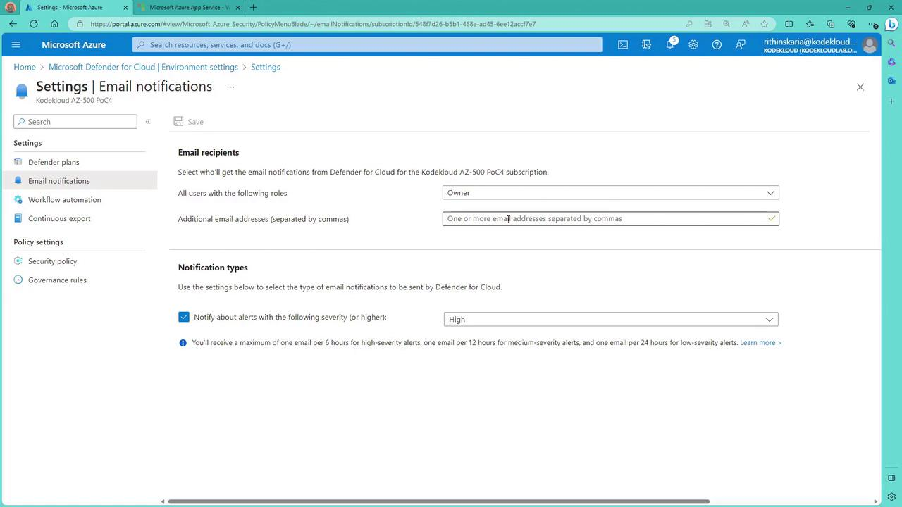

# Define brute force attacks

Source: https://notes.kodekloud.com/docs/Microsoft-Azure-Security-Technologies-AZ-500/Microsoft-Defender-for-Cloud/Define-brute-force-attacks/page

This article explains brute force attacks, their mitigation strategies, detection using Microsoft Defender for Cloud, and configuring alert notifications for security events.

A brute force attack is a systematic cybersecurity method in which attackers use automated tools to try every possible password combination or encryption key. This approach aims to gain unauthorized access by exploiting weak or easily guessable credentials, potentially leading to data breaches and system compromises.

## Mitigation Strategies

Implementing the following strategies can greatly reduce the risk of brute force attacks:

* **Strong Passwords:** Use complex, unique passwords that are difficult to guess.
* **Multi-Factor Authentication (MFA):** Require additional verification beyond just a password.
* **Account Lockout Policies:** Automatically lock accounts after a predetermined number of failed login attempts.
* **Continuous Monitoring:** Regularly inspect logs and set up automated alerts for any unusual login attempts.
* **Cybersecurity Awareness:** Educate users on the importance of proper password practices.
* **Regular Updates:** Keep systems updated by installing security patches, using intrusion prevention systems, and incorporating threat intelligence to detect evolving attack patterns.

## Detection with [Microsoft Defender for Cloud](https://learn.microsoft.com/en-us/azure/defender-for-cloud/)

[Microsoft Defender for Cloud](https://learn.microsoft.com/en-us/azure/defender-for-cloud/) is an effective tool in detecting brute force attacks. It notifies you through security alerts when potential brute force activities are identified. These alerts are displayed in the security alerts section, offering a centralized view of potential security threats.

<Frame>
  
</Frame>

Even though there may not currently be any alerts, any future detection of a brute force attack will automatically update this section with the relevant details.

## Configuring Alert Notifications

To ensure you receive prompt notifications of any significant security alerts, including brute force attack alerts, configure email notifications within your environment settings:

1. Navigate to the environment settings in Microsoft Defender for Cloud.
2. Select and customize the email notification rules.
3. Add additional email addresses as needed.
4. Choose the appropriate alert severity levels (e.g., high or medium) to tailor the notifications.

<Frame>
  
</Frame>

<Callout icon="lightbulb">
  Configuring these settings ensures that you are immediately informed of any significant security events, allowing for quick response actions.
</Callout>

<CardGroup>
  <Card title="Watch Video" icon="video" href="https://learn.kodekloud.com/user/courses/microsoft-azure-security-technologies-az-500/module/aea85892-224f-4bd2-8013-e36764e15f37/lesson/3ab55a49-304a-479f-9f4d-ac06e8b622a5" />
</CardGroup>
