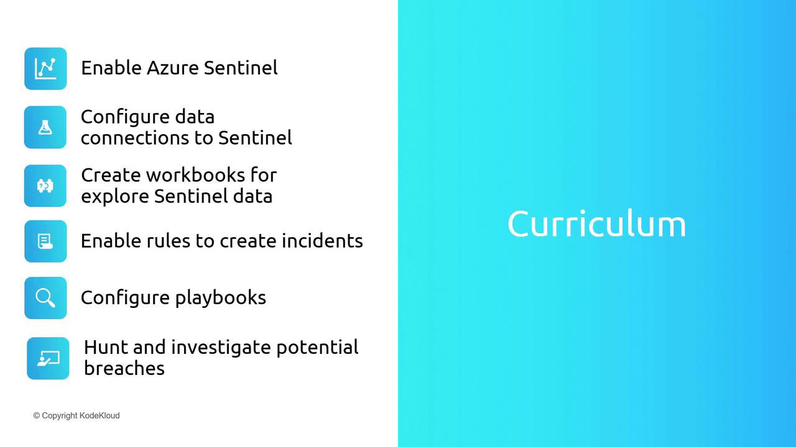

# Introduction

Source: https://notes.kodekloud.com/docs/Microsoft-Azure-Security-Technologies-AZ-500/Microsoft-Sentinel/Introduction/page

This article provides an overview of Microsoft Sentinel, covering its features and integration for security monitoring and incident response.

Microsoft Sentinel is a cloud-native SIEM (Security Information and Event Management) and SOAR (Security Orchestration, Automation, and Response) solution designed to aggregate and analyze security data from a wide variety of sources. It seamlessly integrates with your entire environment—including other cloud platforms and on-premises systems—to provide comprehensive security monitoring and rapid incident response.

In the previous lesson, we explored Microsoft Defender for Cloud. Defender for Cloud is tailored to secure Azure resources by providing vulnerability assessments, enforcing regulatory compliance, and delivering Azure-centric security recommendations. In contrast, Microsoft Sentinel extends these capabilities by offering broader threat detection, advanced correlation, and automated response across your organization. Combining both tools enables robust protection for Azure environments while delivering enterprise-wide security insights and actions.

Microsoft Sentinel encompasses numerous features from both SIEM and SOAR perspectives. In this article, we will cover several key areas, including:

* Enabling Azure Sentinel.
* Configuring data connections to Sentinel.
* Creating workbooks for data exploration.
* Enabling rules to generate incidents.
* Configuring playbooks for automated responses.
* Hunting for and investigating potential breaches.

<Frame>
  
</Frame>

<Callout icon="lightbulb">
  This introductory article provides a level 100 overview of Microsoft Sentinel. For professionals working in Security Operations Centers (SOC) or those seeking a deeper technical understanding, advanced training covering rule creation, playbook design, incident management, and threat hunting is highly recommended.
</Callout>

Let’s begin by discussing how to enable Azure Sentinel in your environment.

<CardGroup>
  <Card title="Watch Video" icon="video" href="https://learn.kodekloud.com/user/courses/microsoft-azure-security-technologies-az-500/module/fdf529c7-54c7-4550-a622-aec81172dcad/lesson/b8c51d29-0b82-4efb-beaa-90a1cc5f7ffb" />
</CardGroup>
