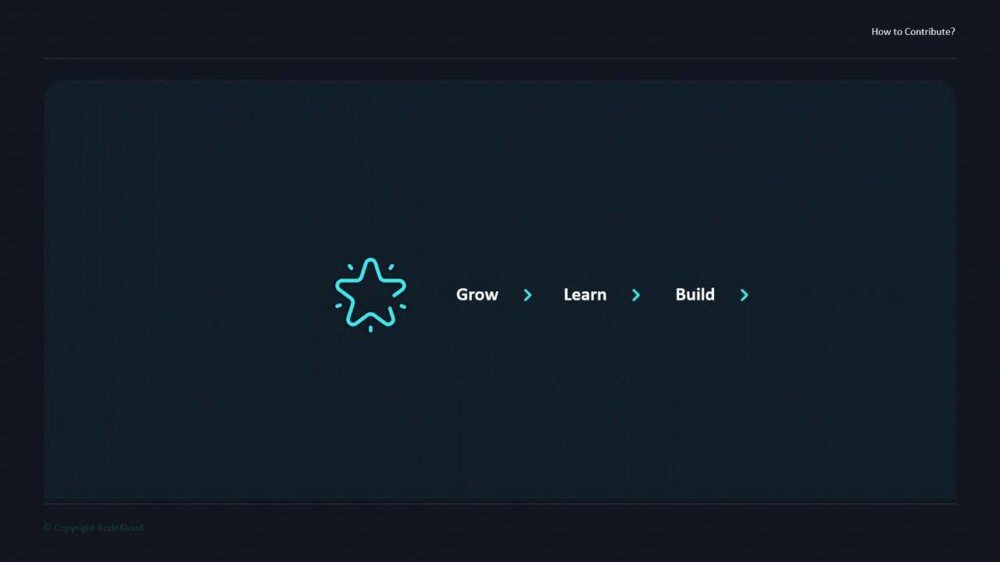
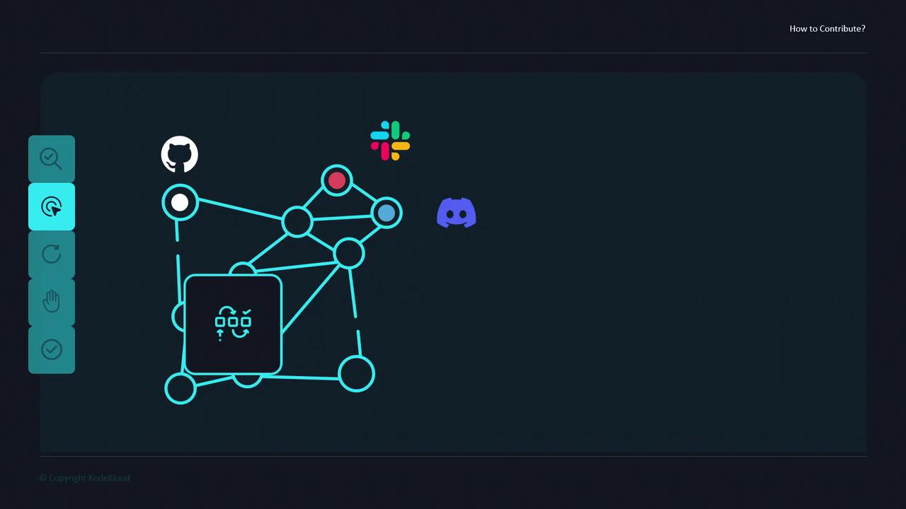
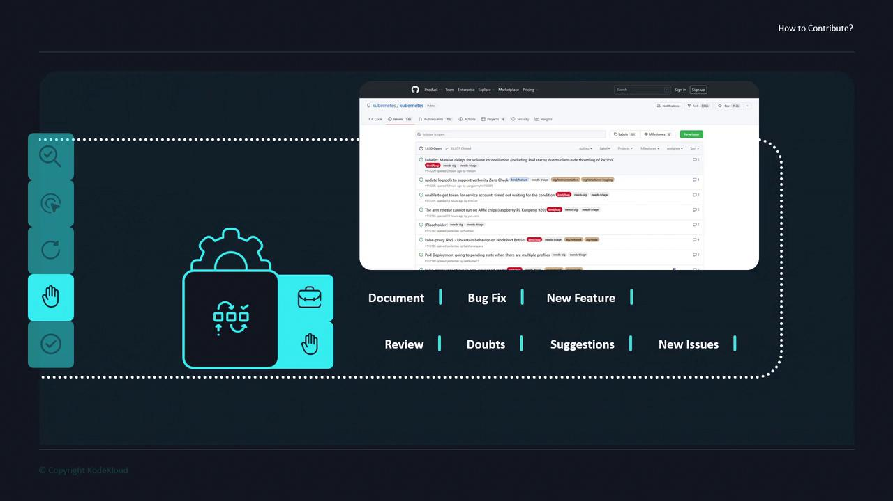

# How To Contribute with KodeKlouds Model for Contribution

Source: https://notes.kodekloud.com/docs/Open-Source-for-Beginners/Getting-Started-with-Open-source/How-To-Contribute-with-KodeKlouds-Model-for-Contribution/page

This article explains KodeKlouds RETRY model for contributing to open source, outlining steps to recognize, engage, try, raise, and apply contributions effectively.

Contributing to open source is a rewarding experience that helps you grow your skills, expand your network, and make a real impact. At KodeKloud, we’ve distilled the essential phases of contribution into a simple framework called the **RETRY** model:

* Recognize
* Engage
* Try
* Raise
* Apply

<Frame>
  
</Frame>

## Overview of the RETRY Model

| RETRY Step | Action                                    | Outcome                                     |
| ---------- | ----------------------------------------- | ------------------------------------------- |
| Recognize  | Identify projects aligned with your goals | Targeted areas where you can make an impact |
| Engage     | Join discussions and introduce yourself   | Build rapport and understand workflows      |
| Try        | Clone, build, and experiment              | Hands-on familiarity with the codebase      |
| Raise      | Open issues or pull requests              | Contribute fixes, docs, or new features     |
| Apply      | Share best practices across communities   | Accelerate growth and knowledge transfer    |

***

## Recognize

Start by narrowing your focus to the projects or communities that resonate with your interests and expertise. Consider factors such as:

* Technology stack (e.g., Kubernetes, Terraform, Docker)
* Programming language (e.g., Python, Go, JavaScript)
* Project mission or domain (e.g., DevOps tools, data analytics)

By aligning with what excites you, it’s easier to stay motivated and make meaningful contributions.

## Engage

Once you’ve chosen a project, immerse yourself in its community channels:

* [GitHub Issues][github-issues]
* [Slack][slack]
* [Discord][discord]

Observe ongoing discussions, introduce yourself, and ask clarifying questions. This helps you learn the project’s norms and find areas where help is needed.

<Callout icon="lightbulb">
  Respect each project’s code of conduct and communication guidelines. Clear, concise messages go a long way in making a positive first impression.
</Callout>

<Frame>
  
</Frame>

## Try

With context from the community, dive into the code:

1. Fork or clone the repository.
2. Install dependencies and run local builds.
3. Explore example configurations and test suites.
4. Reference project docs and existing issues to troubleshoot.

This hands-on experimentation reveals real-world workflows and core functionality.

## Raise

After you’re comfortable with the codebase, start contributing by raising your work for review:

* Fix bugs or code errors
* Enhance or correct documentation
* Propose new features via pull requests
* Open issues to suggest improvements or discuss design

Always follow the project’s contribution guidelines when submitting pull requests or opening issues.

<Callout icon="triangle-alert">
  Before submitting, ensure your changes pass all tests and adhere to the repository’s style guide. Incomplete or non-compliant PRs may be closed without review.
</Callout>

<Frame>
  
</Frame>

## Apply

Finally, leverage what you’ve learned to benefit other projects and teams. Sharing your discoveries, reusable workflows, or automation scripts accelerates collective growth and drives the evolution of open source.

***

## Links and References

* [GitHub Issues][github-issues]
* [Slack][slack]
* [Discord][discord]

[github-issues]: https://docs.github.com/en/issues

[slack]: https://slack.com

[discord]: https://discord.com

<CardGroup>
  <Card title="Watch Video" icon="video" href="https://learn.kodekloud.com/user/courses/open-source-for-beginners/module/fbb6900d-94ee-411a-8821-42557ca81867/lesson/b9d6948e-b9ec-4a5a-9129-d8c42f86a3aa" />
</CardGroup>
