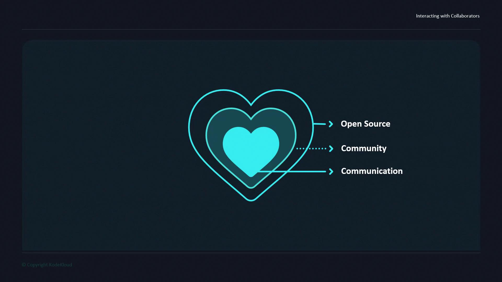
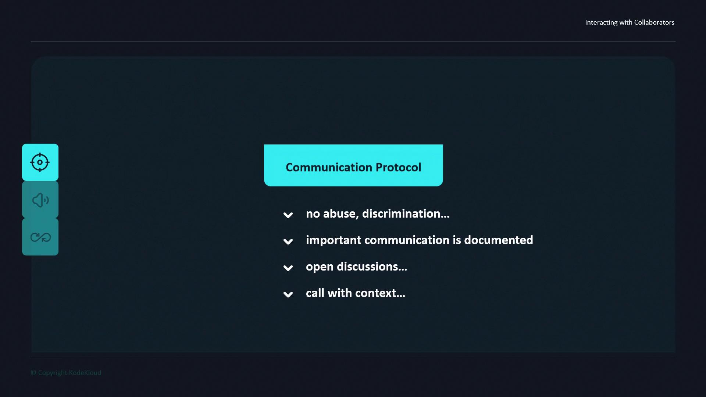

# Interacting with Collaborators

Source: https://notes.kodekloud.com/docs/Open-Source-for-Beginners/Starting-Your-Open-Source-Project/Interacting-with-Collaborators/page

Effective communication fosters trust, resolves conflicts, and streamlines decision-making in open source projects through clear protocols.

Effective communication is the cornerstone of any thriving open source project. Establishing clear protocols early on helps foster trust, resolve conflicts, and streamline decision-making among contributors.

<Frame>
  
</Frame>

## Why a Communication Protocol Matters

Well-defined guidelines promote:

* Respectful interactions without abusive, discriminatory, or offensive language
* Transparent discussions in shared channels
* Efficient collaboration through context-rich messages
* Documentation of key decisions for future reference

## Sample Communication Protocol Table

| Guideline                            | Purpose                                         | Example                                                                         |
| ------------------------------------ | ----------------------------------------------- | ------------------------------------------------------------------------------- |
| No abusive or discriminatory remarks | Maintain a safe, inclusive environment          | Prohibit `offensive_term` or any derogatory language                            |
| Public, transparent channels         | Ensure visibility and collective knowledge      | Use [Slack][slack] or [GitHub Discussions][gh-discussions] for all major topics |
| Context-rich communication           | Reduce misunderstandings and speed up responses | “Regarding PR #42, I’m seeing a build failure on line 10…”                      |
| Document key discussions             | Preserve decisions and rationale for onboarding | Link to shared notes or meeting minutes                                         |

<Frame>
  
</Frame>

<Callout icon="lightbulb">
  Include templates or bots to automate enforcement, such as [GitHub Issue Templates][gh-templates] or Slack reminders.
</Callout>

Some communities take this further by mandating that every message include sufficient context—no simple “hello”—so recipients immediately grasp the intent.

## Case Study: Community Interaction in Action

In the next section, we’ll explore a real-world example of how one open source community applies these principles to onboard new contributors and resolve disagreements effectively.

## Links and References

* [Slack][slack]
* [GitHub Discussions][gh-discussions]
* [GitHub Issue Templates][gh-templates]

[slack]: https://slack.com

[gh-discussions]: https://docs.github.com/en/discussions

[gh-templates]: https://docs.github.com/en/issues/using-templates/about-issue-and-pull-request-templates

<CardGroup>
  <Card title="Watch Video" icon="video" href="https://learn.kodekloud.com/user/courses/open-source-for-beginners/module/767d06e2-2c02-403c-aa37-6e4a5549e6a6/lesson/3ea8d986-acef-4787-a422-58cbe42f1422" />
</CardGroup>
