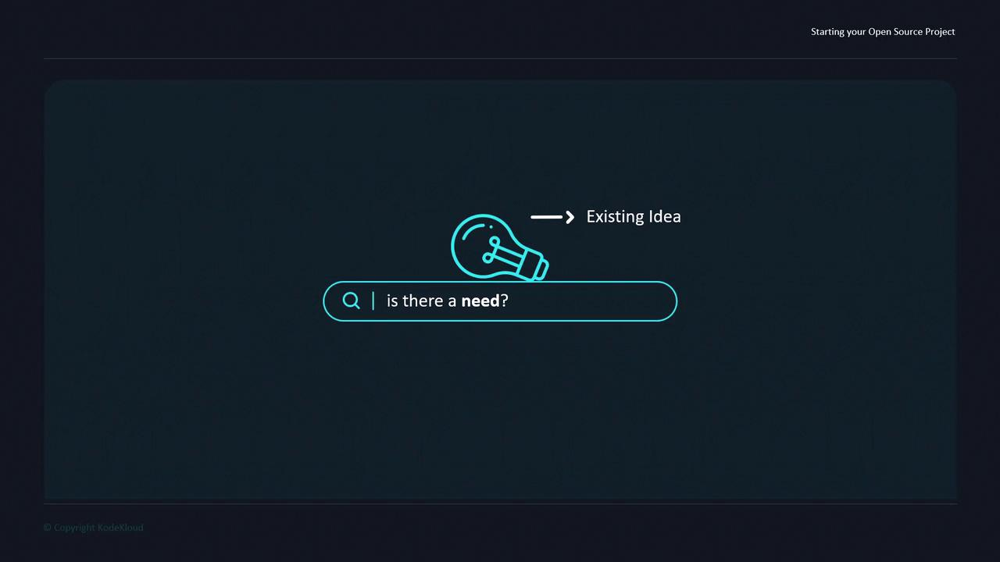
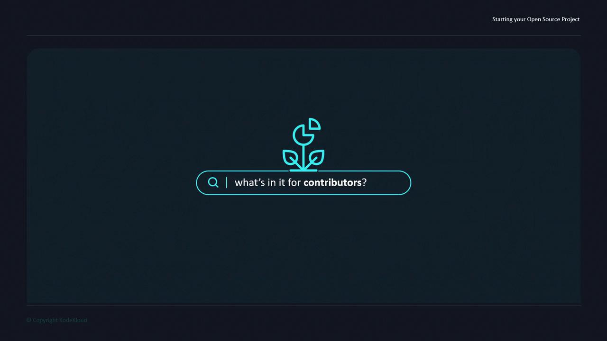

# Starting an Open source project

Source: https://notes.kodekloud.com/docs/Open-Source-for-Beginners/Starting-Your-Open-Source-Project/Starting-an-Open-source-project/page

This guide walks you through essential questions and best practices to start and sustain a successful open source project.

Open source initiatives can be launched by individuals, startups, or enterprises to innovate faster, collaborate in public, and share knowledge. Whether you plan to open-source from day one or transition later, the core steps remain similar. This guide walks you through the essential questions and best practices to start and sustain a successful open source project.

## 1. Validate the Need

Before diving in, confirm that your project fills a genuine gap in the ecosystem.

| Key Action                  | Description                                                              |
| --------------------------- | ------------------------------------------------------------------------ |
| Research existing solutions | Search GitHub, GitLab, or relevant registries to avoid duplicating work. |
| Evaluate popularity metrics | Check stars, forks, and community activity.                              |
| Consider collaboration      | If a project exists, propose features or join its maintainers.           |

<Frame>
  
</Frame>

<Callout icon="lightbulb">
  Leverage platforms like [LibHunt][1] or [Awesome Lists][2] to discover popular open source tools.
</Callout>

## 2. Plan Your Project Sponsorship

Open source projects often incur costs. Outline your budget and funding model:

| Expense Type | Funding Options                         |
| ------------ | --------------------------------------- |
| Hosting      | Crowdfunding, sponsors, grants          |
| Domains      | Open Collective, GitHub Sponsors        |
| CI/CD        | Free tier services, community donations |
| Maintenance  | Paid support, consulting services       |

<Callout icon="lightbulb">
  Set realistic funding goals and review expenses quarterly to adjust your sponsorship strategy.
</Callout>

## 3. Define Contributor Value

Attracting contributors requires a clear value proposition:

* **Learning opportunities**: mentorship, code reviews
* **Project roadmap**: short-term milestones and long-term vision
* **Recognition**: contributors earn commit access, acknowledgments, or swag

<Frame>
  
</Frame>

<Callout icon="triangle-alert">
  Ambiguous goals can deter contributors. Maintain transparent roadmaps and publish regular updates.
</Callout>

## Next Steps

In the following sections, we’ll cover:

* Choosing an open source license
* Writing effective project documentation
* Building and nurturing a community

For additional resources, see:

* [Open Source Guides][3]
* [Choose a License][4]
* [GitHub Community Forum][5]

[1]: https://www.libhunt.com/

[2]: https://github.com/sindresorhus/awesome

[3]: https://opensource.guide/

[4]: https://choosealicense.com/

[5]: https://github.community/

<CardGroup>
  <Card title="Watch Video" icon="video" href="https://learn.kodekloud.com/user/courses/open-source-for-beginners/module/767d06e2-2c02-403c-aa37-6e4a5549e6a6/lesson/ea0390cd-33dc-4cd4-98f9-41aadeac19d7" />
</CardGroup>
