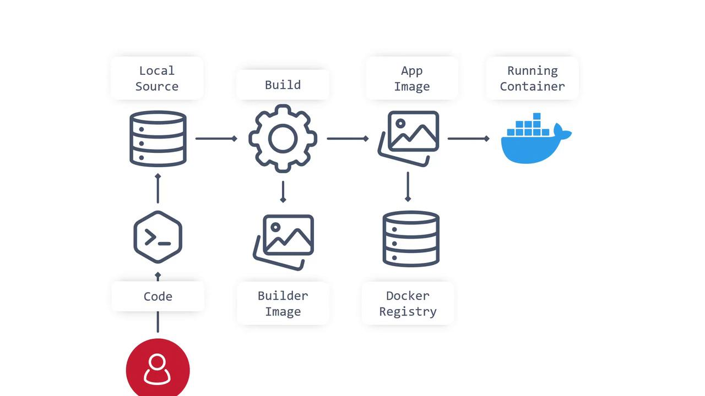
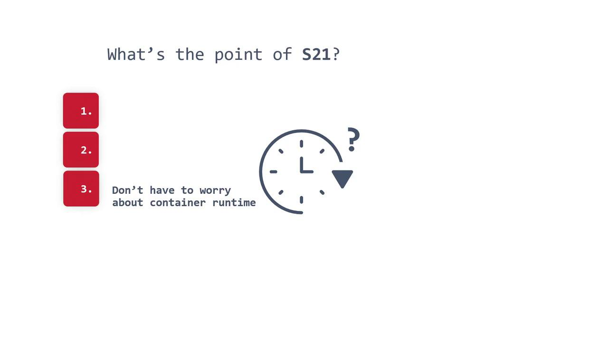
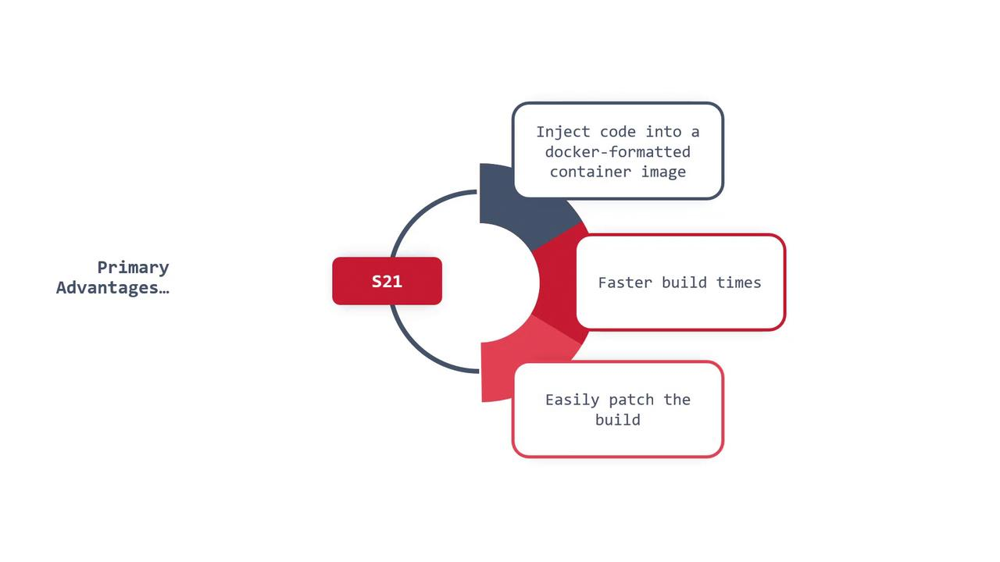

# S2I

Source: https://notes.kodekloud.com/docs/OpenShift-4/Concepts-Builds-and-Deployments/S2I/page

This article explores the Source-to-Image (S2I) build process and its benefits for creating Docker-compliant container images efficiently.

In this article, we explore the Source-to-Image (S2I) build process and its various benefits. Whether you're a developer focused on application code or an operations engineer managing container builds, S2I offers an automated, repeatable process for creating Docker-compliant container images—without the need to handle Dockerfiles or complex build configurations.

S2I simplifies the container image creation process by abstracting the complexity of Dockerfile management and orchestration. Instead of juggling multiple build scripts, you concentrate on your source code while S2I automates the image creation and registry push process. This streamlined approach not only simplifies your workflow but also enhances consistency by reducing manual intervention.

<Frame>
  
</Frame>

## The S2I Workflow

The S2I workflow initiates whenever you commit your source code to a repository. The process is as follows:

* S2I extracts the source code.
* It automatically assembles the source into a Docker-formatted container image.
* The resulting image is pushed to a Docker registry.

This automation eliminates manual Dockerfile maintenance and ensures the build process remains reproducible and standardized.

### Key Advantages of S2I

1. Produces a Docker image directly from your source code, removing the need to manage Dockerfiles or separate build scripts.
2. Ensures consistent and automated builds, reducing the risk of human error.
3. Abstracts the container runtime concerns, making your workflows independent of the specific OCI-compliant runtime.
4. Enhances security by enforcing permissions, authentication, and authorization, thereby limiting image build initiation to trusted users or teams.

<Callout icon="lightbulb">
  * **Faster Build Times:** Optimized operations reduce build times.
  * **Efficient Patching:** S2I can compare current artifacts with previous builds, enabling incremental updates.
</Callout>

<Frame>
  
</Frame>

<Frame>
  
</Frame>

## S2I Implementation and Scripts

Implementing S2I typically involves defining a script that explains how to build the container image from your source code. Although this script can be written in any programming language, its structure often mirrors a simplified Dockerfile, outlining clear steps for the build process.

Below is an example of a simple Bash script that might be placed in the `/tmp/S2I` directory. This script shows how to manage pre-built artifacts, compile the source code, and install the resulting artifacts:

```bash theme={null}
#!/bin/bash
