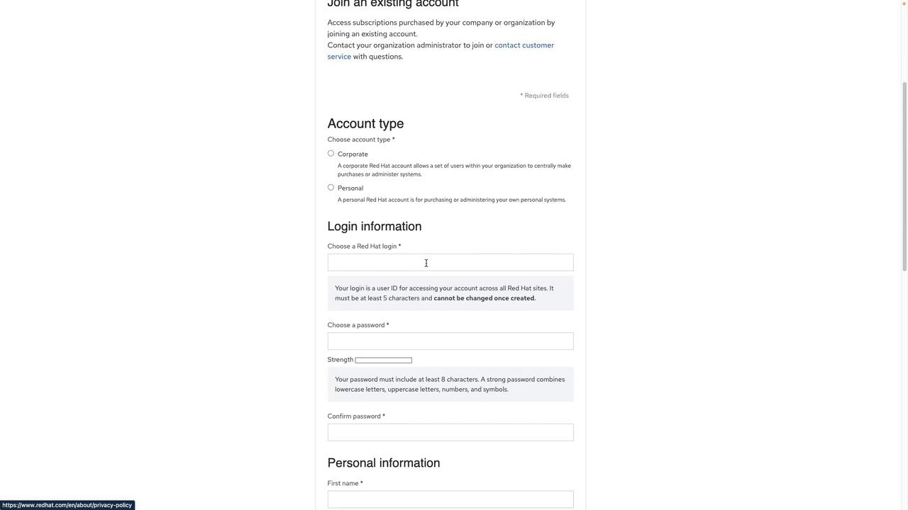

# Openshift Installation Methods

Source: https://notes.kodekloud.com/docs/OpenShift-4/Getting-Started-with-Openshift/Openshift-Installation-Methods/page

This article explains how to create a Red Hat account necessary for OpenShift installation.

Before you begin using OpenShift, you must first sign up for a Red Hat account. Registration is free, so there is no cost involved.

<Callout icon="lightbulb">
  Ensure you create your account well before starting the installation process to avoid any delays.
</Callout>

## Steps to Create a Red Hat Account

1. Open your preferred search engine and search for "Red Hat account."
2. Click on the appropriate result to navigate to [access.redhat.com](https://access.redhat.com).
3. On the Red Hat access page, select the option to register for a new account.

When you click the registration button, a form will appear requesting your personal or corporate details. If you are following this guide for personal learning, select the personal account option. You will need to provide information such as:

* Username and password
* First name and last name
* Job title and email address
* Company information (if applicable)

<Frame>
  
</Frame>

Once you have completed the registration form, click "Create Account." After your account is set up, you can proceed with the OpenShift installation tasks as detailed in this guide.

For more information on OpenShift and related topics, consider visiting the following resources:

* [Red Hat OpenShift Documentation](https://docs.openshift.com)
* [OpenShift Quick Start](https://www.openshift.com/learn/quickstarts)

<CardGroup>
  <Card title="Watch Video" icon="video" href="https://learn.kodekloud.com/user/courses/openshift-4/module/7ba3dd10-68d9-414d-b26b-8e9109a4a3d3/lesson/4527a917-0f46-450a-adca-54cb13bf75eb" />
</CardGroup>
