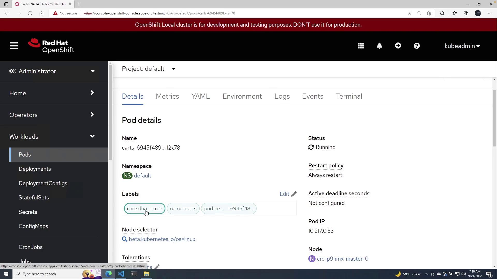

# Demo Network Policies

Source: https://notes.kodekloud.com/docs/OpenShift-4/Openshift-Security/Demo-Network-Policies/page

This lesson demonstrates a Kubernetes network policy configuration controlling inbound connectivity between deployments using labels for secure communication.

In this lesson, we explore a Kubernetes network policy configuration that controls inbound connectivity between deployments. We focus on a real-world example where the Cards deployment is allowed to access the Cards database by leveraging Kubernetes labels.

***

## NetworkPolicy Configuration

The network policy is defined using YAML and specifies the following details:

* API version and resource kind (NetworkPolicy)
* A pod selector that identifies target pods
* Ingress rules that allow traffic only from pods with a specific label

In this example, the policy named "access-cartsdb" selects pods labeled `name: carts-db` and permits ingress traffic solely from pods that have the label `cartsdbaccess: "true"`.

```yaml theme={null}
apiVersion: networking.k8s.io/v1
kind: NetworkPolicy
metadata:
  name: access-cartsdb
spec:
  podSelector:
    matchLabels:
      name: carts-db
  ingress:
  - from:
    - podSelector:
        matchLabels:
          cartsdbaccess: "true"
```

<Callout icon="lightbulb">
  • The `podSelector` under the `spec` targets the Cards DB pod (with the label `name: carts-db`).\
  • The `ingress` rule allows inbound traffic only from pods labeled with `cartsdbaccess: "true"`.
</Callout>

***

## Deployment Configuration in Cards.yaml

Next, we examine the Cards deployment YAML. Notice that on line 16, the pod template is tagged with the new label `cartsdbaccess: "true"`. This label ensures that the Cards deployment is permitted to connect to the Cards DB as allowed by our network policy.

```yaml theme={null}
apiVersion: apps/v1
kind: Deployment
metadata:
  name: carts
  labels:
    name: carts
spec:
  replicas: 1
  selector:
    matchLabels:
      name: carts
  template:
    metadata:
      labels:
        name: carts
        cartsdbaccess: "true"
    spec:
      containers:
      - name: carts
        image: weaveworksdemos/carts:0.4.8
```

When the deployment is applied, the pod receives the `cartsdbaccess: "true"` label, enabling it to communicate with the Cards DB pod as defined in the network policy.

***

## Steps to Apply the Configuration

### 1. Apply the Cards Deployment

Run the following command to apply the Cards deployment:

```shell theme={null}
PS C:\Users\mike\Desktop> oc apply -f carts.yaml
Warning: spec.template.spec.nodeSelector[beta.kubernetes.io/os]: deprecated since v1.14; use "kubernetes.io/os" instead
Warning: would violate PodSecurity "restricted:latest": allowPrivilegeEscalation != false (container "carts" must set securityContext.allowPrivilegeEscalation=false), unrestricted capabilities (container "carts" must set securityContext.capabilities.drop=["ALL"]), runAsNonRoot != true (pod or container "carts" must set securityContext.runAsNonRoot=true), seccompProfile (pod or container "carts" must set securityContext.seccompProfile.type to "RuntimeDefault" or "Localhost")
deployment.apps/carts created
```

After applying the deployment, verify that the Cards pod is running and includes the necessary label for DB access:

<Frame>
  
</Frame>

### 2. Apply the Network Policy

Next, apply the network policy using the command below:

```shell theme={null}
PS C:\Users\mike\Desktop> oc apply -f ./networkpolicy.yaml
networkpolicy.networking.k8s.io/access-cartsdb created
```

After this, navigate to the networking section in the OpenShift portal. You will see the network policy active with the defined pod selectors and ingress rules:

<Frame>
  
</Frame>

<Callout icon="lightbulb">
  With this configuration, only pods with the label `cartsdbaccess: "true"` are permitted to send traffic to the Cards DB pods, ensuring controlled and secure communication within your Kubernetes cluster.
</Callout>

***

## Key Concepts

Below is a table summarizing the key components of this configuration:

| Resource Type | Description                                        | Relevant Label(s)       |
| ------------- | -------------------------------------------------- | ----------------------- |
| NetworkPolicy | Restricts ingress traffic to Cards DB pod          | `name: carts-db`        |
| Deployment    | Configures the Cards deployment with access labels | `cartsdbaccess: "true"` |

***

This lesson demonstrates how network policies combined with proper pod labeling can secure and control network traffic within a Kubernetes environment. For further reading, explore the following resources:

* [Kubernetes Networking](https://kubernetes.io/docs/concepts/services-networking/network-policies/)
* [OpenShift Documentation](https://docs.openshift.com/container-platform/latest/)

<CardGroup>
  <Card title="Watch Video" icon="video" href="https://learn.kodekloud.com/user/courses/openshift-4/module/413252bb-7455-41fa-86eb-e3e9370c8f08/lesson/c2549792-918f-45f1-909a-398695a2c83a" />
</CardGroup>
