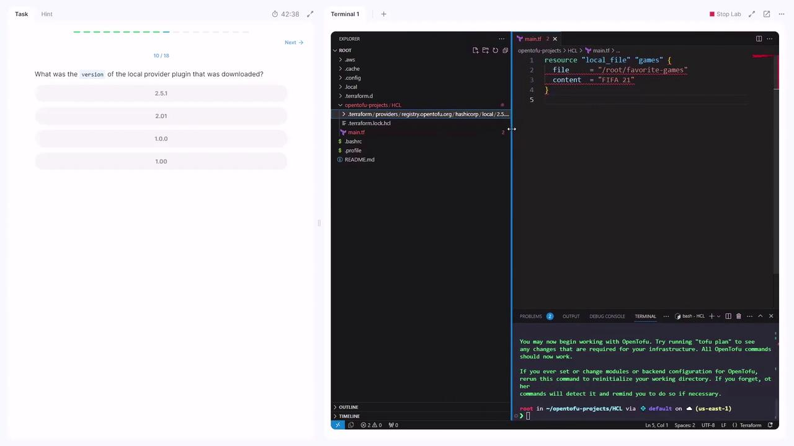

# → main.tf
```

Alternatively, open the folder in VS Code and observe that the filename is `main.tf`.\
**Answer:** `.tf`

***

## Q2: Determine the Resource Type

Inspect the resource block in `main.tf`:

```hcl theme={null}
resource "local_file" "games" {
  file    = "/root/favorite-games"
  content = "FIFA 21"
}
```

**Answer:** `local_file`

***

## Q3: Find the Resource Name

Within the same block, the second quoted identifier denotes the resource name:

```hcl theme={null}
resource "local_file" "games" { … }
```

**Answer:** `games`

***

## Q4: Identify the Provider Name

The provider is indicated by the prefix of the resource type:

```hcl theme={null}
resource "local_file" "games" { … }
```

Here, **local** is the provider.\
**Answer:** `local`

***

## Q5: Valid vs. Invalid Arguments

The `local_file` resource supports only `filename` and `content`. It does *not* accept `resource_type`.

| Argument       | Valid | Description                       |
| -------------- | :---: | --------------------------------- |
| filename       |  Yes  | Path to create the file           |
| content        |  Yes  | Data to write into the file       |
| resource\_type |   No  | Not a supported resource argument |

**Answer:** `resource_type = "local_file"`

***

## Q6: Why `tofu plan` Fails Initially

Running:

```bash theme={null}
tofu plan
```

Produces:

```plaintext theme={null}
Error: Inconsistent dependency lock file
… no version is selected
```

The directory must be initialized first.

<Callout icon="lightbulb">
  Always run `tofu init` before planning or applying any changes.
</Callout>

***

### Initialize the Working Directory

```bash theme={null}
tofu init
```

You should see:

```plaintext theme={null}
OpenTofu has been successfully initialized!
…
```

***

## Q7: Locate the Provider Plugin Version

After initialization, OpenTofu downloads provider plugins. You can confirm the version (`2.5.1`) from the output or by inspecting `.terraform`:

<Frame>
  
</Frame>

**Answer:** `2.5.1`

***

## Q8: Re-run `tofu plan` with Incorrect Arguments

```bash theme={null}
tofu plan
```

Results in:

```plaintext theme={null}
Error: Missing required argument
  on main.tf line 1, in resource "local_file" "games":
   1: resource "local_file" "games" {
The argument "filename" is required, but no definition was found.

Error: Unsupported argument
  on main.tf line 2, in resource "local_file" "games":
   2:   file = "/root/favorite-games"
An argument named "file" is not expected here.
```

You used `file` instead of `filename` and omitted `filename`.

***

## Q9: Identify the Unsupported Argument

Referring to the [Local Provider Documentation](https://registry.opentofu.[SECRET_REDACTED]), `file` is not supported.\
**Answer:** `file`

***

## Q10: Correct the Configuration and Apply

Update **main.tf**:

```hcl theme={null}
resource "local_file" "games" {
  filename = "/root/favorite-games"
  content  = "FIFA 21"
}
```

Run:

```bash theme={null}
tofu plan
tofu apply
# → Apply complete! Resources: 1 added, 0 changed, 0 destroyed.
```

***

## Q11: Switch to a Sensitive File Resource

To mask content in plans, use `local_sensitive_file`:

```hcl theme={null}
resource "local_sensitive_file" "games" {
  filename = "/root/favorite-games"
  content  = "FIFA 21"
}
```

Attempting to add an unsupported `sensitive_content` argument will fail:

```bash theme={null}
tofu plan
```

```plaintext theme={null}
Error: Unsupported argument
  on main.tf line 4, in resource "local_sensitive_file" "games":
   4:   sensitive_content = "FIFA 21"
```

Remove `sensitive_content`; it’s not supported.

***

## Q12: Apply the Sensitive File Resource

With **main.tf** updated:

```hcl theme={null}
resource "local_sensitive_file" "games" {
  filename = "/root/favorite-games"
  content  = "FIFA 21"
}
```

Run:

```bash theme={null}
tofu plan
tofu apply
# → Apply complete! Resources: 1 added, 0 changed, 1 destroyed.
```

Plans will now hide the file’s content.

***

## Q13: Destroy the Resource

```bash theme={null}
tofu destroy
```

```plaintext theme={null}
Plan: 0 to add, 0 to change, 1 to destroy.
Enter a value: yes

Destroy complete! Resources: 1 destroyed.
```

Congratulations—you’ve completed the lab! 🎉

***

## Links and References

* [OpenTofu Documentation](https://opentofu.dev/docs/)
* [Local Provider (OpenTofu)](https://registry.opentofu.dev/hashicorp/local)
* [HCL Language Overview](https://github.com/hashicorp/hcl)

<CardGroup>
  <Card title="Watch Video" icon="video" href="https://learn.kodekloud.com/user/courses/opentofu-a-beginners-guide-to-a-terraform-fork-including-migration-from-terraform/module/b3a724ed-f2f2-4a25-a20e-bfb4c000d1e7/lesson/a2a919d0-3725-49d3-88d5-fd44ed20d987" />

  <Card title="Practice Lab" icon="installation" href="https://learn.kodekloud.com/user/courses/opentofu-a-beginners-guide-to-a-terraform-fork-including-migration-from-terraform/module/b3a724ed-f2f2-4a25-a20e-bfb4c000d1e7/lesson/f0316305-fe24-451d-a551-f3874d6b22b7" />
</CardGroup>


# Update and Destroy Infrastructure

Source: https://notes.kodekloud.com/docs/OpenTofu-A-Beginners-Guide-to-a-Terraform-Fork-Including-Migration-From-Terraform/Getting-Started-with-OpenTofu/Update-and-Destroy-Infrastructure/page

This tutorial teaches how to update and destroy infrastructure managed by OpenTofu using a `local_file` example.

In this tutorial, you’ll learn how to update and destroy infrastructure managed by OpenTofu using a simple `local_file` example. We’ll walk through modifying resource configuration, previewing changes, applying updates, tearing down resources, and organizing your `.tf` files for maintainability.

***

## 🔄 Updating a Resource

To change an existing `local_file` resource, edit its configuration. In this example, we add the `file_permission` argument and set it to `"0700"`:

```hcl theme={null}
resource "local_file" "pet" {
  filename        = "/root/pets.txt"
  content         = "We love pets!"
  file_permission = "0700"
}
```

Next, preview the plan with:

```bash theme={null}
tofu plan
```

Output (truncated):

```bash theme={null}
local_file.pet: Refreshing state... [id=[AWS_SECRET_ACCESS_KEY]]
OpenTofu used the selected providers to generate the following execution plan.
Resource actions are indicated with these symbols:
  -/+ destroy and then create replacement

  # local_file.pet must be replaced
  -/+ resource "local_file" "pet" {
      ~ file_permission = "0777" -> "0700" # forces replacement
      ~ id              = "[AWS_SECRET_ACCESS_KEY]" -> (known after apply)
      ... (other attributes hidden)
    }

Plan: 1 to add, 0 to change, 1 to destroy.

Note: You didn't use the `-out` option to save this plan, so OpenTofu can’t guarantee to take exactly these actions if you run `tofu apply` now.
```

<Callout icon="lightbulb">
  Save your plan with `tofu plan -out=plan.tfplan` to lock in the exact changes for later application.
</Callout>

### Understanding the Plan Output

* The `-/+` indicator shows the resource will be destroyed and recreated.
* `# forces replacement` highlights why OpenTofu must rebuild the resource—in this case, due to a permission change.
* The summary line (e.g., `1 to add, 0 to change, 1 to destroy`) gives a quick overview of the plan.

***

## ✅ Applying the Update

To apply the pending changes, run:

```bash theme={null}
tofu apply
```

You’ll see the same plan, then a confirmation prompt:

```bash theme={null}
Do you want to perform these actions?
  # local_file.pet must be replaced
Enter a value: yes

local_file.pet: Destroying... [id=...]
local_file.pet: Creation complete after 0s

Apply complete! Resources: 1 added, 0 changed, 1 destroyed.
```

***

## 🗑️ Destroying a Resource

When you no longer need the `local_file` resource, use:

```bash theme={null}
tofu destroy
```

Example output:

```bash theme={null}
local_file.pet: Refreshing state... [id=...]
OpenTofu used the selected providers to generate the following execution plan.
Resource actions are indicated with:
  - destroy

  # local_file.pet will be destroyed
  - resource "local_file" "pet" {
      - content         = "We love pets!" -> null
      - file_permission = "0700"            -> null
      - filename        = "/root/pets.txt"  -> null
      - id              = "..."             -> null
      ... (other attributes hidden)
    }

Plan: 0 to add, 0 to change, 1 to destroy.

Do you really want to destroy all resources?
Enter a value: yes

local_file.pet: Destroying... [id=...]
local_file.pet: Destruction complete after 0s

Destroy complete! Resources: 1 destroyed.
```

<Callout icon="triangle-alert">
  Adding `-auto-approve` skips all confirmation prompts. Use with caution, as it will immediately destroy your managed resources.
</Callout>

***

## 🗂️ Organizing Configuration Files

OpenTofu loads all `.tf` files in the working directory. Splitting configurations into multiple files can enhance readability and maintainability.

For example, a directory with two resources:

```bash theme={null}
[opentofu-local-file]$ ls /root/opentofu-local-file
local.tf  cat.tf
```

| File     | Description                             |
| -------- | --------------------------------------- |
| local.tf | Defines the `pet` `local_file` resource |
| cat.tf   | Defines the `cat` `local_file` resource |

**local.tf**

```hcl theme={null}
resource "local_file" "pet" {
  filename = "/root/pets.txt"
  content  = "We love pets!"
}
```

**cat.tf**

```hcl theme={null}
resource "local_file" "cat" {
  filename = "/root/cat.txt"
  content  = "My favorite pet is Mr. Whiskers"
}
```

When you run `tofu apply`, both resources are created together.

### Single vs. Multiple Files

Alternatively, you can combine all resources in one `main.tf`:

```hcl theme={null}
resource "local_file" "pet" {
  filename = "/root/pets.txt"
  content  = "We love pets!"
}

resource "local_file" "cat" {
  filename = "/root/cat.txt"
  content  = "My favorite pet is Mr. Whiskers"
}
```

As your project grows, consider splitting into:

* `variables.tf`
* `outputs.tf`
* `providers.tf`
* `main.tf`

This structure improves clarity and makes collaboration easier.

***

## Links and References

* [OpenTofu Documentation](https://github.com/opentofu/opentofu)
* [Terraform CLI Reference](https://www.terraform.io/docs/cli/)

<CardGroup>
  <Card title="Watch Video" icon="video" href="https://learn.kodekloud.com/user/courses/opentofu-a-beginners-guide-to-a-terraform-fork-including-migration-from-terraform/module/b3a724ed-f2f2-4a25-a20e-bfb4c000d1e7/lesson/bcfab62c-941a-447c-b82b-633fbf64cf48" />
</CardGroup>
