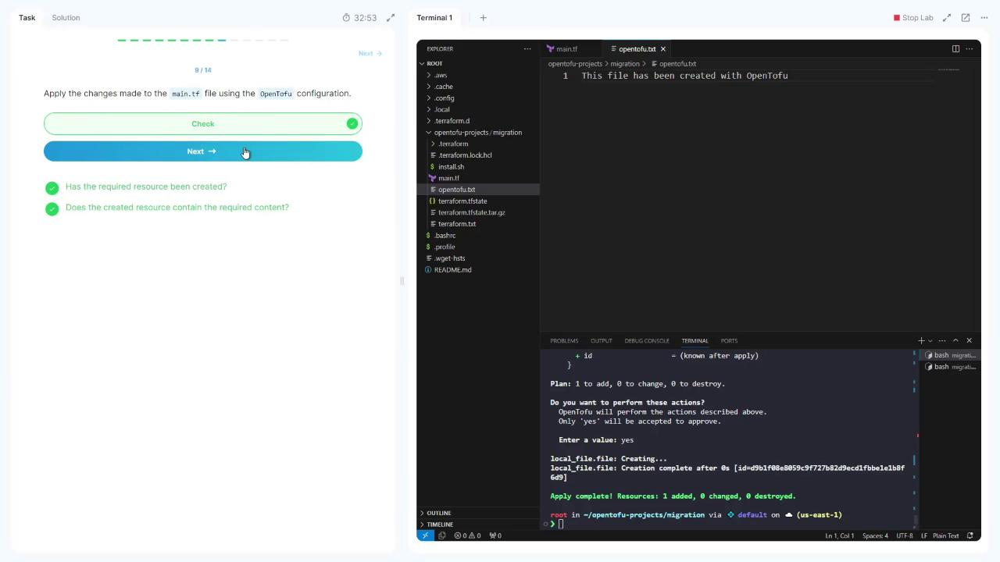
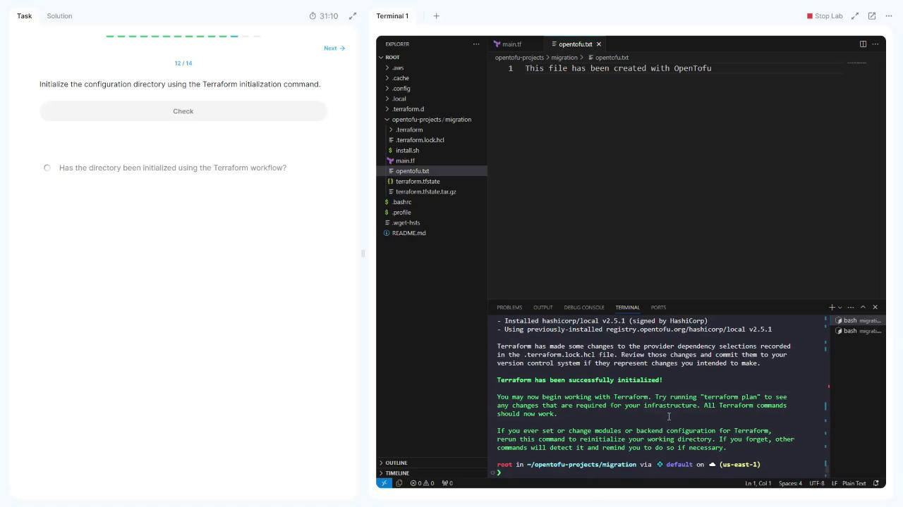
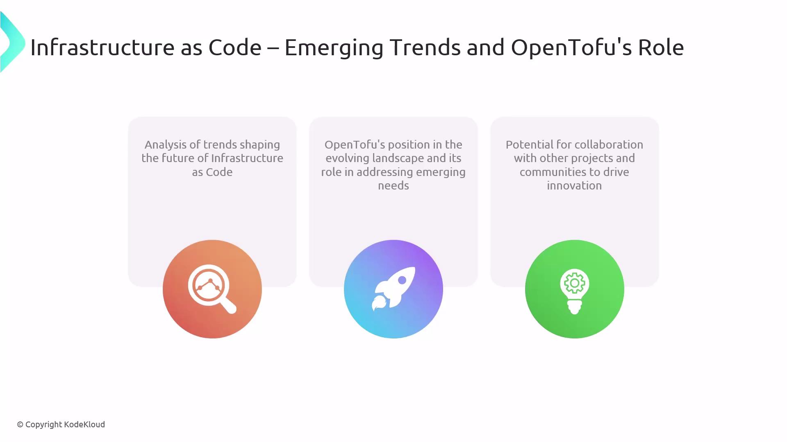

# install.sh  main.tf  terraform.tfstate  terraform.tfstate.tar.gz
```

***

## 4. Initialize with OpenTofu

Switch to the OpenTofu workflow:

```bash theme={null}
tofu init
```

***

## 5. Preview the OpenTofu Plan

Compare the two workflows with this quick reference:

| Action     | Terraform Command    | OpenTofu Command |
| ---------- | -------------------- | ---------------- |
| Initialize | `terraform init`     | `tofu init`      |
| Plan       | `terraform plan`     | `tofu plan`      |
| Validate   | `terraform validate` | `tofu validate`  |
| Apply      | `terraform apply`    | `tofu apply`     |

Run the plan:

```bash theme={null}
tofu plan
```

You should see the same `local_file.file` resource with `filename = "terraform.txt"`.

***

## 6. Update the main.tf for OpenTofu

Change **main.tf** to point to a new file and content:

```hcl theme={null}
resource "local_file" "file" {
  filename = "opentofu.txt"
  content  = "This file has been created with OpenTofu"
}
```

Validate the updated configuration:

```bash theme={null}
tofu validate
```

***

## 7. Apply with OpenTofu

Apply the OpenTofu configuration:

```bash theme={null}
tofu apply
```

Type `yes` when prompted.

<Frame>
  
</Frame>

Confirm that **opentofu.txt** has been created with the new content.

***

## 8. Roll Back to Terraform

1. **Backup the OpenTofu state:**

   ```bash theme={null}
   tar czf terraform.tfstate.tar.gz terraform.tfstate
   ```

2. **Re-initialize with Terraform:**

   ```bash theme={null}
   terraform init
   ```

<Frame>
  
</Frame>

3. **Revert main.tf to the original Terraform resource:**

   ```hcl theme={null}
   resource "local_file" "file" {
     filename = "terraform.txt"
     content  = "This file has been created with Terraform"
   }
   ```

4. **Apply with Terraform:**

   ```bash theme={null}
   terraform apply
   ```

   Enter `yes` and observe:

   ```plaintext theme={null}
   Plan: 1 to add, 0 to change, 1 to destroy.
   Enter a value: yes
   local_file.file: Destroying... [id=91b198b8059c5f72782d9c1d1fe18f6d]
   local_file.file: Destruction complete after 0s
   local_file.file: Creating...
   local_file.file: Creation complete after 0s [id=342bd3c9e4fda9100a36097894200e96b]
   Apply complete! Resources: 1 added, 0 changed, 1 destroyed.
   ```

You’ve now successfully migrated to OpenTofu and rolled back to Terraform!

***

## Links and References

* [Terraform Documentation](https://www.terraform.io/docs)
* [OpenTofu Getting Started](https://docs.opentofu.org/intro/getting-started/)
* [Terraform local\_file Resource](https://registry.terraform.[AWS_SECRET_ACCESS_KEY]/resources/file)

<CardGroup>
  <Card title="Watch Video" icon="video" href="https://learn.kodekloud.com/user/courses/opentofu-a-beginners-guide-to-a-terraform-fork-including-migration-from-terraform/module/5a06d90f-8a8a-49a9-99d6-30b70e37bc83/lesson/d0d5c982-7258-4475-88f8-b28ba6fc7028" />

  <Card title="Practice Lab" icon="installation" href="https://learn.kodekloud.com/user/courses/opentofu-a-beginners-guide-to-a-terraform-fork-including-migration-from-terraform/module/5a06d90f-8a8a-49a9-99d6-30b70e37bc83/lesson/df68a9ef-9245-4a42-a707-d8bebefc6127" />
</CardGroup>


# Emerging trends in Infrastructure as Code and OpenTofus role

Source: https://notes.kodekloud.com/docs/OpenTofu-A-Beginners-Guide-to-a-Terraform-Fork-Including-Migration-From-Terraform/OpenTofu-Beyond-Basics/Emerging-trends-in-Infrastructure-as-Code-and-OpenTofus-role/page

This article explores emerging trends in Infrastructure as Code and highlights OpenTofus role in addressing evolving needs.

Infrastructure as Code (IaC) is transforming how teams manage and provision cloud resources. In this article, we’ll explore the latest IaC trends and show how OpenTofu—a community-driven fork of leading IaC tooling—addresses these evolving needs.

## The Evolving IaC Landscape

<Callout icon="lightbulb">
  Infrastructure as Code (IaC) lets you define cloud resources (compute, storage, networking) in declarative configuration files. This approach improves repeatability, version control, and collaboration.
</Callout>

| Trend                                  | Description                                                                                            |
| -------------------------------------- | ------------------------------------------------------------------------------------------------------ |
| Multi-cloud & Hybrid Support           | Orchestrate resources across on-premises, public clouds, and edge environments from a single workflow. |
| Policy-as-Code & Compliance Automation | Embed governance rules into your IaC pipelines to enforce security and compliance standards.           |
| GitOps & Declarative Pipelines         | Treat Git pull requests as the source of truth, driving infrastructure changes through code reviews.   |
| Security & Drift Detection             | Integrate vulnerability scanning and real-time monitoring to detect configuration drifts early.        |

## OpenTofu’s Position as a Modern IaC Alternative

OpenTofu is a permissively licensed, community-governed fork designed to advance IaC practices. Its modular architecture and transparent roadmap make it a compelling choice for teams seeking flexibility and collaboration.

| Feature                      | Benefit                                                                      |
| ---------------------------- | ---------------------------------------------------------------------------- |
| Pluggable Execution Backends | Swap or extend execution engines to meet custom workflow requirements.       |
| Open Governance Model        | Gain visibility into design decisions, roadmap planning, and release cycles. |
| Active Community Development | Leverage rapid feature enhancements and a growing ecosystem of providers.    |

By combining these strengths, OpenTofu aligns with the demands of modern infrastructure teams that require both control and innovation.

## Driving Collaboration and Ecosystem Growth

OpenTofu’s open-source approach fosters partnerships across complementary projects, standards bodies, and cloud providers. Key collaboration opportunities include:

* Enhancing interoperability between different IaC tools and platforms.
* Sharing best practices for policy enforcement, testing, and security scanning.
* Pooling community contributions to accelerate feature development and integrations.

<Frame>
  
</Frame>

## Links and References

* [OpenTofu GitHub Repository](https://github.com/opentofu)
* [GitOps Principles](https://www.weave.works/technologies/gitops/)
* [Policy as Code with Open Policy Agent](https://www.openpolicyagent.org/)
* [Terraform Documentation](https://www.terraform.io/docs)

<CardGroup>
  <Card title="Watch Video" icon="video" href="https://learn.kodekloud.com/user/courses/opentofu-a-beginners-guide-to-a-terraform-fork-including-migration-from-terraform/module/5a06d90f-8a8a-49a9-99d6-30b70e37bc83/lesson/156f56db-9177-49fc-8f64-fff2719fc4f4" />
</CardGroup>
