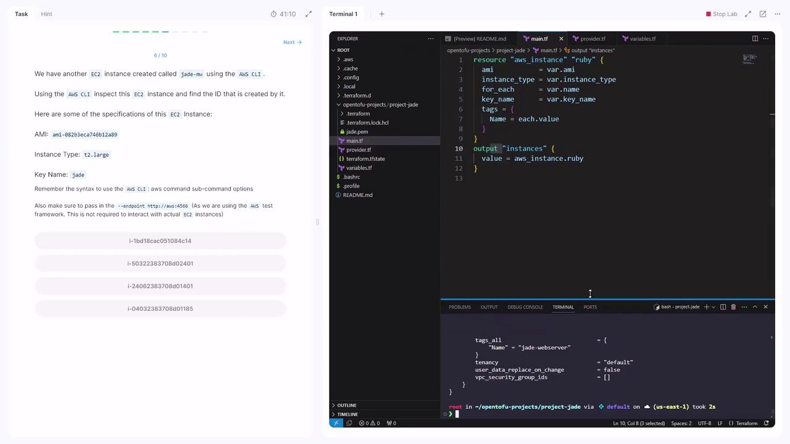
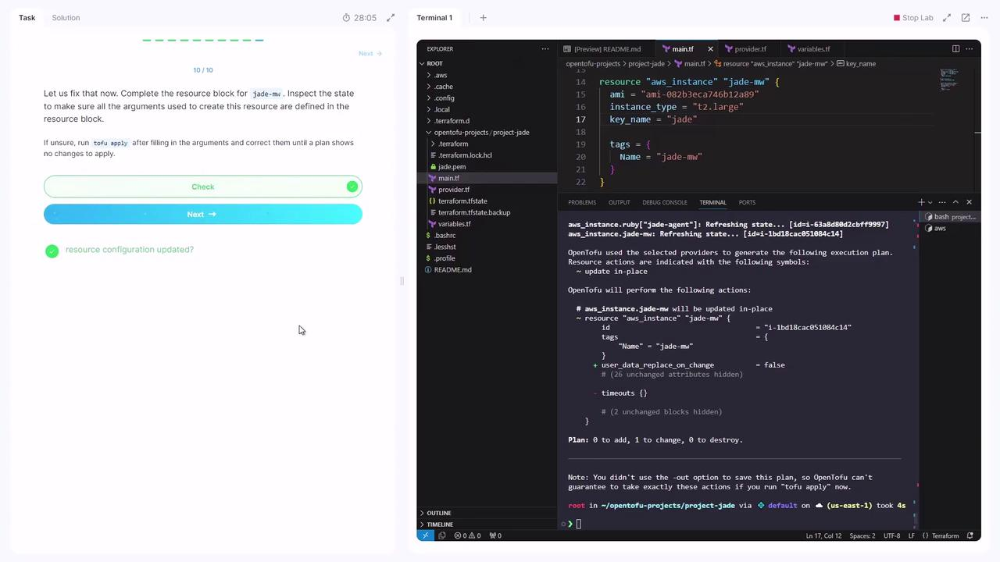

# Demo Tofu Import

Source: https://notes.kodekloud.com/docs/OpenTofu-A-Beginners-Guide-to-a-Terraform-Fork-Including-Migration-From-Terraform/OpenTofu-Import-Tainting-Resources-and-Deubugging/Demo-Tofu-Import/page

Step-by-step guide on importing AWS EC2 resources into OpenTofu for management alongside Terraform code.

Welcome to this step-by-step guide on importing existing AWS resources into OpenTofu. By the end of this tutorial, you'll know how to discover unmanaged resources, import an EC2 instance, and manage it alongside your Terraform code.

## Prerequisites

* OpenTofu CLI installed
* AWS CLI configured for LocalStack (or your AWS account)
* A project directory named `project-jade`

## 1. Initialize the Project Directory

Open your terminal and navigate to the `project-jade` folder:

```bash theme={null}
cd flashroot/opentofu-projects/project-jade/
```

## 2. Review the Existing Terraform Configuration

Below is the current HCL setup. It defines an AWS provider, global variables, and a set of EC2 instances:

```hcl theme={null}
terraform {
  required_providers {
    aws = {
      source  = "hashicorp/aws"
      version = "4.15.0"
    }
  }
}

provider "aws" {
  region                       = "us-east-1"
  skip_credentials_validation  = true
  skip_requesting_account_id   = true
  endpoints {
    ec2 = "http://aws:4566"
  }
}

variable "name" {
  type    = set(string)
  default = ["jade-webserver", "jade-lbr", "jade-app1", "jade-app2"]
}

variable "ami" {
  default = "ami-0c9bfc21ac5bf10eb"
}

variable "instance_type" {
  default = "t2.nano"
}

variable "key_name" {
  default = "jade"
}

resource "aws_instance" "ruby" {
  for_each      = var.name
  ami           = var.ami
  instance_type = var.instance_type
  key_name      = var.key_name

  tags = {
    Name = each.value
  }
}

output "instances" {
  value = aws_instance.ruby
}
```

| Variable            | Description               | Example Default                       |
| ------------------- | ------------------------- | ------------------------------------- |
| `var.name`          | Set of EC2 instance names | `["jade-webserver","jade-lbr","..."]` |
| `var.ami`           | AMI ID for all instances  | `"ami-0c9bfc21ac5bf10eb"`             |
| `var.instance_type` | EC2 instance type         | `"t2.nano"`                           |
| `var.key_name`      | SSH key pair name         | `"jade"`                              |

## 3. Identify Unmanaged Resources

To list all resources tracked in state versus your code, run:

```bash theme={null}
tofu show
```

Compare this output with your HCL.\
**Question:** Which resource appears in the state but not in the configuration?\
**Answer:** An EC2 instance (e.g., `jade-agent`) that wasn’t defined in code.

## 4. Provision the SSH Key Pair

OpenTofu did not create the `jade` key pair—it was generated via AWS CLI:

```bash theme={null}
aws ec2 create-key-pair \
  --endpoint http://aws:4566 \
  --key-name jade \
  --query 'KeyMaterial' \
  --output text > jade.pem
```

This command writes the private key to `jade.pem`.

<Callout icon="triangle-alert">
  Keep your private keys out of version control. Add `jade.pem` to `.gitignore`.
</Callout>

## 5. Locate the External EC2 Instance ID

Another EC2 instance named **Jade-MW** was created manually. Retrieve its Instance ID:

```bash theme={null}
aws ec2 describe-instances --endpoint http://aws:4566
```

<Frame>
  
</Frame>

Sample JSON excerpt:

```json theme={null}
{
  "Reservations": [
    {
      "Instances": [
        {
          "ImageId": "ami-0b32bca746b12849",
          "InstanceId": "i-1bd18cac05184c14",
          "InstanceType": "t2.large",
          "KeyName": "jade",
          ...
        }
      ]
    }
  ]
}
```

> Instance ID: `i-1bd18cac05184c14`

## 6. Import the EC2 Instance into OpenTofu

1. Create an empty resource block in **main.tf**:

   ```hcl theme={null}
   resource "aws_instance" "jade-mw" {
   }
   ```

2. Import the existing EC2 resource:

   ```bash theme={null}
   tofu import aws_instance.jade-mw i-1bd18cac05184c14
   ```

## 7. Complete the Imported Resource Definition

After import, running `tofu apply` will show missing arguments. Inspect the imported state:

```bash theme={null}
tofu show
```

Then update **main.tf** with the required properties:

```hcl theme={null}
resource "aws_instance" "jade-mw" {
  ami           = "ami-0b32bca746b12849"
  instance_type = "t2.large"
  key_name      = "jade"

  tags = {
    Name = "jade-mw"
  }
}
```

<Callout icon="lightbulb">
  You can always re-run `tofu show` to confirm attribute names and values for any imported resource.
</Callout>

## 8. Validate the Configuration

Run a plan to ensure no changes are pending:

```bash theme={null}
tofu plan
```

You should see **0 to add, 0 to change, 0 to destroy**.

<Frame>
  
</Frame>

***

Congratulations! You’ve successfully imported and now manage an existing AWS EC2 instance with OpenTofu.

## References

* [OpenTofu Documentation](https://opentofu.io/docs/)
* [AWS CLI EC2 Commands](https://docs.aws.amazon.com/cli/latest/reference/ec2/)
* [Terraform AWS Provider](https://registry.terraform.io/providers/hashicorp/aws/latest)

<CardGroup>
  <Card title="Watch Video" icon="video" href="https://learn.kodekloud.com/user/courses/opentofu-a-beginners-guide-to-a-terraform-fork-including-migration-from-terraform/module/0fda982f-8bb2-4b57-8009-996870d27e43/lesson/871f5dc8-6a3d-4e31-8afe-f440d7c0014a" />

  <Card title="Practice Lab" icon="installation" href="https://learn.kodekloud.com/user/courses/opentofu-a-beginners-guide-to-a-terraform-fork-including-migration-from-terraform/module/0fda982f-8bb2-4b57-8009-996870d27e43/lesson/f7f08470-934f-4686-a955-df201f9ba5dd" />
</CardGroup>
