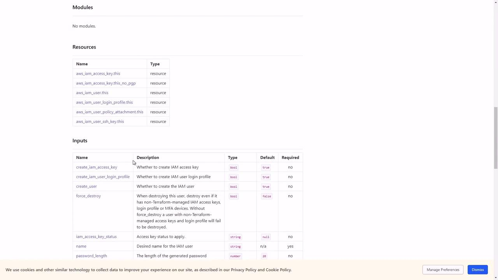

# aws_instance.webserver is tainted, so must be replaced
-/+ resource "aws_instance" "webserver" {
    ...
}
```

Even if the EC2 instance still exists in AWS, OpenTofu will destroy and recreate it because it’s marked tainted.

## 2. Forcing Resource Replacement

To manually mark a resource as tainted (without immediately destroying it):

```bash theme={null}
$ tofu apply-replace aws_instance.webserver
```

Inspect the planned replacement:

```bash theme={null}
$ tofu plan
```

Output:

```plaintext theme={null}
Refreshing state in-memory prior to plan...
aws_instance.webserver: Refreshing state... [id=i-0fd3946f5b3ab8af8]

An execution plan has been generated and is shown below.
Resource actions are indicated with the following symbols:
  -/+ destroy and then create replacement

OpenTofu will perform the following actions:

# aws_instance.webserver is tainted (apply-replace), so will be recreated
-/+ resource "aws_instance" "webserver" {
    ...
}
```

## 3. Undoing a Taint

If you accidentally tainted a resource or decide to keep it:

```bash theme={null}
$ tofu untaint aws_instance.webserver
```

A subsequent `tofu plan` will no longer list that resource for replacement.

## Summary of Taint Commands

| Command                     | Description                                 | Example                                       |
| --------------------------- | ------------------------------------------- | --------------------------------------------- |
| tofu apply                  | Applies changes and auto-taints on failures | `$ tofu apply`                                |
| tofu apply-replace RESOURCE | Marks a resource as tainted for next apply  | `$ tofu apply-replace aws_instance.webserver` |
| tofu untaint RESOURCE       | Removes the taint flag from a resource      | `$ tofu untaint aws_instance.webserver`       |

<Callout icon="triangle-alert">
  Using `tofu apply-replace` will destroy and recreate resources. Ensure you have appropriate backups or snapshots before proceeding.
</Callout>

<CardGroup>
  <Card title="Watch Video" icon="video" href="https://learn.kodekloud.com/user/courses/opentofu-a-beginners-guide-to-a-terraform-fork-including-migration-from-terraform/module/0fda982f-8bb2-4b57-8009-996870d27e43/lesson/04753b68-9a1d-46ca-a149-cdf9c1ae58c0" />
</CardGroup>


# Demo OpenTofu Modules

Source: https://notes.kodekloud.com/docs/OpenTofu-A-Beginners-Guide-to-a-Terraform-Fork-Including-Migration-From-Terraform/OpenTofu-Modules/Demo-OpenTofu-Modules/page

This article covers managing OpenTofu modules to create and configure an AWS IAM user.

Welcome to this hands-on lesson on managing OpenTofu modules. You’ll learn how to inspect, configure, and apply a module to create an AWS IAM user.

## 1. Inspecting the Module Configuration

First, navigate to the project directory and open `main.tf`:

```bash theme={null}
cd /root/OpenTofu/projects/Project\ Sapphire
```

```hcl theme={null}
module "iam_iam-user" {
  source  = "terraform-aws-modules/iam/aws//modules/iam-user"
  version = "5.28.0"
  # insert the 1 required variable here
}
```

Key details:

* A single `module` block named `iam_iam-user`.
* Source: `terraform-aws-modules/iam/aws//modules/iam-user`
* Version: `5.28.0`
* Requires one input: `name` ([registry docs][iam-user module docs]).

## 2. Supplying the Required Input

To create an IAM user named **max**, update the block:

```hcl theme={null}
module "iam_iam-user" {
  source  = "terraform-aws-modules/iam/aws//modules/iam-user"
  version = "5.28.0"
  name    = "max"
}
```

## 3. Initializing and Planning

Initialize your working directory and generate a plan:

```bash theme={null}
openTofu init
openTofu plan
```

You’ll see three resources slated for creation:

```plaintext theme={null}
module.iam_iam-user.aws_iam_access_key.this_no_pgp[0] will be created
module.iam_iam-user.aws_iam_user.this[0] will be created
module.iam_iam-user.aws_iam_user_login_profile.this[0] will be created

Plan: 3 to add, 0 to change, 0 to destroy.
```

The extra resources result from default boolean inputs.

<Frame>
  
</Frame>

<Callout icon="lightbulb">
  By default, the `iam-user` module defines these inputs:

  | Variable                          | Type   | Default | Required |
  | --------------------------------- | ------ | ------- | -------- |
  | name                              | string | —       | yes      |
  | create\_iam\_access\_key          | bool   | true    | no       |
  | create\_iam\_user\_login\_profile | bool   | true    | no       |
</Callout>

## 4. Restricting Resource Creation

To limit the module to only create the IAM user, disable the access key and login profile:

```hcl theme={null}
module "iam_iam-user" {
  source                        = "terraform-aws-modules/iam/aws//modules/iam-user"
  version                       = "5.28.0"
  name                          = "max"
  create_iam_access_key         = false
  create_iam_user_login_profile = false
}
```

Reinitialize and apply:

```bash theme={null}
openTofu init
openTofu apply
```

The new plan shows only the user resource:

```plaintext theme={null}
Plan: 1 to add, 0 to change, 0 to destroy.

module.iam_iam-user.aws_iam_user.this[0]: Creating...
module.iam_iam-user.aws_iam_user.this[0]: Creation complete after 0s [id=max]

Apply complete! Resources: 1 added, 0 changed, 0 destroyed.
```

## 5. Summary

You have now configured the `iam-user` module to create a single IAM user, controlling exactly which resources are deployed.

## References

* [IAM User Module Documentation][iam-user module docs]

[iam-user module docs]: https://registry.terraform.io/modules/terraform-aws-modules/iam/aws/latest

<CardGroup>
  <Card title="Watch Video" icon="video" href="https://learn.kodekloud.com/user/courses/opentofu-a-beginners-guide-to-a-terraform-fork-including-migration-from-terraform/module/d4c286c6-b8ee-47b1-bea3-abcf408b00ed/lesson/b3d60ff8-79d5-4a00-802c-79111cd664ff" />

  <Card title="Practice Lab" icon="installation" href="https://learn.kodekloud.com/user/courses/opentofu-a-beginners-guide-to-a-terraform-fork-including-migration-from-terraform/module/d4c286c6-b8ee-47b1-bea3-abcf408b00ed/lesson/aeb71e1a-1044-4f39-92c4-24d99715436f" />
</CardGroup>
