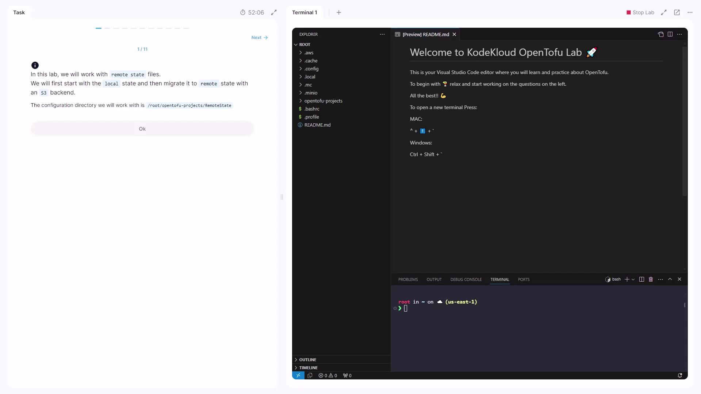

# local_file.classics:
resource "local_file" "classics" {
  content               = "<<EOT\n1. DragonBall\nEOT"
  content_base64sha256  = "61ybEEB9hy2PJuJ30dyB1jDrngh76EV9R9KSA4="
  content_base64sha512  = "lKrYdMr2TokTZk1xL17LfPlLxUld8Z7uGL4vFq/Ko1Bq0yJ6w="
  content_md5           = "content_md5"
  content_sha1          = "content_sha1"
  content_sha256        = "content_sha256"
  content_sha512        = "content_sha512"
  directory_permission  = "755"
  file_permission       = "644"
  filename              = "/root/anime/classic_shows.txt"
  id                    = "8ac5abf90e9a20aa8e3b49f248d568f2367b2"
}
```

<Callout icon="lightbulb">
  The `tofu state show` command only reads the state—your infrastructure remains unchanged.
</Callout>

***

## 3. Retrieving the ID of a Resource

If you need a resource’s unique identifier (e.g., to reference it elsewhere), use:

```bash theme={null}
tofu state show local_file.top10
```

Look for the `id =` line. It might appear as:

```text theme={null}
id = "961e7f431c2b8a09f1b2d3a4e5b6c7d8e9f0a1b2"
```

***

## 4. Removing a Resource from State

To stop managing a resource without destroying it, remove its block from `main.tf` and then:

```bash theme={null}
tofu state rm local_file.hall_of_fame
```

Sample session:

```bash theme={null}
$ tofu state rm local_file.hall_of_fame
Removed local_file.hall_of_fame
Successfully removed 1 resource instance(s).
```

Verify removal:

```bash theme={null}
tofu state list
```

<Callout icon="triangle-alert">
  `tofu state rm` **does not** delete actual resources. It only detaches them from Terraform’s state.
</Callout>

***

## 5. Working with Remote State (S3 Backend)

In `/root/OpenTofu/project/super-pets/`, configure an S3 backend in `tofu.tf`:

```hcl theme={null}
terraform {
  backend "s3" {
    bucket = "my-remote-state"
    key    = "super-pets/terraform.tfstate"
    region = "us-east-1"
  }
}
```

Define two `random_pet` resources in `main.tf`:

```hcl theme={null}
resource "random_pet" "super_pet_1" {
  length    = var.length1
  prefix    = var.prefix1
  separator = "-"
}

resource "random_pet" "super_pet_2" {
  length    = var.length2
  prefix    = var.prefix2
  separator = "-"
}
```

And variables:

```hcl theme={null}
variable "length1" { default = 1 }
variable "length2" { default = 2 }
variable "prefix1" { default = "Super" }
variable "prefix2" { default = "Wonder" }
```

Since the state is stored remotely, all `tofu state` commands will interact with S3.

To confirm:

```bash theme={null}
tofu state show random_pet.super_pet_1
```

Output:

```bash theme={null}
# random_pet.super_pet_1:
id        = "Super-grackle"
length    = 1
prefix    = "Super"
separator = "-"
```

***

## 6. Finding the ID of `super_pet_2`

Similarly, retrieve the ID for the second pet:

```bash theme={null}
tofu state show random_pet.super_pet_2
```

Example:

```bash theme={null}
# random_pet.super_pet_2:
id        = "Wonder-super-pup"
length    = 2
prefix    = "Wonder"
separator = "-"
```

***

## 7. Renaming a Resource in Config and State

To rename `random_pet.super_pet_1` to `random_pet.ultra_pet`:

1. **Update `main.tf`:**

   ```hcl theme={null}
   resource "random_pet" "ultra_pet" {
     length    = var.length1
     prefix    = var.prefix1
     separator = "-"
   }

   resource "random_pet" "super_pet_2" {
     length    = var.length2
     prefix    = var.prefix2
     separator = "-"
   }
   ```

2. **Move it in the state:**

   ```bash theme={null}
   tofu state mv random_pet.super_pet_1 random_pet.ultra_pet
   ```

3. **Verify:**

   ```bash theme={null}
   tofu state list
   # Outputs: random_pet.ultra_pet, random_pet.super_pet_2
   ```

***

Thank you for following this tutorial on OpenTofu state management!

## Links and References

* [OpenTofu Documentation](https://opentofu.io/docs)
* [Terraform State Management](https://developer.hashicorp.com/terraform/cli/commands/state)
* [AWS S3 Backend](https://registry.terraform.io/providers/hashicorp/aws/latest/docs/resources/s3_bucket)

<CardGroup>
  <Card title="Watch Video" icon="video" href="https://learn.kodekloud.com/user/courses/opentofu-a-beginners-guide-to-a-terraform-fork-including-migration-from-terraform/module/dd54768d-8454-44bd-bab2-99f8f7b5f145/lesson/baf21805-46cd-4e5a-8c54-c0f7077c60c8" />

  <Card title="Practice Lab" icon="installation" href="https://learn.kodekloud.com/user/courses/opentofu-a-beginners-guide-to-a-terraform-fork-including-migration-from-terraform/module/dd54768d-8454-44bd-bab2-99f8f7b5f145/lesson/84ec9729-999c-49cb-adcd-4ab31ab275e2" />
</CardGroup>


# Demo Remote State

Source: https://notes.kodekloud.com/docs/OpenTofu-A-Beginners-Guide-to-a-Terraform-Fork-Including-Migration-From-Terraform/Remote-State/Demo-Remote-State/page

This tutorial teaches managing Terraform state locally and migrating it to a remote S3-compatible backend using MinIO.

Welcome to the OpenTofu Remote State lab! In this tutorial, you’ll learn how to manage Terraform state locally and then migrate it to a remote S3-compatible backend using MinIO. We’ll walk through creating local state, switching variables, configuring S3 backend, and migrating your state seamlessly.

<Frame>
  
</Frame>

Your working directory is:

```text theme={null}
/root/OpenTofu/projects/remote_state
```

Open it in [Visual Studio Code](https://code.visualstudio.com/).

***

## 1. Define a Local File Resource

Create `main.tf` with a `local_file` resource that writes to a file based on a variable:

```hcl theme={null}
resource "local_file" "state" {
  filename = "/root/${var.local_state}"
  content  = "This configuration uses ${var.local_state} state"
}
```

Declare the variables in `variables.tf`:

| Variable           | Type   | Default  | Description                      |
| ------------------ | ------ | -------- | -------------------------------- |
| `var.local_state`  | string | `local`  | Filename when using local state  |
| `var.remote_state` | string | `remote` | Filename when using remote state |

Initialize and review:

```bash theme={null}
cd /root/OpenTofu/projects/remote_state
tofu init
tofu plan
```

Apply the configuration:

```bash theme={null}
tofu apply
