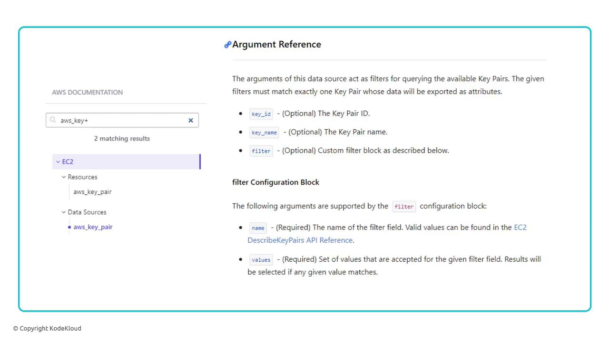
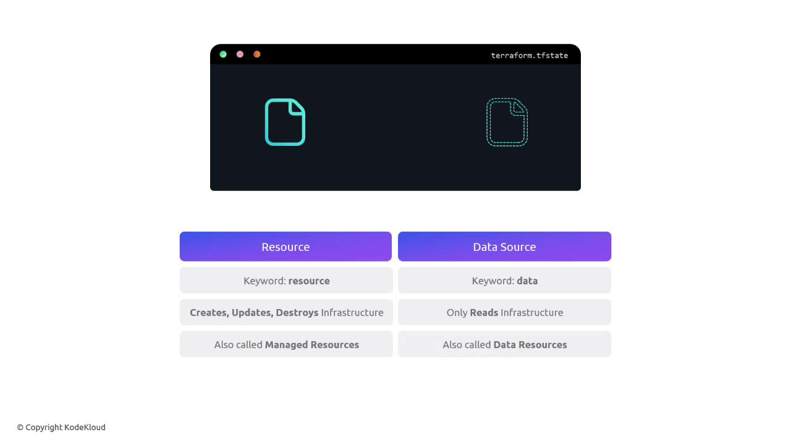

# Data Sources

Source: https://notes.kodekloud.com/docs/OpenTofu-A-Beginners-Guide-to-a-Terraform-Fork-Including-Migration-From-Terraform/Working-with-OpenTofu/Data-Sources/page

This article explains how to use data sources in OpenTofu to fetch read-only information about existing infrastructure.

OpenTofu lets you provision infrastructure and reference attributes between resources using expressions. But what if a resource already exists—created manually, via another tool, or in a different configuration? Data sources solve this by fetching read-only information about existing infrastructure.

## Why Use Data Sources?

* Read attributes of existing resources without managing their lifecycle.
* Integrate with resources created by CloudFormation, Ansible, Terraform, or manually.
* Avoid duplicating state in multiple configurations.

<Callout icon="lightbulb">
  Data sources are *read-only*. They cannot create, update, or destroy resources. For full lifecycle management, use `resource` blocks instead.
</Callout>

## Referencing an Existing AWS Key Pair

Suppose you already have an AWS Key Pair named `alpha`. You can fetch its `key_name` for use in an EC2 instance:

```hcl theme={null}
data "aws_key_pair" "cerberus_key" {
  key_name = "alpha"
}

resource "aws_instance" "cerberus" {
  ami           = var.ami
  instance_type = var.instance_type
  key_name      = data.aws_key_pair.cerberus_key.key_name
}
```

* `data "aws_key_pair" "cerberus_key"` declares a data source.
* The argument `key_name = "alpha"` locates the existing key pair.
* In the EC2 resource, `data.aws_key_pair.cerberus_key.key_name` provides the fetched value.

<Frame>
  
</Frame>

<Callout icon="lightbulb">
  Check the AWS Provider Data Sources documentation for all available arguments and attributes: [https://registry.terraform.io/[AWS_SECRET_ACCESS_KEY]-sources/key\_pair](https://registry.terraform.io/[AWS_SECRET_ACCESS_KEY]-sources/key_pair)
</Callout>

## Filtering Data Sources by Tags

When you can’t identify a resource by a single attribute, use filters. For example, locate the key pair tagged with `project = cerberus`:

```hcl theme={null}
data "aws_key_pair" "cerberus_key" {
  filter {
    name   = "tag:project"
    values = ["cerberus"]
  }
}

resource "aws_instance" "cerberus" {
  ami           = var.ami
  instance_type = var.instance_type
  key_name      = data.aws_key_pair.cerberus_key.key_name
}
```

* The `filter` block matches key pairs with the given tag.
* Multiple filters can be combined to narrow the search.

## Resources vs. Data Sources

| Aspect          | Resource Blocks              | Data Source Blocks            |
| --------------- | ---------------------------- | ----------------------------- |
| Lifecycle       | Create, Read, Update, Delete | Read only                     |
| Keyword         | `resource`                   | `data`                        |
| Terraform State | Managed                      | Not managed                   |
| Use Case        | Provision infrastructure     | Query existing infrastructure |

<Frame>
  
</Frame>

## Links and References

* [OpenTofu Documentation](https://opentofu.io/)
* [Terraform AWS Provider Data Sources](https://registry.terraform.io/[AWS_SECRET_ACCESS_KEY]-sources/)
* [AWS CloudFormation](https://docs.aws.amazon.com/cloudformation/)
* [Ansible](https://www.ansible.com/)

<CardGroup>
  <Card title="Watch Video" icon="video" href="https://learn.kodekloud.com/user/courses/opentofu-a-beginners-guide-to-a-terraform-fork-including-migration-from-terraform/module/69432d48-55d0-4340-a56d-9f9a7819d26c/lesson/5036c5cd-aa89-4255-8417-70d9b4c7b505" />
</CardGroup>
