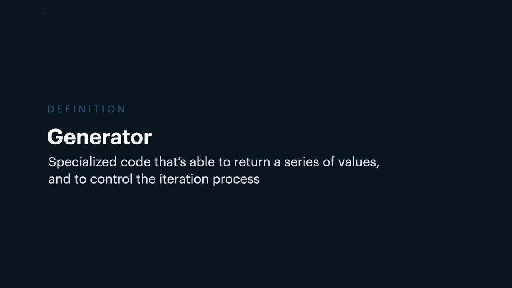
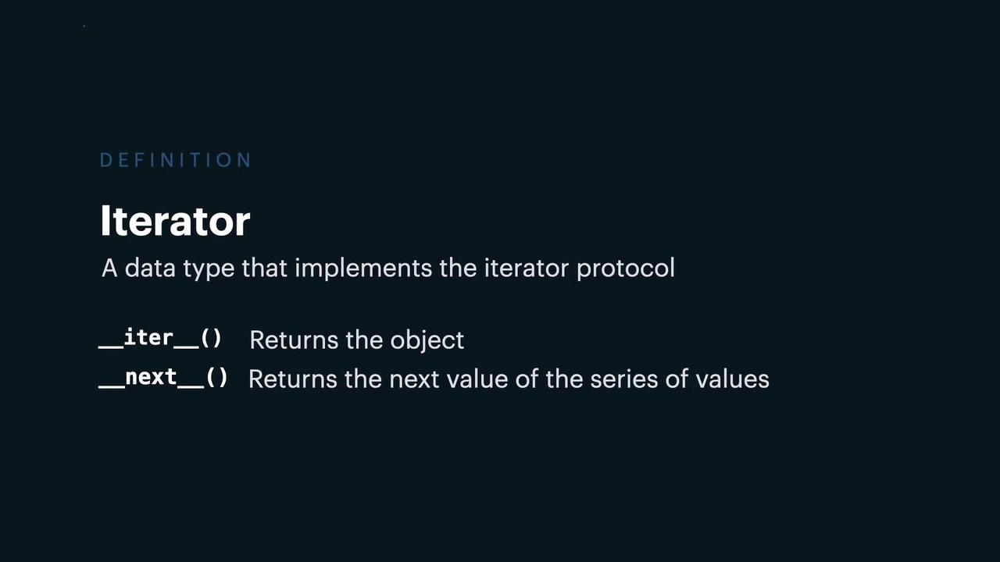

# Generators List Comprehension Lambda and Closures

Source: https://notes.kodekloud.com/docs/PCAP-Python-Certification-Course/Miscellaneous/Generators-List-Comprehension-Lambda-and-Closures/page

This article explores core Python concepts including generators, list comprehensions, lambda functions, and closures to enhance coding efficiency and conciseness.

In this article, we delve into several core Python concepts: generators, list comprehensions, lambda functions, and closures. By understanding these concepts, you'll be better equipped to write efficient and concise code. We'll start with the range function, which is frequently used to print a sequence of values.

The range function returns an iterator—a special type of generator that produces numbers on demand. Consider the following example:

```python theme={null}
for i in range(5):
    print(i)
```

Output:

```plaintext theme={null}
0
1
2
3
4
```

A generator is a specialized piece of code that can yield a series of values while preserving its state between iterations. Since the range function returns an iterator, it can be used directly within a for-in loop to traverse its values.

<Frame>
  
</Frame>

## Iterators and the Iterator Protocol

An iterator is an object that adheres to the iterator protocol by implementing two core methods: `__iter__()` and `__next__()`. The `__iter__()` method returns the iterator object itself (typically called once), while the `__next__()` method yields the next value in the sequence. When the sequence is exhausted, `__next__()` raises a StopIteration exception.

<Frame>
  
</Frame>

## Creating a Custom Generator via an Iterator

Although Python's built-in range function offers a ready-made iterator, you can also create a custom iterator by defining the necessary methods. The following example demonstrates how to implement a custom range class that emulates the behavior of the built-in range:

```python theme={null}
class CustomRange:
    def __init__(self, maximum):
        self.__maximum = maximum
        self.__current = 0

    def __iter__(self):
        return self

    def __next__(self):
        if self.__current >= self.__maximum:
            raise StopIteration
        result = self.__current
        self.__current += 1
        return result

custom_range = CustomRange(10)
for i in custom_range:
    print(i)
```

In this implementation, the `__iter__()` method returns the object itself, while the `__next__()` method returns the current value before incrementing it. Once the current value reaches the maximum, a StopIteration is raised to signal the end of the iteration.

<Callout icon="lightbulb">
  Managing state manually in iterators (like keeping track of the current value) can be avoided by using the yield keyword, which simplifies generator creation.
</Callout>

## Using Generators with the yield Keyword

The yield keyword allows a function to produce a series of values without losing its state, effectively pausing and resuming the function's execution. Consider this simple example:

```python theme={null}
def simple_generator():
    for i in range(5):
        yield i
