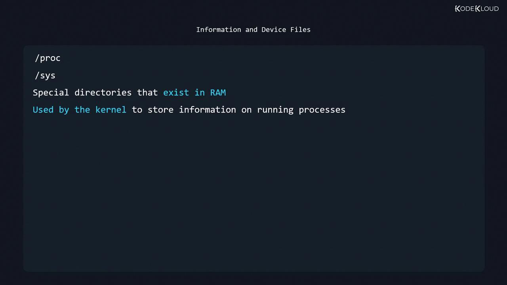

# List loaded modules
lsmod

# Filter for sound-related modules
lsmod | fgrep -i snd
```

Unload (remove) a module:

```bash theme={null}
sudo modprobe -r snd_hda_intel
```

<Callout icon="triangle-alert">
  Unloading critical modules (e.g., storage or network drivers) can render your system unbootable. Proceed with caution.
</Callout>

View detailed information about a module:

```bash theme={null}
modinfo snd
```

List only parameters:

```bash theme={null}
modinfo snd -p
```

### 3.1 Persistent Module Configuration

To apply module parameters at boot or blacklist unwanted modules, use files in `/etc/modprobe.d/`:

| Config File                      | Purpose                      |
| -------------------------------- | ---------------------------- |
| `/etc/modprobe.d/<module>.conf`  | Set parameters for a module  |
| `/etc/modprobe.d/blacklist.conf` | Prevent modules from loading |
| `/etc/modprobe.conf`             | Legacy configuration file    |

Example: blacklisting the `snd` driver:

```text theme={null}
blacklist snd
```

## 4. Kernel Information Files (/proc and /sys)

Linux exposes hardware and process information via two virtual filesystems:

* `/proc`: Process and kernel data (e.g., `/proc/cpuinfo`)
* `/sys`: Device and driver attributes (e.g., `/sys/class/net`)

<Frame>
  
</Frame>

<Callout icon="lightbulb">
  Since `/proc` and `/sys` reside in volatile memory, their contents reset on reboot.
</Callout>

***

Continue to the quiz to test your understanding of Linux hardware configuration and inspection.

<CardGroup>
  <Card title="Watch Video" icon="video" href="https://learn.kodekloud.com/user/courses/linux-professional-institute-lpic-1-exam-101/module/55c2d118-3a85-4da1-8a7f-e9f8671cc818/lesson/5985cc6f-eacb-4c02-bc57-2317e64ce94f" />
</CardGroup>


# Conclusion

Source: https://notes.kodekloud.com/docs/Prep-Course-Linux-Foundation-Certified-System-Administrator-LFCS-Certification/Conclusion/Conclusion/page

This article concludes a Linux System Administration course, highlighting skills learned and encouraging further exploration in the field.

Congratulations on completing this comprehensive Linux System Administration course!

Over the past few weeks, you have delved into the intricate world of Linux system administration, acquiring a wide range of skills essential for success in this competitive field. Whether you embarked on this journey as a beginner or sought to expand your expertise, you are now well-prepared for the certification exam and the challenges of real-world system management.

Throughout the course, you learned how to:

* Navigate systems and manage files using critical commands.
* Execute deployment operations and automate tasks efficiently.
* Manage processes and adjust kernel runtime parameters.
* Oversee user and group administration and implement robust security configurations.
* Configure IPv4 and IPv6 settings, manage packets, and handle SSH operations.
* Master storage techniques, including partitioning, file systems, remote storage, and permissions, ensuring data integrity.

These skills have laid a solid foundation for your future as a certified Linux administrator.

<Callout icon="lightbulb">
  Hands-on labs and real-world scenarios played a crucial role in reinforcing your knowledge, allowing you to apply theoretical concepts to practical challenges confidently.
</Callout>

Below is an example command you might have used during the course:

```bash theme={null}
sudo find /opt/findme/ -type f -perm u=x | sudo tee /opt/foundthem.txt
```

I extend my deepest gratitude for your dedication, enthusiasm, and commitment throughout this course. Remember, learning is a continuous journey—what you have mastered here is just the beginning. Continue to explore and experiment with the ever-evolving landscape of Linux and open-source technologies.

If you’re aiming to further enhance your skills and credentials, consider the [Red Hat Certified System Administrator (RHCSA)](https://learn.kodekloud.com/user/courses/red-hat-certified-system-administrator-rhcsa) course available on KodeKloud. This course is meticulously designed to help you master Red Hat Enterprise Linux and excel in the RHCSA certification exam.

<Callout icon="lightbulb">
  Your newly acquired skills have vast potential to impact your career and the broader tech community. Go forward with confidence, curiosity, and determination—the dynamic realm of Linux system administration awaits your influence.
</Callout>

Thank you once again for your commitment, and best of luck as you continue your professional journey!

<CardGroup>
  <Card title="Watch Video" icon="video" href="https://learn.kodekloud.com/user/courses/linux-foundation-certified-system-administrator-lfcs/module/f408d15b-a4a0-45ea-96ba-b5717e0f1896/lesson/53a047dd-597e-4bbe-8381-8ae133d53ae4" />

  <Card title="Practice Lab" icon="installation" href="https://learn.kodekloud.com/user/courses/linux-foundation-certified-system-administrator-lfcs/module/da07a41e-0d84-4c94-9e9b-9a43a838b76e/lesson/f82ed719-396e-4d60-a122-6abbd55e2b07" />
</CardGroup>
