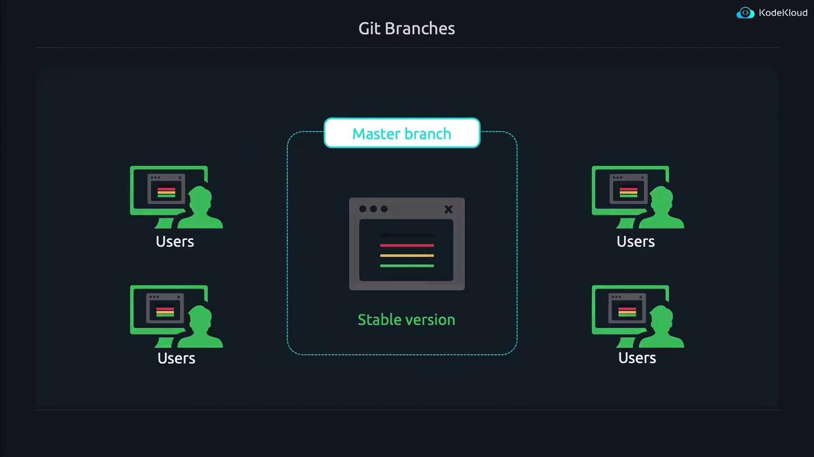
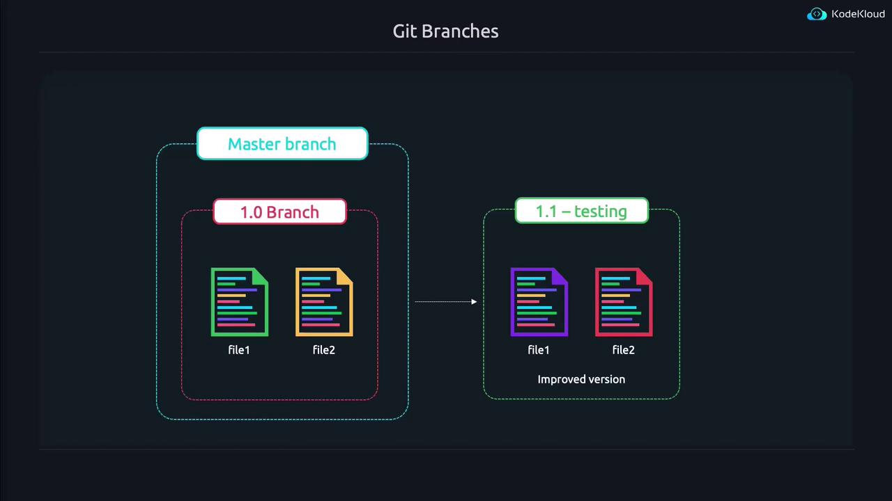
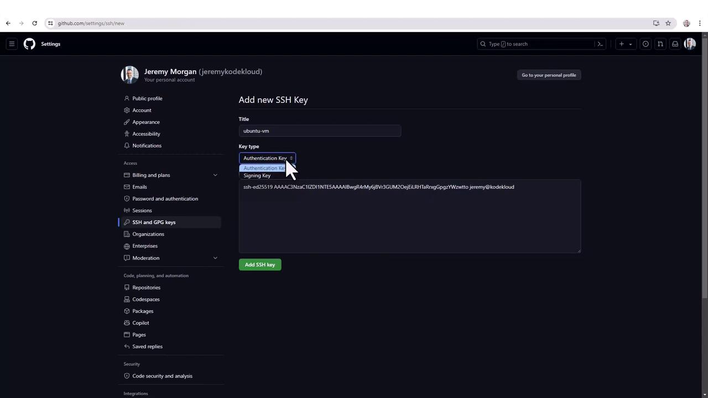
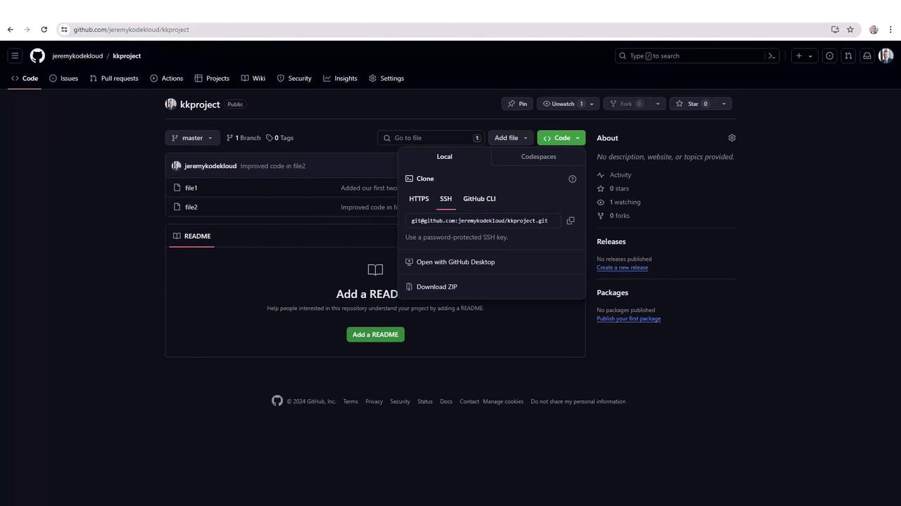
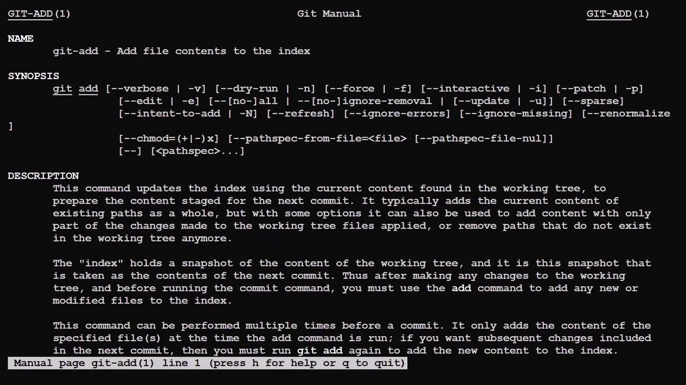

# Git Branches and Remote Repositories

Source: https://notes.kodekloud.com/docs/Prep-Course-Linux-Foundation-Certified-System-Administrator-LFCS-Certification/Essential-Commands/Git-Branches-and-Remote-Repositories/page

Learn to use Git branches and remote repositories for version management, tracking changes, merging, and team collaboration.

In this lesson, you will learn how to leverage Git branches and remote repositories to manage different versions of your code, track modifications, merge changes, and effectively collaborate with your team.

──────────────────────────────

## Understanding Branches

Running the "git status" command might produce output similar to the following:

```bash theme={null}
aaron@kodekloud:~/project$ git status
On branch master
Changes to be committed:
  (use "git restore --staged <file>..." to unstage)
        deleted:    file3

aaron@kodekloud:~/project$ git commit -m "Removed buggy feature"
[master 44b9e16] Remove buggy feature
 1 file changed, 1 deletion(-)
 delete mode 100644 file3
```

Git branches allow you to develop different versions of your project simultaneously. For example, if version 1.0 is already in production and requires bug fixes while new features are developed for version 1.1, you can create separate branches for each. The master branch is the default branch that typically holds your stable, released version.

Imagine your master branch is currently at version 1.0 with file1 and file2. The diagram below illustrates this concept by presenting the "Master branch" as the stable codebase accessed by users.

<Frame>
  
</Frame>

To experiment or develop new features without affecting the master branch, create a new branch. In this case, the branch is named "1.1-testing" to indicate that it is under development.

<Frame>
  
</Frame>

──────────────────────────────

## Working with Branches in the Terminal

You can easily create and switch to a new branch using the following commands:

```bash theme={null}
jeremy@kodekloud:~/project$ git branch 1.1-testing
jeremy@kodekloud:~/project$ git branch --list
* master
  1.1-testing
jeremy@kodekloud:~/project$ git checkout 1.1-testing
Switched to branch '1.1-testing'
```

Now that you are on the 1.1-testing branch, open "file2" in your preferred editor and make your modifications (for example, update a line to "This is the IMPROVED line of code in file2"). Then, run "git status" to see that your changes have been detected:

```bash theme={null}
jeremy@kodekloud:~/project$ vim file2
jeremy@kodekloud:~/project$ git status
On branch 1.1-testing
Changes not staged for commit:
  (use "git add <file>..." to update what will be committed)
  (use "git restore <file>..." to discard changes in working directory)
    modified:   file2

no changes added to commit (use "git add" and/or "git commit -a")
```

<Callout icon="lightbulb">
  Before committing, always add your changes to the staging area using "git add" to ensure that only the intended modifications are committed.
</Callout>

Proceed to add and commit your changes:

```bash theme={null}
jeremy@kodekloud:~/project$ git add file2
jeremy@kodekloud:~/project$ git commit -m "Improved code in file2"
[1.1-testing 34a562] Improved code in file2
 1 file changed, 1 insertion(+), 1 deletion(-)
```

At this point, the improvements exist only in the 1.1-testing branch, leaving the master branch unchanged.

──────────────────────────────

## Viewing Commit History

To review the history of your Git commits, use the Git log. Executing the following command provides detailed commit entries:

```bash theme={null}
jeremy@kodekloud:~/project$ git log --raw
```

In the log output, symbols indicate file actions: A for added, D for deleted, and M for modified files. Each commit is identified by a unique hash value. To inspect the changes in a specific commit, use the "git show" command along with part of the commit hash. For example, a diff might resemble:

```diff theme={null}
+++ b/file2
@@ -1 +1 @@
-This is the ORIGINAL line of code in file2
+This is the IMPROVED line of code in file2
```

If you switch back to the master branch, you'll notice that it remains one commit behind. For example:

```bash theme={null}
jeremy@kodekloud:~/project$ git checkout master
Switched to branch 'master'
jeremy@kodekloud:~/project$ cat file2
This is the ORIGINAL line of code in file2
```

This demonstrates that the HEAD pointer reflects the state of the current branch.

──────────────────────────────

## Merging Branches

Once you have verified the improvements on the 1.1-testing branch, you can merge these changes back into the master branch. First, switch to the master branch:

```bash theme={null}
jeremy@kodekloud:~/project$ git checkout master
Already on 'master'
```

Then, merge the 1.1-testing branch:

```bash theme={null}
jeremy@kodekloud:~/project$ git merge 1.1-testing
Updating 44e4de1..344e562
Fast-forward
 file2 | 2 +-
 1 file changed, 1 insertion(+), 1 deletion(-)
```

After the merge, the master branch now includes the improvements made in file2:

```bash theme={null}
jeremy@kodekloud:~/project$ cat file2
This is the IMPROVED line of code in file2
```

──────────────────────────────

## Working with Remote Repositories

Up until now, you have been working with your local repository. In collaborative environments, it's vital to synchronize your changes with a remote repository hosted on platforms like [GitHub](https://github.com) or [GitLab](https://gitlab.com).

### Pushing Local Changes

Pushing your local commits to a remote repository ensures that your collaborators can access the latest version of your project. Start by checking the current remote configuration:

```bash theme={null}
jeremy@kodekloud:~/project$ git remote -v
```

If there's no remote configured, add one using the connection string provided by your hosting platform:

```bash theme={null}
jeremy@kodekloud:~/project$ git remote add origin git@github.com:jeremykodekloud/kkproject.git
jeremy@kodekloud:~/project$ git remote -v
origin  git@github.com:jeremykodekloud/kkproject.git (fetch)
origin  git@github.com:jeremykodekloud/kkproject.git (push)
```

Push the changes on the master branch to your remote repository:

```bash theme={null}
jeremy@kodekloud:~/project$ git push origin master
```

Follow any prompts regarding host authenticity if this is your first connection.

──────────────────────────────

## Configuring SSH Keys

For secure communication with Git remote repositories, it's recommended to use SSH keys. To generate an SSH key pair, run:

```bash theme={null}
jeremy@kodekloud:~/project$ ssh-keygen
Generating public/private ed25519 key pair.
Enter file in which to save the key (/home/jeremy/.ssh/id_ed25519):
Enter passphrase (empty for no passphrase):
```

Once your keys have been generated, view your public key:

```bash theme={null}
jeremy@kodekloud:~/project$ cat ~/.ssh/id_ed25519.pub
ssh-ed25519 [SECRET_REDACTED] jeremy@kodekloud
```

Copy the displayed key and add it to your GitHub account under Settings → SSH and GPG keys.

<Frame>
  
</Frame>

After adding your SSH key, you can securely push your changes.

──────────────────────────────

## Cloning a Remote Repository

When a new team member joins, they can easily clone the remote repository to get the entire project history. For example:

```bash theme={null}
git clone git@github.com:jeremykodekloud/kkproject.git
```

This command creates a local directory named "kkproject" along with a hidden .git folder containing all commit history.

<Frame>
  
</Frame>

──────────────────────────────

## Getting Additional Help

Git is a powerful tool with a wide range of features. If you ever need assistance or a reminder of a command's options, simply type "git" and press the tab key twice to see a list of commands. For in-depth information on any command, you can consult the manual pages:

```bash theme={null}
man git-add
```

A sample Git log entry may look like this:

```plaintext theme={null}
commit 136b3a701d98fcc5c5e17ec3bc92272e4a810be
Author: jeremy <jeremy@kodekloud.com>
Date:   Thu Jun 13 20:52:23 2024 +0000

removed buggy feature

commit [SECRET_REDACTED]
Author: jeremy <jeremy@kodekloud.com>
Date:   Thu Jun 13 20:47:33 2024 +0000

Added new feature

Added our first two files to get the project started
```

For further reading and advanced Git techniques, please visit the [KodeKloud Git Documentation](https://www.kodekloud.com).

<Frame>
  
</Frame>

──────────────────────────────
This lesson has covered the fundamental techniques for working with Git branches and remote repositories. Continue with our next lesson to further enhance your Git skills.

<CardGroup>
  <Card title="Watch Video" icon="video" href="https://learn.kodekloud.com/user/courses/linux-foundation-certified-system-administrator-lfcs/module/115b1db7-7970-4cc8-91d4-0ac4892fed9f/lesson/bbbfc366-f8b0-4cda-88b5-1ca4043f0b4a" />

  <Card title="Practice Lab" icon="installation" href="https://learn.kodekloud.com/user/courses/linux-foundation-certified-system-administrator-lfcs/module/115b1db7-7970-4cc8-91d4-0ac4892fed9f/lesson/d5b0561e-7331-425a-af4c-ca91f2c61d1a" />
</CardGroup>
