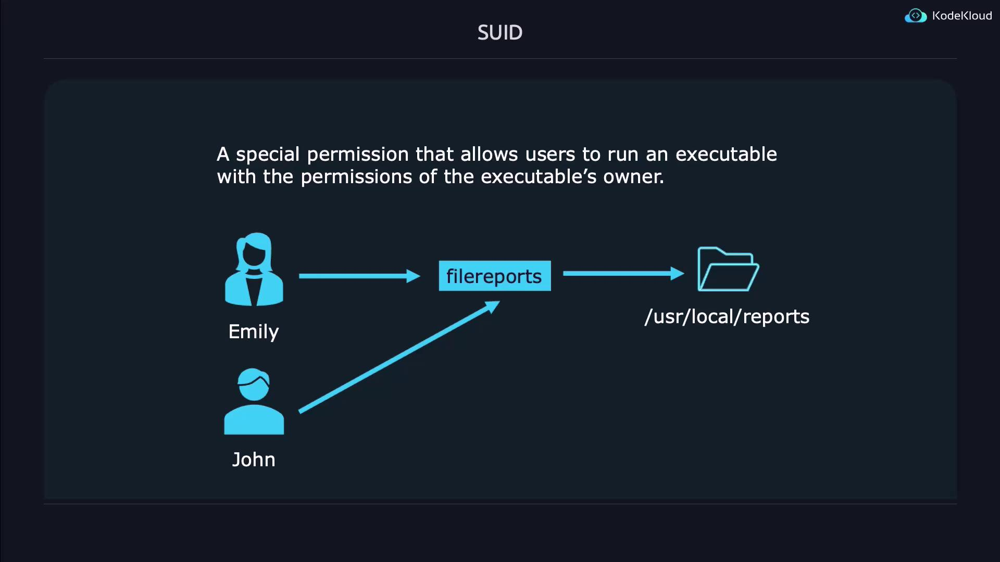

# SUID SGID and Sticky Bit

Source: https://notes.kodekloud.com/docs/Prep-Course-Linux-Foundation-Certified-System-Administrator-LFCS-Certification/Essential-Commands/SUID-SGID-and-Sticky-Bit/page

This article explores SUID, SGID, and the Sticky Bit permissions in Unix/Linux systems for managing security and resource access.

In Unix/Linux systems, managing permissions is critical to maintaining security and efficient resource access. In this article, we explore three special permissions—SUID, SGID, and the Sticky Bit—that allow controlled elevation of privileges and help manage collaborative environments.

<Callout icon="lightbulb">
  Understanding these permissions ensures that applications can safely operate with elevated privileges without compromising system integrity.
</Callout>

## SUID (Set User ID)

SUID is a permission that, when applied to an executable file, enables the process to run with the file owner's privileges instead of those of the user who launched it. This feature is particularly useful when an application requires access to restricted resources. For example, if Emily develops a reports application that needs to access files under `/usr/local/reports`, she can allow John to run the application without granting him unfettered access to her directory.

<Frame>
  
</Frame>

### Demonstration of SUID

Below is a step-by-step demonstration of setting and verifying the SUID bit:

```bash theme={null}
