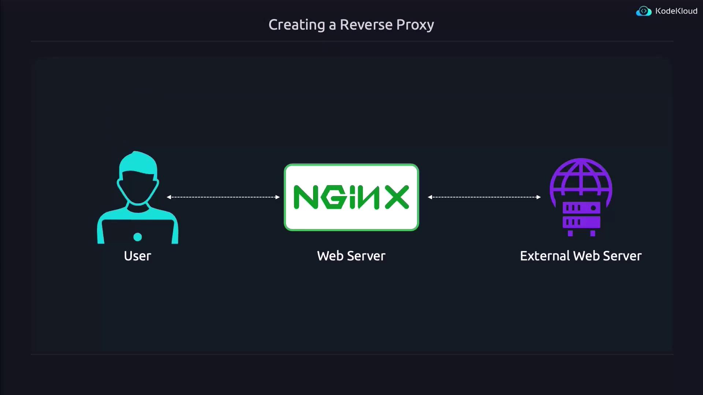
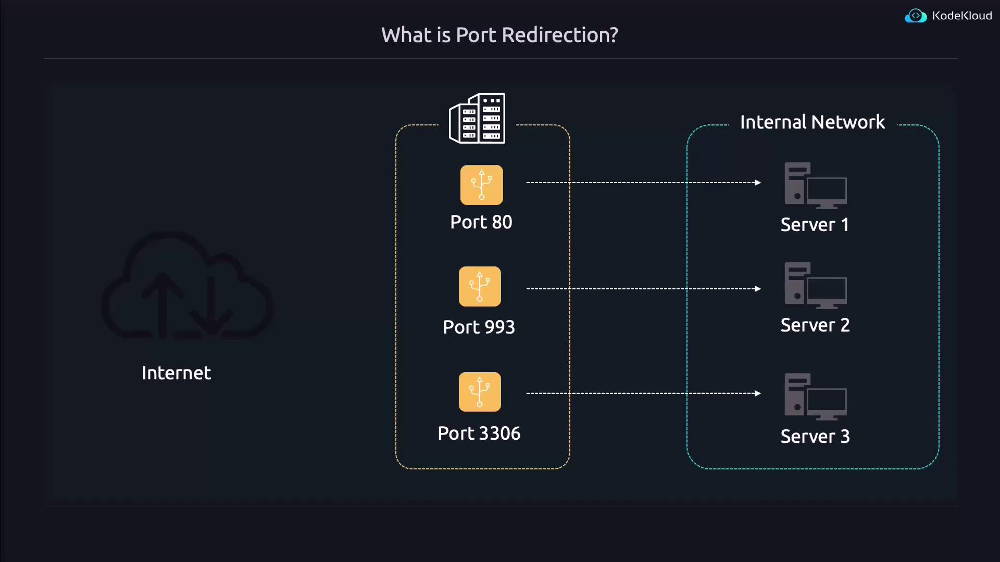
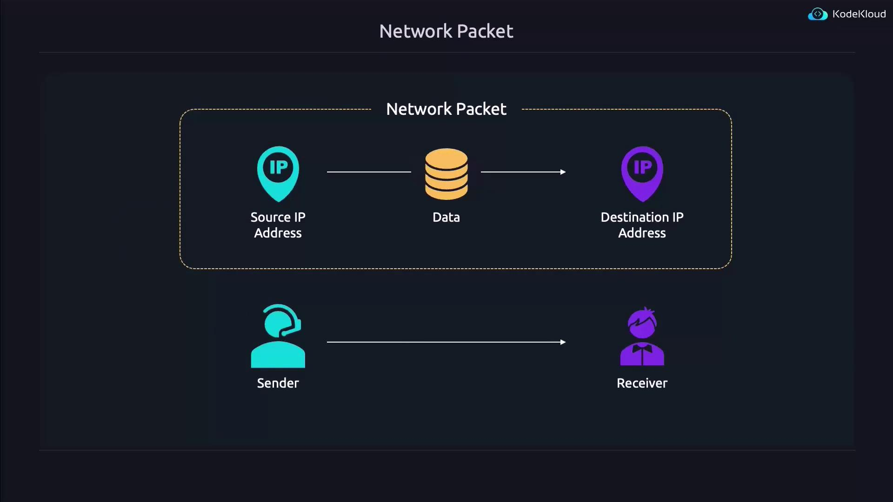
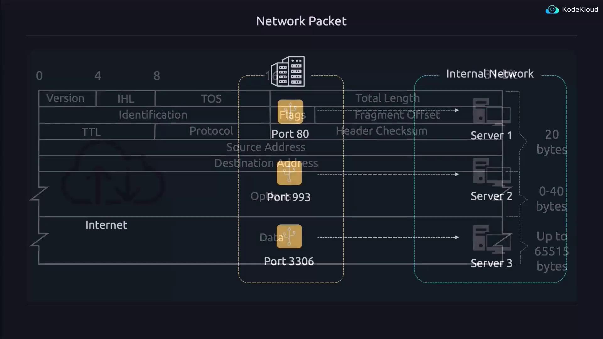
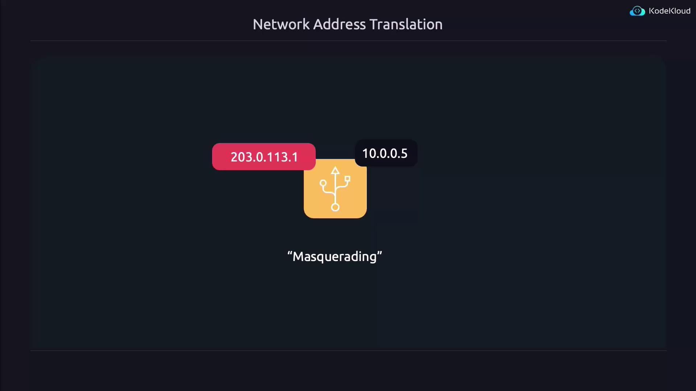

# To enable the reverse proxy configuration:
sudo ln -s /etc/nginx/sites-available/proxy.conf /etc/nginx/sites-enabled/proxy.conf

# To disable the default configuration:
sudo rm /etc/nginx/sites-enabled/default
```

Before applying the changes, test the configuration for syntax errors:

```bash theme={null}
sudo nginx -t
```

You should see output confirming that the configuration syntax is OK and the test was successful:

```bash theme={null}
nginx: the configuration file /etc/nginx/nginx.conf syntax is ok
nginx: configuration file /etc/nginx/nginx.conf test is successful
```

Finally, reload Nginx to activate your new settings:

```bash theme={null}
sudo systemctl reload nginx.service
```

At this point, Nginx is successfully configured as a reverse proxy, directing requests to the web server at 1.1.1.1.

<Frame>
  
</Frame>

## Configuring Nginx as a Load Balancer

Transforming Nginx into a load balancer requires a few configuration adjustments.

1. First, remove the symbolic link for the existing reverse proxy configuration:

   ```bash theme={null}
   sudo rm /etc/nginx/sites-enabled/proxy.conf
   ```

2. Next, create a new configuration file (for example, "lb.conf") in the `/etc/nginx/sites-available` directory with the content below:

   ```nginx theme={null}
   upstream mywebservers {
       server 1.2.3.4;
       server 5.6.7.8;
   }

   server {
       listen 80;
       location / {
           proxy_pass http://mywebservers;
       }
   }
   ```

### Explanation of the Load Balancer Configuration

* The `upstream` block defines a pool of backend servers identified as "mywebservers". Here, servers with IP addresses 1.2.3.4 and 5.6.7.8 are listed.
* The server block listens on port 80 and directs incoming requests to the backend pool specified in the upstream block.

By default, Nginx will distribute requests using the round-robin method. However, for high-traffic websites, a more dynamic load balancing method may be more appropriate. For instance, adding the `least_conn` directive will instruct Nginx to send requests to the server with the fewest active connections:

```nginx theme={null}
upstream mywebservers {
    least_conn;
    server 1.2.3.4;
    server 5.6.7.8;
}

server {
    listen 80;
    location / {
        proxy_pass http://mywebservers;
    }
}
```

If your servers have varying performance capabilities, you can assign weights to influence traffic distribution. For example, a more powerful server can be given a higher weight:

```nginx theme={null}
upstream mywebservers {
    least_conn;
    server 1.2.3.4 weight=3;
    server 5.6.7.8;
}

server {
    listen 80;
    location / {
        proxy_pass http://mywebservers;
    }
}
```

<Callout icon="triangle-alert">
  To temporarily remove a server from the load balancing pool (for maintenance, for example), include the `down` parameter in its configuration.
</Callout>

Mark a server as unavailable with the `down` keyword:

```nginx theme={null}
upstream mywebservers {
    least_conn;
    server 1.2.3.4 weight=3 down;
    server 5.6.7.8;
}

server {
    listen 80;
    location / {
        proxy_pass http://mywebservers;
    }
}
```

You can also designate a backup server that remains idle until it's needed if one of your primary servers fails:

```nginx theme={null}
upstream mywebservers {
    least_conn;
    server 1.2.3.4;
    server 5.6.7.8;
    server 10.20.30.40 backup;
}

server {
    listen 80;
    location / {
        proxy_pass http://mywebservers;
    }
}
```

If any backend server is operating on a custom port (for example, port 8081), specify the port number in the server directive:

```nginx theme={null}
upstream mywebservers {
    least_conn;
    server 1.2.3.4:8081;
    server 5.6.7.8;
    server 10.20.30.40 backup;
}

server {
    listen 80;
    location / {
        proxy_pass http://mywebservers;
    }
}
```

### Enable and Reload the Load Balancer Configuration

Once your "lb.conf" file is created, enable it by linking it from `sites-available` to `sites-enabled`. Then, test and reload the Nginx configuration:

```bash theme={null}
sudo ln -s /etc/nginx/sites-available/lb.conf /etc/nginx/sites-enabled/lb.conf
sudo nginx -t
sudo systemctl reload nginx.service
```

With these changes in place, Nginx now efficiently functions as a load balancer according to your configuration.

That’s all for this lesson. Happy configuring, and see you in the next one!

<CardGroup>
  <Card title="Watch Video" icon="video" href="https://learn.kodekloud.com/user/courses/linux-foundation-certified-system-administrator-lfcs/module/2ba92913-296b-481d-af2d-6710bf3f7cdd/lesson/f9bc6e80-9f45-4d5e-8ce9-3207595ab7a7" />
</CardGroup>


# Port Redirection and Network Address Translation NAT

Source: https://notes.kodekloud.com/docs/Prep-Course-Linux-Foundation-Certified-System-Administrator-LFCS-Certification/Networking/Port-Redirection-and-Network-Address-Translation-NAT/page

This article teaches how to set up port redirection and network address translation for directing incoming traffic to private servers behind a firewall.

In this lesson, you'll learn how to set up port redirection and network address translation (NAT). These techniques enable a public-facing server to direct incoming traffic to the correct private servers behind a firewall.

***

## Understanding Port Redirection

In many network configurations, servers operate on a private internal network that is not directly accessible from the Internet. In these cases, a public server acts as an intermediary between the Internet and the private network. Connected to both networks, the public server can forward incoming connections to the appropriate private server by using properly defined redirection rules.

For example, when a device on the Internet connects to the public server on port 80—commonly used for web traffic—the server must know which internal server should handle the request. Port redirection (or port forwarding) allows you to create rules that, for instance:

* Forward incoming connections on port 80 to Server 1.
* Redirect connections on port 993 to Server 2.
* Route connections on port 3306 to Server 3.

***

## Network Address Translation (NAT) Explained

Data transmitted over networks is broken into small packets. Each packet carries header information such as the source and destination IP addresses, which are essential for guiding the packet through different network devices.

<Frame>
  
</Frame>

For example, an IPv4 packet includes various header fields that help routers and switches forward it correctly from the sender to the intended recipient. The source and destination addresses ensure that both data and any necessary responses are routed properly.

<Frame>
  
</Frame>

When data travels from server to server via network devices, both the source and destination information in the packet header allow responses to find the way back. Consider this scenario:

<Frame>
  
</Frame>

Imagine an external device with IP address 203.0.0.113 sending data to a public server with IP 123.4. When the public server receives a connection on port 80, it changes the destination IP from 123.4 to 10.0.0.5 (Server 1's private IP) and forwards the packet. However, because the packet retains the original source IP (203.0.0.113), Server 1’s reply would try to reach that external IP directly, bypassing the public server.

To resolve this, the public server performs NAT on the source IP by replacing it with its own public address. This ensures that responses correctly route back to the public server and then to the external device.

<Frame>
  
</Frame>

This process, known as masquerading, is similar to how home routers allow multiple devices to share a single public IP address.

***

## Configuring Port Redirection in Linux

Before you can set up port redirection, you must enable IP forwarding on your machine. This allows the system to forward packets between interfaces. By default, IP forwarding is disabled.

### Enabling IP Forwarding

On Ubuntu, it is recommended to enable IP forwarding in `/etc/sysctl.d/99-sysctl.conf` rather than in `/etc/sysctl.conf` because the latter might be overwritten during system updates. Open the file with your preferred editor and uncomment the following lines as needed:

```bash theme={null}
sudo vim /etc/sysctl.d/99-sysctl.conf
