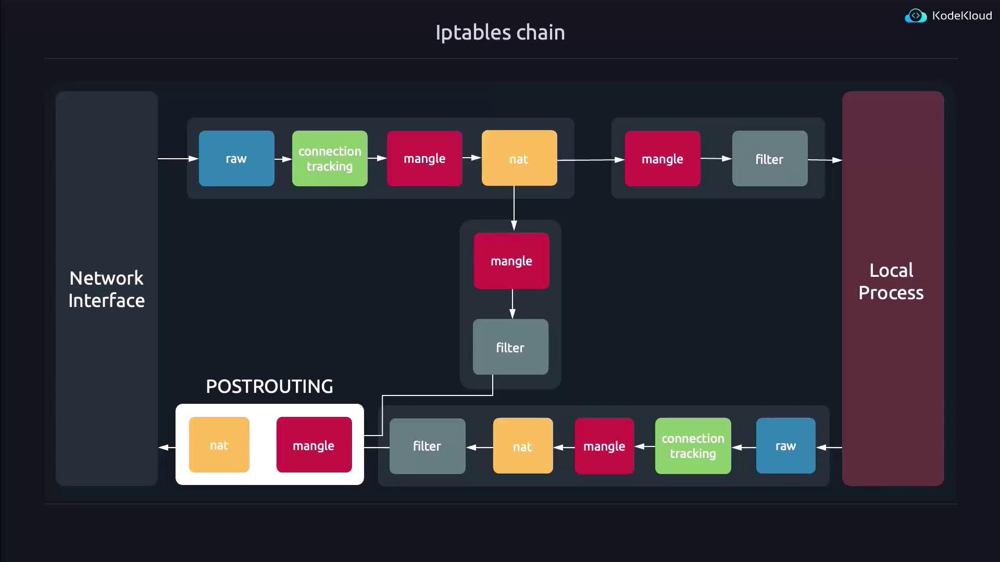
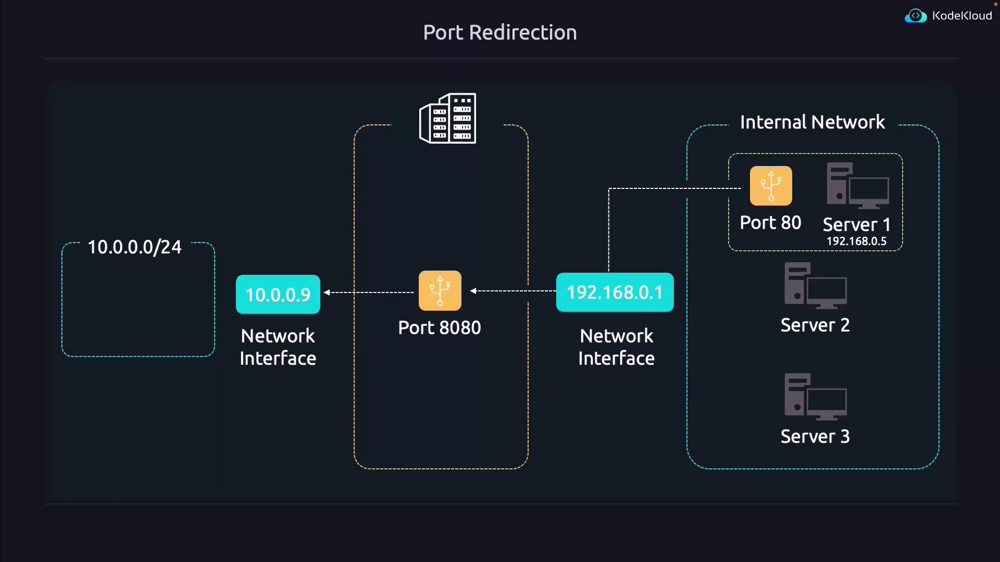
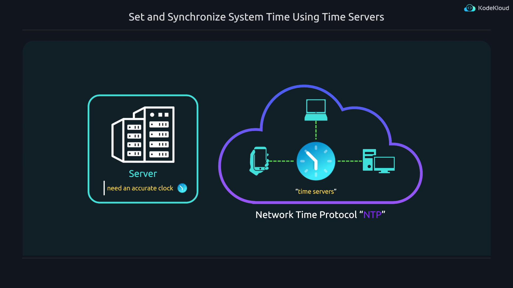
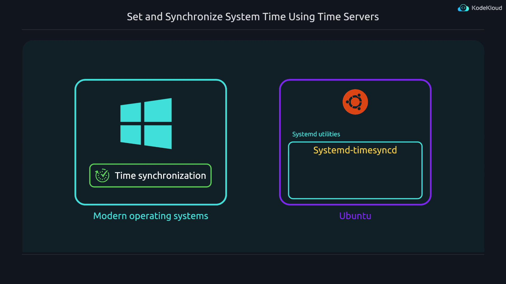
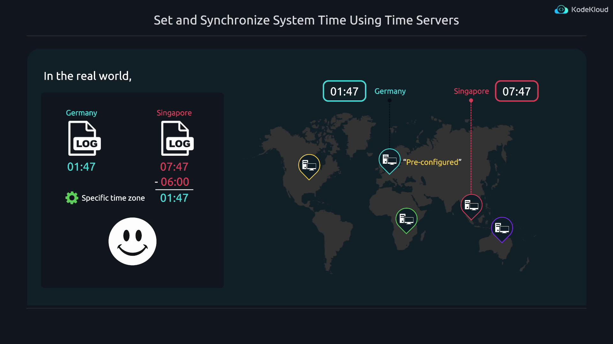

# Uncomment the next line to enable packet forwarding for IPv4
#net.ipv4.ip_forward=1
# Uncomment the next line to enable packet forwarding for IPv6
# Enabling this option disables Stateless Address Autoconfiguration based on Router Advertisements for this host
#net.ipv6.conf.all.forwarding=1
```

After making these changes, reload the sysctl configuration:

```bash theme={null}
sudo sysctl --system
```

Verify that the values for IP forwarding are set to 1.

***

## Configuring Port Redirection with iptables

Linux processes network data using the netfilter framework. Although nftables is the modern tool, iptables remains widely used and will convert its rules to nftables rules automatically.

Consider the following scenario:

Assume the interface `enp1s0` manages traffic from the internal network range 10.0.0.0/24, and `enp6s0` is used for outbound traffic to the Internet. First, configure a rule that forwards incoming TCP connections on port 8080 to an internal address (for example, 192.168.0.5 on port 80):

```bash theme={null}
sudo iptables -t nat -A PREROUTING -i enp1s0 -s 10.0.0.0/24 -p tcp --dport 8080 -j DNAT --to-destination 192.168.0.5:80
```

<Frame>
  
</Frame>

<Callout icon="lightbulb">
  Remember that while these iptables rules are useful for illustrating concepts, you should restrict the rules by specifying interfaces and source IP ranges in production environments to minimize potential abuse.
</Callout>

Even if a connection is initiated from an external machine, the packet's source address remains unchanged. As a result, when the internal server replies, it would attempt to send the response directly to the external IP address, which is not reachable from within the internal network.

To ensure return packets are properly routed back through the public server, modify the source address using a masquerade rule in the POSTROUTING chain:

```bash theme={null}
sudo iptables -t nat -A POSTROUTING -s 10.0.0.0/24 -o enp6s0 -j MASQUERADE
```

This rule dynamically replaces the source IP with the public IP of the outgoing interface.

<Frame>
  
</Frame>

***

## A Brief Look at nftables

Although iptables is more familiar to many, nftables provides a modern alternative. Below is an example configuration using nftables that mirrors the iptables example:

```yaml theme={null}
table ip nat {
    chain PREROUTING {
        type nat hook prerouting priority dnat; policy accept;
        iifname "enp1s0" meta l4proto tcp ip saddr 10.0.0.0/24 tcp dport 8080 counter packets 0 bytes 0 dnat to 192.168.0.5:80
    }
    chain POSTROUTING {
        type nat hook postrouting priority srcnat; policy accept;
        oifname "enp6s0" ip saddr 10.0.0.0/24 counter packets 0 bytes 0 masquerade
    }
}
```

To list your active nftables rules, use:

```bash theme={null}
sudo nft list ruleset
```

Many distributions, including Ubuntu, automatically convert iptables rules to nftables, simplifying the transition.

***

## Maintaining Persistence of the Rules

Keep in mind that iptables rules configured as above are temporary and will be lost after a system reboot. To save these rules permanently on Ubuntu, install the iptables-persistent package:

```bash theme={null}
sudo apt install iptables-persistent
```

When prompted, confirm the default options to save your rules. For subsequent rule modifications, use:

```bash theme={null}
sudo netfilter-persistent save
```

<Callout icon="triangle-alert">
  Avoid unrestricted forwarding. Always restrict rules to specific interfaces and IP ranges to prevent unauthorized use of your network setup.
</Callout>

***

## Optional Considerations and Additional Firewall Rules

Using options such as `-i`, `-o`, and `-s` in iptables commands allows you to restrict rules to specific network interfaces or IP ranges—a best practice in production environments. Unrestricted rules could enable malicious actors to misuse your server.

For example, if you are using UFW (Uncomplicated Firewall) on Ubuntu, the default policy is to deny forwarding. To allow traffic, you may need to adjust UFW settings. Here is an example configuration:

```bash theme={null}
sudo ufw allow 22
sudo ufw enable
sudo ufw route allow from 10.0.0.0/24 to 192.168.0.5
```

This configuration allows SSH (port 22) and routes packets from the 10.0.0.0/24 network to the internal server at 192.168.0.5. Customize these rules to match your network architecture and security requirements.

For further details on UFW syntax and command splits, refer to the UFW manual:

```bash theme={null}
man ufw-framework
```

***

## Quick Reference Commands

Below is a table summarizing some useful commands for configuring port redirection and NAT on Linux:

| Action                       | Command                                                                    |
| ---------------------------- | -------------------------------------------------------------------------- |
| Enable IP Forwarding         | Edit `/etc/sysctl.d/99-sysctl.conf` and reload with `sudo sysctl --system` |
| List iptables NAT Rules      | `sudo iptables -L -t nat`                                                  |
| Flush iptables NAT Table     | `sudo iptables --flush --table nat`                                        |
| List nftables Rules          | `sudo nft list ruleset`                                                    |
| Save iptables/nftables Rules | `sudo netfilter-persistent save`                                           |

***

This lesson provided an overview of port redirection and NAT, including both underlying principles and practical configuration using iptables (with a glimpse at nftables). In the next lesson, we will explore advanced networking configurations to further enhance your network’s efficiency and security.

<CardGroup>
  <Card title="Watch Video" icon="video" href="https://learn.kodekloud.com/user/courses/linux-foundation-certified-system-administrator-lfcs/module/2ba92913-296b-481d-af2d-6710bf3f7cdd/lesson/975636ae-2572-4d22-899b-e4890128d9a4" />
</CardGroup>


# Set and Synchronize System Time Using Time Servers

Source: https://notes.kodekloud.com/docs/Prep-Course-Linux-Foundation-Certified-System-Administrator-LFCS-Certification/Networking/Set-and-Synchronize-System-Time-Using-Time-Servers/page

This article explains how to set and synchronize system time using NTP servers on Ubuntu.

Accurate timekeeping is critical for server operations. Hardware clocks in computers are not perfect and may gradually drift from the actual time. For instance, if the real time is 12:00:05, a server might display 12:00:06—a one-second drift ahead. Fortunately, most devices today automatically synchronize their clocks over the Internet using the Network Time Protocol (NTP).

Most modern operating systems include time synchronization software by default. In Ubuntu, the default utility is systemd-timesyncd, which is part of the systemd suite.

<Frame>
  
</Frame>

## Configure Time Zone Settings

In addition to time synchronization, it is important to correctly set the time zone. Incorrect time zones can lead to confusion, especially when managing logs from servers located in different regions. For example, when it is 1:47 in Germany, it is 7:47 in Singapore. It is advisable to set your server’s time zone to your local zone or to that of your company’s main office.

<Frame>
  
</Frame>

Time-related operations can be managed using the `timedatectl` utility. To view the list of available time zones, run:

```bash theme={null}
timedatectl list-timezones
```

The output will look similar to this:

```plaintext theme={null}
America/Araguaina
America/Argentina/Buenos_Aires
America/Argentina/Catamarca
America/Argentina/ComodRivadavia
America/Argentina/Cordoba
America/Argentina/Jujuy
America/Argentina/La_Rioja
America/Argentina/Mendoza
America/Argentina/Rio_Gallegos
America/Argentina/Salta
America/Argentina/San_Juan
America/Argentina/San_Luis
America/Argentina/Tucuman
America/Argentina/Ushuaia
America/Aruba
America/Asuncion
America/Atikokan
America/Atka
America/Bahia
America/Bahia_Banderas
America/Barbados
America/Belem
America/Belize
America/Blanc-Sablon
America/Boa_Vista
America/Bogota
America/Boise
America/Buenos_Aires
lines 59-86
```

Time zones are formatted with the continent first, followed by a slash, and then the city. To set your time zone to Los Angeles, use the command:

```bash theme={null}
sudo timedatectl set-timezone America/Los_Angeles
```

Remember to use an underscore for cities with multiple words. Verify the change by executing:

```bash theme={null}
timedatectl
```

A sample output might look like:

```plaintext theme={null}
Local time: Wed 2024-05-22 18:45:48 PDT
Universal time: Thu 2024-05-23 01:45:48 UTC
RTC time: Thu 2024-05-23 01:45:48
Time zone: America/Los_Angeles (PDT, -0700)
System clock synchronized: yes
NTP service: active
RTC in local TZ: no
```

This output also indicates whether an NTP service is active.

## Manage NTP Synchronization

If you find that the NTP service is not active, follow these steps to ensure proper time synchronization:

1. **Install systemd-timesyncd (if not already installed):**

   ```bash theme={null}
   sudo apt install systemd-timesyncd
   ```

2. **Enable synchronization with NTP servers:**

   ```bash theme={null}
   sudo timedatectl set-ntp true
   ```

3. **Verify the status:**

   ```bash theme={null}
   timedatectl
   ```

To check the status of the systemd-timesyncd service, run:

```bash theme={null}
systemctl status systemd-timesyncd.service
```

A typical output is:

```plaintext theme={null}
● systemd-timesyncd.service - Network Time Synchronization
   Loaded: loaded (/usr/lib/systemd/system/systemd-timesyncd.service; enabled; preset: enabled)
   Active: active (running) since Wed 2024-05-22 17:23:17 PDT; 1h 24min ago
     Docs: man:systemd-timesyncd.service(8)
 Main PID: 809 (systemd-timesyncd)
   Status: "Contacted time server 91.189.91.157:123 (ntp.ubuntu.com)."
    Tasks: 2 (limit: 9442)
   Memory: 1.4M (peak: 2.2M)
      CPU: 198ms
   CGroup: /system.slice/systemd-timesyncd.service
           └─809 /usr/lib/systemd/systemd-timesyncd

May 22 17:23:21 kodekloud systemd-timesyncd[809]: Network configuration changed, trying to establish connection...
May 22 17:23:22 kodekloud systemd-timesyncd[809]: Network configuration changed, trying to establish connection...
May 22 17:24:25 kodekloud systemd-timesyncd[809]: Contacted time server 91.189.91.157:123 (ntp.ubuntu.com).
May 22 17:24:25 kodekloud systemd-timesyncd[809]: Initial clock synchronization to Thu 2024-05-23 00:2...
```

<Frame>
  
</Frame>

<Callout icon="lightbulb">
  Use tab completion in your terminal by typing `timedatectl ` and then pressing tab twice to explore additional commands such as `show-timesync` and `timesync-status`.
</Callout>

## Configure Custom NTP Servers

To change the default settings for systemd-timesyncd and specify custom NTP servers, you need to edit the configuration file:

```bash theme={null}
sudo vim /etc/systemd/timesyncd.conf
```

Within the file, locate the following block and modify it as desired by uncommenting and updating the NTP server list:

```ini theme={null}
[Time]
NTP=0.us.pool.ntp.org 1.us.pool.ntp.org 2.us.pool.ntp.org 3.us.pool.ntp.org
#FallbackNTP=ntp.ubuntu.com
#RootDistanceMaxSec=5
#PollIntervalMinSec=32
#PollIntervalMaxSec=2048
#ConnectionRetrySec=30
#SaveIntervalSec=60
```

This configuration sets four NTP servers from the US pool. Notice that underscores are used in city names or when naming a server with multiple words.

After saving your changes, restart the service to apply the new configuration:

```bash theme={null}
sudo systemctl restart systemd-timesyncd
```

To verify that the newly specified NTP servers are in use, run:

```bash theme={null}
timedatectl show-timesync
```

A sample output may look like:

```plaintext theme={null}
jeremy@kodekloud:~$ timedatectl show-timesync
FallbackNTPServers=ntp.ubuntu.com
ServerName=0.us.pool.ntp.org
ServerAddress=198.30.92.2
RootDistanceMaxUSec=5s
PollIntervalMinUSec=32s
PollIntervalMaxUSec=34min 8s
PollIntervalUSec=2min 8s
NTPMessage={ Leap=0, Version=4, Mode=4, Stratum=2, Precision=-20, RootDelay=21.499ms, RootDispersion=28.747ms, Reference=82CF74F0, OriginateTimestamp=Wed 2024-05-22 18:53:17 PDT, TransmitTimestamp=Wed 2024-05-22 18:53:17 PDT, ReceiveTimestamp=Wed 2024-05-22 18:53:17 PDT, DestinationTimestamp=Wed 2024-05-22 18:53:17 PDT, Ignored=no, PacketCount=2, Jitter=99us }
```

You can also check the detailed time synchronization status using:

```bash theme={null}
timedatectl timesync-status
```

This command provides comprehensive information including the poll interval, root distance, offset, delay, and other relevant NTP details. A sample output might be:

```plaintext theme={null}
jeremy@kodekloud:~$ timedatectl timesync-status
    Server: 198.30.92.2 (0.us.pool.ntp.org)
    Poll interval: 2min 8s (min: 32s; max: 34min 8s)
    Leap: normal
    Version: 4
    Stratum: 2
    Reference: 82CFF4F0
    Precision: 1us (−20)
    Root distance: 39.496ms (max: 5s)
    Offset: -262us
    Delay: 79.540ms
    Jitter: 99us
    Packet count: 2
    Frequency: +11.919ppm
jeremy@kodekloud:~$
```

<Callout icon="triangle-alert">
  Ensure that your network configuration allows NTP traffic. If synchronization fails, check your firewall and network settings.
</Callout>

## Conclusion

This guide covered how to configure both the time zone and NTP synchronization on Ubuntu using systemd-timesyncd. You learned how to view available time zones, set the correct zone, enable time synchronization, modify NTP settings, and verify the synchronization status. Maintaining accurate system time is essential for log management and other time-sensitive operations.

See you in the next lesson!

<CardGroup>
  <Card title="Watch Video" icon="video" href="https://learn.kodekloud.com/user/courses/linux-foundation-certified-system-administrator-lfcs/module/2ba92913-296b-481d-af2d-6710bf3f7cdd/lesson/46c64e6e-5833-4e4f-b749-08f41f9a9f85" />
</CardGroup>
