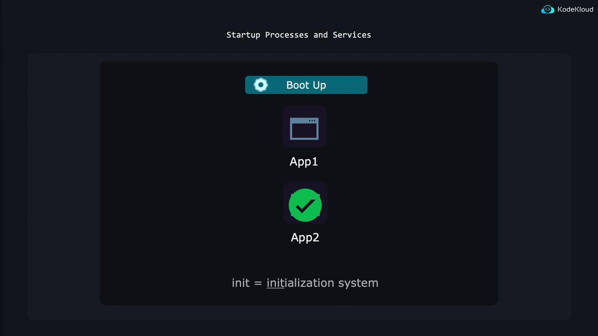
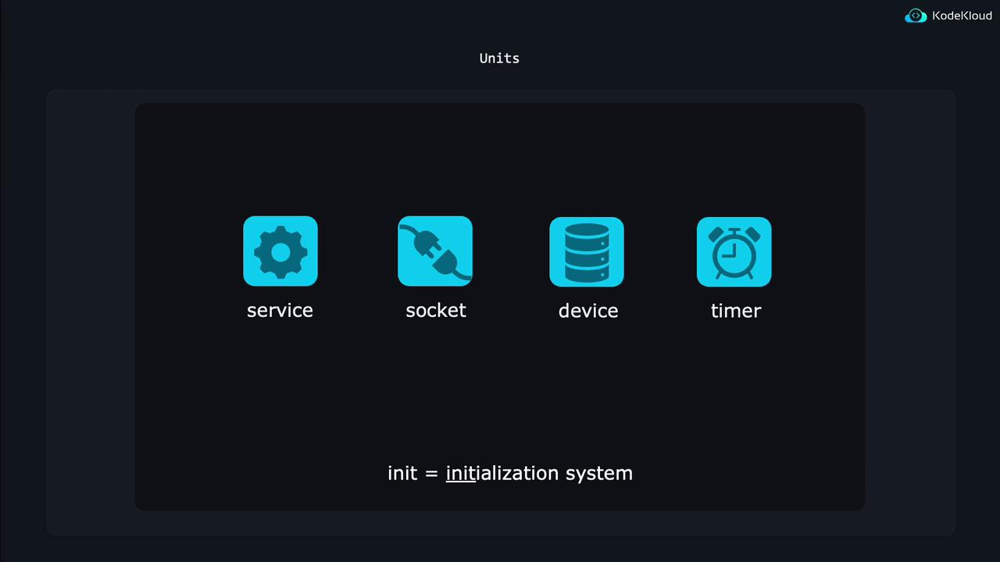

# Manage Startup Process and Services In Services Configuration

Source: https://notes.kodekloud.com/docs/Prep-Course-Linux-Foundation-Certified-System-Administrator-LFCS-Certification/Operations-Deployment/Manage-Startup-Process-and-Services-In-Services-Configuration/page

This article explains managing startup processes and services in Linux using the init system and systemd units for efficient system operation.

This article explains how to manage startup processes and services in Linux. During the boot sequence, Linux automatically launches several critical applications in a defined order. For example, if Application 2 depends on Application 1, Application 1 will load first. Additionally, if a critical application crashes, the system is configured to automatically restart it to ensure uninterrupted operation.

<Frame>
  
</Frame>

## The Role of the Init System and Systemd Units

The startup and management of services in Linux are controlled by the init system. This system uses configuration files called systemd units to determine how applications should be started, what actions to take when an application fails, and other necessary operations. The term systemd refers both to the suite of tools that manage Linux systems and the primary program that acts as the init system.

<Frame>
  
</Frame>

Systemd ensures smooth system operation by initializing and monitoring various system components. There are several types of systemd units such as service, socket, device, and timer units. For example, timer units can schedule tasks like weekly file cleanups or database verifications. In this guide, the focus is on service units.

A service unit provides systemd with all the details required to manage an application’s lifecycle. This includes the command to start the application, what to do if it crashes, how to reload configurations, and more. To explore the various options available in a service unit file, run:

```bash theme={null}
man systemd.service
```

## Example: Managing the SSH Daemon

Many Linux servers run an SSH daemon to enable remote connections. Systemd manages this daemon using a specific service unit. You can display the SSH service unit file by executing:

```bash theme={null}
$ systemctl cat ssh.service
```

The output might resemble the following:

```plaintext theme={null}
