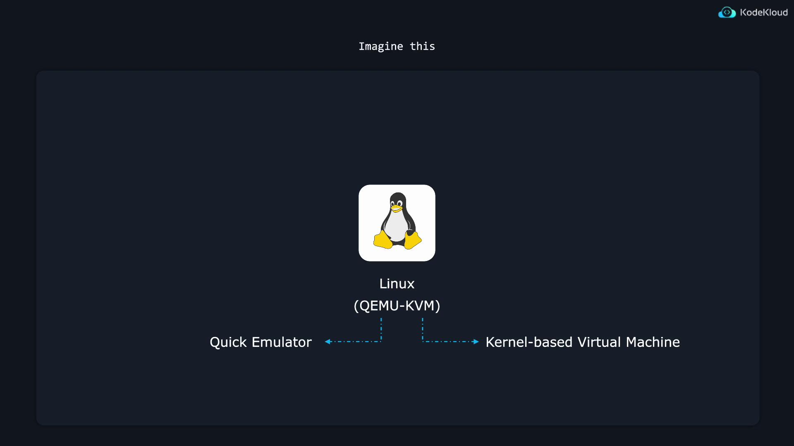
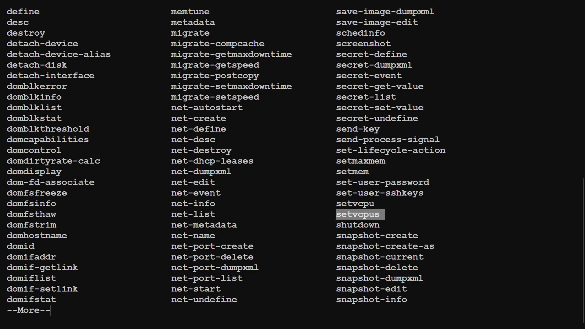

# /lib/systemd/system/ssh.service
[Unit]
Description=OpenBSD Secure Shell server
Documentation=man:sshd(8) man:sshd_config(5)
After=network.target auditd.service
ConditionPathExists=!/etc/ssh/sshd_not_to_be_run

[Service]
EnvironmentFile=/etc/default/ssh
ExecStartPre=/usr/sbin/sshd -t
ExecStart=/usr/sbin/sshd -D $SSHD_OPTS
ExecReload=/usr/sbin/sshd -t
ExecReload=/bin/kill -HUP $MAINPID
KillMode=process
Restart=on-failure
RestartPreventExitStatus=255
Type=notify
RuntimeDirectory=sshd
RuntimeDirectoryMode=0755
```

In this file:

* **ExecStart** specifies the command used to launch the SSH daemon.
* **ExecReload** defines the commands to reload the SSH configuration.
* **Restart=on-failure** ensures that systemd automatically restarts the service if it crashes.

If the SSH daemon fails, systemd will restart it to maintain remote connectivity.

## Checking Service Status

To verify the status of the SSH service, run:

```bash theme={null}
$ sudo systemctl status ssh.service
```

A typical output may look like this:

```plaintext theme={null}
● ssh.service - OpenBSD Secure Shell server
   Loaded: loaded (/etc/systemd/system/ssh.service; enabled; vendor preset: enabled)
   Active: active (running) since Wed 2024-02-28 18:32:18 UTC; 2h 29min ago
     Docs: man:sshd(8)
           man:sshd_config(5)
 Main PID: 688 (sshd)
    Tasks: 1 (limit: 4558)
   Memory: 7.6M
      CPU: 88ms
   CGroup: /system.slice/ssh.service
           └─688 "sshd: /usr/sbin/sshd -D [listener] 0 of 10-100 startups"

Feb 28 18:32:18 kodekloud systemd[1]: Starting OpenBSD Secure Shell server...
Feb 28 18:32:18 kodekloud sshd[688]: Server listening on 0.0.0.0 port 22.
Feb 28 18:32:18 kodekloud sshd[688]: Server listening on :: port 22.
Feb 28 18:32:18 kodekloud systemd[1]: Started OpenBSD Secure Shell server.
```

The output indicates whether the service is enabled to start at boot, confirms that the process is running, and displays the process identifier (PID) along with log messages for troubleshooting.

## Starting, Stopping, Restarting, and Reloading Services

You can manually manage services using various systemctl commands:

* **Stop a service:**

  ```bash theme={null}
  $ sudo systemctl stop ssh.service
  ```

* **Start a service:**

  ```bash theme={null}
  $ sudo systemctl start ssh.service
  ```

* **Restart a service:**\
  This command stops and then starts the service to apply new configurations.

  ```bash theme={null}
  $ sudo systemctl restart ssh.service
  ```

* **Reload a service:**\
  This command reloads the service’s configuration without interrupting active sessions, which is particularly useful when users are connected.

  ```bash theme={null}
  $ sudo systemctl reload ssh.service
  ```

After modifying the SSH configuration file located at `/etc/ssh/sshd_config`, you can enforce the new settings with either of the following commands:

```bash theme={null}
$ sudo systemctl restart ssh.service   # Fully stops and starts the service.
$ sudo systemctl reload ssh.service    # Gracefully reloads the configuration.
```

You can review the status again to confirm the service behavior:

```bash theme={null}
$ systemctl status ssh.service
Feb 28 21:42:16 kodekloud systemd[1]: Stopped OpenBSD Secure Shell server.
Feb 28 21:42:16 kodekloud systemd[1]: Starting OpenBSD Secure Shell server...
Feb 28 21:42:48 kodekloud systemd[1]: Reloading OpenBSD Secure Shell server...
Feb 28 21:42:48 kodekloud sshd[2413]: Received SIGHUP; restarting.
Feb 28 21:42:48 kodekloud systemd[1]: Reloaded OpenBSD Secure Shell server.
```

<Callout icon="lightbulb">
  Not all applications support configuration reloads. When in doubt, systemd will first attempt a graceful reload and then perform a full restart if necessary.
</Callout>

## Enabling and Disabling Services

To prevent a service from starting automatically at boot, use the disable command:

```bash theme={null}
$ sudo systemctl disable ssh.service
$ systemctl status ssh.service
# Output shows "disabled" in the Loaded line.
```

Verify the service's enablement status with:

```bash theme={null}
$ systemctl is-enabled ssh.service
```

To enable the service for automatic startup at boot, run:

```bash theme={null}
$ sudo systemctl enable ssh.service
```

If you want a daemon to start immediately and at boot, you can use the --now option:

```bash theme={null}
$ sudo systemctl enable --now ssh.service
```

Likewise, to stop a service immediately and disable it for future boots, run:

```bash theme={null}
$ sudo systemctl disable --now ssh.service
```

<Callout icon="triangle-alert">
  Be cautious when disabling critical services such as SSH, particularly on remote systems.
</Callout>

## Masking Services

Some services might restart automatically even after being stopped or disabled because other services trigger them. In such cases, you can mask the service to completely prevent it from starting. For example, to prevent the at daemon from being activated:

```bash theme={null}
$ sudo systemctl mask atd.service
```

A masked service cannot be enabled or started. Any attempt to do so will generate an error:

```plaintext theme={null}
Failed to enable unit: Unit file /etc/systemd/system/atd.service is masked.
Failed to start atd.service: Unit atd.service is masked.
```

To reverse the masking and allow the service to operate normally, run:

```bash theme={null}
$ sudo systemctl unmask atd.service
```

## Listing Service Units

Sometimes the service name for an installed application may not be obvious (for instance, Apache might be listed as apache.service or httpd.service depending on your distribution). To display all service units regardless of their state, use:

```bash theme={null}
$ sudo systemctl list-units --type service --all
```

This command lists service units in various states—active, inactive, enabled, or disabled—ensuring you have a complete overview. An example output may look like:

| UNIT                       | LOAD      | ACTIVE   | SUB     | DESCRIPTION               |
| -------------------------- | --------- | -------- | ------- | ------------------------- |
| accounts-daemon.service    | loaded    | active   | running | Accounts Service          |
| alsa-restore.service       | loaded    | inactive | dead    | Save/Restore Sound Card   |
| alsa-state.service         | loaded    | active   | running | Manage Sound Card State   |
| apparmor.service           | not-found | inactive | dead    | apparmor.service          |
| atd.service                | loaded    | active   | running | Job spooling tools        |
| auditd.service             | loaded    | active   | running | Security Auditing Service |
| auth-rpcgss-module.service | loaded    | inactive | dead    | Kernel Module support     |

In addition to service units, systemd also manages other types of units such as sockets and timers.

***

In summary, this article demonstrated how systemd manages Linux services through service units—from starting and stopping to restarting and reloading configurations. Mastering these commands is essential for efficient system management and ensuring continuous system reliability.

## Additional Resources

* [Systemd Documentation](https://www.freedesktop.org/wiki/Software/systemd/)
* [Understanding Linux Systemd Services](https://www.digitalocean.com/community/tutorials/understanding-systemd-units-and-unit-files)

Happy managing!

<CardGroup>
  <Card title="Watch Video" icon="video" href="https://learn.kodekloud.com/user/courses/linux-foundation-certified-system-administrator-lfcs/module/cb813f7f-73bd-40ee-a088-d31ba20c51de/lesson/483983fa-145d-4d27-8a3a-26fe482ab15a" />
</CardGroup>


# Manage and Configure Virtual Machines

Source: https://notes.kodekloud.com/docs/Prep-Course-Linux-Foundation-Certified-System-Administrator-LFCS-Certification/Operations-Deployment/Manage-and-Configure-Virtual-Machines/page

This article explains how to manage and configure virtual machines using the virsh command-line tool in Linux environments.

In modern software, virtualization allows you to create a virtual computer—or virtual machine (VM)—within your actual computer. This capability is particularly valuable in server environments because it lets a single physical machine serve multiple clients simultaneously.

For instance, imagine a powerful server equipped with 64 CPU cores and 1024 GB of RAM. By creating 32 virtual machines, each VM can be allocated 2 virtual CPUs (vCPUs) and 32 GB of RAM. Rather than renting out one enormous server to a single client, you can offer 32 smaller virtual servers. This is the foundation of cloud compute services provided by [DigitalOcean](https://www.digitalocean.com/), [Amazon Web Services](https://aws.amazon.com/), and [Google Cloud](https://cloud.google.com/).

<Frame>
  
</Frame>

Among many available tools for virtualization on Linux, QEMU-KVM has become the most popular. QEMU (Quick Emulator) emulates virtual computers, while KVM (Kernel-based Virtual Machine) integrates into the Linux kernel to leverage hardware acceleration for enhanced performance.

In this guide, we focus on using a command-line tool called virsh (or VIRSH) to manage virtual machines. If you’ve used VirtualBox before, you might recall its graphical interface for VM creation, configuration, and management. Virsh, however, uses terminal commands to achieve similar tasks, making it a powerful choice for administrators.

<Frame>
  
</Frame>

## Getting Started

To quickly begin, install the virt-manager package. Although virt-manager is designed for systems with a GUI, installing it will bring in many useful dependencies for headless or text-based environments.

Run the following command:

```bash theme={null}
sudo apt install virt-manager
```

When installing virt-manager, your package manager will fetch several dependency packages. The output may look similar to this:

```bash theme={null}
Get:95 http://us.archive.ubuntu.com/ubuntu noble/universe amd64 gir1.2-gtksource-4 amd64
Get:96 http://us.archive.ubuntu.com/ubuntu noble/universe amd64 spice-client-glib-usb-acl
Get:97 http://us.archive.ubuntu.com/ubuntu noble/main amd64 libpcsclite1 amd64 2.0.3-1build1
Get:98 http://us.archive.ubuntu.com/ubuntu noble/main amd64 libcaca0 amd64 1:2.8.0-3build1
Get:99 http://us.archive.ubuntu.com/ubuntu noble/main amd64 liborc-0.4-0t6 amd64 1:0.4.3-1
Get:100 http://us.archive.ubuntu.com/ubuntu noble/main amd64 libgstreamer-plugins-base1.0
Get:101 http://us.archive.ubuntu.com/ubuntu noble/universe amd64 libphodav-3.0-common
Get:102 http://us.archive.ubuntu.com/ubuntu noble/main amd64 libproxy1v5 amd64 0.5.4-4build1
Get:103 http://us.archive.ubuntu.com/ubuntu noble/main amd64 glib-networking-common
Get:104 http://us.archive.ubuntu.com/ubuntu noble/main amd64 glib-networking-services
Get:105 http://us.archive.ubuntu.com/ubuntu noble/main amd64 glib-networking amd64 2.80.0
Get:106 http://us.archive.ubuntu.com/ubuntu noble/main amd64 libsoup-3.0-common
Get:107 http://us.archive.ubuntu.com/ubuntu noble/main amd64 libsoup-3.0-0
18% [107 libsoup-3.0-0 194 B/289 kB 0%]
```

Even though you may not use the virt-manager graphical interface, its installation provides several utilities essential for virtual machine management.

Below is a snippet of further installation output:

```bash theme={null}
Get:251 http://us.archive.ubuntu.com/ubuntu noble/main amd64 ovmf all 2024.02-2 [4,571 kB]
Fetched 130 MB in 10s (13.2 MB/s)
Extracting templates from packages: 100%
Selecting previously unselected package acl.
(Read database ... 83,334 files and directories currently installed.)
Preparing to unpack .../000-acl_2.3.2-1build1_amd64.deb ...
Unpacking acl (2.3.2-1build1) ...
Selecting previously unselected package libgdk-pixbuf2.0-common.
Preparing to unpack .../001-libgdk-pixbuf2.0-common_2.42.10+dfsg-3ubuntu3_all.deb ...
Unpacking libgdk-pixbuf2.0-common (2.42.10+dfsg-3ubuntu3) ...
Selecting previously unselected package libgdk-pixbuf-2.0-0:amd64.
Preparing to unpack .../002-libgdk-pixbuf-2.0-0_2.42.10+dfsg-3ubuntu3_amd64.deb ...
Unpacking libgdk-pixbuf-2.0-0:amd64 (2.42.10+dfsg-3ubuntu3) ...
Selecting previously unselected package gtk-update-icon-cache.
Preparing to unpack .../003-gtk-update-icon-cache_3.24.41-4ubuntu1_amd64.deb ...
Unpacking gtk-update-icon-cache (3.24.41-4ubuntu1) ...
Selecting previously unselected package hicolor-icon-theme.
Preparing to unpack .../004-hicolor-icon-theme_0.17-2_all.deb ...
Unpacking hicolor-icon-theme (0.17-2) ...
Selecting previously unselected package humanity-icon-theme.
Preparing to unpack .../005-humanity-icon-theme_0.6.16_all.deb ...
Unpacking humanity-icon-theme (0.6.16) ...
```

## Creating a Virtual Machine Configuration

Let's proceed with creating a configuration file for a virtual machine. Begin by creating a directory to store your VM definitions and then create an XML file using your preferred text editor:

```bash theme={null}
jeremy@kodekloud:~$ mkdir machines
jeremy@kodekloud:~$ cd machines/
jeremy@kodekloud:~/machines$ vim testmachine.xml
```

The XML file below defines a virtual machine named "TestMachine" running under QEMU. It allocates 1 GiB of RAM, 1 vCPU, and uses a 64-bit (x86\_64) architecture with hardware-assisted virtualization (HVM):

```xml theme={null}
<domain type="qemu">
  <name>TestMachine</name>
  <memory unit="GiB">1</memory>
  <vcpu>1</vcpu>
  <os>
    <type arch="x86_64">hvm</type>
  </os>
</domain>
```

In a production setting, a complete VM configuration will include additional parameters such as storage, network interfaces, and the operating system. For demonstration purposes, this basic setup is sufficient.

Define the virtual machine using the following command:

```bash theme={null}
virsh define testmachine.xml
```

You should see an output similar to:

```bash theme={null}
jeremy@kodekloud:~/machines$ virsh define testmachine.xml
Domain 'TestMachine' defined from testmachine.xml
jeremy@kodekloud:~/machines$
```

## Managing Virtual Machines with virsh

The virsh tool has an extensive help page. To display it, use:

```bash theme={null}
virsh help
```

By default, only active domains are listed. To view all defined domains (including inactive ones), run:

```bash theme={null}
virsh list --all
```

You should see "TestMachine" listed, albeit with the state "shut off".

### Starting and Managing VM States

To start your virtual machine, execute:

```bash theme={null}
virsh start TestMachine
```

If your VM name includes spaces, enclose it in double quotes. Once started, verify its state with:

```bash theme={null}
virsh list
```

To reboot the virtual machine gracefully – allowing software applications to exit properly – run:

```bash theme={null}
virsh reboot TestMachine
```

If the machine becomes unresponsive, you can force a reset, which is analogous to pressing a hardware reset button:

```bash theme={null}
jeremy@kodekloud:~/machines$ virsh list
 Id    Name         State
--------------------------------
 1     TestMachine  running

jeremy@kodekloud:~/machines$ virsh reset TestMachine
Domain 'TestMachine' was reset
jeremy@kodekloud:~/machines$
```

#### Shutting Down and Destroying VMs

To shut down the virtual machine gracefully (if the guest OS is present and active), use:

```bash theme={null}
virsh shutdown TestMachine
```

For instance:

```bash theme={null}
jeremy@kodekloud:~/machines$ virsh shutdown TestMachine
Domain 'TestMachine' is being shutdown
```

Since this test VM may not have an operating system installed, the shutdown command might not work as expected. However, in real scenarios, it allows applications to close properly.

If the VM is unresponsive, you can force a hard power off (equivalent to unplugging the machine) as follows:

```bash theme={null}
virsh destroy TestMachine
```

Sample workflow:

```bash theme={null}
jeremy@kodekloud:~/machines$ virsh list
 Id    Name             State
----------------------------------
 1     TestMachine      running

jeremy@kodekloud:~/machines$ virsh reset TestMachine
Domain 'TestMachine' was reset

jeremy@kodekloud:~/machines$ virsh shutdown TestMachine
Domain 'TestMachine' is being shutdown

jeremy@kodekloud:~/machines$ virsh list
 Id    Name             State
----------------------------------
 1     TestMachine      running

jeremy@kodekloud:~/machines$ virsh destroy TestMachine
Domain 'TestMachine' destroyed

jeremy@kodekloud:~/machines$
```

<Callout icon="lightbulb">
  The `destroy` command only powers off the VM abruptly—it does not remove the VM's definition. To completely remove the VM, you must undefine it.
</Callout>

To remove the VM's configuration, execute:

```bash theme={null}
virsh undefine TestMachine
```

If you also want to remove any associated storage files, use:

```bash theme={null}
virsh undefine --remove-all-storage TestMachine
```

After undefining, verify removal with:

```bash theme={null}
virsh list --all
```

If needed, you can recreate the VM by redefining the XML file:

```bash theme={null}
jeremy@kodekloud:~/machines$ virsh define testmachine.xml
Domain 'TestMachine' defined from testmachine.xml
jeremy@kodekloud:~/machines$
```

### Enabling Autostart

To ensure that your virtual machine automatically starts when the host system boots, enable autostart:

```bash theme={null}
virsh autostart TestMachine
```

Conversely, disable autostart with:

```bash theme={null}
virsh autostart --disable TestMachine
```

## Modifying VM Resources

To inspect the resources assigned to a VM, use:

```bash theme={null}
virsh dominfo TestMachine
```

### Changing vCPU Count

Suppose you wish to increase the number of vCPUs from one to two. First, check the current allocation:

```bash theme={null}
virsh dominfo TestMachine
```

Use the `setvcpus` command to change the configuration. You can see command options by viewing:

```bash theme={null}
virsh help setvcpus
```

<Frame>
  
</Frame>

The help output shows the syntax and options:

```text theme={null}
NAME
   setvcpus - change number of virtual CPUs

SYNOPSIS
   setvcpus <domain> <count> [--maximum] [--config] [--live] [--current] [--guest] [--hotpluggable]

DESCRIPTION
   Change the number of virtual CPUs in the guest domain.

OPTIONS
   [--domain] <string>    domain name, id or uuid
   [--count] <number>     number of virtual CPUs
   --maximum              set maximum limit on next boot
   --config               affect next boot
   --live                 affect running domain
   --current              affect current domain
   --guest                modify cpu state in the guest
   --hotpluggable         make added vcpus hot(un)pluggable
```

To permanently change the vCPU count (affecting the next boot), run:

```bash theme={null}
jeremy@kodekloud:~/machines$ virsh setvcpus TestMachine 2 --config
```

If you encounter an error indicating that the requested vCPUs exceed the current maximum (e.g., "2 > 1"), update the maximum allowed vCPUs with:

```bash theme={null}
jeremy@kodekloud:~/machines$ virsh setvcpus TestMachine 2 --config --maximum
```

Remember that modifying the vCPU count does not change a running VM. You must destroy (power off) the VM first:

```bash theme={null}
virsh destroy TestMachine
```

Then, start it again:

```bash theme={null}
virsh start TestMachine
```

Verify the changes with:

```bash theme={null}
virsh dominfo TestMachine
```

### Changing Memory Allocation

To adjust memory allocation, first set the maximum allowed memory and then modify the allocation. For example, to change the memory to 2048 MB, run:

```bash theme={null}
virsh setmem TestMachine 2048M --config
```

Then, shut down the machine gracefully (or force shutdown if necessary) and restart it:

```bash theme={null}
jeremy@kodekloud:~/machines$ virsh shutdown TestMachine
Domain 'TestMachine' is being shutdown
jeremy@kodekloud:~/machines$ virsh destroy TestMachine
Domain 'TestMachine' destroyed
jeremy@kodekloud:~/machines$ virsh start TestMachine
Domain 'TestMachine' started
```

Finally, confirm the configuration update:

```bash theme={null}
virsh dominfo TestMachine
```

A typical output might be:

```bash theme={null}
Id:             3
Name:           TestMachine
UUID:           a10f764d-f147-4878-97d0-d89e7918f34
OS Type:        hvm
State:          running
CPU(s):         2
CPU time:       1.1s
Max memory:     2097152 KiB
Used memory:    2097152 KiB
Persistent:     yes
Autostart:      enable
Managed save:   no
Security model: none
Security DOI:   0
```

This confirms that your resource modifications have taken effect.

## Conclusion

This guide walked you through creating and managing virtual machines using virsh. By following these steps, you can leverage virtualization to efficiently allocate server resources and adapt configurations to meet your specific needs.

For further details, consider exploring additional [Kubernetes Documentation](https://kubernetes.io/docs/) or the [Terraform Registry](https://registry.terraform.io/) for advanced deployment scenarios.

<CardGroup>
  <Card title="Watch Video" icon="video" href="https://learn.kodekloud.com/user/courses/linux-foundation-certified-system-administrator-lfcs/module/cb813f7f-73bd-40ee-a088-d31ba20c51de/lesson/3d7e96d4-d592-4a3a-ac94-9953888e8193" />
</CardGroup>
