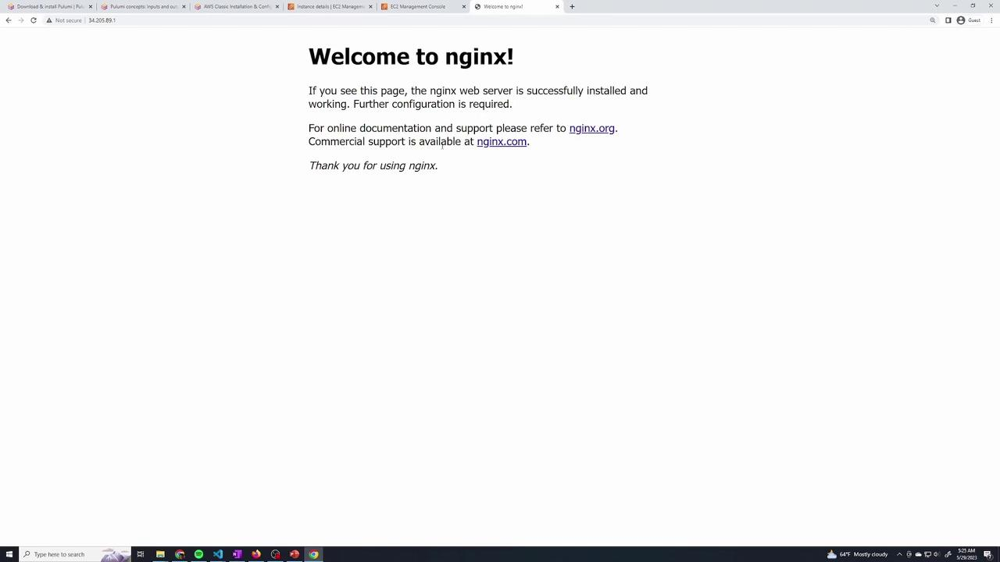
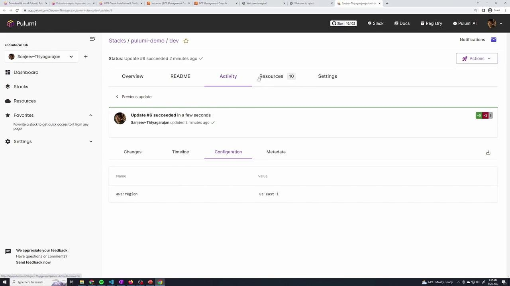
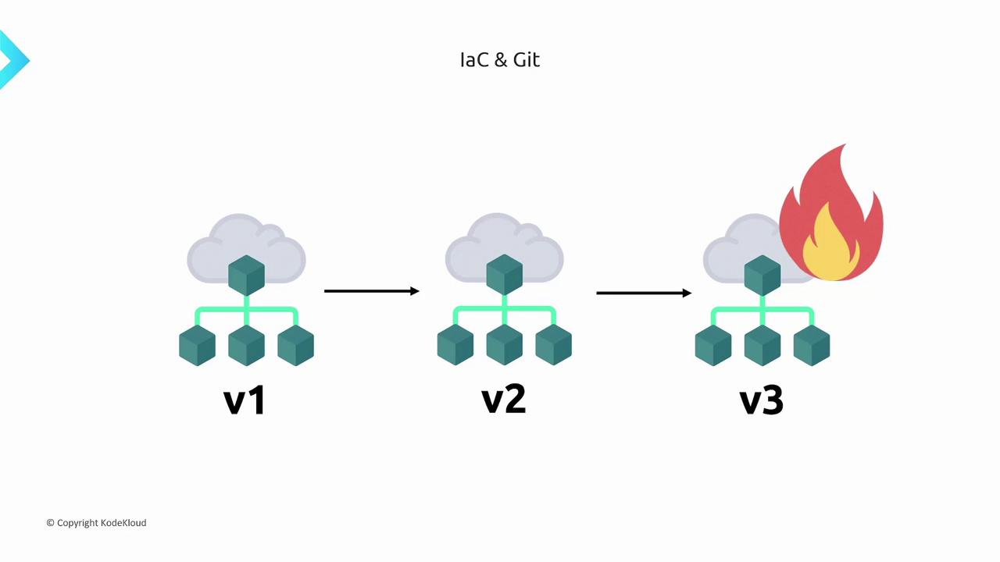

# Create an AWS resource (S3 Bucket) for demonstration purposes.
bucket = s3.Bucket("my-bucket")
pulumi.export("bucket_name", bucket.id)

# Create a security group for web servers.
sg = ec2.SecurityGroup("web-server-sg",
    description="Security group for web servers")

# Define an ingress rule to allow SSH (port 22).
allow_ssh = ec2.SecurityGroupRule("AllowSSH",
    type="ingress",
    from_port=22,
    to_port=22,
    protocol="tcp",
    cidr_blocks=["0.0.0.0/0"],
    security_group_id=sg.id)

# Define an ingress rule to allow HTTP traffic (port 80).
allow_http = ec2.SecurityGroupRule("AllowHTTP",
    type="ingress",
    from_port=80,
    to_port=80,
    protocol="tcp",
    cidr_blocks=["0.0.0.0/0"],
    security_group_id=sg.id)

# Define an egress rule to allow all outbound traffic.
allow_all = ec2.SecurityGroupRule("AllowAll",
    type="egress",
    from_port=0,
    to_port=0,
    protocol="-1",
    cidr_blocks=["0.0.0.0/0"],
    security_group_id=sg.id)

# Launch an EC2 instance using the security group.
ec2_instance = ec2.Instance("web-server",
    ami="ami-053b0d53c279acc90",
    instance_type="t3.nano",
    key_name="test1",
    vpc_security_group_ids=[sg.id],
    tags={
        "Name": "web"
    })

pulumi.export("public_ip", ec2_instance.public_ip)
```

After deploying this stack with `pulumi up`, you might encounter a connection error when testing SSH connectivity. For example:

```plaintext theme={null}
(venv) C:\Users\sanje\Downloads>ssh -i test1.pem ubuntu@34.205.89.1
ssh: connect to host 34.205.89.1 port 22: Connection timed out
```

<Callout icon="lightbulb">
  Ensure that your security group allows SSH access. If you experience a timeout, verify that the ingress rule for port 22 is correctly configured.
</Callout>

You can verify the security group and its rules by reviewing the Pulumi preview output in your terminal:

```plaintext theme={null}
C:\Users\sanje\Documents\scratch\pulumi-demo>pulumi up
Previewing update (dev)

View in Browser (Ctrl+O): https://app.pulumi.com/your-org/pulumi-demo/dev/previews/...

Type                             Name                    Plan      Info
pulumi:pulumi:Stack             pulumi-demo-dev
+  aws:ec2:SecurityGroup        web-server-sg           create
+  aws:ec2:SecurityGroupRule    AllowSSH                create
+  aws:ec2:SecurityGroupRule    AllowHTTP               create
+  aws:ec2:SecurityGroupRule    AllowAll                create
~  aws:ec2:Instance             web-server              update    [diff: ~vpcSecurityGroupIds]

Resources:
+ 4 to create
~ 1 to update
5 changes. 2 unchanged

Do you want to perform this update? [Use arrows to move, type to filter]
```

Once the update is complete, connect to your instance using SSH. When connected, update the package manager and install Nginx:

```bash theme={null}
sudo apt update
sudo apt install nginx
```

Check that Nginx is running:

```bash theme={null}
systemctl status nginx
```

When you navigate to the public IP of your instance in a web browser, you should see the default Nginx welcome page confirming that the server is configured correctly.

<Frame>
  
</Frame>

***

## 2. Generating a Clickable DNS URL for Your Instance

Instead of manually copying the public IP address, you can output a clickable URL using the instance's public DNS. Update your outputs as follows:

```python theme={null}
pulumi.export("public_ip", ec2_instance.public_ip)
pulumi.export("instance_url", pulumi.Output.concat("http://", ec2_instance.public_dns))
```

After deploying with `pulumi up`, the output will display similar values:

```plaintext theme={null}
Outputs:
  bucket_name: "my-bucket-5d138fe"
  instance_url: "http://ec2-34-205-89-1.compute-1.amazonaws.com"
  public_ip: "34.205.89.1"
```

You can also retrieve the stack outputs at any time by running:

```bash theme={null}
pulumi stack output
```

***

## 3. Creating Multiple EC2 Instances Using a Loop

To efficiently create multiple EC2 instances, define an array of instance names and iterate over it. In the example below, three instances ("web1", "web2", and "web3") are created, and their public IP addresses are collected for output.

```python theme={null}
instance_names = ["web1", "web2", "web3"]
output_public_ip = []

for name in instance_names:
    ec2_instance = ec2.Instance(name,
        ami="ami-053b0d53c279acc90",
        instance_type="t3.nano",
        key_name="test1",
        vpc_security_group_ids=[sg.id],
        tags={"Name": name}
    )
    output_public_ip.append(ec2_instance.public_ip)

pulumi.export("public_ip", output_public_ip)
```

During the next `pulumi up` execution, Pulumi will detect that the original "web-server" instance is no longer needed. It will remove it and create the three new instances. The terminal output will reflect these changes:

```plaintext theme={null}
Outputs:
- instance_url: "http://ec2-34-205-89-1.compute-1.amazonaws.com"
- public_ip: "34.205.89.1"
+ public_ip: [
    [0]: "44.201.56.20"
    [1]: "44.200.224.43"
    [2]: "3.230.151.48"
  ]

Resources:
  + 3 to create
  - 1 to delete
```

Verify the changes by checking the AWS console for the newly created instances ("web1", "web2", and "web3").

***

## 4. Monitoring Your Pulumi Deployment

After running an update, click the provided URL in the output to access the Pulumi dashboard. This dashboard offers a detailed view of the recent update, including resource creation, updates, or deletions. It also provides a comprehensive timeline of configuration changes and deployment events.

<Frame>
  
</Frame>

<Callout icon="lightbulb">
  The Pulumi dashboard is a powerful tool for tracking your deployment progress and understanding resource changes. Make sure to explore it after every update for better insight.
</Callout>

***

## 5. Cleaning Up Resources

When you are finished with the demonstration, you can remove all resources from your stack by running:

```bash theme={null}
pulumi destroy
```

This command marks all resources for deletion. The output will look similar to this:

```plaintext theme={null}
Outputs:
  - bucket_name: "my-bucket-5d138fe"
  - public_ip: [
      [0]: "44.201.56.20"
      [1]: "44.200.224.43"
      [2]: "3.230.151.48"
    ]

Resources:
  - 9 to delete

Do you want to perform this destroy? yes
Destroying (dev)
```

Confirm the prompt to allow Pulumi to clean up the resources created during this demo.

***

This lesson demonstrated how to create and manage security groups and EC2 instances using Pulumi. From outputting useful connection information to scaling your deployment with a loop, you now have a solid foundation for using Pulumi in your infrastructure projects. Happy coding!

<CardGroup>
  <Card title="Watch Video" icon="video" href="https://learn.kodekloud.com/user/courses/pulumi-essentials/module/883d8d6f-c8be-44af-ac4d-ba0835d32f5d/lesson/e2fd37dc-fe18-42d6-9393-5c8f3ec400e2" />
</CardGroup>


# IaC Git

Source: https://notes.kodekloud.com/docs/Pulumi-Essentials/Pulumi-Essentials/IaC-Git/page

Storing Infrastructure as Code in Git streamlines collaboration and enhances management of infrastructure configurations through version control and environment replication.

Storing our Infrastructure as Code (IaC) in Git offers numerous benefits that streamline team collaboration and enhance our ability to manage and propagate infrastructure configurations effectively.

By defining setups as code rather than through manual console clicks, team members can easily recreate consistent environments using simple commands like "apply" or "deploy." This approach not only simplifies environment replication but also ensures that the infrastructure aligns precisely with the defined configuration at all times.

<Callout icon="lightbulb">
  Using Git for IaC enables seamless sharing of code between team members and, if desired, with a broader community when the repository is public. This fosters collaboration and knowledge sharing across teams.
</Callout>

A key advantage of using Git for IaC is its robust version control. Git commits act as a historical record of our infrastructure modifications. In the event of an issue or failure, you can quickly trace back changes and revert to a known stable state—saving valuable time during troubleshooting or rollbacks.

The image below illustrates the evolution of a cloud infrastructure managed via Git. Notice how the third version is marked as problematic with a fire icon, emphasizing the importance of version control when issues arise.

<Frame>
  
</Frame>

<CardGroup>
  <Card title="Watch Video" icon="video" href="https://learn.kodekloud.com/user/courses/pulumi-essentials/module/883d8d6f-c8be-44af-ac4d-ba0835d32f5d/lesson/4c23b3be-4e5e-4df1-8e0d-425a910e8b23" />
</CardGroup>
