# Define the neural network by creating a class
class SimpleNeuralNetwork(nn.Module):
    def __init__(self):
        super(SimpleNeuralNetwork, self).__init__()

        # Define the layers
        self.input_layer = nn.Linear(10, 20)
        self.hidden_layer = nn.Linear(20, 15)
        self.output_layer = nn.Linear(15, 1)

        # Define the activation function
        self.activation = nn.ReLU()

    # Define the forward pass
    def forward(self, x):
        x = self.activation(self.input_layer(x))
        x = self.activation(self.hidden_layer(x))
        x = self.output_layer(x)
        return x
```

In this class:

* The `__init__` method sets up the input, hidden, and output layers, along with the ReLU activation function.
* The `forward` method dictates how data flows through the network, from the input layer to the final output.

When you create an instance of this class, PyTorch recognizes it as a neural network model automatically.

### Understanding torch.nn.Module

The `torch.nn.Module` class offers a structured approach for defining layers and operations in your model. By inheriting from this module, you benefit from features such as automatic management of weights, gradients, and parameter updates. This design also simplifies saving, loading, and reusing your model.

<Frame>
  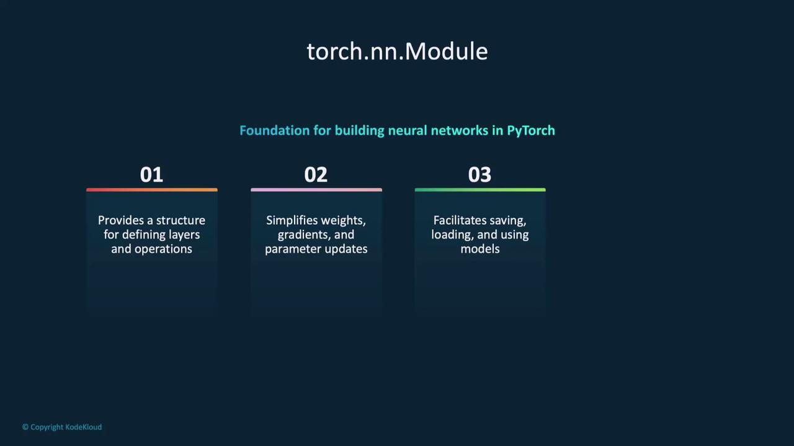
</Frame>

In the `__init__` function, by defining the layers, you ensure that they are primed to process data seamlessly.

***

## A Quick Overview of Neural Network Layers

When designing a neural network, you have various types of layers at your disposal. Here are some common layer types used in PyTorch:

1. **Fully Connected Layer (Dense Layer)**
   * Every neuron in one layer is connected to every neuron in the next.
   * Implemented as `nn.Linear`.

2. **Convolutional Layer**
   * Ideal for image processing.
   * Uses convolutional filters to extract features such as edges and textures.
   * Implemented as `nn.Conv2d`.

3. **Recurrent Layer**
   * Suitable for sequential data like time-series or text.
   * Examples include `nn.RNN`, `nn.LSTM`, and `nn.GRU`.

4. **Dropout Layer**
   * Randomly ignores a portion of neurons during training, helping to prevent overfitting.

5. **Activation Functions**
   * Introduce non-linearity into the network (e.g., ReLU for hidden layers, sigmoid or softmax for output layers).

6. **Batch Normalization**
   * Normalizes the outputs of each layer to improve training stability and speed.

<Frame>
  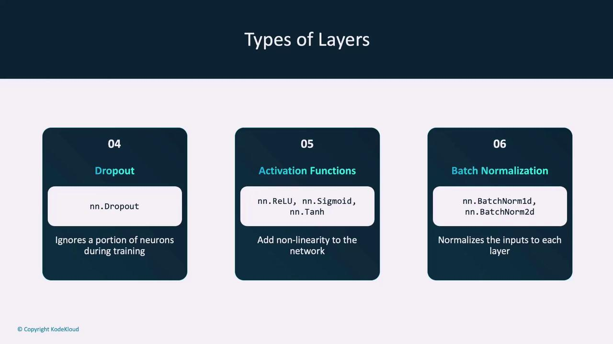
</Frame>

Other layers include pooling (MaxPool, AveragePool), padding, and embedding layers (common in NLP tasks). Vision-specific layers, such as transformer layers, are used in advanced image processing and NLP models.

<Frame>
  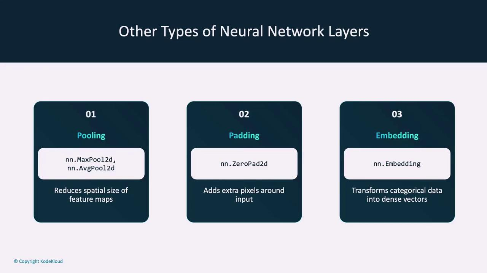
</Frame>

Transformers are widely used in state-of-the-art models like BERT and GPT:

```Python theme={null}
nn.ConvTranspose2d,
nn.Upsample

nn.Transformer,
nn.TransformerEncoder,
nn.TransformerDecoder
```

<Frame>
  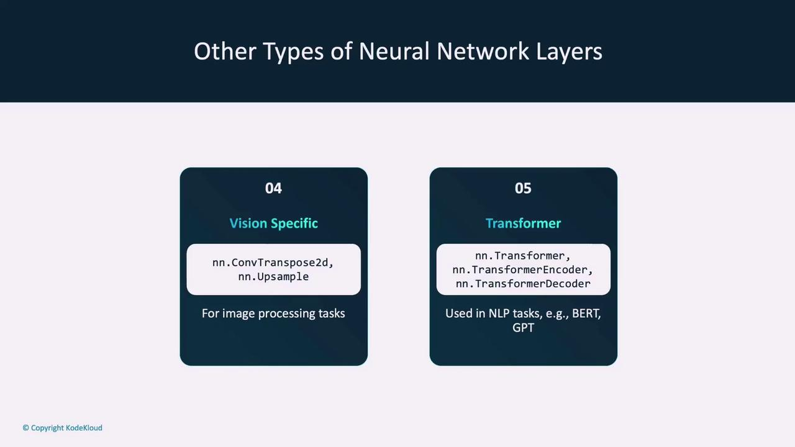
</Frame>

***

## The Forward Function

In a PyTorch model, the `forward` function defines the sequence of operations and transformations that generate a prediction from input data. Essentially, it processes data through each layer and produces an output.

Consider the simplified example below that demonstrates the forward pass:

```python theme={null}
def forward(self, x):
    x = self.activation(self.input_layer(x))
    x = self.activation(self.hidden_layer(x))
    x = self.output_layer(x)
    return x
```

This function enables the model to process inputs and generate predictions. Once the class is defined, creating an instance and printing the model structure provides visibility into its layers:

```python theme={null}
# Create an instance of the model
model = SimpleNeuralNetwork()

# Print the model structure
print(model)
```

Printing the model displays the input, hidden, and output layers along with their corresponding parameters (weights and biases).

<Frame>
  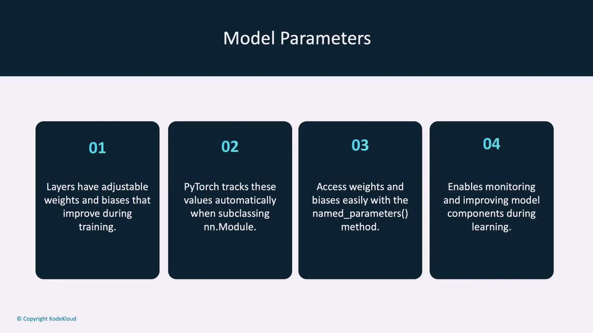
</Frame>

***

## Designing Your Network

When designing your neural network, consider the following factors:

* **Output Size:** Analyze the dimensions of your input data and determine the desired output (e.g., classification labels versus regression values). This affects the configuration of the first and last layers.
* **Network Architecture:** Choose the appropriate architecture based on the task. For instance, CNNs are optimal for image data, while RNNs suit sequential data. Experimentation with existing architectures is useful.
* **Layers and Connections:** Decide the number of neurons and the connectivity between layers. Too few neurons may cause underfitting, whereas too many may lead to overfitting.
* **Activation Functions:** Select the right activation functions (e.g., ReLU, sigmoid, or tanh) to capture non-linear patterns within your data.

<Frame>
  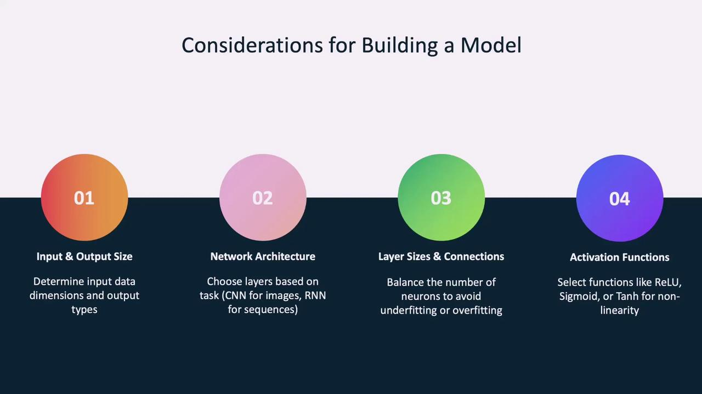
</Frame>

***

## Loss Functions and Optimizers

After designing the model, the next step is training. Training involves optimizing the model's parameters (weights and biases) by reducing the error using loss functions and optimizers.

* **Loss Function:** This function measures how well the model's predictions match the target values. Common examples include cross-entropy loss for classification tasks and mean squared error (MSE) for regression tasks.
* **Optimizer:** The optimizer adjusts the model’s parameters to minimize the loss using gradients computed via backpropagation. Popular optimizers include Stochastic Gradient Descent (SGD) and Adam.

<Frame>
  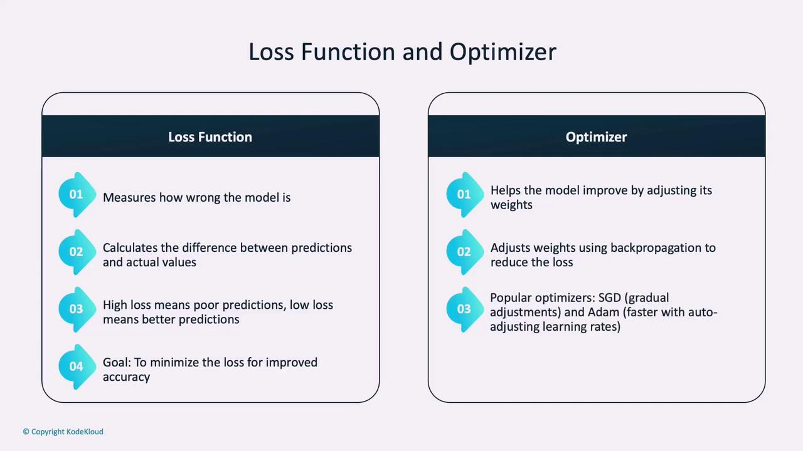
</Frame>

Below is an example that defines a loss function and an optimizer for a model:

```python theme={null}
import torch.optim as optim

criterion = nn.CrossEntropyLoss()
optimizer = optim.SGD(model.parameters(), lr=0.001, momentum=0.9)
```

Here, `criterion` is set to cross-entropy loss for classification tasks, and `optimizer` is configured as SGD with a learning rate of 0.001 and momentum of 0.9. Other loss functions such as Mean Squared Error (MSELoss) and Binary Cross-Entropy (BCELoss) cater to regression and binary classification tasks, respectively.

<Frame>
  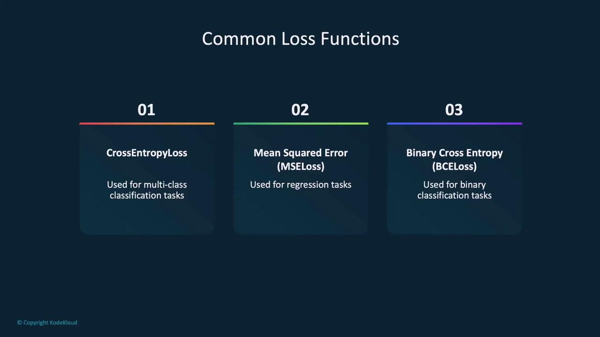
</Frame>

Common optimizers include:

* **Stochastic Gradient Descent (SGD):** Updates weights based on gradients, often enhanced with momentum.
* **Adam:** Combines SGD with adaptive learning rates for improved optimization.

<Frame>
  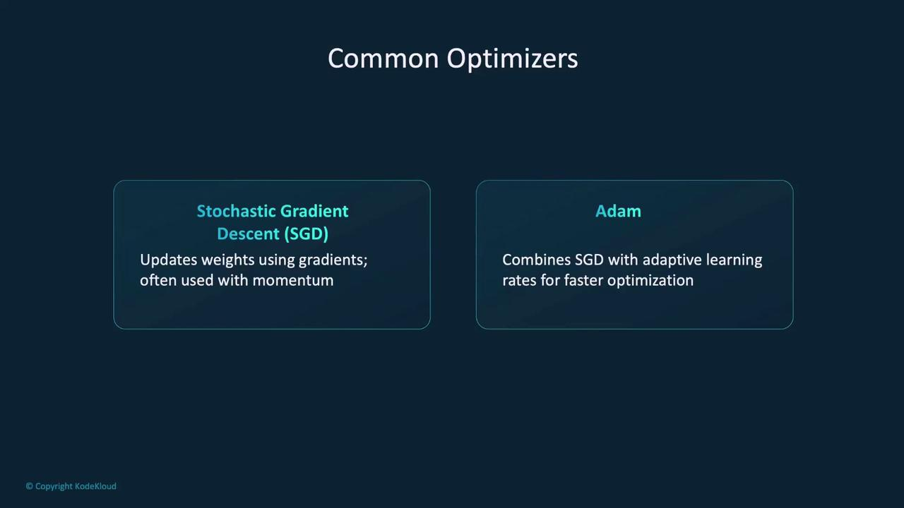
</Frame>

***

## Automatic Differentiation with Autograd

One of PyTorch's standout features is automatic differentiation with Autograd. This mechanism tracks operations performed on Tensors to build a computational graph, which is later used to compute gradients during backpropagation. When you invoke `loss.backward()`, Autograd calculates the gradients for each parameter, guiding the optimizer in updating the model's weights.

<Frame>
  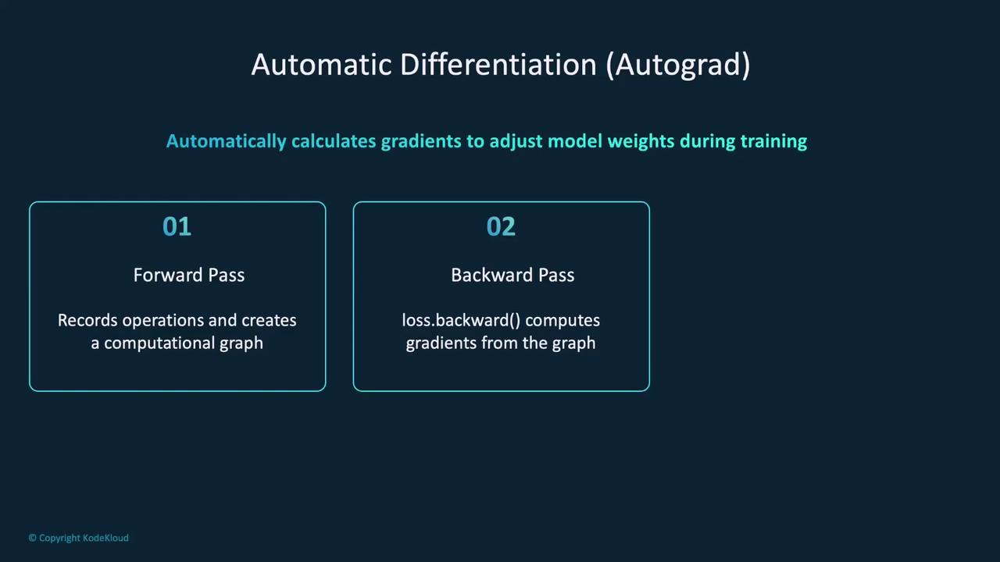
</Frame>

This automated gradient computation simplifies the training process by eliminating the need for manual derivative calculations.

***

## Training the Model

With the neural network, loss function, and optimizer defined, the next step is training the model. Training involves iterating through the dataset over multiple epochs. In each epoch, the model:

* Makes predictions.
* Calculates the loss.
* Computes gradients using backpropagation.
* Updates its weights via the optimizer.

An epoch signifies one complete pass through the training dataset.

<Frame>
  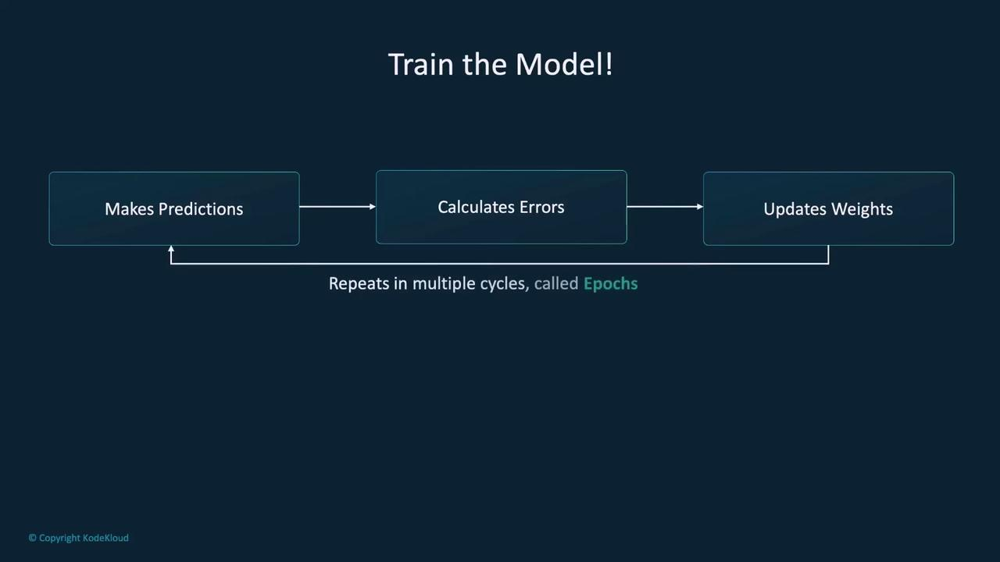
</Frame>

### Example Training Loop

Below is an example demonstrating a training loop that runs over three epochs:

```python theme={null}
N_EPOCHS = 3

for epoch in range(N_EPOCHS):  # Loop for 3 epochs
    running_loss = 0.0
    for i, data in enumerate(trainloader, 0):
        # Get the inputs; data is a list of [inputs, labels]
        inputs, labels = data

        # Zero the gradients before backpropagation
        optimizer.zero_grad()

        # Forward pass
        outputs = model(inputs)
        loss = criterion(outputs, labels)

        # Backward pass and optimization
        loss.backward()
        optimizer.step()

        # Accumulate the batch loss
        running_loss += loss.item()

    print(f"Epoch: {epoch} Loss: {running_loss/len(trainloader)}")
```

In this loop:

* Data is fetched in batches from `trainloader`.
* Gradients are reset using `optimizer.zero_grad()`.
* A forward pass calculates predictions.
* The loss is then backpropagated, and the optimizer updates the model parameters.
* The average loss for each epoch is printed to monitor training progress.

***

## Incorporating Validation Data

Validating your model during training is essential for ensuring that it generalizes well and does not overfit the training data. Overfitting occurs when the model learns the details and noise in the training dataset too well, resulting in poor performance on unseen data.

### Updated Training Loop with Validation

The example below demonstrates a training loop that includes a validation phase:

```python theme={null}
N_EPOCHS = 3

for epoch in range(N_EPOCHS):  # Loop for 3 epochs
    # Training phase
    training_loss = 0.0
    model.train()  # Set the model to training mode
    for i, data in enumerate(trainloader, 0):
        inputs, labels = data
        optimizer.zero_grad()  # Reset gradients
        outputs = model(inputs)  # Forward pass
        loss = criterion(outputs, labels)  # Compute loss
        loss.backward()  # Backpropagation
        optimizer.step()  # Update parameters
        training_loss += loss.item()

    # Validation phase
    val_loss = 0.0
    model.eval()  # Set the model to evaluation mode
    for i, data in enumerate(valoader, 0):
        inputs, labels = data
        outputs = model(inputs)  # Forward pass
        loss = criterion(outputs, labels)
        val_loss += loss.item()

    print(f"Epoch: {epoch} Train Loss: {training_loss/len(trainloader)} Val Loss: {val_loss/len(valoader)}")
```

<Callout icon="lightbulb">
  Remember to switch between training and evaluation modes using `model.train()` and `model.eval()`. This ensures that layers like dropout behave correctly during training and inference.
</Callout>

<Frame>
  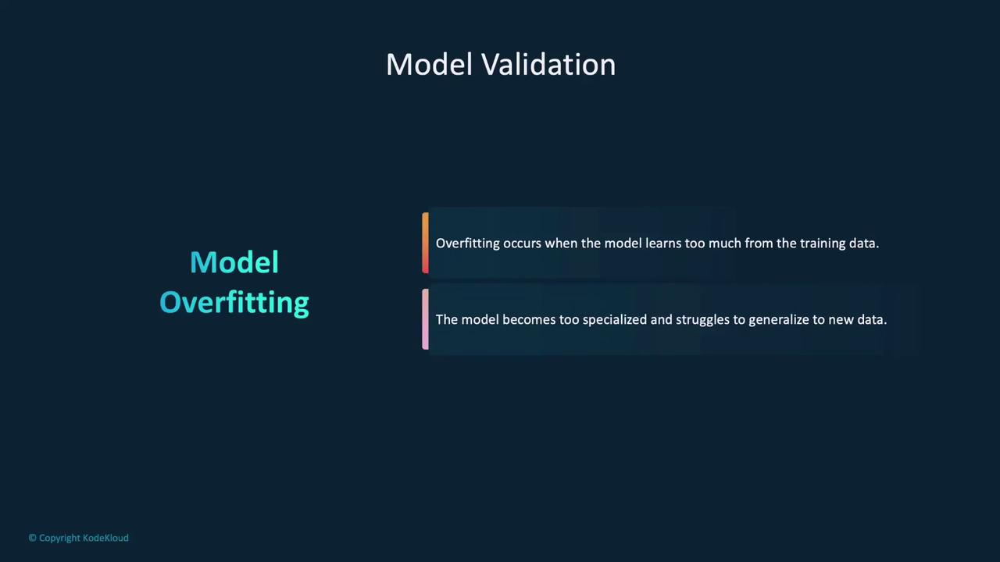
</Frame>

***

## Recap of the Steps

1. **Define the Model:**
   * Create a class that inherits from `torch.nn.Module`.
   * Define the network layers in the `__init__` method.
   * Specify the data flow in the `forward` method.

2. **Set Up the Training Environment:**
   * Initialize the model.
   * Define a loss function to quantify errors.
   * Set up an optimizer to adjust model parameters.

3. **Implement the Training Loop:**
   * Iterate through batches for several epochs.
   * Perform forward passes, compute the loss, backpropagate, and update weights.
   * Optionally incorporate validation to monitor generalization.

<Frame>
  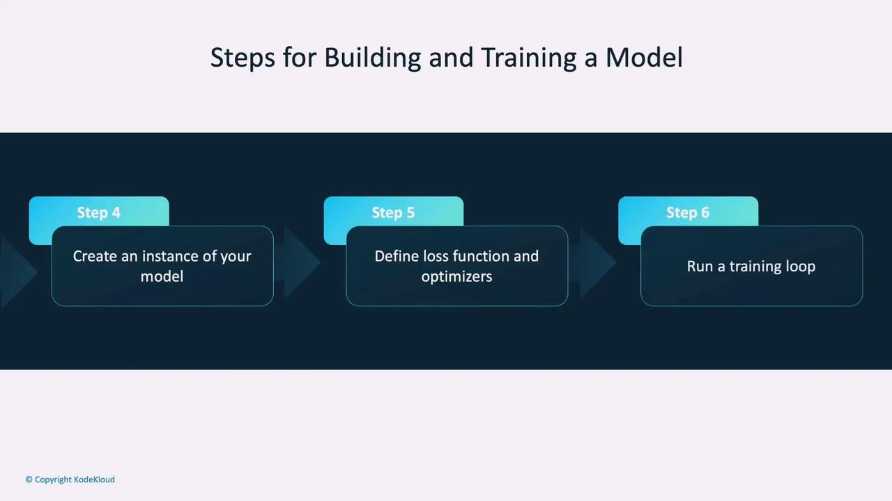
</Frame>

***

## Conclusion

In this article, we have covered:

* How to build a neural network in PyTorch by defining a class that inherits from `torch.nn.Module`.
* How to design the network structure, including layer definitions and the forward pass.
* The importance of loss functions and optimizers in training.
* How to implement a training loop that incorporates validation to combat overfitting.

This foundational knowledge paves the way for exploring more advanced topics and practical demonstrations of neural networks in action.

<CardGroup>
  <Card title="Watch Video" icon="video" href="https://learn.kodekloud.[AWS_SECRET_ACCESS_KEY]-a284-41d1-8469-7e60705bbab8/lesson/9c822dcd-3b71-4c90-9dc3-c1729b4ae61c" />
</CardGroup>


# Demo Additional Training Methods

Source: https://notes.kodekloud.com/docs/PyTorch/Building-and-Training-Models/Demo-Additional-Training-Methods/page

This article explores advanced training techniques in PyTorch, including transfer learning, learning rate schedulers, and model sharing with step-by-step examples.

In this article, we dive into advanced training techniques in PyTorch. We explore methods such as transfer learning, creating learning rate schedulers, and sharing models with the PyTorch community. With step-by-step examples, you'll learn how to modify pre-trained models, fine-tune parameters, and efficiently manage training routines.

Below is an outline of the topics covered:

• Using the TorchVision library to load pre-trained models\
• Modifying model output layers for custom tasks\
• Utilizing the PyTorch Hub to list, download, and share models\
• Creating and using learning rate schedulers\
• Freezing model layers and fine-tuning only the final layer

──────────────────────────────

## Loading and Using Pre-trained Models with TorchVision

PyTorch offers a wide array of pre-trained models through the TorchVision library. You can leverage these models directly for fine-tuning or use them as feature extractors. The examples below demonstrate how to list available models, load the VGG19 model, and implement both the legacy `pretrained=True` approach and the modern API using the `weights` argument.

```python theme={null}
