# Model Evaluation

Source: https://notes.kodekloud.com/docs/PyTorch/Building-and-Training-Models/Model-Evaluation/page

This article discusses the process and importance of model evaluation in machine learning, including metrics, overfitting, and practical implementation techniques.

In this lesson, we trained three distinct models: a custom model from scratch and two models leveraging transfer learning. Now, we need to select the best candidate for deployment in production. Before making that decision, a thorough model evaluation must be performed.

<Frame>
  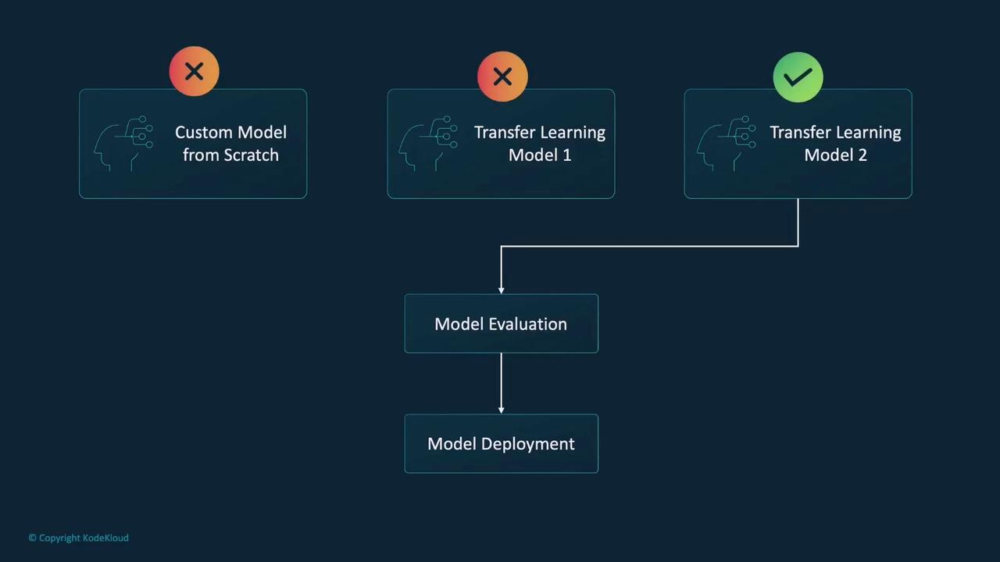
</Frame>

Model evaluation is the process of assessing a machine learning model's performance on unseen data. It verifies whether the model has effectively captured the underlying patterns in the training data and can generalize to new examples. Think of it as administering a test to the model using questions it hasn't seen before.

To perform the evaluation, we use a separate dataset—commonly known as the test dataset—which is not used during the training phase. By comparing the model's predictions with the true labels, we can determine its effectiveness.

<Frame>
  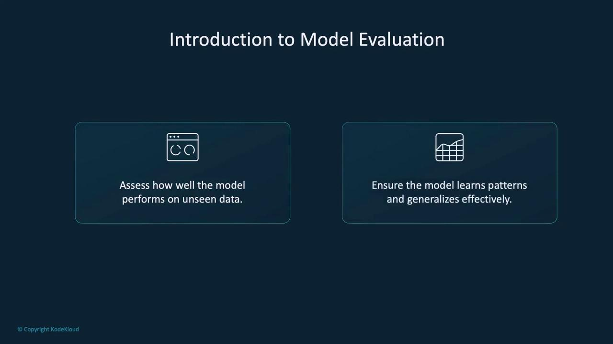
</Frame>

<Frame>
  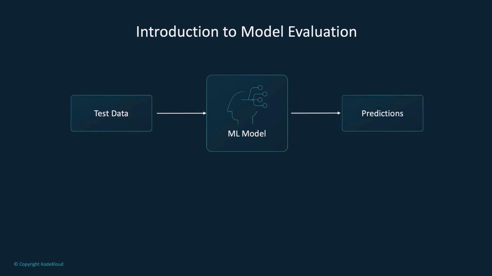
</Frame>

This evaluation process enables us to compute metrics such as accuracy—which reflects how many predictions are correct—as well as precision and recall, which provide more detailed insights especially when dealing with imbalanced datasets.

<Frame>
  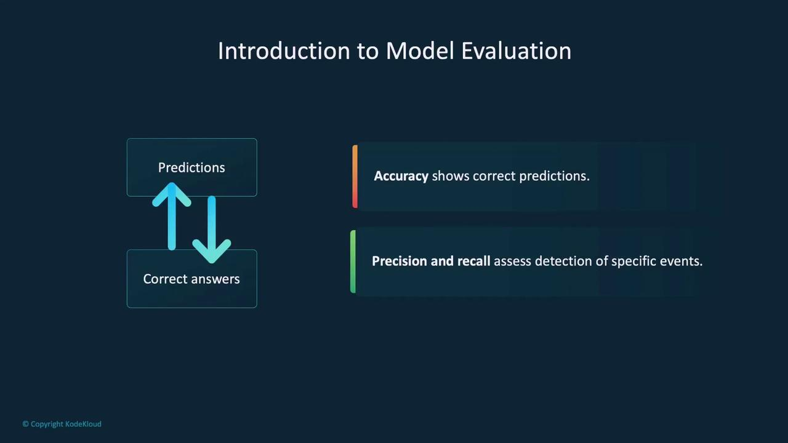
</Frame>

Evaluating a model is crucial because a model that performs exceptionally well on training data might still fail in real-world scenarios due to overfitting. Overfitting happens when the model memorizes the training data rather than learning generalizable patterns. By rigorously testing on unseen data, we can detect such issues and choose the model that best meets our operational requirements.

<Frame>
  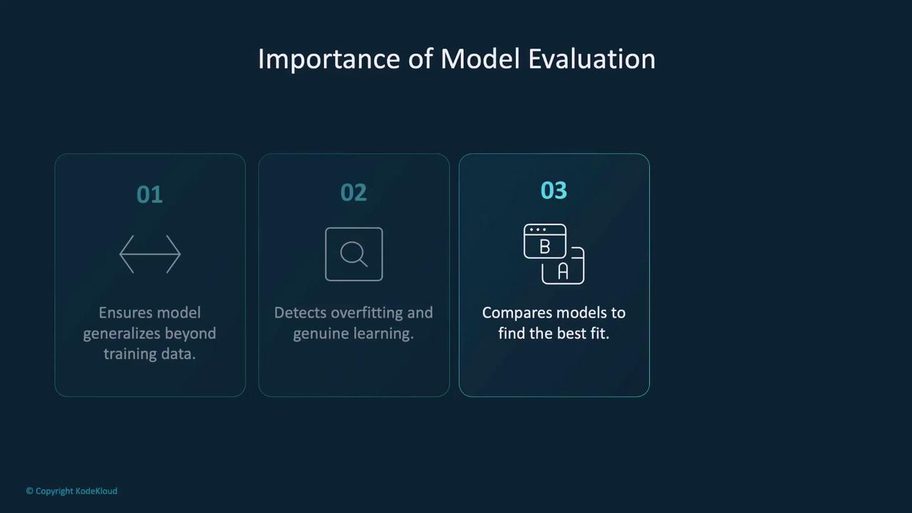
</Frame>

It also helps pinpoint weaknesses, such as difficulty handling specific input types, thereby allowing us to make necessary improvements before deployment.

## Training vs. Validation Loss

During model training, we compute two key loss metrics: training loss and validation loss. These metrics provide insights into how well the model learns from the provided data.

* **Training Loss:** This metric measures error on the training dataset, which the model uses to iterate and optimize its parameters through methods like gradient descent. A low training loss indicates that the model is learning from the training data, but it doesn't guarantee good generalization.

* **Validation Loss:** This loss is computed on an unseen validation dataset after each training epoch (without updating the model parameters). A large discrepancy between training and validation loss is a strong indicator of overfitting.

Monitoring these metrics together helps in deciding when to stop the training process. If training loss decreases continually while validation loss increases, it signifies that the model is overfitting.

<Frame>
  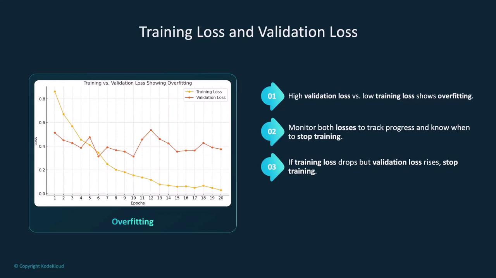
</Frame>

A balanced training approach will yield similar training and validation loss values over time.

## Overfitting vs. Underfitting

Two common challenges during model training are overfitting and underfitting:

* **Underfitting:** Occurs when the model is too simple to capture the underlying trends in the data, resulting in poor performance on both training and test datasets.

* **Overfitting:** Happens when a model is overly complex and starts to memorize the training data instead of learning generalizable patterns. Even though it might perform excellently on the training set, its performance on new, unseen data deteriorates.

<Frame>
  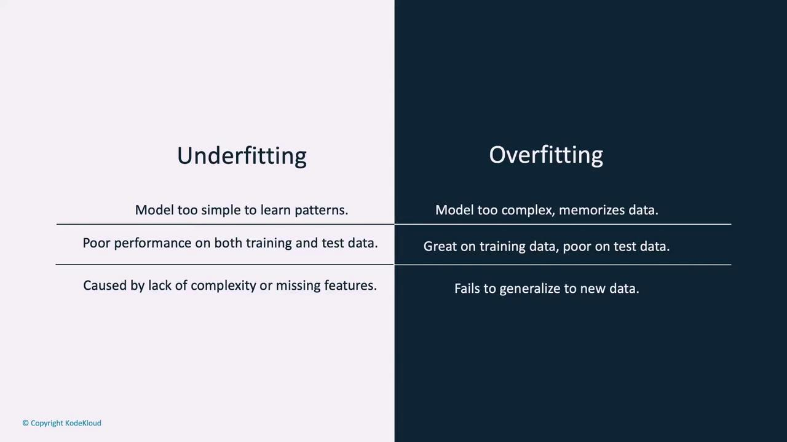
</Frame>

The goal is to strike a balance where the model can generalize well without falling into the traps of underfitting or overfitting.

## Evaluation Metrics

Model evaluation employs several metrics to quantify performance:

* **Accuracy:** Represents the ratio of correctly predicted instances to the total predictions. While accuracy is easy to compute, it can be misleading for imbalanced datasets.

<Frame>
  
</Frame>

* **Precision:** Indicates the ratio of true positive predictions to all positive predictions made by the model. This metric is vital in scenarios where false positives carry a high cost, such as spam detection or medical diagnosis.

* **Recall:** Denotes the ratio of true positive predictions to all actual positive cases, focusing on the model's ability to identify all positive instances. It is especially important in fields like disease detection and fraud monitoring.

<Frame>
  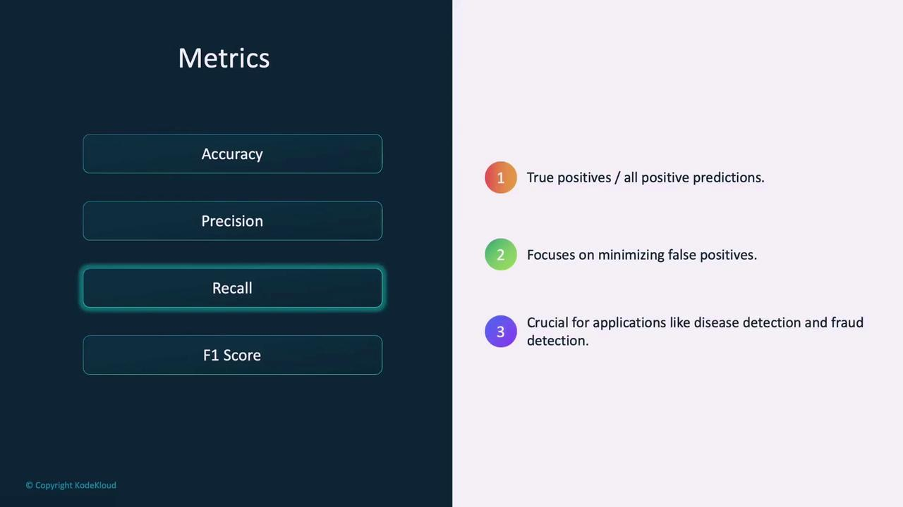
</Frame>

* **F1 Score:** This is the harmonic mean of precision and recall. It provides a single metric that balances both false positives and false negatives, making it useful when you need a balance between precision and recall.

<Frame>
  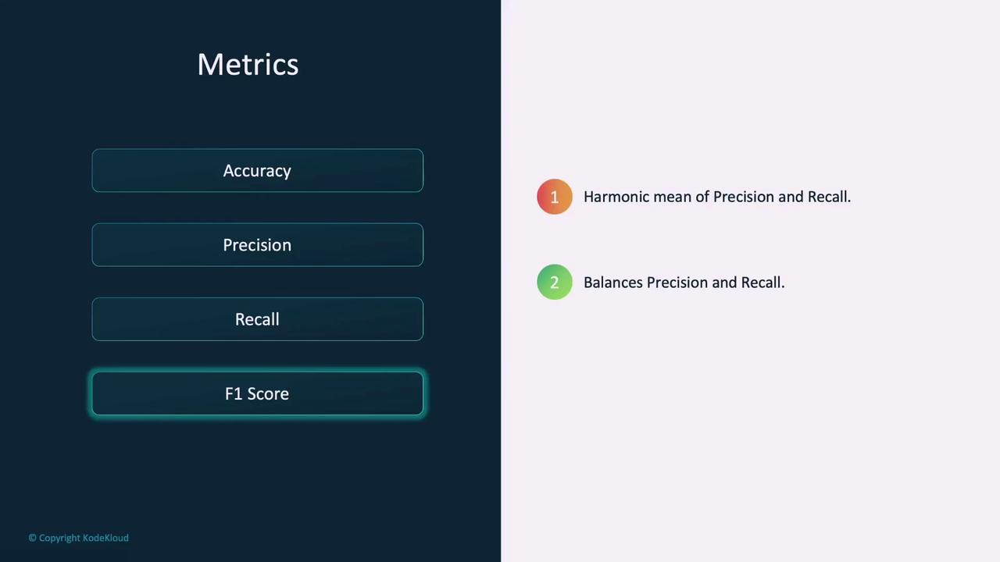
</Frame>

## The Confusion Matrix

A confusion matrix is an essential tool for evaluating classification models. It offers a detailed breakdown by comparing actual labels with the model’s predictions and categorizing them as follows:

* **True Positives:** Both predicted and actual labels are positive (e.g., both are "dog").
* **True Negatives:** Both predicted and actual labels are negative.
* **False Positives:** The model predicts positive while the actual label is negative.
* **False Negatives:** The model predicts negative while the actual label is positive.

<Frame>
  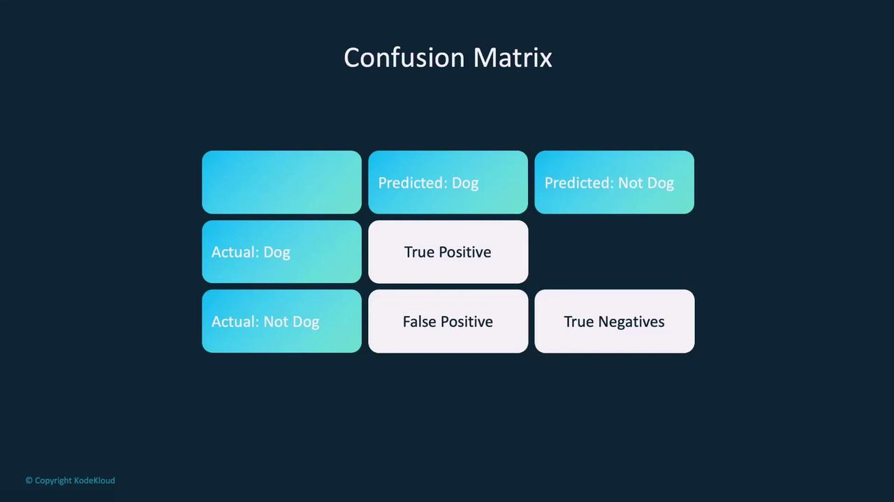
</Frame>

This matrix is the foundation for computing metrics like accuracy, precision, and recall.

<Frame>
  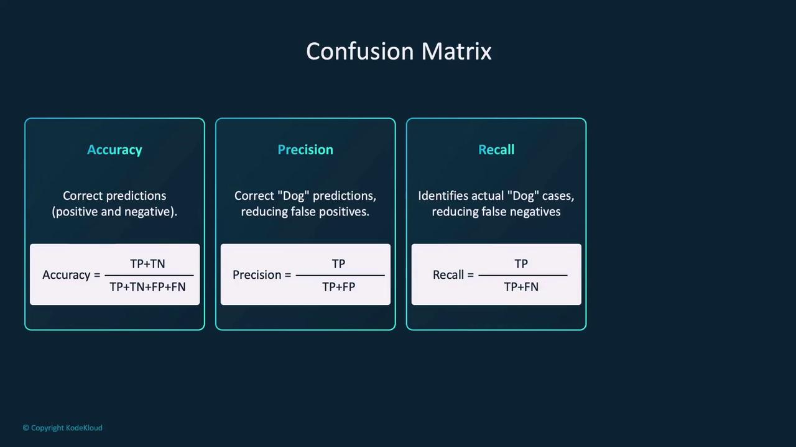
</Frame>

## Model Evaluation in Practice

Evaluating a model often mirrors the approach used during training, but with key distinctions. In evaluation, we use a test loop where gradient computation is disabled using PyTorch’s `no_grad` function. This approach reduces memory usage and enhances computational speed.

Below is an example showcasing both a training loop (for context) and a test loop used for evaluation:

```python theme={null}
