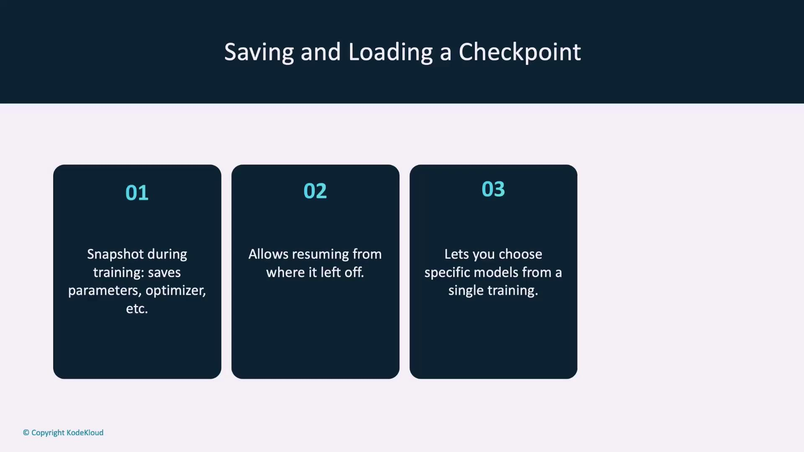
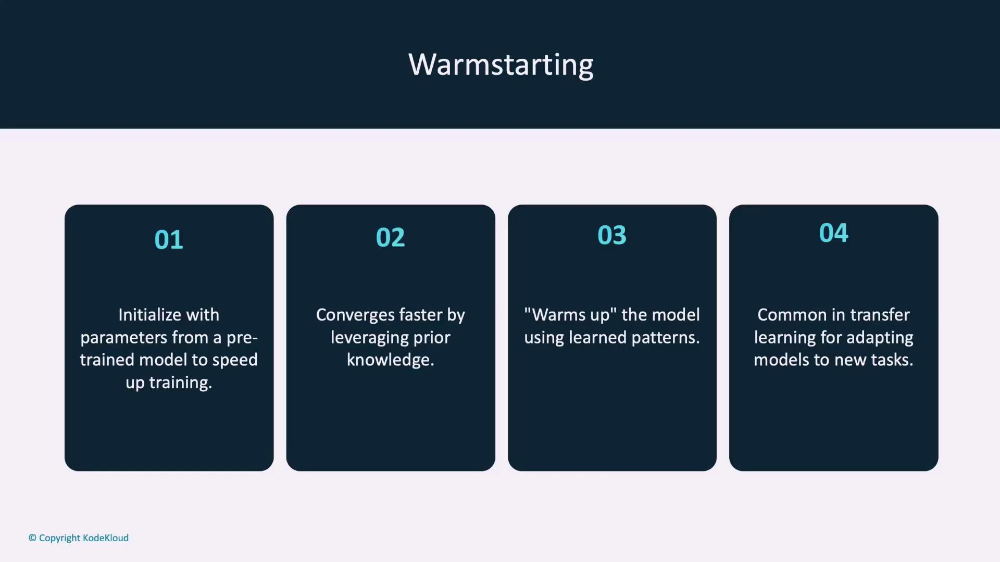
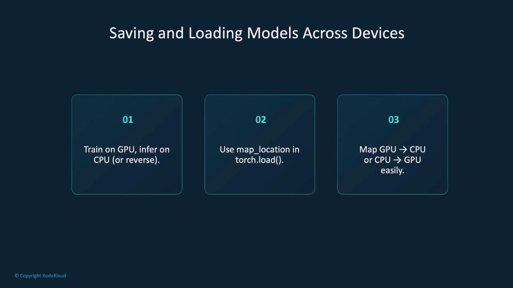
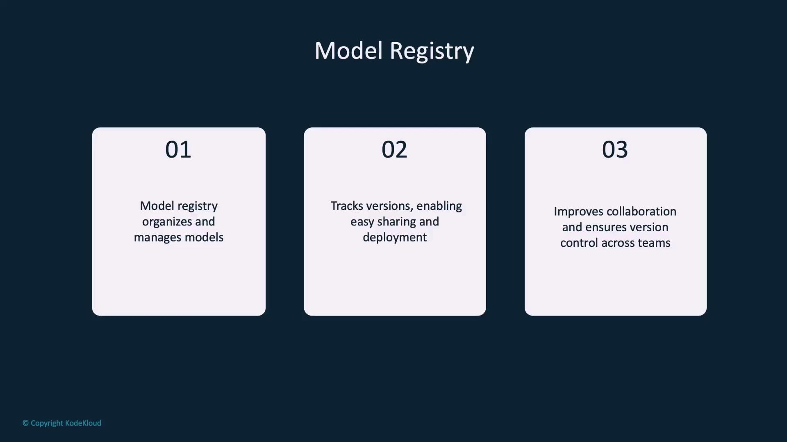
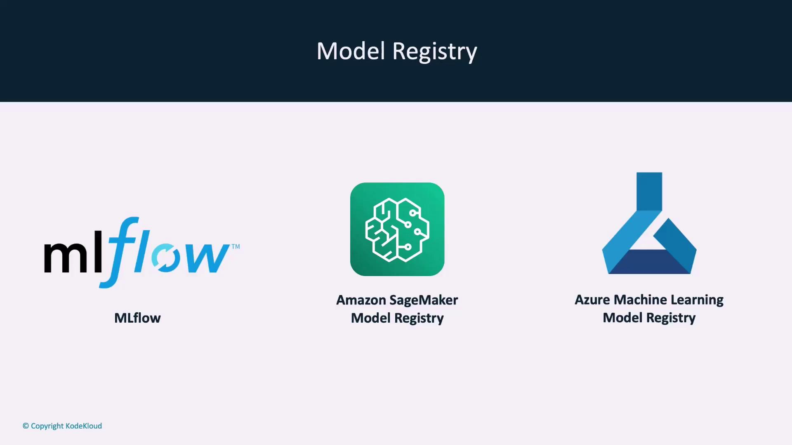
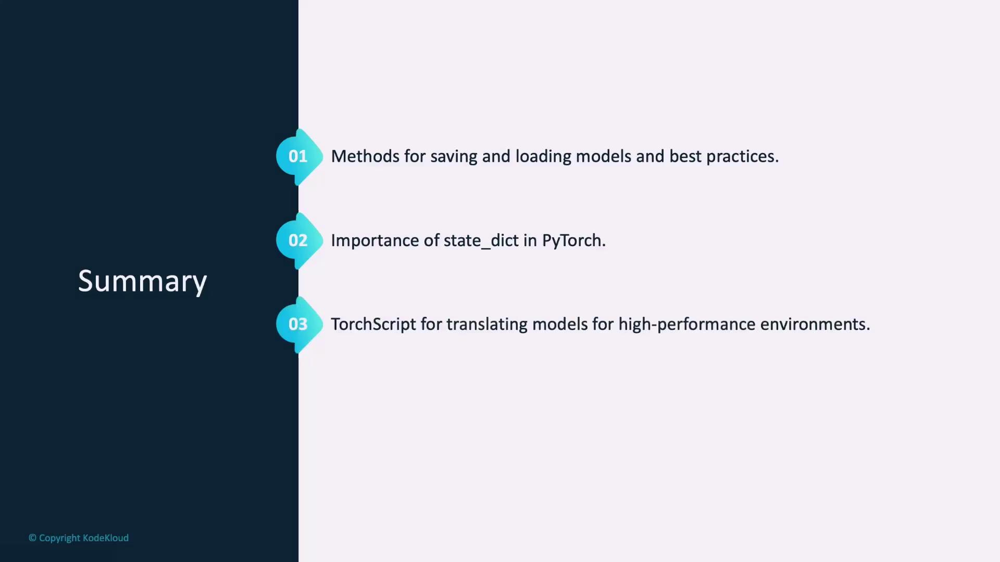
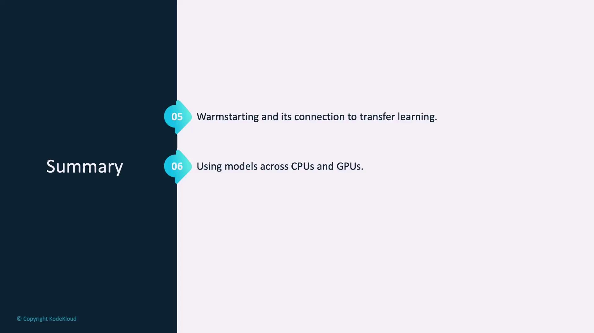

# Save using state_dict
torch.save(model.state_dict(), PATH)

# Load for inference
model.load_state_dict(torch.load(PATH, map_location='cpu'))
model.eval()
```

## Saving and Loading the Entire Model

You also have the option to save the entire model, which includes both its architecture and parameters. This method is convenient because you can reload the model without redefining its structure. However, one drawback is that the saved model is coupled with its original code and file paths, potentially causing issues when those change. This method is best suited for personal projects or stable codebases.

```python theme={null}
# Save the entire model
torch.save(model, PATH + "/model.pt")

# Load the entire model
model = torch.load(PATH + "/model.pt")
model.eval()
```

## Exporting Models with TorchScript

TorchScript allows you to export PyTorch models for high-performance deployment across various environments, including C++ or mobile devices. First, create a scripted version of your model using `torch.jit.script`, then export it with the `save` function. Later, you can load it with `torch.jit.load` and switch it to evaluation mode.

```python theme={null}
# Export to TorchScript
model_scripted = torch.jit.script(model)
model_scripted.save('model_scripted.pt')

# Load the scripted model
model = torch.jit.load('model_scripted.pt')
model.eval()
```

## Checkpoints During Training

A checkpoint is a snapshot of your training state at a given time. It typically includes:

* The model’s `state_dict`
* The optimizer’s `state_dict`
* Additional details like the current epoch and loss

Checkpoints allow you to resume training exactly where it left off.

<Frame>
  
</Frame>

### Saving a Checkpoint

Organize the necessary components into a dictionary and save it with the `.tar` extension:

```python theme={null}
# Save Checkpoint
torch.save({
    'epoch': epoch,
    'model_state_dict': model.state_dict(),
    'optimizer_state_dict': optimizer.state_dict(),
    'loss': loss,
}, PATH + "/checkpoint.tar")
```

### Reloading a Checkpoint

Initialize your model and optimizer first, then load their state dictionaries along with any additional saved components:

```python theme={null}
# Initialize Model and Optimizer
model = ModelClass()
optimizer = OptimizerClass()

# Load from Checkpoint
checkpoint = torch.load(PATH + "/checkpoint.tar", map_location='cpu')
model.load_state_dict(checkpoint['model_state_dict'])
optimizer.load_state_dict(checkpoint['optimizer_state_dict'])
epoch = checkpoint['epoch']
loss = checkpoint['loss']
```

You might also choose to save a checkpoint at regular intervals—say, every five epochs—to balance reliability with storage demands.

```python theme={null}
# Training loop example
for epoch in range(N_EPOCHS):
    ...
    if epoch % 5 == 0:
        torch.save({
            'epoch': epoch,
            'model_state_dict': model.state_dict(),
            'optimizer_state_dict': optimizer.state_dict(),
            'loss': loss,
        }, PATH + f"/checkpoint_{epoch}.tar")
```

## Warm Starting Models

Warm starting means initializing a new model with parameters from a previously trained one rather than starting from scratch. This is particularly useful in transfer learning scenarios where a pre-trained model is adapted to a related task, leading to faster convergence and improved performance.

<Frame>
  
</Frame>

To warm start a model, load its state dictionary. If there are discrepancies between the keys (due to missing or extra parameters), you can set the `strict` flag to `False`.

```python theme={null}
# Load a model with non-matching keys
model = ModelClass()
model.load_state_dict(torch.load(PATH, map_location='cpu'), strict=False)

# Optionally, modify parameter key names if needed
new_state_dict = {}
for key, value in model.state_dict().items():
    if key == "old_layer_name":
        new_state_dict["new_layer_name"] = value
```

## Moving Models Between Devices

Models are often trained on GPUs and then deployed on CPUs or vice versa. PyTorch makes it easy to handle device differences through the `map_location` parameter in `torch.load`.

• **Loading a GPU-Saved Model on a CPU:**

```python theme={null}
model = ModelClass()
model.load_state_dict(torch.load(PATH, map_location='cpu'))
```

• **Loading a CPU-Saved Model on a GPU:**

```python theme={null}
model = ModelClass()
model.load_state_dict(torch.load(PATH, map_location='cuda:0'))
model.to(torch.device('cuda'))
```

Always ensure that both your model and input data are on the same device for optimal performance.

<Frame>
  
</Frame>

## Model Registries

A model registry is a centralized system to organize, store, and manage models. It simplifies tracking model versions, sharing across teams, and managing deployments. Popular solutions like MLflow, AWS SageMaker Model Registry, and Azure Machine Learning Model Registry integrate seamlessly with PyTorch. Although this guide doesn't delve deeply into model registries, they are invaluable for efficient production workflows.

<Frame>
  
</Frame>

<Frame>
  
</Frame>

## Summary

We've explored several methods for saving and loading models in PyTorch:

* Using `torch.save`/`torch.load` and `load_state_dict` to preserve and restore model parameters.
* Leveraging TorchScript to export models for deployment in non-Python environments.
* Creating checkpoints during training to resume work seamlessly.
* Employing warm starting to take advantage of pre-trained models in transfer learning.
* Handling device differences by using the `map_location` parameter.
* Managing model versions through a centralized model registry.

<Frame>
  
</Frame>

<Frame>
  
</Frame>

<Callout icon="lightbulb">
  Ensure that you save and load your models consistently with the same configuration and device mappings to avoid runtime errors.
</Callout>

This comprehensive walkthrough of saving and loading models in PyTorch should provide you with the tools you need to manage your models effectively. Now, try out these techniques in your demo and optimize your workflow!

<CardGroup>
  <Card title="Watch Video" icon="video" href="https://learn.kodekloud.[AWS_SECRET_ACCESS_KEY]-a284-41d1-8469-7e60705bbab8/lesson/916cc3d9-f79d-425a-9a29-08ddc0f2a80a" />
</CardGroup>


# Course Introduction

Source: https://notes.kodekloud.com/docs/PyTorch/Getting-Started-with-PyTorch/Course-Introduction/page

This course teaches PyTorch for developing AI applications, focusing on breast cancer diagnosis and covering data handling, model training, and deployment techniques.

Welcome to the PyTorch course! PyTorch is a versatile, open-source machine learning library celebrated for its flexibility and efficiency in constructing sophisticated AI models. Leaders in the tech industry—including Meta, Microsoft, and Tesla—rely on PyTorch for cutting-edge machine learning projects. Its powerful computational capabilities and vibrant community support make it an invaluable tool in the ever-evolving AI and machine learning landscape.

In this hands-on course, you will assume the role of an AI engineer tasked with developing an innovative application to accelerate breast cancer diagnosis. This project not only hones your PyTorch skills but also contributes to advancing healthcare through faster, more accurate treatment planning. I’m Mumshad Mannambeth, and I will be your guide throughout this journey.

Throughout the course, you will engage in a series of practical labs that convert theoretical concepts into real-world applications, allowing you to experiment, learn from mistakes, and build the confidence to tackle genuine PyTorch challenges.

Let’s explore the topics covered in this course:

## PyTorch Essentials

In this section, you’ll learn how to set up your environment, work with tensors, and leverage automatic differentiation—a core component of training models. These foundational skills will prepare you for building and debugging deep learning architectures.

## Data Handling with PyTorch

Managing and transforming data is a fundamental step in any machine learning workflow. You’ll discover how to work with datasets, design data loaders, and create transformation pipelines to feed your models with clean, well-structured data.

## Model Training and Advanced Techniques

Here, you will train your models, optimize their performance, and perform comprehensive evaluations. We’ll also explore advanced strategies such as transfer learning and the use of pre-trained models to boost accuracy and speed up development.

## Deployment

In the final phase, you will learn how to serve your trained models in production environments. Topics include building simple web services with Flask, containerizing applications with Docker, and deploying at scale using Kubernetes.

By the end of this course, you will have built, trained, and deployed a complete image classification solution. Are you ready to make a significant impact in the fields of AI and healthcare? Let’s get started on this transformative journey to elevate your PyTorch expertise!

<CardGroup>
  <Card title="Watch Video" icon="video" href="https://learn.kodekloud.[AWS_SECRET_ACCESS_KEY]-2490-4be0-a894-4b3d3cc78fac/lesson/24f499b9-3958-4227-abe2-54dc3abf6433" />
</CardGroup>
