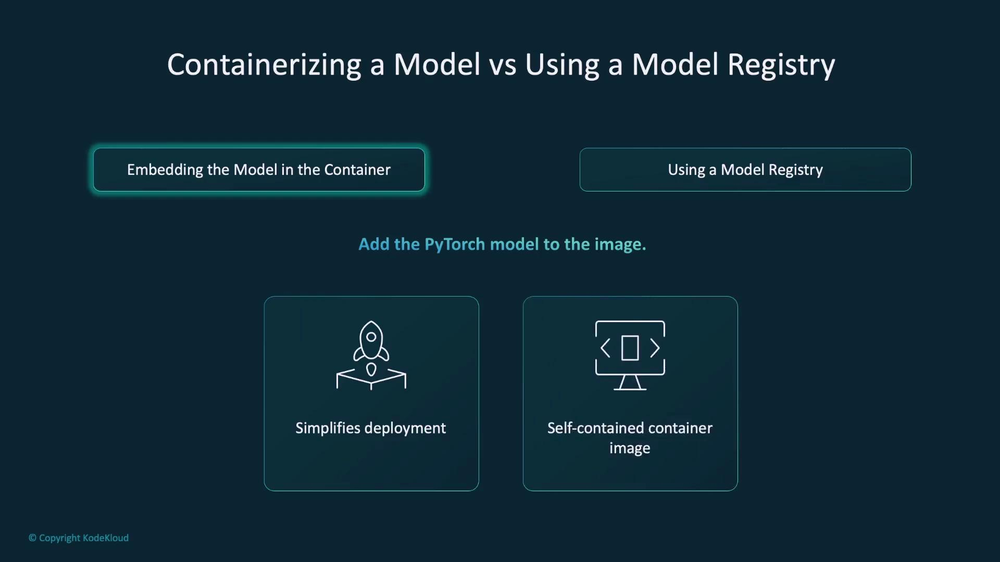
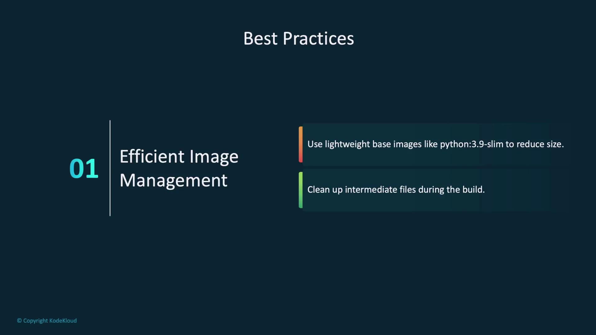
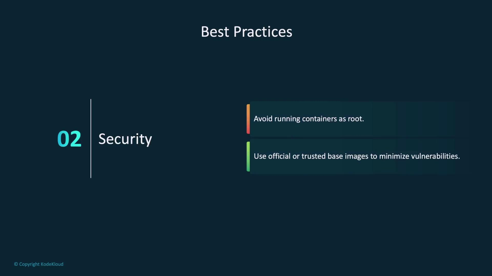
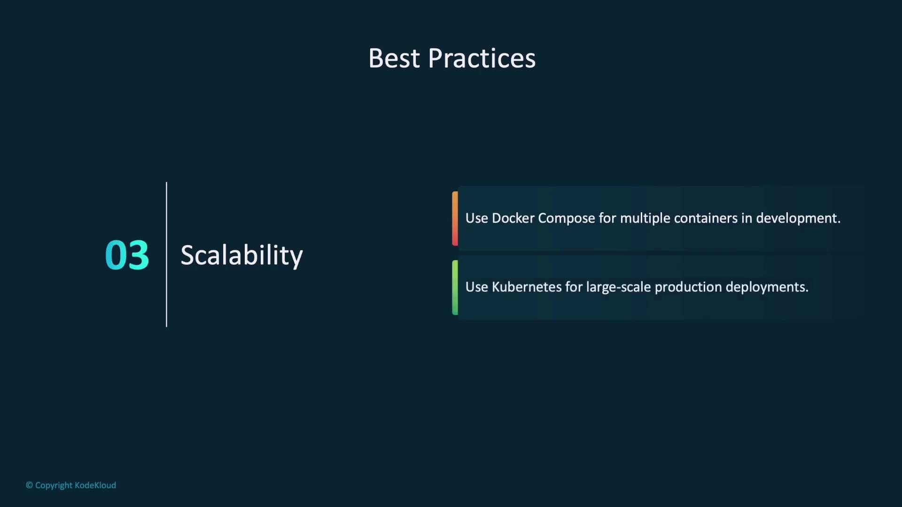
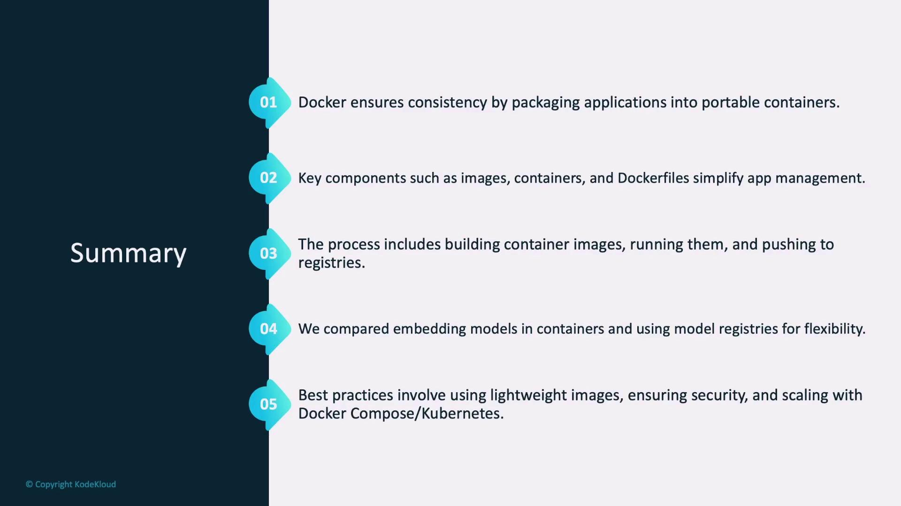
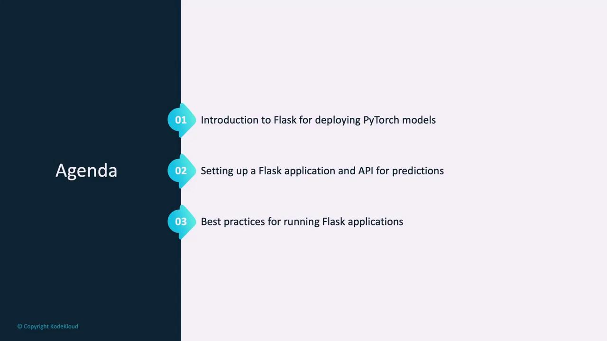
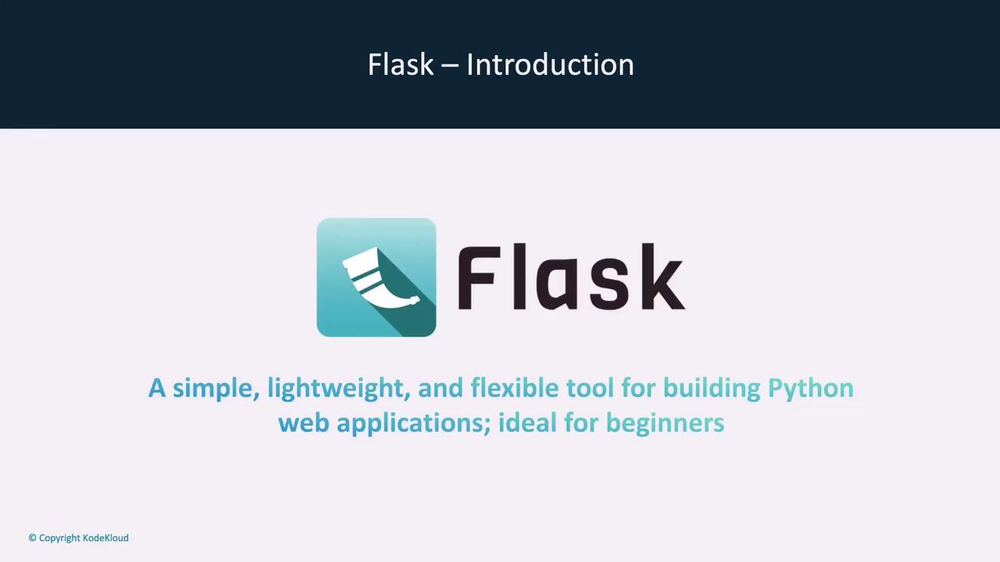
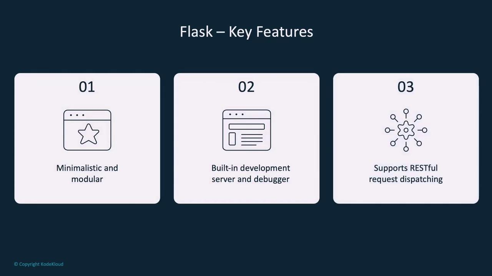
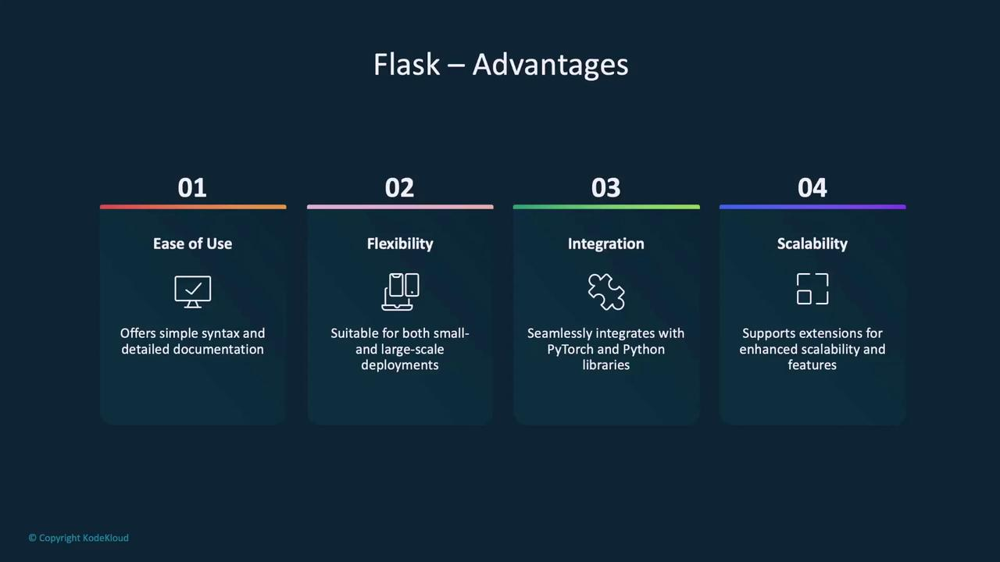

# Build docker image called flask-app
docker build -t flask-app .
```

The dot indicates that the current directory serves as the build context, including the Dockerfile and any other required files.

To run the container and map the container's port 5000 to the host's port 5000, execute:

```shell theme={null}
# Run container from image
docker run -p 5000:5000 flask-app

# List available images
docker image ls
```

The `docker run` command creates and starts a container, while `docker image ls` lists all available Docker images.

Images can then be pushed to a registry for production deployment or team collaboration. When using Docker Hub, the workflow typically follows this sequence:

```shell theme={null}
# Tag the image
docker tag flask-app your-username/flask-app:latest

# Push to the registry
docker push your-username/flask-app:latest

# Pull the image
docker pull your-username/flask-app:latest

# Run the pulled image
docker run -p 5000:5000 your-username/flask-app:latest
```

For more information, see the [Docker Documentation](https://docs.docker.com/).

***

## Model Deployment Approaches

When deploying models with Docker, there are two popular approaches:

1. **Embedding the Model Directly into the Container**\
   The model is incorporated during the build process, simplifying deployment because every component is bundled together. However, this method can lead to larger container sizes and reduced flexibility for updating the model.

2. **Using a Model Registry**\
   The model is stored externally (e.g., on AWS S3, Google Cloud Storage, or managed via MLflow) and is downloaded at runtime. This reduces the container size and allows for easier updates without rebuilding the image.

<Frame>
  
</Frame>

Both approaches have their merits; your choice will depend on your specific deployment requirements.

***

## Best Practices for Docker Deployment

Adhering to best practices when deploying models or applications using Docker can significantly improve efficiency, security, and scalability:

* **Efficient Image Management:**\
  Use lightweight base images such as Python 3.9 Slim to reduce image size. Remove intermediate files during the build process to keep your images lean.

<Frame>
  
</Frame>

* **Security:**\
  Avoid running containers as the root user and opt for official or trusted base images to minimize vulnerabilities.

<Frame>
  
</Frame>

* **Scalability:**\
  Utilize tools like Docker Compose to manage multiple containers during development, and consider orchestration solutions such as Kubernetes for scaling production deployments.

<Frame>
  
</Frame>

Below is a summary table highlighting various Docker components along with usage examples:

| Component    | Purpose                                                     | Command/Example                     |
| ------------ | ----------------------------------------------------------- | ----------------------------------- |
| Dockerfile   | Defines steps to build a Docker image                       | `docker build -t flask-app .`       |
| Docker Image | A packaged snapshot of the application and its dependencies | `docker image ls`                   |
| Container    | A running instance of a Docker image                        | `docker run -p 5000:5000 flask-app` |

***

## Summary

In this article, we covered the essentials of Docker and its significance in model deployment. Key takeaways include:

* Docker facilitates packaging applications into portable containers, ensuring consistency and reliability across diverse environments.
* The Docker architecture comprises vital components such as the Docker Engine, images, containers, and Dockerfiles.
* Containerization involves writing a Dockerfile, building an image, and running a container, with the option to push the image to a registry.
* Two primary approaches to model deployment with Docker include embedding the model directly into the container or leveraging an external model registry.
* Best practices for Docker deployment focus on maintaining lean images, ensuring security, and scaling effectively using tools like Docker Compose and Kubernetes.

<Frame>
  
</Frame>

By following these guidelines, you can enhance your model deployment process and fully harness the benefits of Docker for efficient, scalable, and secure application management. For more detailed information, refer to the [official Docker documentation](https://docs.docker.com/).

<CardGroup>
  <Card title="Watch Video" icon="video" href="https://learn.kodekloud.[AWS_SECRET_ACCESS_KEY]-845c-4cdf-9261-7688050bd96c/lesson/c686a7f3-2e4b-4c36-a212-dc9b95354760" />
</CardGroup>


# Introduction to Flask

Source: https://notes.kodekloud.com/docs/PyTorch/Model-Deployment-and-Inference/Introduction-to-Flask/page

This guide explores deploying PyTorch models using Flask, covering setup, integration, and best practices for creating an inference API.

In this guide, we explore how to deploy PyTorch models using Flask—a lightweight Python web framework that seamlessly transforms research code into accessible, production-ready services. You’ll learn what Flask is, why it’s an excellent choice for deployment, and how to set up a basic Flask application that loads a trained PyTorch model and creates an inference API endpoint.

<Frame>
  
</Frame>

Let's dive in.

Flask is a simple, lightweight, and flexible web framework that makes building Python web applications fast and modular. Its minimalistic approach means you only add the functionality you require, which keeps projects well-organized and scalable—ideal for both beginners and more complex applications.

<Frame>
  
</Frame>

Flask comes equipped with a built-in development server and debugger, along with robust support for creating RESTful APIs. These features make it perfectly suited for deploying machine learning models where quick testing and clear error reporting are critical.

<Frame>
  
</Frame>

With its clarity, comprehensive documentation, and seamless integration with PyTorch, Flask is a top choice for deploying machine learning services. Although it is not designed for high-performance computing out-of-the-box, its stability and ease of use make it a robust choice for a wide range of applications.

<Frame>
  
</Frame>

## Installing Flask

To start using Flask, install it via pip. Open your terminal and run the following command:

```bash theme={null}
