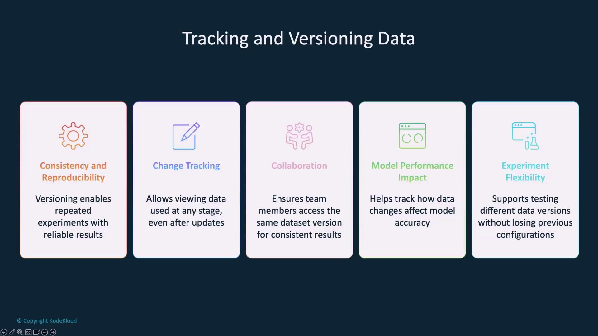
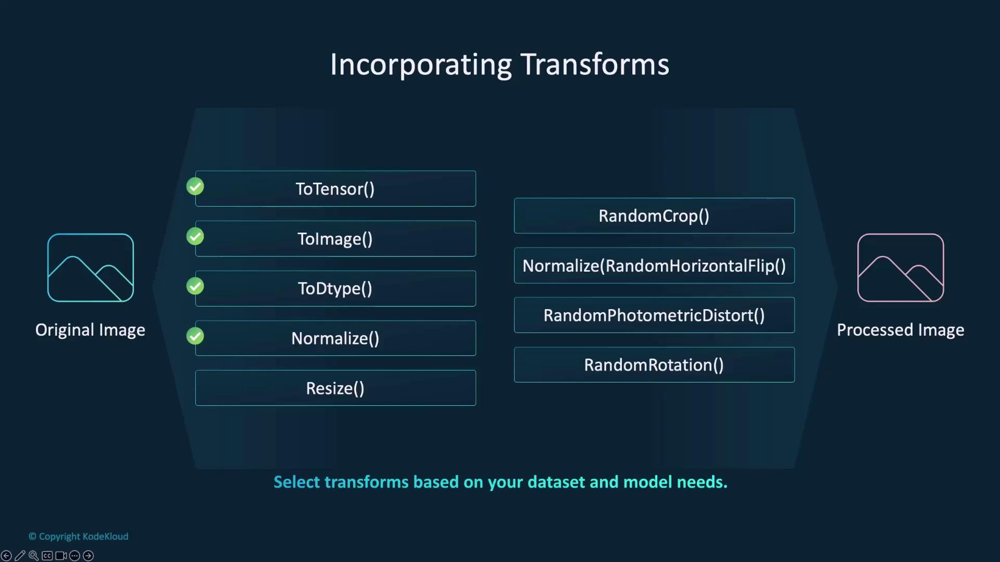
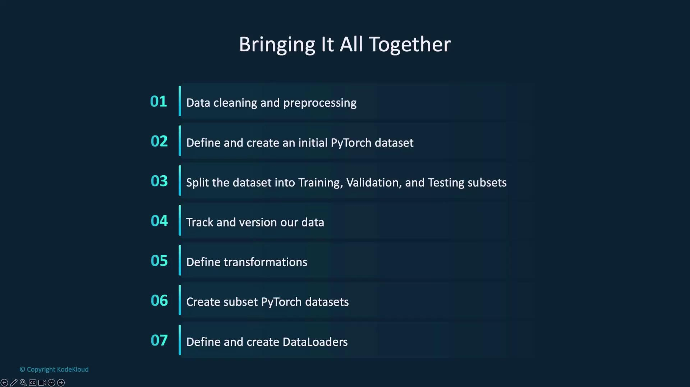
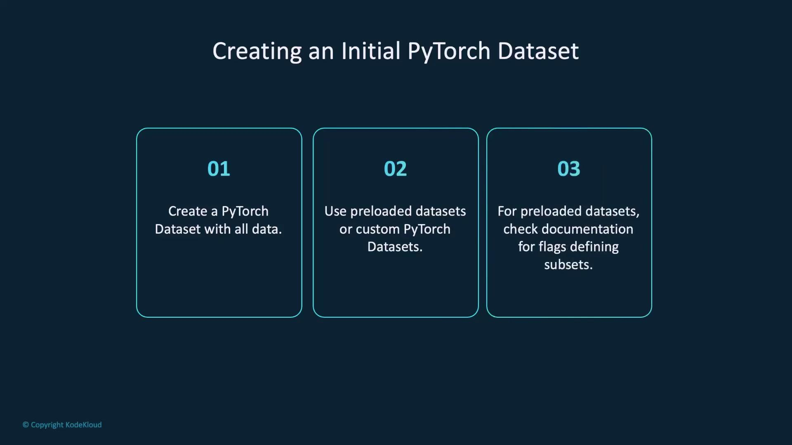
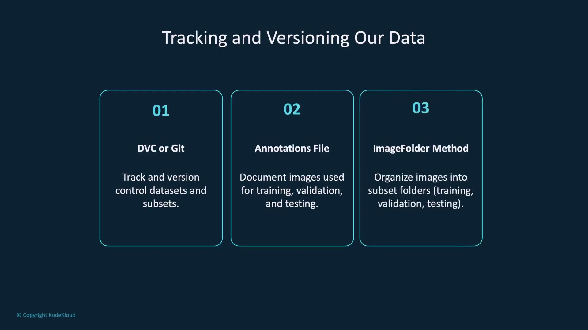
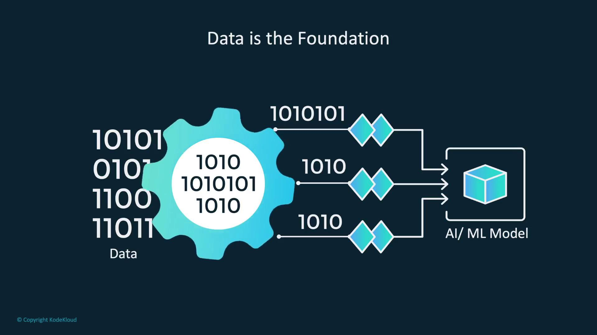
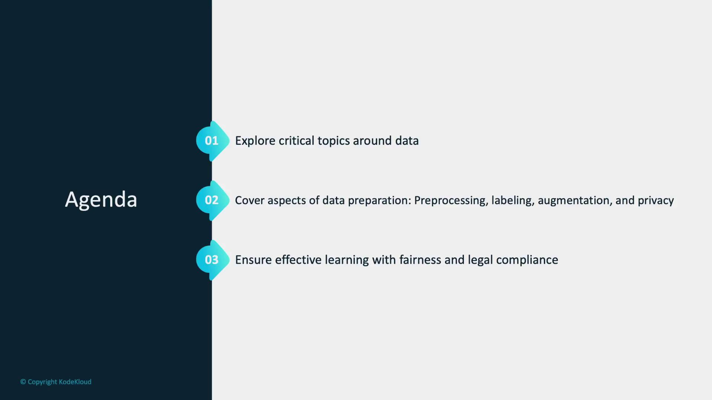
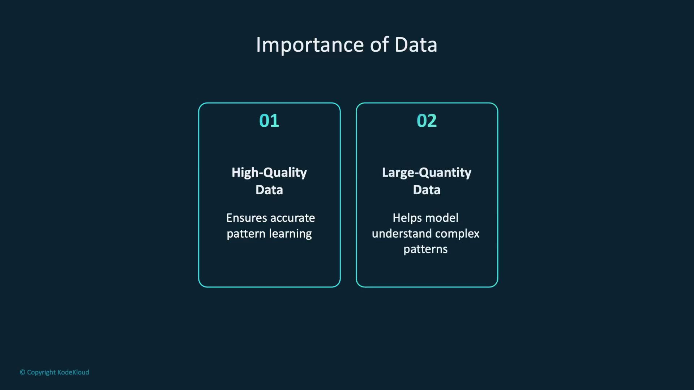
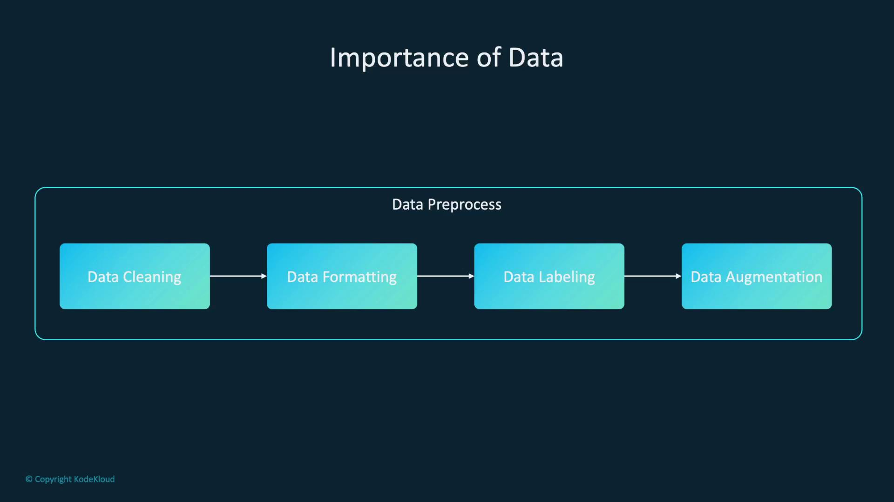

# Calculate sizes for training, validation, and testing sets
train_size = int(0.7 * len(dataset))
val_size = int(0.15 * len(dataset))
test_size = len(dataset) - train_size - val_size

# Randomly split the dataset
train_dataset, val_dataset, test_dataset = random_split(dataset, [train_size, val_size, test_size])
```

<Callout icon="lightbulb">
  Keep in mind that `RandomSplit` produces different splits every time it is executed. For reproducible results, manage data tracking and versioning separately.
</Callout>

## Dataset Versioning

Versioning is vital for ensuring reproducibility in model training. By recording the exact data used (for example, via a CSV annotations file), you can easily reproduce and verify your experiments—even if the underlying dataset changes. Tools like [DVC](https://dvc.org/) or [Git](https://git-scm.com/) are commonly used for this purpose.

<Frame>
  
</Frame>

## Data Cleaning and Preprocessing

Before training your image classification model, cleaning and preprocessing the data is key. Data cleaning removes duplicate, blurry, or irrelevant images that could confuse the model, while preprocessing standardizes the data by resizing images and normalizing pixel values.

Important transformations for image classification include:

* **Conversion to tensor** using `ToTensor()`
* **Normalization** for consistent pixel value ranges

Additional augmentations such as random cropping, horizontal flipping, and rotations can help increase data diversity. However, choose augmentations that suit the real-world images your model is expected to process.

<Frame>
  
</Frame>

## Creating a PyTorch Dataset

PyTorch supports both preloaded and custom datasets. For example, if you’re using a preloaded dataset like CIFAR10, make sure to review its documentation for details on subset flags. Here’s how you can set up CIFAR10 with basic transformations:

```python theme={null}
import torchvision
import torchvision.transforms as transforms

# Define transformation: convert image to tensor and normalize pixel values
transform = transforms.Compose([
    transforms.ToTensor(),
    transforms.Normalize((0.5, 0.5, 0.5), (0.5, 0.5, 0.5))
])

# CIFAR10 Training set
trainset = torchvision.datasets.CIFAR10(root='./data', train=True, download=True, transform=transform)

# CIFAR10 Testing set
testset = torchvision.datasets.CIFAR10(root='./data', train=False, download=True, transform=transform)
```

Once your dataset is cleaned and prepared, you can apply the previously described data splitting technique using `RandomSplit`.

## Data Versioning and Tracking Approaches

Documenting your data is crucial. You have a couple of approaches:

1. **Annotations File**\
   Use an annotations file to record each image's path along with its corresponding label:

   ```text theme={null}
   image, label
   img1.jpg, class1
   img2.jpg, class1
   ...
   img3.jpg, class2
   ```

2. **Folder Organization**\
   Organize your dataset into folders for training, validation, and testing, with subfolders for each class label:

   ```text theme={null}
   dataset/
   ├── train/
   │   ├── class1/
   │   │   ├── img1.jpg
   │   │   └── ...
   │   └── class2/
   │       ├── img1.jpg
   │       └── ...
   ├── valid/
   │   ├── class1/
   │   │   ├── img1.jpg
   │   │   └── ...
   │   └── class2/
   │       ├── img1.jpg
   │       └── ...
   └── test/
       ├── class1/
       │   ├── img1.jpg
       │   └── ...
       └── class2/
           ├── img1.jpg
           └── ...
   ```

<Callout icon="lightbulb">
  Using an annotations file offers flexibility, as it allows managing datasets without loading all images into memory at once.
</Callout>

## Data Transformations

Different subsets of your dataset may require unique transformations. Training transforms often include data augmentations, while validation and testing transforms remain minimal for consistency.

### Training Transformation

```python theme={null}
from torchvision import transforms

train_transform = transforms.Compose([
    transforms.Resize((128, 128)),          # Resize to a fixed size
    transforms.RandomHorizontalFlip(),      # Randomly flip images horizontally
    transforms.ToTensor(),                  # Convert image to tensor
    transforms.Normalize(mean=[0.485, 0.456, 0.406],
                         std=[0.229, 0.224, 0.225])  # Normalize pixel values
])
```

### Validation Transformation

```python theme={null}
from torchvision import transforms

val_transform = transforms.Compose([
    transforms.Resize((128, 128)),          # Resize to a fixed size
    transforms.ToTensor(),                  # Convert image to tensor
    transforms.Normalize(mean=[0.485, 0.456, 0.406],
                         std=[0.229, 0.224, 0.225])  # Normalize pixel values
])
```

After defining these transformations, you can create custom datasets that apply them as needed:

```python theme={null}
# Training Dataset
train_dataset = CustomDataset(
    annotations_file='train_labels.csv',
    transform=train_transform
)

# Validation Dataset
val_dataset = CustomDataset(
    annotations_file='val_labels.csv',
    transform=val_transform
)
```

## Creating DataLoaders

DataLoaders are essential for batching and efficiently feeding data into your model during training and evaluation. Below is an example of how to create DataLoaders for your custom datasets:

```python theme={null}
import torch

# Training DataLoader
train_loader = torch.utils.data.DataLoader(train_dataset, batch_size=64,
                                           shuffle=True, num_workers=2)

# Validation DataLoader
val_loader = torch.utils.data.DataLoader(val_dataset, batch_size=32,
                                         shuffle=True, num_workers=1)
```

## Summary

This lesson covered essential topics for effective data preparation in PyTorch:

* **Data Splitting**: Using `RandomSplit` to create balanced training, validation, and testing subsets.
* **Data Cleaning and Preprocessing**: Ensuring image quality and consistency through cleaning, resizing, and normalization.
* **Dataset Versioning**: Tracking data with annotations files or organized folder structures for reproducibility.
* **Data Transformations**: Customizing training and validation pipelines to include the necessary augmentations.
* **Creating DataLoaders**: Efficiently batching and feeding data during model training.

<Frame>
  
</Frame>

Additionally, documenting your data—using either annotations files or a structured folder layout—ensures transparent and reproducible experiments.

<Frame>
  
</Frame>

Finally, tracking and versioning are emphasized so that you can reliably reproduce your experiments:

<Frame>
  
</Frame>

In the next demonstration, we will integrate these data preparation techniques into a complete workflow for PyTorch model training.

<CardGroup>
  <Card title="Watch Video" icon="video" href="https://learn.kodekloud.com/user/courses/pytorch/module/f9d4b50b-328e-4cf7-a22a-3b236bf0abcd/lesson/38c436af-6837-416e-8195-f4a5342ef66f" />
</CardGroup>


# Data Overview

Source: https://notes.kodekloud.com/docs/PyTorch/Working-with-Data/Data-Overview/page

This article explores data preparation for AI and ML models, covering preprocessing, labeling, augmentation, and privacy management to ensure effective learning and fairness.

Data is the foundation of any successful AI and ML model. The quality, quantity, and ethical management of your data greatly impact the performance and fairness of your models.

<Frame>
  
</Frame>

In this article, we explore essential topics related to data preparation. We cover preprocessing, labeling, augmentation, and privacy management—key steps that ensure your model learns effectively while adhering to legal and ethical standards.

<Frame>
  
</Frame>

Data is the cornerstone for model learning. Think of it as the collection of experiences from which an AI system draws knowledge. High-quality data enables models to capture accurate patterns, while poor-quality data can lead to unreliable outcomes. In addition, having a substantial amount of diverse data empowers your model to understand complex patterns and generalize well.

<Frame>
  
</Frame>

A robust dataset should undergo thorough preprocessing:

* Clean the data by removing errors and duplicates.
* Format the data appropriately for the model.
* Label the data to provide clear guidance during training.
* Augment the data to enhance its diversity and robustness.

<Frame>
  
</Frame>

By prioritizing data quality, quantity, and thorough preparation, you set a strong foundation for successful model building. Ensuring accurate, consistent, and complete data helps the model learn and perform better.

<Frame>
  
</Frame>

For instance, if the dataset overwhelmingly contains images of cats with few dog images, the model may perform well on cats but struggle with dogs. To avoid this imbalance, ensure even representation across classes. Managing large and diverse datasets is streamlined by using PyTorch's DataLoader:

```python theme={null}
