# Create a DataLoader object with a batch size of 32
dataLoader = DataLoader(dataset, batch_size=32, shuffle=True)
```

<Callout icon="lightbulb">
  We will cover DataLoaders in more detail in the upcoming section.
</Callout>

## Data Preprocessing

Data preprocessing is critical for model training. It begins with cleaning—removing duplicates and addressing outliers that could mislead the model.

<Frame>
  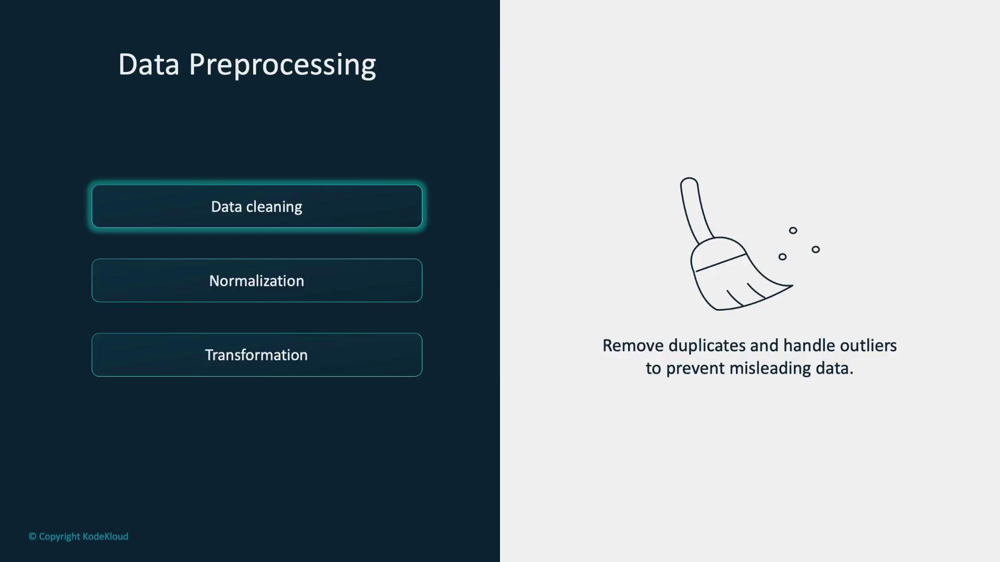
</Frame>

Next, normalization scales data features to similar ranges. This improvement helps the model learn efficiently and converge faster. Transformations convert raw data into a format that models can interpret—often transforming images or text into numerical tensors using libraries like TorchVision. The code below demonstrates how to resize images, convert them to tensors, and normalize their pixel values:

```python theme={null}
# Transformations for image preprocessing
transform = transforms.Compose([
    transforms.Resize((256, 256)),  # Resize images to 256x256 pixels
    transforms.ToTensor(),          # Convert images to PyTorch tensors
    transforms.Normalize(mean=[0.485, 0.456, 0.406],  # Normalize images
                         std=[0.229, 0.224, 0.225])
])
```

Data augmentation further increases dataset diversity by applying transformations such as horizontal flips, rotations, or color adjustments. This technique is especially valuable when data is limited, as it enables the model to generalize better from an expanded set of examples.

<Frame>
  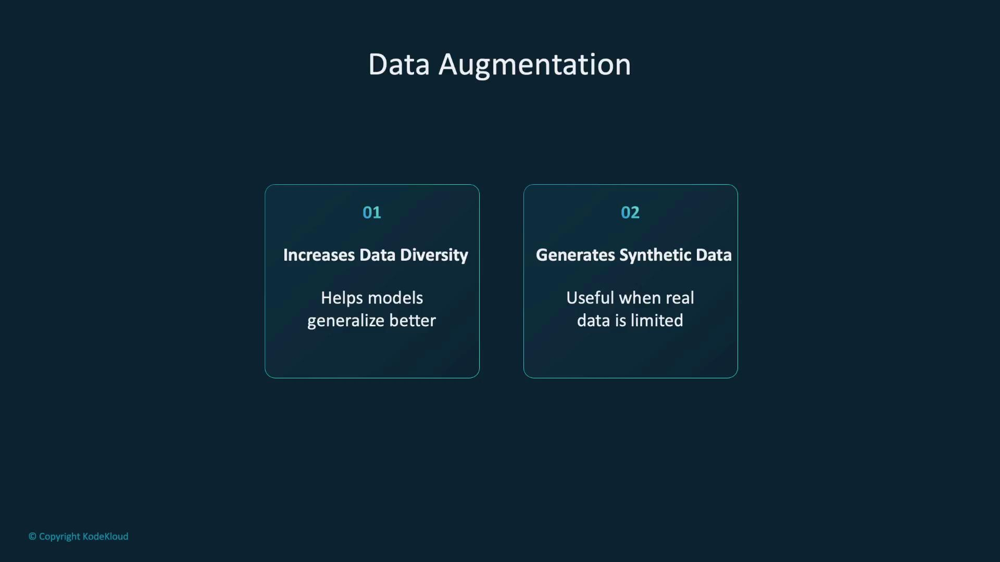
</Frame>

Using TorchVision's transforms, you can easily implement these augmentations. Consider the example below:

```python theme={null}
# Transformations for data augmentation
transform = transforms.Compose([
    transforms.RandomHorizontalFlip(p=0.5),  # Randomly flip images horizontally with a probability of 0.5
    transforms.RandomRotation(degrees=15),   # Randomly rotate images by up to 15 degrees
    transforms.ToTensor()                      # Convert images to PyTorch tensors
])
```

## Data Splitting and Labeling

Splitting your data into training, validation, and testing sets is essential for robust model performance. This approach helps prevent overfitting and ensures realistic evaluation of the model's performance.

<Frame>
  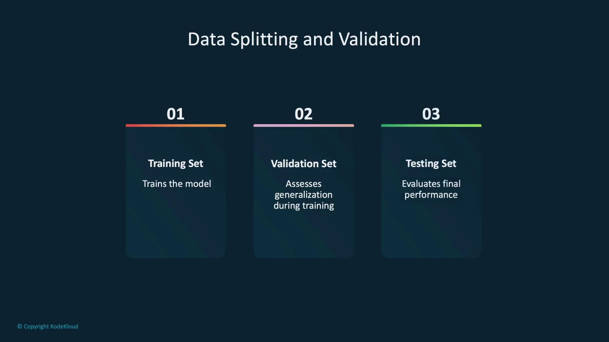
</Frame>

PyTorch’s utility, RandomSplit, allows you to partition your dataset easily:

```python theme={null}
# Split the full dataset into training, validation, and testing sets
train_data, val_data, test_data = random_split(full_data, [train_size, val_size, test_size])
```

Accurate data labeling is crucial in supervised learning, as correct labels guide the model's understanding of input-output relationships. Mislabeling can lead to flawed performance; therefore, ensuring consistent annotation is key.

<Frame>
  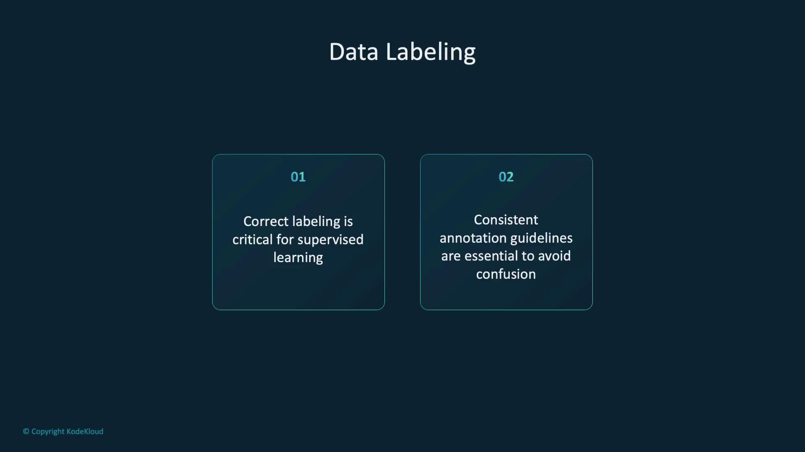
</Frame>

In PyTorch, custom dataset classes simplify the management of labeled data. The example below demonstrates how to instantiate a custom dataset from a CSV file:

```python theme={null}
# Instantiate a custom dataset from a CSV file
dataset = CustomDataset(csv_file='dataset.csv')
```

## Ethical Considerations: Fairness and Privacy

Bias in data can lead to models that exhibit unfair or discriminatory behaviors. To build equitable models, it is important to detect and correct these biases during data preparation.

<Callout icon="triangle-alert">
  When handling data, always prioritize protecting individuals' privacy by anonymizing personal information and securing sensitive data. Comply with regulations such as GDPR or HIPAA.
</Callout>

Responsible data usage involves obtaining consent, transparently communicating how data is used, and carefully assessing the societal impact of your models.

<Frame>
  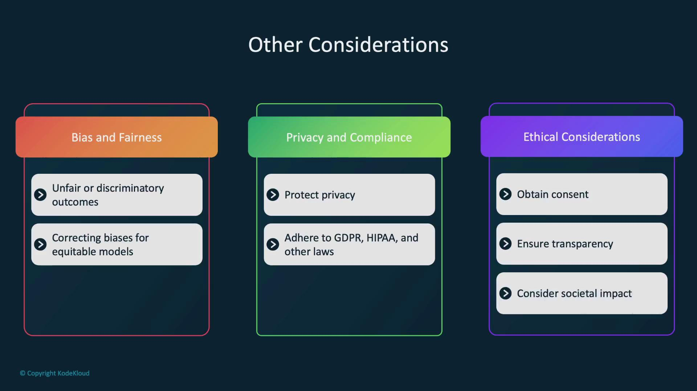
</Frame>

## Next Steps: Custom Datasets and PyTorch Data Handling

In the upcoming section, we will dive deeper into PyTorch by building custom datasets. We'll explore the Dataset and DataLoader classes and leverage TorchVision transforms for sophisticated preprocessing, standardization, and augmentation of image data.

<Frame>
  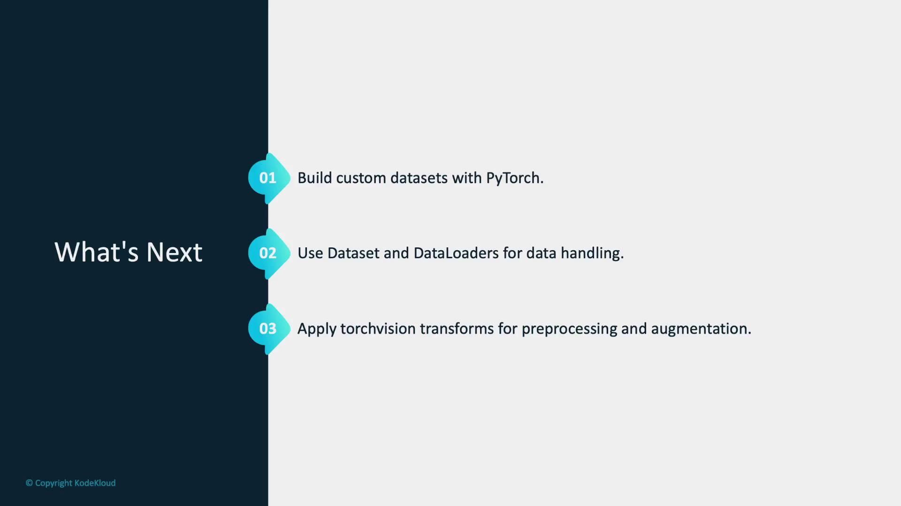
</Frame>

Let’s begin our exploration of PyTorch by working with datasets and data loaders to facilitate efficient and scalable model training.

<CardGroup>
  <Card title="Watch Video" icon="video" href="https://learn.kodekloud.[AWS_SECRET_ACCESS_KEY]-328e-4cf7-a22a-3b236bf0abcd/lesson/f572da68-13e3-41f5-a25a-26a3b000e4e1" />
</CardGroup>


# Datasets and Dataloaders

Source: https://notes.kodekloud.com/docs/PyTorch/Working-with-Data/Datasets-and-Dataloaders/page

This article explores how PyTorch’s Datasets and Dataloaders facilitate efficient data handling and loading for machine learning projects.

Data is the cornerstone of any machine learning or AI project. The quality and organization of your data have a direct impact on model performance. High-quality, well-organized data enables your model to learn meaningful patterns rather than noise, thereby enhancing its ability to generalize to new, unseen data.

In this lesson, we explore how PyTorch’s Datasets and Dataloaders provide powerful tools for efficient data handling and loading.

<Frame>
  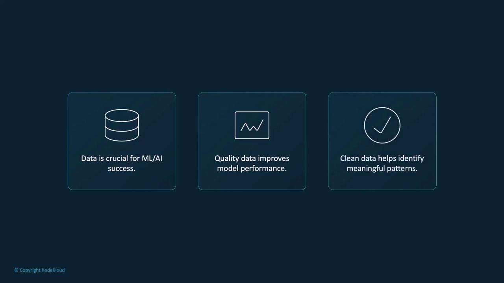
</Frame>

## Overview

In PyTorch, a **Dataset** represents your data (whether images, text, or any other forms), while a **Dataloader** wraps an iterable around the dataset, enabling efficient access to data samples. Together, they simplify tasks like batching, shuffling, and parallel data loading, thereby streamlining the training process.

<Frame>
  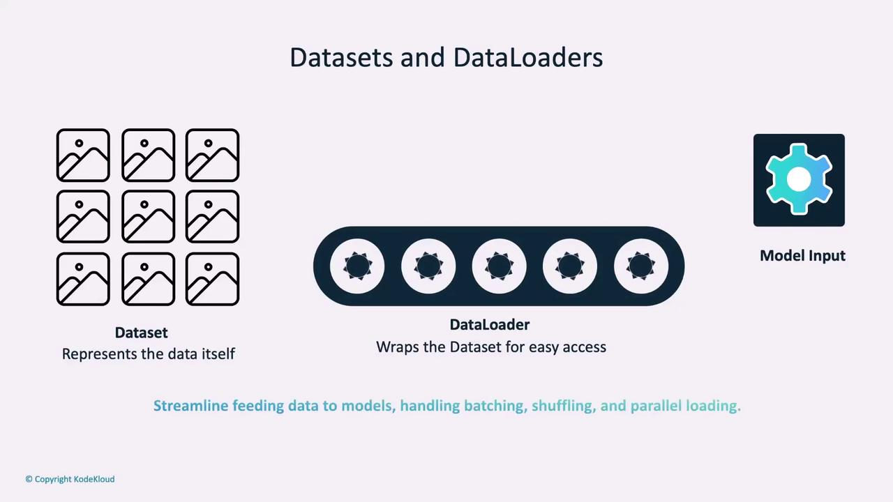
</Frame>

Efficient data access and processing patterns are key to improving training performance. Datasets and dataloaders not only abstract the data-handling process but also optimize the training loops.

<Frame>
  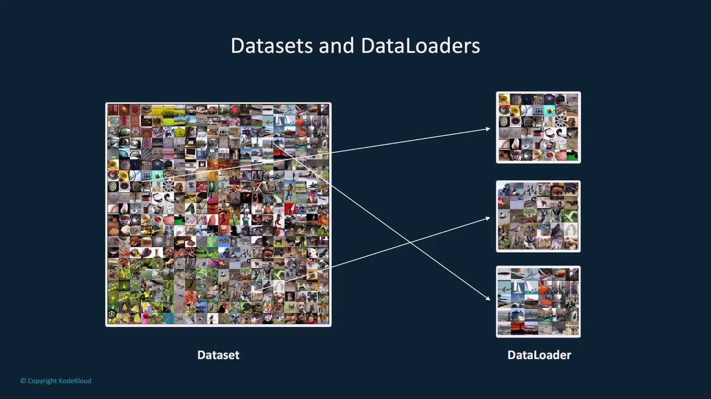
</Frame>

## PyTorch Datasets

Datasets in PyTorch are typically implemented using a Python class that serves as a blueprint for accessing and processing data samples. This approach allows you to customize data handling for various types of inputs.

<Frame>
  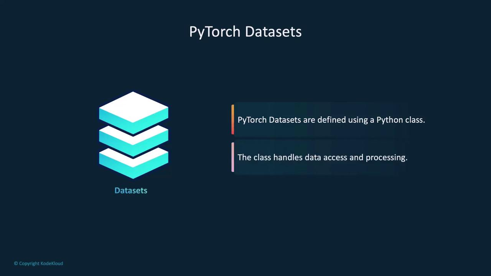
</Frame>

The **Dataset** class is built around three key methods:

* **`__init__`**: Initializes the dataset object. Here you define the dataset source (e.g., a local directory, annotation file) and specify any transformations to be applied.
* **`__len__`**: Returns the total number of samples in your dataset.
* **`__getitem__`**: Retrieves a specific data sample based on the index, supporting indexed access similar to Python lists or arrays.

<Frame>
  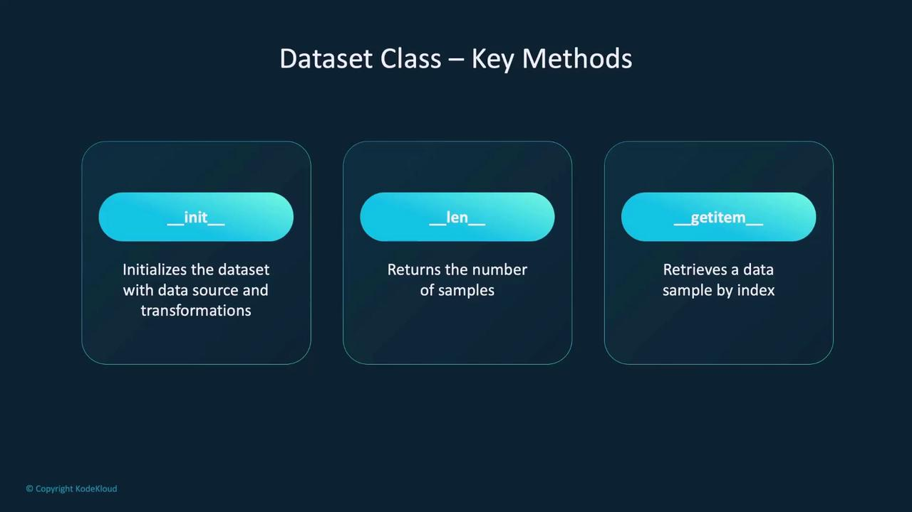
</Frame>

Below is an example showcasing a custom PyTorch dataset class called `CustomImageDataset`:

```python theme={null}
import os
import pandas as pd
from torchvision.io import read_image
from torch.utils.data import Dataset

class CustomImageDataset(Dataset):
    def __init__(self, annotations_file, img_dir, transform=None, target_transform=None):
        self.img_labels = pd.read_csv(annotations_file)
        self.img_dir = img_dir
        self.transform = transform
        self.target_transform = target_transform

    def __len__(self):
        return len(self.img_labels)

    def __getitem__(self, idx):
        img_path = os.path.join(self.img_dir, self.img_labels.iloc[idx, 0])
        image = read_image(img_path)
        label = self.img_labels.iloc[idx, 1]
        if self.transform:
            image = self.transform(image)
        if self.target_transform:
            label = self.target_transform(label)
        return image, label
```

In this example, the `__init__` method reads an annotation CSV file containing image filenames and labels. The image directory and optional transformations are stored for later use. The `__len__` method returns the number of samples, while `__getitem__` constructs the image path, reads the image into a tensor, applies the necessary transformations, and returns both image and label as a tuple.

There are two main categories of datasets in PyTorch:

1. **Preloaded Datasets:** Ready-to-use datasets provided by PyTorch for popular data sources.
2. **Custom Datasets:** Custom-built datasets tailored to your unique data requirements.

<Frame>
  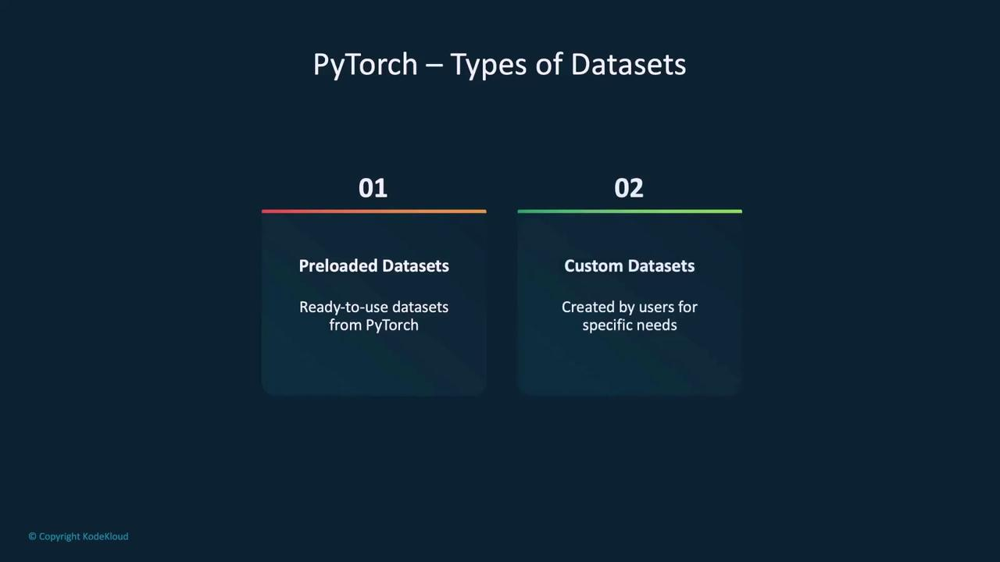
</Frame>

Understanding how to implement and utilize the Dataset class allows you to manage various data types while customizing data access and preprocessing techniques.

### Creating a Custom Dataset

Creating a custom dataset in PyTorch is straightforward. The flexibility offered by custom datasets lets you tailor data handling to your specific project requirements. Consider the following minimal example:

```python theme={null}
import torch
from torch.utils.data import Dataset

class CustomDataset(Dataset):
    def __init__(self):
        # Initialize data
        self.data = []  # Replace with your data loading logic

    def __len__(self):
        return len(self.data)

    def __getitem__(self, idx):
        sample = self.data[idx]
        return sample  # Return a data sample
```

In this simplified example, `__init__` loads your data, `__len__` returns the total number of samples, and `__getitem__` retrieves a sample based on its index.

Depending on your project, you might need to load different data types. Here are examples for images, text, and audio:

#### Loading Image Data

```python theme={null}
from PIL import Image
from torch.utils.data import Dataset

class ImageDataset(Dataset):
    def __init__(self, image_paths):
        self.image_paths = image_paths  # List of image file paths

    def __len__(self):
        return len(self.image_paths)

    def __getitem__(self, idx):
        image = Image.open(self.image_paths[idx])  # Open image file
        return image  # Return the image
```

#### Loading Text Data

```python theme={null}
from torch.utils.data import Dataset

class TextDataset(Dataset):
    def __init__(self, text_files):
        self.text_files = text_files  # List of text file paths

    def __len__(self):
        return len(self.text_files)

    def __getitem__(self, idx):
        with open(self.text_files[idx], 'r') as file:
            text = file.read()  # Read text file content
        return text  # Return the text data
```

#### Loading Audio Data

```python theme={null}
import torchaudio
from torch.utils.data import Dataset

class AudioDataset(Dataset):
    def __init__(self, audio_files):
        self.audio_files = audio_files  # List of audio file paths

    def __len__(self):
        return len(self.audio_files)

    def __getitem__(self, idx):
        waveform, sample_rate = torchaudio.load(self.audio_files[idx])  # Load audio file
        return waveform  # Return the audio data
```

## Preloaded Datasets in PyTorch

PyTorch includes a variety of preloaded datasets that are widely used in machine learning and AI tasks. These datasets are preprocessed and ready to use, saving you valuable time during experimentation. For instance, vision datasets are accessible via the TorchVision library, offering popular datasets like MNIST, CIFAR-10, and ImageNet.

<Frame>
  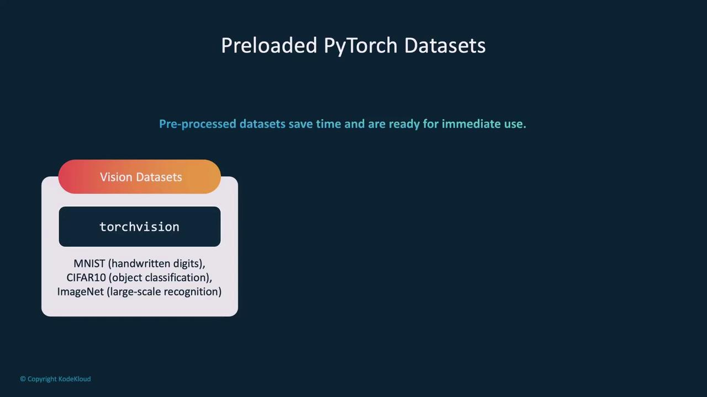
</Frame>

Text tasks benefit from the TorchText library, and audio processing tasks often leverage TorchAudio, both of which include several preloaded datasets.

### Example: Loading the MNIST Dataset

The MNIST dataset is a classic example in the machine learning community, containing 70,000 images of handwritten digits. Using TorchVision, loading MNIST is straightforward:

```python theme={null}
from torchvision import datasets

train_dataset = datasets.MNIST(root='data/', train=True, download=True)
print(train_dataset)
