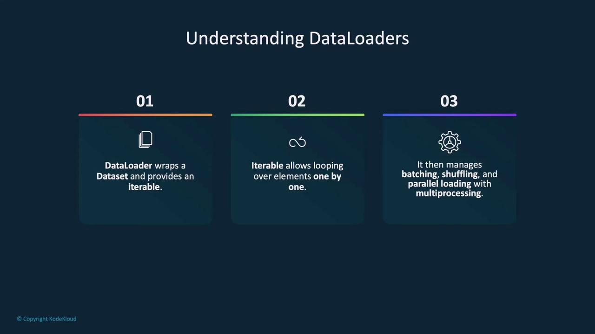
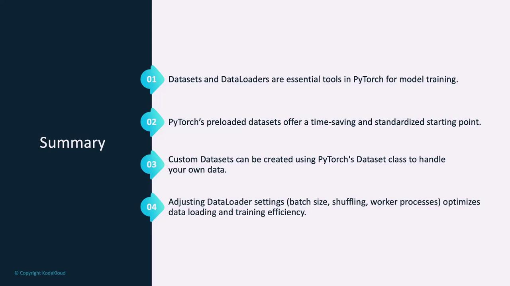

# Output:
# Dataset MNIST
#     Number of datapoints: 60000
#     Root location: data/
#     Split: Train
```

By setting `train=True`, you load the training set; similarly, switching to `train=False` provides the test set. Each sample in the dataset is a tuple consisting of a 28x28 grayscale image and its corresponding label (a digit between 0 and 9).

Accessing individual samples is as simple as:

```python theme={null}
image, label = train_dataset[0]
print(f'Label: {label}')
print(f'Image size: {image.size}')
```

This method of accessing data is consistent with both preloaded and custom datasets.

## Dataloaders in PyTorch

Dataloaders serve as an iterable wrapper around a dataset, making it easier to loop through data samples during training. They are especially useful for handling batching, shuffling, and parallel data loading using multiple workers.

<Frame>
  
</Frame>

When importing a Dataloader from `torch.utils.data`, you can configure key parameters:

* **batch\_size**: Specifies how many samples are loaded in each batch. Larger batches speed up training but require more memory.
* **shuffle**: If set to `True`, randomizes the order of data samples each epoch, which can improve model generalization.
* **num\_workers**: Determines the number of subprocesses to use for data loading. Increasing this number can boost data loading speed but consumes more CPU resources.

For example, creating a dataloader for the MNIST training dataset looks like this:

```python theme={null}
from torch.utils.data import DataLoader

train_loader = DataLoader(dataset=train_dataset,
                          batch_size=64,
                          shuffle=True,
                          num_workers=2)
```

<Callout icon="lightbulb">
  Remember to adjust the `batch_size` and `num_workers` parameters according to your hardware capabilities for optimal performance.
</Callout>

## Summary

Datasets and Dataloaders are fundamental building blocks in PyTorch that simplify data management for model training. Preloaded datasets provide a quick starting point for many applications, while custom datasets offer the flexibility needed for specialized data sources. By fine-tuning settings such as batch size, shuffling, and the number of worker processes, you can significantly optimize both data loading and the overall training process.

<Frame>
  
</Frame>

Now that you have a clear understanding of PyTorch's Datasets and Dataloaders, let's proceed to a demo to see these concepts in action.

<CardGroup>
  <Card title="Watch Video" icon="video" href="https://learn.kodekloud.[AWS_SECRET_ACCESS_KEY]-328e-4cf7-a22a-3b236bf0abcd/lesson/62df45f3-d356-4293-8462-2a7ec4878292" />
</CardGroup>


# Demo Building Data

Source: https://notes.kodekloud.com/docs/PyTorch/Working-with-Data/Demo-Building-Data/page

This article guides building and preprocessing a custom dataset for training machine learning models using PyTorch, covering data cleaning, annotation, and transformations.

In this lesson, we will guide you through building and preprocessing a custom dataset to train a machine learning model. Whether you are working with images, text, audio, or any other data modality, this step-by-step tutorial covers data cleaning, annotation creation, dataset splitting, versioning, applying transformations, and ultimately preparing PyTorch datasets along with DataLoaders.

***

## 1. Loading and Displaying the Dataset

First, we load the dataset and visualize the images to verify that they meet the training requirements.

<Callout icon="lightbulb">
  Viewing your dataset before training helps identify any images that do not belong to your target classes.
</Callout>

```python theme={null}
