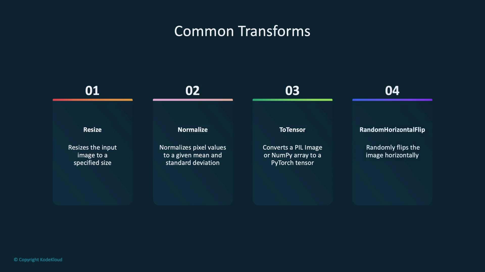
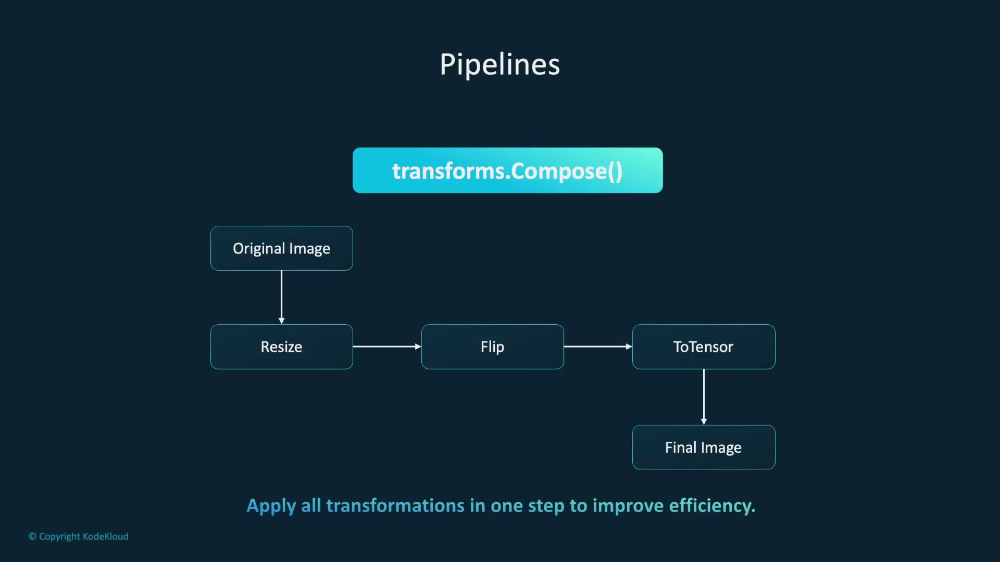
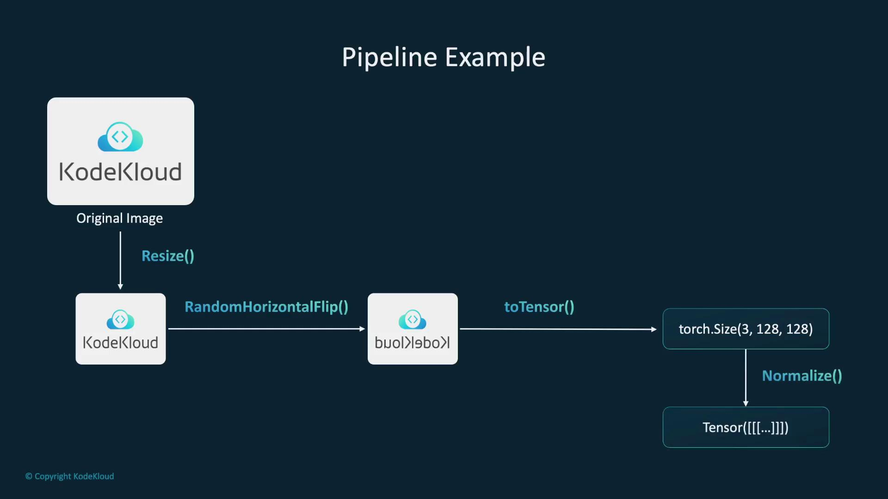
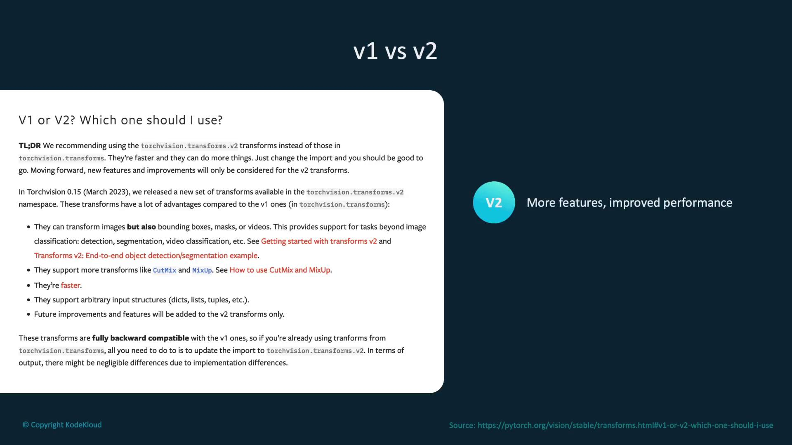
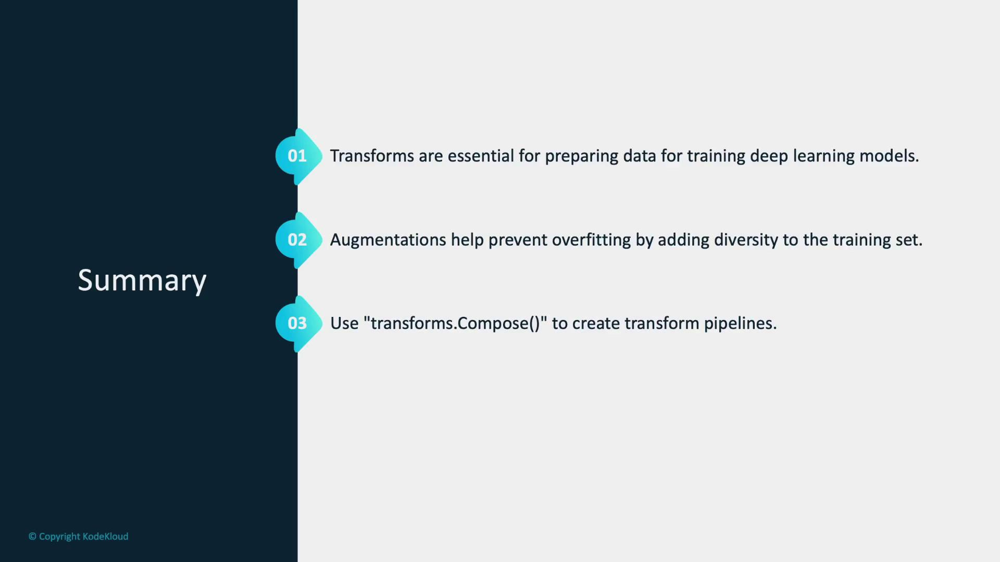

# Import transforms module from torchvision
from torchvision import transforms
```

Some common image transformations include:

* **Resize:** Adjust the dimensions of an image to a specific size.
* **Normalize:** Convert pixel intensity values to a standard scale that aids model training.
* **ToTensor:** Change images into tensors, the primary data structures used in PyTorch for numerical computations.
* **RandomHorizontalFlip:** Horizontally flip the image with a given probability to simulate different viewing angles.

<Callout icon="lightbulb">
  The diagram below summarizes these common image transformations. The details provided above are typically sufficient for implementation.
</Callout>

<Frame>
  
</Frame>

Let's examine these transformations in action.

## Resizing Images

The code below demonstrates how to use the Python Pillow library to load an image and then apply the PyTorch resize transformation to change its dimensions to 128x128 pixels:

```python theme={null}
from torchvision import transforms
from PIL import Image

# Load an image
image = Image.open('path_to_image.jpg')

# Resize the image to 128x128 pixels
resize_transform = transforms.Resize((128, 128))
resized_image = resize_transform(image)
```

Resizing ensures that all images in your dataset share consistent dimensions before training your model.

## Normalization and Random Horizontal Flip

Normalization adjusts pixel values, positioning them on a consistent scale, which in turn helps optimize model training. The following example normalizes an image tensor to a mean and standard deviation of 0.5. In addition, applying a random horizontal flip with a 50% probability introduces variation in image perspectives:

```python theme={null}
# Random Horizontal Flip with a 50% chance
random_flip_transform = transforms.RandomHorizontalFlip(p=0.5)
flipped_image = random_flip_transform(image)
```

Random horizontal flipping enriches the dataset by simulating different angles, which enhances the model’s ability to generalize.

## Creating a Transformation Pipeline

PyTorch allows you to combine multiple transformations into a single pipeline using the `transforms.Compose` class. This approach streamlines preprocessing by chaining operations such as resizing, flipping, converting to a tensor, and normalizing pixel values. The diagram below visually outlines this process:

<Frame>
  
</Frame>

Below is an example of how to create such a transformation pipeline:

```python theme={null}
# Pipeline using Compose
transform_pipeline = transforms.Compose([
    transforms.Resize((128, 128)),
    transforms.RandomHorizontalFlip(),
    transforms.ToTensor(),
    transforms.Normalize((0.5,), (0.5,))
])
```

This pipeline resizes the image to 128x128 pixels, applies a random horizontal flip, converts the image into a tensor, and then normalizes the pixel values.

<Callout icon="lightbulb">
  An additional diagram (if available) further clarifies the sequential data processing within this pipeline. The code and explanation above provide a comprehensive overview.
</Callout>

<Frame>
  
</Frame>

To apply the pipeline to an image, load the image using Python Pillow and then pass it through the transformation pipeline:

```python theme={null}
from PIL import Image
image = Image.open('path_to_image.jpg')

# Apply the pipeline to the image
transformed_image = transform_pipeline(image)
```

## Integrating Transformations with Datasets

Transformations can be directly integrated into dataset objects. For example, when using the preloaded MNIST dataset, you can integrate a transformation pipeline so that each image is preprocessed automatically during data loading:

```python theme={null}
from torchvision.datasets import MNIST

# Integrate the transformation pipeline into the dataset
dataset = MNIST(root='data', train=True, transform=transform_pipeline, download=True)
```

Each image accessed from this dataset undergoes consistent preprocessing, streamlining your workflow.

## Transitioning to the V2 API

Everything discussed so far is based on version 1 of the transformations API. PyTorch now recommends using the V2 API due to its enhanced features and improved performance. The V2 API is backward compatible with V1 and offers additional functionality and efficiency. Although a diagram may compare the two versions visually, the key takeaway is that V2 provides faster performance and more features while maintaining compatibility.

<Frame>
  
</Frame>

To use the V2 API, simply import the new module as shown below:

```python theme={null}
# V2 API Import
from torchvision.transforms import v2
```

We will explore the V2 API in greater detail in the demonstration section.

## Summary

Transformations are essential for preparing image data and augmenting it to improve model robustness. Techniques such as flipping and rotating images help prevent overfitting by offering diverse perspectives on the input data. Additionally, combining multiple transformations using `transforms.Compose` creates an efficient and organized preprocessing pipeline.

<Callout icon="lightbulb">
  While a summary diagram could provide a visual recap, the detailed discussion above comprehensively covers the importance and application of data transformations in deep learning workflows.
</Callout>

<Frame>
  
</Frame>

Integrating these transformations into the data loading process ensures that preprocessing is both seamless and efficient. With this understanding of image transformations in PyTorch, you are now ready to see these techniques in action in the upcoming demonstration.

<CardGroup>
  <Card title="Watch Video" icon="video" href="https://learn.kodekloud.com/user/courses/pytorch/module/f9d4b50b-328e-4cf7-a22a-3b236bf0abcd/lesson/5fd8231b-b241-4785-a397-ca229e3695c5" />
</CardGroup>


# Connect To Database Python

Source: https://notes.kodekloud.com/docs/Python-API-Development-with-FastAPI/Databases-with-Python/Connect-To-Database-Python/page

Learn to connect a Python application to a PostgreSQL database using psycopg2, covering connection setup, SQL execution, error handling, and retry mechanisms.

In this lesson, you'll learn how to connect a Python application to a PostgreSQL database using the psycopg2 library. We will cover setting up a connection, executing SQL commands, and handling connection errors gracefully. Additionally, you'll discover how to implement a retry mechanism if the initial connection fails.

The following Python code demonstrates how to import the library, establish a connection, and perform basic SQL operations:

```python theme={null}
import psycopg2
