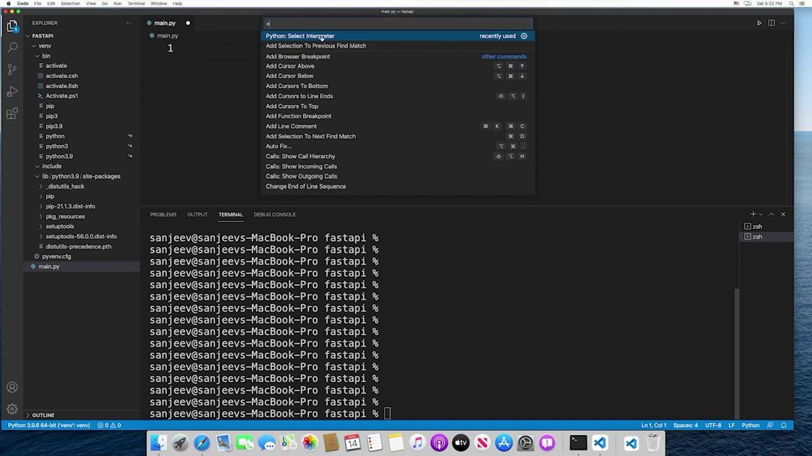

# Venv Mac

Source: https://notes.kodekloud.com/docs/Python-API-Development-with-FastAPI/Python-Setup/Venv-Mac/page

This article guides setting up a virtual environment on a Mac using Visual Studio Code for project dependency isolation.

In this lesson, we will guide you through setting up a virtual environment on a Mac using Visual Studio Code (VS Code). This setup is essential for isolating your project dependencies and ensuring consistency across your projects.

## Getting Started in VS Code

Begin by opening VS Code and loading the project folder that you created in a previous lesson. Then, open the integrated terminal by clicking the terminal icon or navigating to Terminal > New Terminal from the menu. The integrated terminal in VS Code starts in your project folder automatically, saving you from manually navigating there.

Below is an example of terminal usage outside of VS Code:

```plaintext theme={null}
Last login: Sat Aug 14 16:10:15 on ttys000
sanjeev@sanjeevs-MacBook-Pro ~ % ls
Desktop    Downloads    Movies    Pictures
Documents  Library      Music     Public
sanjeev@sanjeevs-MacBook-Pro ~ % cd Documents
sanjeev@sanjeevs-MacBook-Pro Documents % ls
fastapi  test
sanjeev@sanjeevs-MacBook-Pro Documents % cd fastapi
sanjeev@sanjeevs-MacBook-Pro fastapi %
```

<Callout icon="lightbulb">
  When using the VS Code integrated terminal, you will automatically be in your project folder, which simplifies your workflow.
</Callout>

For demonstration purposes, the presenter is using a virtual machine running macOS on a Windows system. Some minor glitches or differences in terminal behavior might occur, but it is highly recommended to use the VS Code terminal for a smoother experience.

## Creating a Virtual Environment

To create a virtual environment, run the following command using Python 3’s built-in venv module. Replace `<name>` with your preferred environment name. For consistency, many users choose the name "venv" across all projects.

```plaintext theme={null}
Last login: Sat Aug 14 16:10:15 on tty000
sanjeev@sanjeevs-MacBook-Pro ~ % ls
Desktop    Downloads    Movies    Pictures
Documents  Library      Music     Public
sanjeev@sanjeevs-MacBook-Pro Documents % ls
fastapi    test
sanjeev@sanjeevs-MacBook-Pro Documents % cd fastapi
sanjeev@sanjeevs-MacBook-Pro fastapi % python3 -m venv <name>
```

Using the name "venv" helps standardize your environment settings, and later you can add the "venv" folder to your GitIgnore file to prevent accidental commits of environment-specific files.

Here is the command using "venv" as the environment name:

```bash theme={null}
sanjeev@sanjeevs-MacBook-Pro ~ % cd Documents
sanjeev@sanjeevs-MacBook-Pro Documents % ls
sanjeev@sanjeevs-MacBook-Pro Documents % cd fastapi
sanjeev@sanjeevs-MacBook-Pro fastapi % python3 -m venv venv
```

After running this command, a folder named "venv" is created in your project directory. Inside that folder, you will find various files and a Python interpreter located in the "bin" directory, ensuring that your project uses an isolated Python environment.

## Switching the Python Interpreter in VS Code

To configure VS Code to use the Python interpreter from your virtual environment:

1. Open the Command Palette in VS Code.
2. Select "Python: Select Interpreter."
3. Choose "Enter interpreter path" and type the following:

   ```bash theme={null}
   ./venv/bin/python
   ```

After this, VS Code will display the interpreter from your local virtual environment. Although the Python version (e.g., 3.9.6) remains the same, package installations are now isolated to your project-specific environment.

## Activating the Virtual Environment in the Terminal

Even after selecting the interpreter in VS Code, the integrated terminal might still be using your global Python environment. To activate your virtual environment within the terminal, run:

```bash theme={null}
sanjeev@sanjeevs-MacBook-Pro ~/Documents % ls
Desktop    Downloads    Movies      Pictures
Documents  Library      Music       Public
sanjeev@sanjeevs-MacBook-Pro ~/Documents % cd fastapi
sanjeev@sanjeevs-MacBook-Pro ~/Documents/fastapi % python3 -m venv venv
sanjeev@sanjeevs-MacBook-Pro ~/Documents/fastapi % source venv/bin/activate
```

Once activated, your terminal prompt will be prefixed with the name of your virtual environment (e.g., "venv"). This indicates that any packages installed with pip will only be added to this isolated environment.

<Callout icon="lightbulb">
  You must reactivate your virtual environment each time you open a new terminal session or restart VS Code. If the interpreter reverts to the global version, simply reselect the appropriate interpreter via the Command Palette.
</Callout>

<Frame>
  
</Frame>

With your virtual environment correctly set up and activated, you are now ready to begin coding your project. This isolated environment ensures that installed packages do not interfere with global Python configurations, making your development process smoother and more efficient.

Happy coding!

<CardGroup>
  <Card title="Watch Video" icon="video" href="https://learn.kodekloud.com/user/courses/python-api-development-with-fastapi/module/441565b9-9f18-459f-9b0b-252b1caff7b1/lesson/2f38b7de-07cf-4fbd-a381-a05b13633e45" />
</CardGroup>
