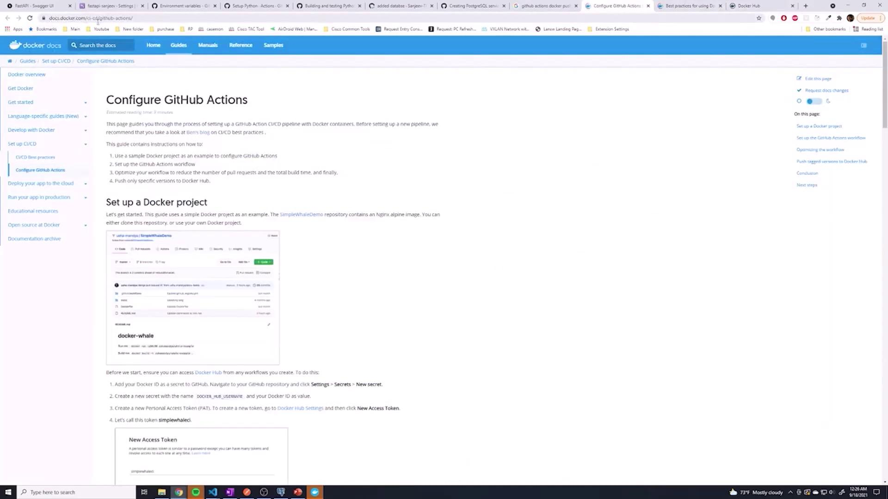
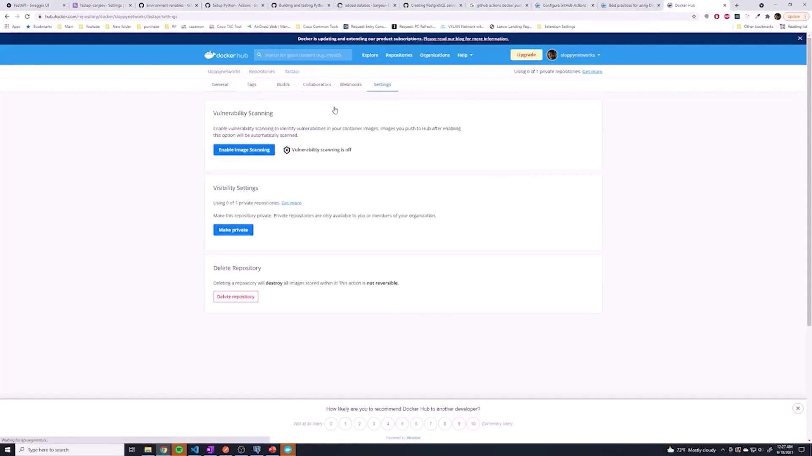
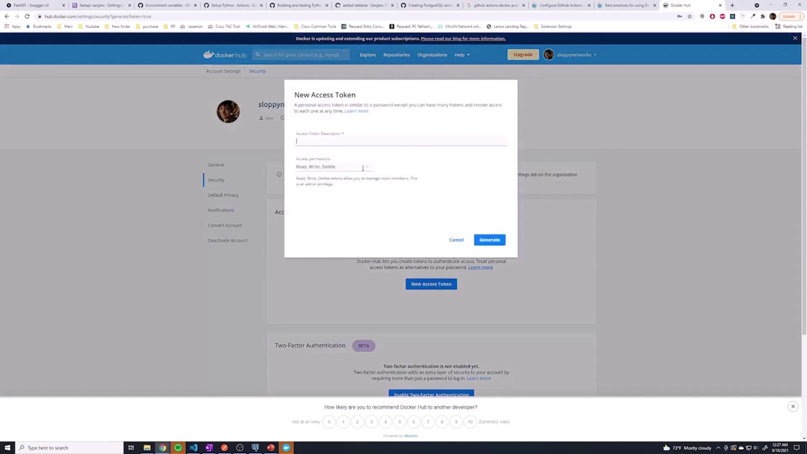
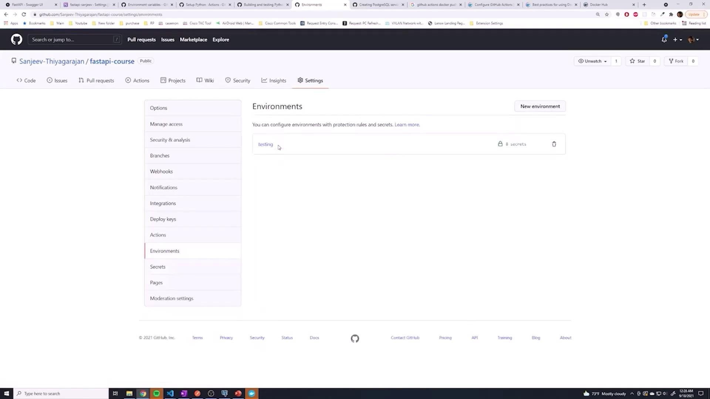
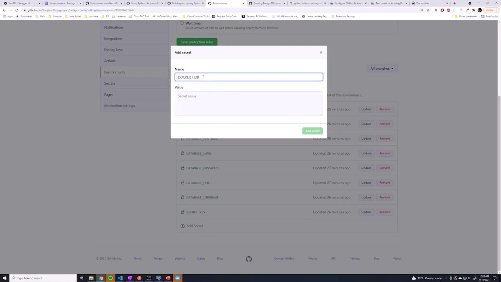
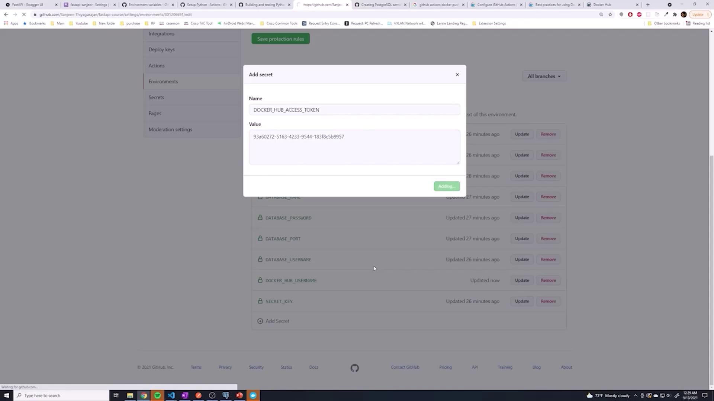
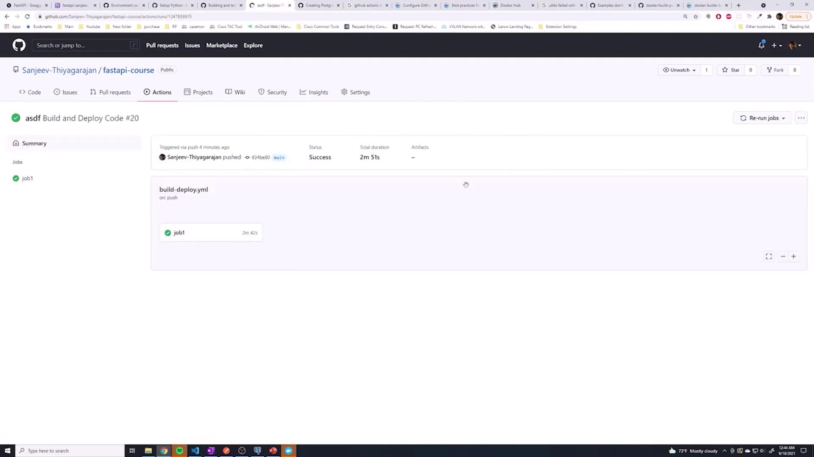

# Building Docker Images

Source: https://notes.kodekloud.com/docs/Python-API-Development-with-FastAPI/CICD/Building-Docker-Images/page

This guide explains how to create a Docker image in a CI runner and push it to Docker Hub.

In this guide, you will learn how to create a Docker image within your CI runner and push it to Docker Hub. This allows your production network to always pull the latest image. We will cover the entire process—from setting up your Docker Hub repository and generating an access token to configuring GitHub secrets and integrating Docker commands into your GitHub Actions workflow.

## CI Job Example

Below is a sample output from one of our CI jobs. It shows that pip was updated, dependencies were installed, and tests were executed using pytest:

```plaintext theme={null}
job1
succeeded 1 minute ago in 9s
* update pip
* install all dependencies
* test with pytest
Collecting pytest
  Downloading pytest-6.2.5-py3-none-any.whl (280 kB)
Collecting pluggy<1.0,>=0.12
  Downloading pluggy-0.13.1-py2.py3-none-any.whl (18 kB)
Collecting iniconfig
  Downloading iniconfig-1.1.1-py2.py3-none-any.whl (5.0 kB)
Collecting attrs>=19.2.0
  Downloading attrs-21.2.0-py2.py3-none-any.whl (57 kB)
Collecting pyparsing>=2.0.3
  Downloading pyparsing-2.4.7-py2.py3-none-any.whl (67 kB)
Installing collected packages: pyparsing, pluggy, iniconfig, attrs, pytest
Successfully installed attrs-21.2.0 iniconfig-1.1.1 packaging-21.0 pluggy-0.13.1 pytest-6.2.5
=============================================== short test summary info ================================================
tests/test_calculations.py .                                                                           [ 32%]
tests/test_posts.py .                                                                                   [ 71%]
tests/test_users.py .                                                                                   [ 85%]
tests/test_votes.py .                                                                                   [100%]
============================================= warnings summary ===============================================
..././..../opt/hostedtoolcache/Python/3.9.7/x64/lib/python3.9/site-packages/attrs/py.10
...
...
Docs: https://docs.pytest.org/en/stable/warnings.html
```

Once your tests pass, your production network is ready to pull the newly built image.

## Setting Up Your Docker Hub Repository

To integrate Docker with your GitHub Actions workflow, follow these steps:

1. Log into your [Docker Hub](https://hub.docker.com) account.
2. Click **Create repository**.
3. Choose a repository name that clearly reflects your project. For simplicity, set the repository to public.

To tag your local image for pushing to Docker Hub, use the following Docker command:

```bash theme={null}
docker tag local-image:tagname new-repo:tagname
```

<Callout icon="lightbulb">
  For further details, refer to the [Docker documentation on setting up GitHub Actions](https://docs.docker.com/).
</Callout>

## Generating an Access Token on Docker Hub

Next, generate an access token:

1. Navigate to your account settings (or "Security" under account settings).
2. Click **New Access Token** and follow the prompts.

The process might display pop-ups similar to these:

<Frame>
  
</Frame>

<Frame>
  
</Frame>

<Frame>
  
</Frame>

<Callout icon="triangle-alert">
  Remember: Once generated, copy the access token immediately. It will only be displayed once.
</Callout>

## Storing Credentials in GitHub Secrets

With your Docker Hub username and access token, take the following steps:

1. Store these credentials as secrets in GitHub (either as global repository secrets or within a specific environment, e.g., "testing").
2. Name them appropriately, for example, `DOCKER_HUB_USERNAME` and `DOCKER_HUB_ACCESS_TOKEN`.

The images below guide you through adding secrets in GitHub:

<Frame>
  
</Frame>

<Frame>
  
</Frame>

<Frame>
  
</Frame>

## Configuring GitHub Actions Workflow

Now that your credentials are securely stored, integrate Docker commands into your GitHub Actions workflow. Below is a sample workflow that logs in to Docker Hub, sets up Docker Buildx, and builds/pushes your image:

```yaml theme={null}
jobs:
  build:
    runs-on: ubuntu-latest
    steps:
      - name: Check Out Repo
        uses: actions/checkout@v2

      - name: Login to Docker Hub
        uses: docker/login-action@v1
        with:
          username: ${{ secrets.DOCKER_HUB_USERNAME }}
          password: ${{ secrets.DOCKER_HUB_ACCESS_TOKEN }}

      - name: Set Up Docker Buildx
        id: buildx
        uses: docker/setup-buildx-action@v1

      - name: Build and Push
        id: docker_build
        uses: docker/build-push-action@v2
        with:
          context: .
          file: ./Dockerfile
          builder: ${{ steps.buildx.outputs.name }}
          push: true
          tags: ${{ secrets.DOCKER_HUB_USERNAME }}/fastapi:latest
          cache-from: type=local,src=/tmp/.buildx-cache
          cache-to: type=local,dest=/tmp/.buildx-cache

      - name: Image Digest
        run: echo ${{ steps.docker_build.outputs.digest }}
```

In this workflow:

* The repository is checked out.
* Docker Hub is authenticated using your GitHub secrets.
* The **Docker Buildx** action is configured as the builder.
* The Docker image is built using the context (current directory) and the specified Dockerfile and then pushed to Docker Hub.
* The image digest is printed for verification.

## Example: Integrating Environment Variables and Services

If your project requires additional environment variables (like a Postgres service), you can include them as follows:

```yaml theme={null}
DATABASE_PASSWORD: ${{ secrets.DATABASE_PASSWORD }}
DATABASE_NAME: ${{ secrets.DATABASE_NAME }}
DATABASE_USERNAME: ${{ secrets.DATABASE_USERNAME }}
SECRET_KEY: ${{ secrets.SECRET_KEY }}
ALGORITHM: ${{ secrets.ALGORITHM }}
ACCESS_TOKEN_EXPIRE_MINUTES: ${{ secrets.ACCESS_TOKEN_EXPIRE_MINUTES }}

services:
  postgres:
    image: postgres
    env:
      DATABASE_PASSWORD: ${{ secrets.DATABASE_PASSWORD }}
```

You can also incorporate Docker Hub login and build steps in your testing workflow:

```yaml theme={null}
jobs:
  build:
    steps:
      - name: Set Up Python
        uses: actions/setup-python@v2
        with:
          python-version: "3.9"

      - name: Update pip
        run: python -m pip install --upgrade pip

      - name: Install All Dependencies
        run: pip install -r requirements.txt

      - name: Test with pytest
        run: |
          pip install pytest
          pytest

      - name: Login to Docker Hub
        uses: docker/login-action@v1
        with:
          username: ${{ secrets.DOCKER_HUB_USERNAME }}
          password: ${{ secrets.DOCKER_HUB_ACCESS_TOKEN }}

      - name: Set Up Docker Buildx
        id: buildx
        uses: docker/setup-buildx-action@v1

      - name: Build and Push Image
        id: docker_build
        uses: docker/build-push-action@v2
        with:
          context: ./
          file: ./Dockerfile
          builder: ${{ steps.buildx.outputs.name }}
          push: true
          tags: ${{ secrets.DOCKER_HUB_USERNAME }}/fastapi:latest

      - name: Display Image Digest
        run: echo ${{ steps.docker_build.outputs.digest }}
```

<Callout icon="lightbulb">
  Ensure each step in your workflow contains either `uses` or `run`. Combining both in a single step can lead to YAML syntax errors.
</Callout>

## Handling Buildx Issues

If you encounter an error—such as one related to unsupported cache export on the default Docker driver—try switching to a different driver with this command:

```bash theme={null}
docker buildx create --use
```

Make sure Buildx is set up before calling the build and push actions.

## Creating a Dockerfile

If your repository does not yet include a Dockerfile, create one at the project root (named with a capital D). Here’s a simple example:

```Dockerfile theme={null}
FROM python:3.9.7
WORKDIR /usr/src/app
COPY requirements.txt ./
RUN pip install --no-cache-dir -r requirements.txt
COPY .
CMD ["uvicorn", "app.main:app", "--host", "0.0.0.0", "--port", "8000"]
```

After creating your Dockerfile, commit your changes using:

```bash theme={null}
git add --all
git commit -m "added docker"
```

Then push your changes to the repository to trigger the CI/CD pipeline. You can verify a successful push by checking Docker Hub or reviewing your GitHub Actions log output.

<Frame>
  
</Frame>

## Continuous Delivery

Once your CI/CD pipeline successfully pushes the image to Docker Hub, you can extend the workflow to continuously deliver your application. Use additional `docker push` commands to deploy to production. If Docker is not part of your production environment, consider commenting out or removing the Docker steps to conserve build minutes.

With this setup, your GitHub Actions workflow manages both testing and the Docker build/push process—a critical part of your CI/CD pipeline.

Happy coding!

<CardGroup>
  <Card title="Watch Video" icon="video" href="https://learn.kodekloud.com/user/courses/python-api-development-with-fastapi/module/4979410a-af57-460b-8f71-5a177fa10d2d/lesson/cc3b74db-9940-4ea6-a21e-d82b95ae78a5" />
</CardGroup>
