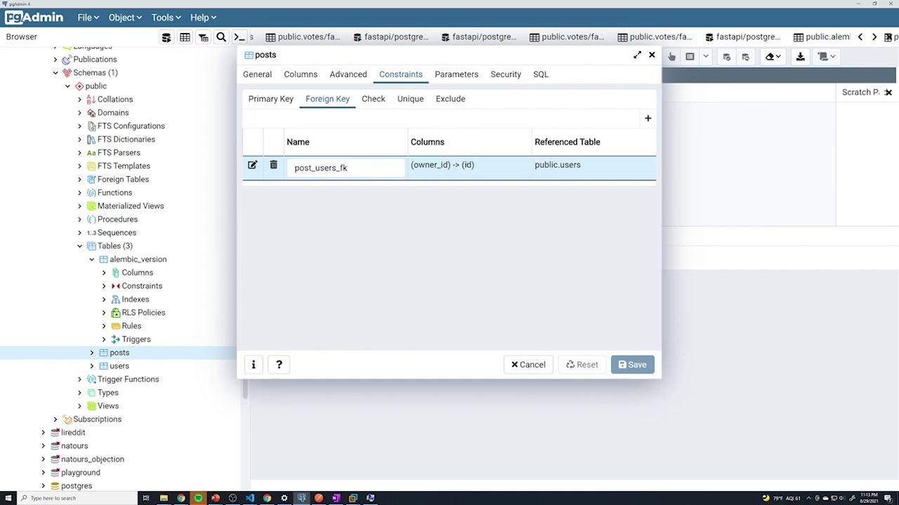
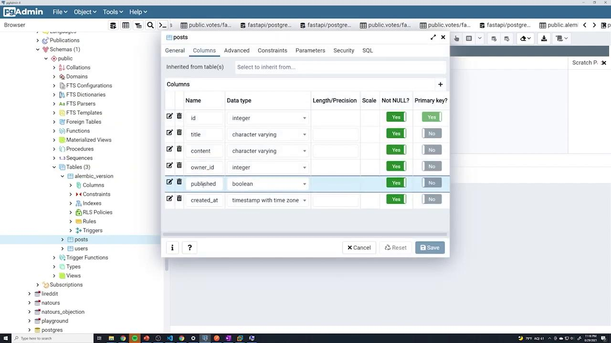
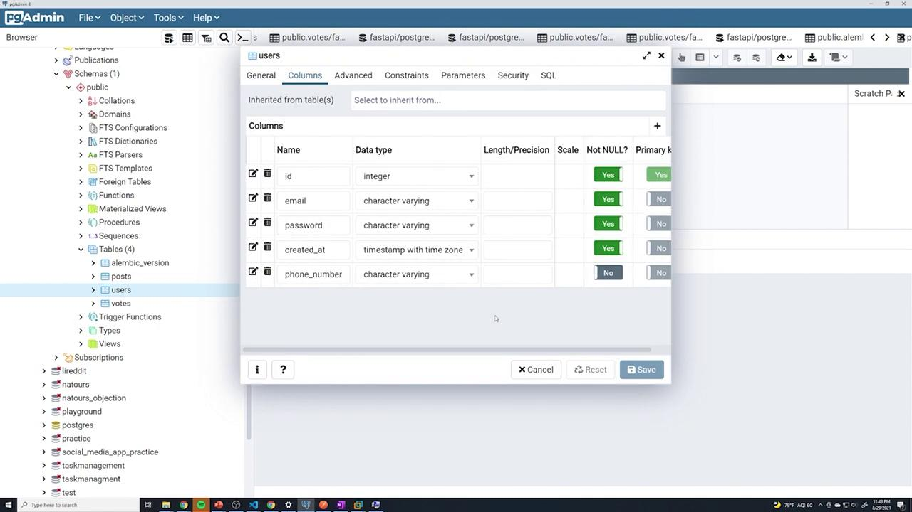

# revision identifiers, used by Alembic.
revision = '01b254928a5'
down_revision = 'cfcc4fd02d18'
branch_labels = None
depends_on = None

def upgrade():
    op.add_column('posts', sa.Column('content', sa.String(), nullable=False))
```

The corresponding console output for upgrading and downgrading is:

```plaintext theme={null}
(venv) C:\Users\sanje\Documents\Courses\fastapi>alembic upgrade head
INFO [alembic.runtime.migration] Context impl PostgreSQLImpl.
INFO [alembic.runtime.migration] Will assume transactional DDL.
INFO [alembic.runtime.migration] Running upgrade cfcc4fd02d18 -> 01b254928a5, add content column to posts table
(venv) C:\Users\sanje\Documents\Courses\fastapi>alembic downgrade cfcc4fd02d18
INFO [alembic.runtime.migration] Context impl PostgreSQLImpl.
INFO [alembic.runtime.migration] Will assume transactional DDL.
INFO [alembic.runtime.migration] Running downgrade 01b254928a5 -> cfcc4fd02d18, add content column to posts table
```

Next, generate a new migration for the users table. Instead of typing everything from scratch, copy the following code from your notes:

```python theme={null}
def upgrade():
    op.create_table('users',
        sa.Column('id', sa.Integer(), nullable=False),
        sa.Column('email', sa.String(), nullable=False),
        sa.Column('password', sa.String(), nullable=False),
        sa.Column('created_at', sa.TIMESTAMP(timezone=True),
            server_default=sa.text('now()'), nullable=False),
        sa.PrimaryKeyConstraint('id'),
        sa.UniqueConstraint('email')
    )
```

Alembic will generate a migration file automatically, as seen below:

```plaintext theme={null}
INFO [alembic.runtime.migration] Will assume transactional DDL.
INFO [alembic.runtime.migration] Running downgrade 01b2584928a5 -> cfcc4fd02d18, add content column to posts table
Generating C:\Users\sanje\Documents\Courses\fastapi\alembic\versions\8c82b1632f52_add_user_table.py ...
```

### Key Points in the Users Table Migration

* The `id` column is defined as an integer and set as non-nullable. A primary key is established using either `primary_key=True` or a separate `sa.PrimaryKeyConstraint('id')`.
* The `email` column has a unique constraint to prevent duplicate entries.
* The `created_at` column is defined with TIMESTAMP and timezone support. Its default value is set to `now()` using `server_default=sa.text('now()')`.

This configuration is reflected in your SQLAlchemy models:

```python theme={null}
class User(Base):
    __tablename__ = "users"
    id = Column(Integer, primary_key=True, nullable=False)
    email = Column(String, nullable=False, unique=True)
    password = Column(String, nullable=False)
    created_at = Column(TIMESTAMP(timezone=True),
                          nullable=False, server_default=text('now()'))

class Vote(Base):
    __tablename__ = "votes"
    user_id = Column(Integer, ForeignKey("users.id", ondelete="CASCADE"), primary_key=True)
    post_id = Column(Integer, ForeignKey("posts.id"))
```

The same SQL migration for creating the users table is captured here:

```python theme={null}
def upgrade():
    op.create_table('users',
        sa.Column('id', sa.Integer(), nullable=False),
        sa.Column('email', sa.String(), nullable=False),
        sa.Column('password', sa.String(), nullable=False),
        sa.Column('created_at', sa.TIMESTAMP(timezone=True),
                  server_default=sa.text('now()'), nullable=False),
        sa.PrimaryKeyConstraint('id'),
        sa.UniqueConstraint('email')
    )
```

After running this migration, verify via your database interface that the users table contains the correct columns and constraints.

<Frame>
  
</Frame>

***

## Adding a Foreign Key to the Posts Table

Next, establish a relationship between the posts and users tables by adding a foreign key to the posts table. To link the two tables, add a new column `owner_id` to the posts table.

Start by introducing the column without the constraint:

```python theme={null}
import sqlalchemy as sa

# revision identifiers, used by Alembic.
revision = 'af786b740296'
down_revision = '8c82b1632f52'
branch_labels = None
depends_on = None

def upgrade():
    op.add_column('posts', sa.Column('owner_id', sa.Integer(), nullable=False))
```

Then, update the migration to set up the foreign key that connects `posts.owner_id` to `users.id` with cascading delete behavior:

```python theme={null}
def upgrade():
    op.add_column('posts', sa.Column('owner_id', sa.Integer(), nullable=False))
    op.create_foreign_key('post_users_fk', source_table="posts", referent_table="users",
        local_cols=['owner_id'], remote_cols=['id'], ondelete="CASCADE")
```

Ensure that your downgrade function reverses these changes properly:

```python theme={null}
def downgrade():
    op.drop_constraint('post_users_fk', table_name="posts")
    op.drop_column('posts', 'owner_id')
```

After running the migration, use the following command to apply it:

```plaintext theme={null}
(venv) C:\Users\sanje\Documents\Courses\fastapi> alembic upgrade head
INFO [alembic.runtime.migration] Context impl PostgresqlImpl.
INFO [alembic.runtime.migration] Will assume transactional DDL.
INFO [alembic.runtime.migration] Running upgrade cfcc4fd021d8 -> 01b2584928a5, add content column to posts
INFO [alembic.runtime.migration] Running upgrade 01b2584928a5 -> 8c82b1632f52, add user table
INFO [alembic.runtime.migration] Running upgrade af786b740296 -> add foreign-key to posts table
```

After the upgrade, verify in pgAdmin that the foreign key constraint is correctly set up:

<Frame>
  
</Frame>

***

## Adding Additional Columns to the Posts Table

Your application may require extra functionality that necessitates new columns. In this case, we add a boolean `published` column and a `created_at` timestamp column to the posts table.

The following migration achieves this:

```python theme={null}
# revision identifiers, used by Alembic.
revision = '036d0a4565b7'
down_revision = 'af786b740296'
branch_labels = None
depends_on = None

def upgrade():
    op.add_column('posts', sa.Column(
        'published', sa.Boolean(), nullable=False, server_default='TRUE')
    )
    op.add_column('posts', sa.Column(
        'created_at', sa.TIMESTAMP(timezone=True), nullable=False, server_default=sa.text('NOW()'))
    )

def downgrade():
    op.drop_column('posts', 'published')
    op.drop_column('posts', 'created_at')
```

Run this migration and check the updated table structure via PostgreSQL. The image below shows the updated posts table schema:

<Frame>
  
</Frame>

***

## Downgrading and Re-Upgrading Revisions

Alembic provides the flexibility to rollback and upgrade revisions as needed. For instance, to roll back to the revision corresponding to the user table, use the following migration:

```python theme={null}
def upgrade():
    op.create_table('posts', sa.Column('id', sa.Integer(), nullable=False,
        primary_key=True), sa.Column('title', sa.String(), nullable=False))
    
def downgrade():
    op.drop_table('posts')
```

Then run:

```plaintext theme={null}
alembic downgrade cfcc4fd0218
```

Alternatively, upgrade a single revision:

```plaintext theme={null}
alembic upgrade +1
```

Or upgrade directly to the latest revision using:

```plaintext theme={null}
alembic upgrade head
```

This approach ensures efficient management of your database schema throughout your development lifecycle.

***

## Auto-Generating the Votes Table

With the posts and users tables in place, the next step is creating a votes table. Instead of writing the migration manually, leverage Alembic's auto-generation feature. Alembic compares your SQLAlchemy models with the existing schema and creates the necessary migration.

Below is the SQLAlchemy model for the Post, which includes all required columns:

```python theme={null}
from .database import Base

class Post(Base):
    __tablename__ = "posts"

    id = Column(Integer, primary_key=True, nullable=False)
    title = Column(String, nullable=False)
    content = Column(String, nullable=False)
    published = Column(Boolean, server_default='TRUE', nullable=False)
    created_at = Column(TIMESTAMP(timezone=True),
                        nullable=False, server_default=text('now()'))
    owner_id = Column(Integer, ForeignKey("users.id", ondelete="CASCADE"), nullable=False)

    owner = relationship("User")
```

After ensuring your models are imported in Alembic’s configuration, run the following command:

```plaintext theme={null}
alembic revision --autogenerate -m "add votes table"
```

The auto-generated migration for the votes table will resemble this:

```python theme={null}
def upgrade():
    # ### commands auto generated by Alembic - please adjust! ###
    op.create_table('votes',
        sa.Column('user_id', sa.Integer(), nullable=False),
        sa.Column('post_id', sa.Integer(), nullable=False),
        sa.ForeignKeyConstraint(['post_id'], ['posts.id'], ondelete='CASCADE'),
        sa.ForeignKeyConstraint(['user_id'], ['users.id'], ondelete='CASCADE'),
        sa.PrimaryKeyConstraint('user_id', 'post_id')
    )
    # ### end Alembic commands ###

def downgrade():
    # ### commands auto generated by Alembic - please adjust! ###
    op.drop_table('votes')
    # ### end Alembic commands ###
```

After upgrading with `alembic upgrade head`, verify that the votes table is created with the appropriate foreign key constraints.

***

## Updating the User Model with a New Phone Number Column

If you wish to extend your User model with an optional `phone_number` column, update your SQLAlchemy model as shown below:

```python theme={null}
class User(Base):
    __tablename__ = "users"
    id = Column(Integer, primary_key=True, nullable=False)
    email = Column(String, nullable=False, unique=True)
    password = Column(String, nullable=False)
    created_at = Column(TIMESTAMP(timezone=True), nullable=False, server_default=text('now()'))
    phone_number = Column(String)
```

Then, create an auto-migration to reflect this change:

```plaintext theme={null}
(venv) C:\Users\sanje\Documents\Courses\fastapi> alembic revision --autogenerate -m "add phone number"
```

The generated migration file should include:

```python theme={null}
def upgrade():
    # ### commands auto generated by Alembic - please adjust! ###
    op.add_column('users', sa.Column('phone_number', sa.String(), nullable=True))
    # ### end Alembic commands ###
```

Upon running the upgrade, verify through pgAdmin that a new `phone_number` column is present in the users table:

<Frame>
  
</Frame>

***

## Removing models.Base.metadata.create\_all from main.py

As Alembic now manages your database schema, you can remove the direct table creation command from your main application file. Although keeping it might be useful during early development, it is redundant once migrations are in place.

Below is a sample `main.py` file with the table creation commented out:

```python theme={null}
from fastapi import FastAPI
from . import models
from .database import engine
from .routers import post, user, auth, vote
from .config import settings

print(settings.database_username)

app = FastAPI()

app.include_router(post.router)
app.include_router(user.router)
```

When you start the application, the console will display standard startup messages:

```plaintext theme={null}
INFO:     Started server process [18648]
INFO:     Waiting for application startup.
INFO:     Application startup complete.
INFO:     127.0.0.1:64656 - "POST /users HTTP/1.1" 307 Temporary Redirect
INFO:     127.0.0.1:64656 - "POST /users HTTP/1.1" 201 Created
INFO:     127.0.0.1:64656 - "GET /login HTTP/1.1" 200 OK
INFO:     127.0.0.1:64656 - "GET /users HTTP/1.1" 307 Temporary Redirect
INFO:     127.0.0.1:64656 - "POST /users HTTP/1.1" 201 Created
INFO:     127.0.0.1:64656 - "GET /posts HTTP/1.1" 200 OK
```

***

By following these steps, you can efficiently manage your evolving database schema with Alembic. This process minimizes manual migration work and ensures that your database stays in sync with your SQLAlchemy models as your application grows.

For further reading on Alembic and database migrations, consider exploring [Alembic's official documentation](https://alembic.sqlalchemy.org/).

<CardGroup>
  <Card title="Watch Video" icon="video" href="https://learn.kodekloud.com/user/courses/python-api-development-with-fastapi/module/a6a7b30d-5ca7-4d69-a323-c508340e9931/lesson/bb29afb7-96d5-499b-87f3-73a997c84429" />
</CardGroup>


# Alembic Setup

Source: https://notes.kodekloud.com/docs/Python-API-Development-with-FastAPI/Database-Migration/Alembic-Setup/page

This article explains setting up Alembic for migration management with SQLAlchemy in a FastAPI project.

This article explains how to set up Alembic for migration management with SQLAlchemy, specifically within a FastAPI project. You will learn how to install, initialize, and configure Alembic to keep track of your database schema changes.

## Project Structure

Below is an example of the project structure, which shows where migration scripts will be stored:

```text theme={null}
yourproject/
    alembic/
        versions/
            23e153465_add_account.py
            23f5e266_add_address_field.py
```

## Installing Alembic

Begin by installing Alembic using pip. This not only installs the package but also provides access to its command-line interface:

```bash theme={null}
pip install alembic
```

After installing, verify the installation by running:

```bash theme={null}
alembic --help
```

You should see output similar to this:

```plaintext theme={null}
Requirement already satisfied: six==1.5 in c:\users\sanje\documents\courses\fastapi\venv\lib\site-packages
Installing collected packages: alembic
Successfully installed alembic-1.6.5
WARNING: You are using pip version 21.2.1; however, version 21.2.4 is available.
You should consider upgrading via the 'c:\users\sanje\documents\courses\fastapi\venv\scripts\python.exe -m pip install --upgrade pip' command.
```

Before moving forward, note that the sample code below presents snippets of your SQLAlchemy models. For instance, you could have models for `User` and `Vote` as follows:

```python theme={null}
class User(Base):
    __tablename__ = "users"
    id = Column(Integer, primary_key=True, nullable=False)
    email = Column(String, nullable=False, unique=True)
    password = Column(String, nullable=False)
    created_at = Column(TIMESTAMP(timezone=True), nullable=False, server_default=text('now()'))
    phone_number = Column(String)

class Vote(Base):
    __tablename__ = "votes"
    user_id = Column(Integer, ForeignKey("users.id", ondelete="CASCADE"), primary_key=True)
    post_id = Column(Integer, ForeignKey("posts.id", ondelete="CASCADE"), primary_key=True)
```

<Callout icon="lightbulb">
  In this example, you are instructed to remove the `phone_number` field once Alembic is set up and you are ready to update your database schema.
</Callout>

## Preparing the Database

Before running migrations, ensure that your application is stopped to prevent automatic restarts during the migration process. If required, drop any existing tables—using `DROP CASCADE` if there are foreign key constraints—to start with a clean slate.

To check the current data in your database, you can run the following SQL query:

```sql theme={null}
SELECT * FROM public.posts
ORDER BY id ASC
```

## Initializing Alembic

Initialize Alembic to create the necessary directory structure and configuration files. The Alembic CLI provides several subcommands, which you can review using:

```plaintext theme={null}
positional arguments:
  {branches,current,downgrade,edit,heads,history,init,list_templates,merge,revision,show,stamp,upgrade}
    branches         Show current branch points.
    current          Display the current revision for a database.
    downgrade        Revert to a previous version.
    edit             Edit revision script(s) using $EDITOR.
    heads            Show current available heads in the script directory.
    history          List changed scripts in chronological order.
    init             Initialize a new scripts directory.
    list_templates    List available templates.
    merge            Merge two revisions together. Creates a new migration file.
    revision         Create a new revision file.
    show             Show the revision(s) denoted by the given symbol.
    stamp            "stamp" the revision table with the given revision; don't run any migrations.
    upgrade          Upgrade to a later version.

optional arguments:
  -h, --help           show this help message and exit
  --version            show program's version number and exit
  -C CONFIG, --config CONFIG
                        Alternate config file; defaults to value of ALEMBIC_CONFIG environment
  -n NAME, --name NAME
                        Name of section in ini file to use for Alembic config
  -x X                 Additional arguments consumed by custom env.py scripts, e.g. -x
  setting1=something   -x setting2=something
  -r, --raiseerr       Raise a full stack trace on error
```

You can also check help for initialization by running:

```bash theme={null}
(venv) C:\Users\sanje\Documents\Courses\fastapi> alembic init --help
```

When ready, initialize Alembic by specifying a directory name. For example:

```bash theme={null}
(venv) C:\Users\sanje\Documents\Courses\fastapi> alembic init alembic
```

The output should indicate that the directory structure and configuration files have been created successfully:

```bash theme={null}
Creating directory C:\Users\sanje\Documents\Courses\fastapi\alembic ... done
Creating directory C:\Users\sanje\Documents\Courses\fastapi\alembic\versions ... done
Generating C:\Users\sanje\Documents\Courses\fastapi\alembic.ini ... done
Generating C:\Users\sanje\Documents\Courses\fastapi\alembic\env.py ... done
Generating C:\Users\sanje\Documents\Courses\fastapi\alembic\README ... done
Generating C:\Users\sanje\Documents\Courses\fastapi\alembic\script.py.mako ... done
Please edit configuration/connection/logging settings in 'C:\Users\sanje\Documents\Courses\fastapi\alembic.ini' before proceeding.
```

This creates the Alembic directory outside the application folder along with the `alembic.ini` configuration file. Next, you need to update both the `env.py` and `alembic.ini` files to connect Alembic with your SQLAlchemy models and database settings.

## Configuring env.py for SQLAlchemy

The `env.py` file is the main configuration file for Alembic. It must be updated to import your SQLAlchemy models and set the target metadata for autogeneration. An initial snippet might look like this:

```python theme={null}
from logging.config import fileConfig

from sqlalchemy import engine_from_config
from sqlalchemy import pool

from alembic import context
