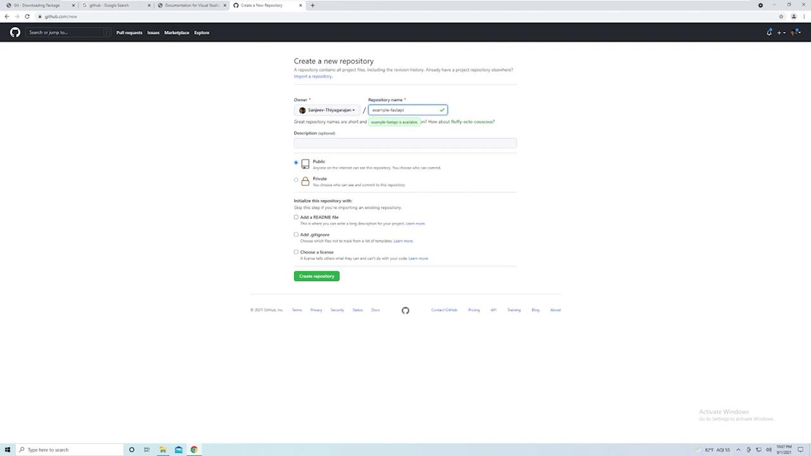
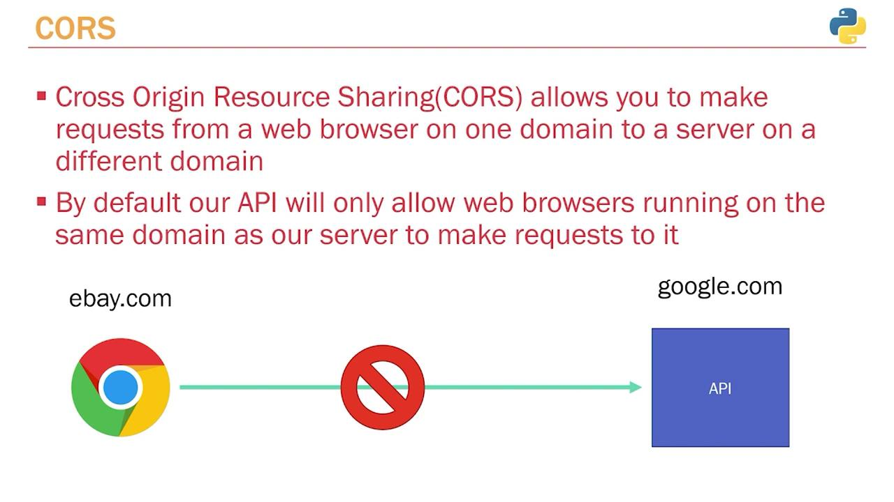
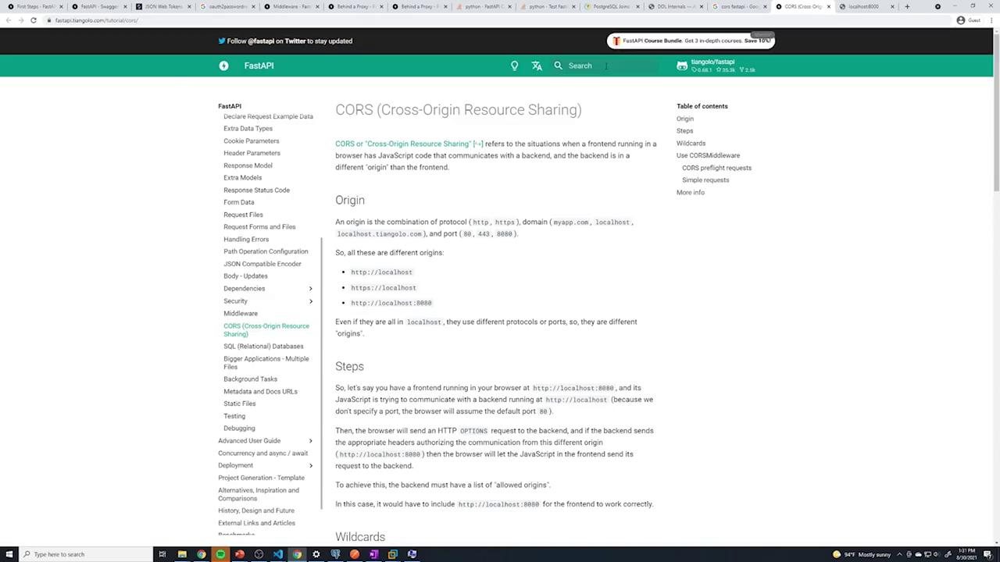

# Including routers for posts, users, authentication, and votes
app.include_router(post.router)
app.include_router(user.router)
app.include_router(auth.router)
app.include_router(vote.router)

@app.get("/")
def root():
    return {"message": "Hello World"}
```

Before setting up Git, consider these preliminary steps: by default, Git tracks all files in your project. However, you might not want to include files such as sensitive environment variables, cache directories (e.g., `__pycache__`), or your virtual environment folder (commonly named `venv`). To avoid tracking these files, create a `.gitignore` file in your project's root folder (be sure to include the leading dot).

Within the `.gitignore` file, add entries similar to the following:

* `.env` (for your environment variables)
* `__pycache__/`
* Your virtual environment folder (e.g., `venv`)

Next, capture the current state of your project’s dependencies by running:

```bash theme={null}
(venv) C:\Users\sanje\Documents\Courses\fastapi> pip freeze
```

This command lists all installed packages along with their versions. A typical output might look like:

```plaintext theme={null}
aiofiles==0.5.0
alembic==1.6.5
aniso8601==7.0.0
async-exit-stack==1.0.1
async-generator==1.10
bcrypt==3.2.0
certifi==2021.5.30
cffi==1.14.6
charset-normalizer==2.0.4
click==7.1.2
cryptography==3.4.8
python==3.9.5
```

To share these dependency details with your team, pipe the output into a file named `requirements.txt`:

```bash theme={null}
(venv) C:\Users\sanje\Documents\Courses\fastapi> pip freeze > requirements.txt
```

When someone clones your repository, all dependencies can be installed via:

```bash theme={null}
pip install -r requirements.txt
```

<Callout icon="lightbulb">
  Make sure your `.gitignore` and `requirements.txt` are up-to-date before making your initial commit.
</Callout>

## Installing Git

If Git is not installed on your machine, download and install it by visiting the official Git [downloads page](https://git-scm.com/downloads) or by searching for "Git" online. During installation on Windows, follow the wizard instructions, and ensure you override the default branch name from “master” to “main” to align with current GitHub conventions.

During the installation process, you may see a prompt requiring acknowledgement of the license agreement. Accept the license to proceed.

<Frame>
  
</Frame>

Once installed, open a terminal or command prompt and verify the installation with:

```bash theme={null}
git --version
```

A version output confirms that Git is correctly installed.

## Creating a GitHub Repository

Next, set up a remote repository on GitHub:

1. Visit [GitHub](https://github.com) and log in (or sign up if you don’t have an account).
2. Click on the "New repository" button.
3. Fill in the repository name, description, and visibility (choose public for simplicity).
4. Click "Create repository."

<Frame>
  
</Frame>

## Configuring Your Local Repository

Initialize your project folder as a Git repository. Open your terminal in the project’s root directory and execute:

```bash theme={null}
git init
```

This command creates a hidden `.git` folder where Git stores all repository data. Next, add all project files (respecting the rules defined in your `.gitignore`) with:

```bash theme={null}
git add --all
```

Before committing, you might have a sample Python model file (e.g., a SQLAlchemy model) that demonstrates what is being tracked:

```python theme={null}
from sqlalchemy import Column, Integer, String, Boolean
from sqlalchemy.sql import text
from sqlalchemy.sql.types import TIMESTAMP
from .database import Base

class Post(Base):
    __tablename__ = "posts"

    id = Column(Integer, primary_key=True, nullable=False)
    title = Column(String, nullable=False)
    content = Column(String, nullable=False)
    published = Column(Boolean, server_default="TRUE", nullable=False)
    created_at = Column(TIMESTAMP(timezone=True), nullable=False, server_default=text("now()"))
```

Before committing your changes, Git might prompt you for your user identity. Configure your Git username and email globally:

```bash theme={null}
git config --global user.email "you@example.com"
git config --global user.name "Your Name"
```

Then, commit your changes:

```bash theme={null}
git commit -m "initial commit"
```

Rename your default branch to “main” and add the remote repository URL (replace the URL with your actual repository URL):

```bash theme={null}
git branch -M main
git remote add origin https://github.com/Sanjeev-Thiyagarajan/example-fastapi.git
```

Finally, push your code to GitHub:

```bash theme={null}
git push -u origin main
```

You may be prompted to authenticate via your browser or with a personal access token. Once authenticated, your code will be pushed to the remote repository. A typical output may resemble:

```plaintext theme={null}
Enumerating objects: 34, done.
Counting objects: 100% (34/34), done.
Delta compression using up to 2 threads
Compressing objects: 100% (30/30), done.
Writing objects: 100% (34/34), done.
Total 34 (delta 0), reused 0 (delta 0), pack-reused 0
To https://github.com/Sanjeev-Thiyagarajan/example-fastapi.git
 * [new branch]      main -> main
Branch 'main' set up to track remote branch 'main' from 'origin'.
```

<Callout icon="lightbulb">
  At this point, your repository is successfully configured both locally and on GitHub. Your `.gitignore` is safeguarding unnecessary files, and the `requirements.txt` captures all dependencies, ensuring smooth transitions during deployment and collaboration.
</Callout>

With Git now set up, you are ready to move on to deploying your application.

<CardGroup>
  <Card title="Watch Video" icon="video" href="https://learn.kodekloud.com/user/courses/python-api-development-with-fastapi/module/1af49f64-16e1-4559-841f-4b684c6a8f15/lesson/736d0706-15fe-45d1-a441-d0c848e963c9" />
</CardGroup>


# What Is CORS

Source: https://notes.kodekloud.com/docs/Python-API-Development-with-FastAPI/Deployment/What-Is-CORS/page

This article explains Cross-Origin Resource Sharing (CORS) and its importance in API development, including how to configure it in FastAPI applications.

In this lesson, we explore Cross-Origin Resource Sharing (CORS) and its significance in modern API development. CORS is a crucial mechanism that allows applications to overcome the restrictions imposed by web browsers when requesting resources from a different domain than the one serving the web page. Throughout this lesson, we use Postman—a robust API testing tool—to demonstrate API interactions. It's important to understand that while Postman sends requests directly from your computer, your API may also receive requests from other sources such as servers, mobile devices, or web browsers.

For instance, if you test your API using Postman, it might return a response such as:

```json theme={null}
{
  "Post": {
    "title": "something something beaches, hello",
    "content": "something something beaches",
    "published": true,
    "id": 1,
    "created_at": "2021-08-29T23:47:46.533146-04:00",
    "owner_id": 1,
    "owner": {
      "id": 1,
      "email": "sanjeev123@gmail.com",
      "created_at": "2021-08-29T23:47:37.610675-04:00"
    }
  },
  "votes": 0
}
```

Similar requests could be made using tools such as cURL or from mobile devices. However, when a request is made via a web browser using JavaScript's Fetch API, the behavior differs. Consider the following JSON payload sent from the browser:

```json theme={null}
{
  "post": {
    "title": "something something beaches hello",
    "content": "something_something_beaches",
    "published": true,
    "id": 1,
    "created_at": "2021-08-29T23:47:46.533146-04:00",
    "owner_id": 1,
    "owner": {
      "id": 1,
      "email": "sanjeev123@gmail.com",
      "created_at": "2021-08-29T23:47:37.610275-04:00"
    }
  },
  "votes": 0
}
```

When the Fetch API is used, the browser enforces CORS policies. For example, a simple JavaScript snippet in the browser console may look like this:

```javascript theme={null}
fetch('http://localhost:8000/')
```

To properly handle the returned promise and display the output, you can extend the snippet as follows:

```javascript theme={null}
fetch('http://localhost:8000/')
  .then(res => res.json())
  .then(console.log);
```

If you run this snippet while on a website like google.com, you might encounter an error similar to:

```text theme={null}
Access to fetch at 'http://localhost:8000/' from origin 'https://www.google.com' has been blocked by CORS policy.
```

<Callout icon="triangle-alert">
  This error indicates that your browser is preventing the request because your API only accepts requests from the same origin. If your API is hosted on google.com, a request from ebay.com will be blocked.
</Callout>

When accessing your API directly on its domain (for example, by navigating to `http://localhost:8000` in your browser), the API responds successfully:

```json theme={null}
{"message": "Hello World"}
```

This confirms that accessing your API from the same domain bypasses CORS restrictions.

Below is an example of a simple FastAPI application without CORS handling:

```python theme={null}
from fastapi import FastAPI

app = FastAPI()

@app.get("/")
def root():
    return {"message": "Hello World"}
```

A sample console output when using Uvicorn might be:

```plaintext theme={null}
INFO:     Started server process [22164]
INFO:     Waiting for application startup...
INFO:     Application startup complete.
INFO:     Uvicorn running on http://127.0.0.1:60904 (Press CTRL+C to quit)
INFO:     127.0.0.1:60904 - "GET / HTTP/1.1" 200 OK
INFO:     127.0.0.1:57060 - "GET /favicon.ico HTTP/1.1" 404 Not Found
INFO:     127.0.0.1:53500 - "GET / HTTP/1.1" 200 OK
```

## Understanding CORS

CORS (Cross-Origin Resource Sharing) enables web browsers to request resources from a server on a different domain, which is not allowed by default. Most web frameworks, including FastAPI, accept requests only from the same domain hosting the API.

Imagine your API is hosted on google.com while your web application is on ebay.com. In this scenario, ebay.com would be prevented from communicating with the API on google.com unless CORS is properly configured. Conversely, when both the website and the API are hosted on the same domain, communication happens seamlessly.

<Frame>
  
</Frame>

When testing on `localhost:8000`—the same domain used by your web browser—the API logs a proper response in the developer tools console.

### Enabling CORS in FastAPI

To handle requests from different origins, you can enable CORS in your FastAPI application using its middleware. The FastAPI documentation provides clear guidance on configuring CORS. Below is an example of setting up CORS middleware:

```python theme={null}
from fastapi import FastAPI
from fastapi.middleware.cors import CORSMiddleware

app = FastAPI()

origins = [
    "http://localhost.tiangolo.com",
    "http://localhost",
    "http://localhost:8888"
]

app.add_middleware(
    CORSMiddleware,
    allow_origins=origins,
    allow_credentials=True,
    allow_methods=["*"],
    allow_headers=["*"],
)

@app.get("/")
async def read_main():
    return {"message": "Hello World"}
```

In this setup, the middleware allows requests from a pre-defined list of origins. This middleware function intercepts each request, ensuring that only the specified origins are permitted.

If your API includes multiple routers, you can integrate CORS middleware like this:

```python theme={null}
from fastapi import FastAPI
from fastapi.middleware.cors import CORSMiddleware
from routers import post, user, auth, vote  # assuming these are defined in your project

app = FastAPI()

origins = []  # Initially empty; later populate it with allowed domains

app.add_middleware(
    CORSMiddleware,
    allow_origins=origins,
    allow_credentials=True,
    allow_methods=["*"],
    allow_headers=["*"],
)

app.include_router(post.router)
app.include_router(user.router)
app.include_router(auth.router)
app.include_router(vote.router)
```

You can modify the list of allowed origins based on your application's requirements. For instance, to restrict access only to Google:

```python theme={null}
from fastapi import FastAPI
from fastapi.middleware.cors import CORSMiddleware
from routers import post, user

app = FastAPI()

origins = ["https://www.google.com"]

app.add_middleware(
    CORSMiddleware,
    allow_origins=origins,
    allow_credentials=True,
    allow_methods=["*"],
    allow_headers=["*"],
)

app.include_router(post.router)
app.include_router(user.router)
```

If a request is made from a domain not specified in the allowed origins list (like youtube.com), the browser will block the request and log a CORS error in the console:

```plaintext theme={null}
fetch('http://localhost:8000/')
  .then(res => res.json())
  .then(console.log);

Access to fetch at 'http://localhost:8000/' from origin 'https://www.youtube.com' has been blocked by CORS policy: No 'Access-Control-Allow-Origin' header is present on the requested resource.
```

For public APIs where unrestricted access is desired, you can use a wildcard ("\*") to allow requests from any domain:

```python theme={null}
from fastapi import FastAPI
from fastapi.middleware.cors import CORSMiddleware

app = FastAPI()

origins = ["*"]

app.add_middleware(
    CORSMiddleware,
    allow_origins=origins,
    allow_credentials=True,
    allow_methods=["*"],
    allow_headers=["*"],
)

@app.get("/")
async def read_main():
    return {"message": "Hello World"}
```

<Callout icon="lightbulb">
  Although using a wildcard ("\*") makes your API accessible from all domains, it is advisable to restrict origins to specific domains when deploying to production to ensure enhanced security.
</Callout>

Below is an example of a complete FastAPI setup using the wildcard configuration:

```python theme={null}
from fastapi import FastAPI
from fastapi.middleware.cors import CORSMiddleware
from routers import post, user, auth, vote  # adjust import paths as necessary

app = FastAPI()

origins = ["*"]

app.add_middleware(
    CORSMiddleware,
    allow_origins=origins,
    allow_credentials=True,
    allow_methods=["*"],
    allow_headers=["*"]
)

app.include_router(post.router)
app.include_router(user.router)
app.include_router(auth.router)
app.include_router(vote.router)
```

When running your application with Uvicorn, you might see console output similar to:

```plaintext theme={null}
INFO:     Started server process [30400]
INFO:     Waiting for application startup.
INFO:     Application startup complete.
INFO:     Uvicorn running on http://127.0.0.1:5167 (Press CTRL+C to quit)
INFO:     127.0.0.1:51038 - "GET / HTTP/1.1" 200 OK
```

This configuration simplifies testing by permitting requests from any domain. However, when deploying your API, ensure that you update the allowed origins to maintain a secure environment.

In summary, CORS is essential for controlling which domains are permitted to access your API. By configuring CORS middleware in FastAPI, you can balance accessibility and security for both development and production environments.

<Frame>
  
</Frame>

<CardGroup>
  <Card title="Watch Video" icon="video" href="https://learn.kodekloud.com/user/courses/python-api-development-with-fastapi/module/1af49f64-16e1-4559-841f-4b684c6a8f15/lesson/3635d588-8029-4552-b0e2-af9baa73d9e0" />
</CardGroup>
