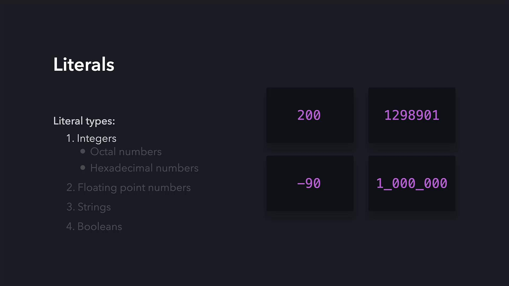
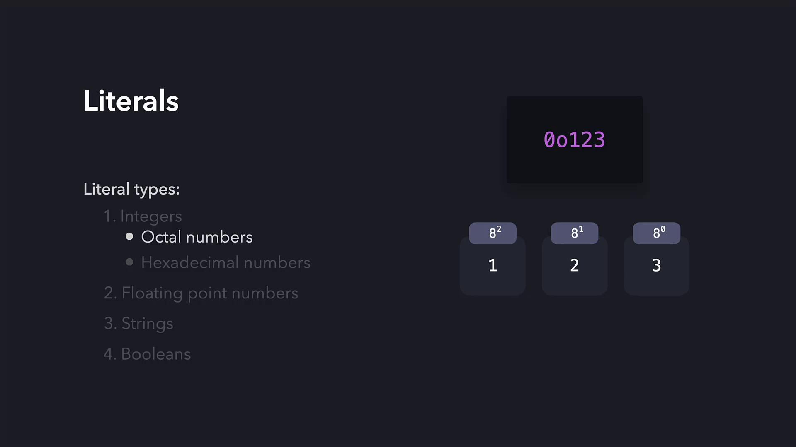
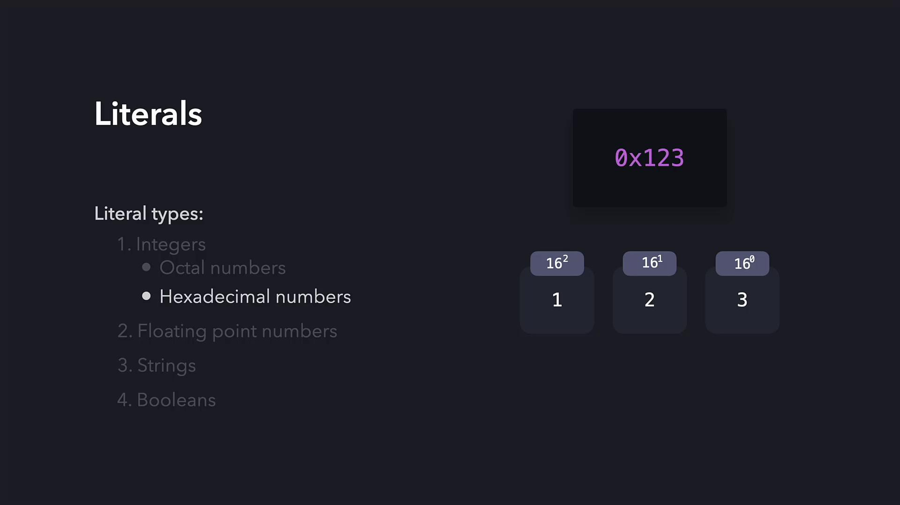
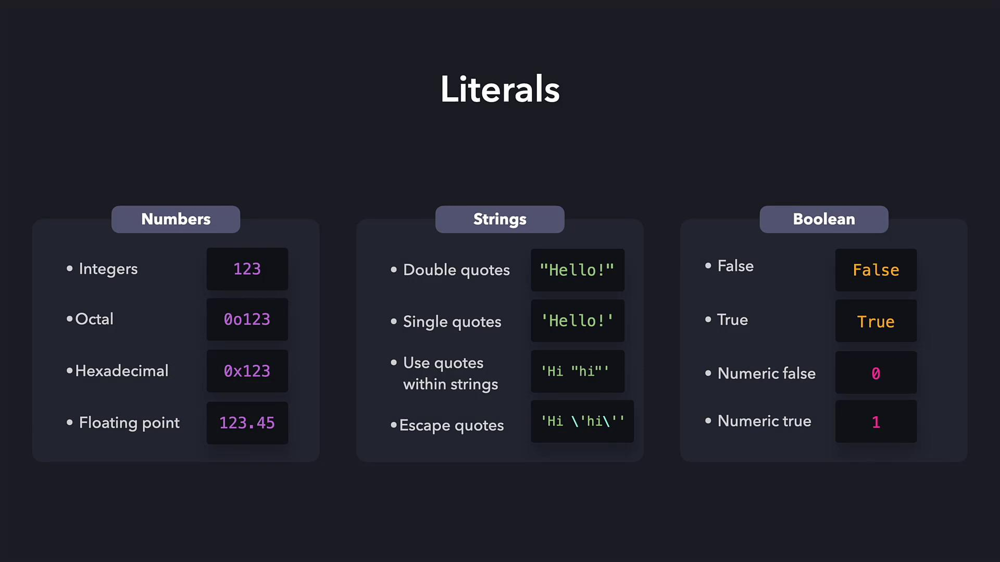

# content of test_sample.py
def inc(x):
    return x + 1

def test_answer():
    assert inc(3) == 5
```

When you run pytest, it reports the failure by comparing the expected value with the actual result. This behavior is crucial for debugging your code.

***

## FastAPI Route Example

Below is an example snippet of a FastAPI route, demonstrating how to implement a login endpoint. This snippet also emphasizes that test outputs might include details about the runtime environment:

```python theme={null}
from fastapi import APIRouter, Depends
from sqlalchemy.orm import Session
import schemas, models, database
from fastapi.security import OAuth2PasswordRequestForm

router = APIRouter(tags=['Authentication'])

@router.post('/login', response_model=schemas.Token)
def login(user_credentials: OAuth2PasswordRequestForm = Depends(), db: Session = Depends(database.get_db)):
    user = db.query(models.User).filter(
        models.User.email == user_credentials.username
    ).first()
```

<Callout icon="lightbulb">
  Even if pytest sometimes displays "collected 0 items" (e.g., due to naming conventions or missing tests), always double-check that your tests follow the appropriate naming patterns.
</Callout>

***

## Creating a Simple Calculation Module

To practice testing, let’s build a module that performs basic arithmetic operations. Create a file (for example, `app/calculations.py`) with:

```python theme={null}
def add(num1: int, num2: int):
    return num1 + num2
```

***

## Writing Tests for the Calculation Module

Next, create a directory named `tests` (if it doesn’t already exist) and add a file called `test_calculations.py` to test the `add` function:

```python theme={null}
from app.calculations import add

def test_add():
    print("testing add function")
    # 5 + 3 should equal 8
    assert add(5, 3) == 8
```

<Callout icon="lightbulb">
  Pytest automatically discovers tests in files whose names start with <code>test\_</code> and functions that begin with <code>test\_</code>. If your file or function naming deviates from this convention (e.g., using <code>mytest.py</code> or <code>testing\_add()</code>), pytest will not run the tests unless explicitly specified.
</Callout>

***

## Understanding Assert Statements

Pytest leverages Python’s built-in `assert` statement to confirm that conditions are met:

* A true assertion (e.g., `assert True`) results in a passing test.
* A false assertion (e.g., `assert False`) raises an `AssertionError` and marks the test as failed.

Consider these basic examples:

```python theme={null}
def test_assert_true():
    assert True  # This test passes

def test_assert_false():
    assert False  # This test fails
```

When running these tests, pytest provides visual feedback—a green dot for passing tests and a red dot for failing ones—accompanied by detailed error messages for debugging.

Keep in mind that print statements (like in the earlier `test_add` example) will appear in the output when running tests directly with a command like:

```bash theme={null}
py -3 tests/test_calculations.py
```

However, pytest manages output differently when running an entire test suite.

***

## Leveraging Pytest’s Auto-Discovery

For seamless test discovery by pytest, adhere to these guidelines:

1. Name test files with a prefix `test_` (for example, `test_calculations.py`).
2. Ensure that test function names also begin with `test_` (e.g., `def test_add():`).

To execute your tests, simply run:

```bash theme={null}
pytest
```

A typical output might look like this:

```plaintext theme={null}
(venv) C:\Users\sanje\Documents\Courses\fastapi>pytest
================================ test session starts =============================
platform win32 -- Python 3.9.5, pytest-6.2.5, py-1.10.0, pluggy-1.0.0
rootdir: C:\Users\sanje\Documents\Courses\fastapi
plugins: cov-2.12.1
collected 1 item

tests/test_calculations.py .                                              [100%]

================================= 1 passed in 0.06s ================================
```

<Callout icon="triangle-alert">
  If pytest reports “collected 0 items”, verify that your test files and functions correctly follow the naming conventions and that an <code>**init**.py</code> file is present in your tests directory if required.
</Callout>

***

## Conclusion

In this tutorial, we covered:

* Installing pytest using pip
* Writing a basic failing test and analyzing its output
* Creating a simple arithmetic module and writing corresponding tests
* The significance of proper naming conventions for test discovery
* How Python’s `assert` statements help validate code functionality

By following these best practices, you are well on your way to mastering automated testing in Python. Happy testing!

***

## Resources

* [Pytest Documentation](https://docs.pytest.org/)
* [FastAPI Documentation](https://fastapi.tiangolo.com/)
* [SQLAlchemy Documentation](https://docs.sqlalchemy.org/)
* [Python Testing with Pytest](https://realpython.com/pytest-python-testing/)

<CardGroup>
  <Card title="Watch Video" icon="video" href="https://learn.kodekloud.com/user/courses/python-api-development-with-fastapi/module/eed445e5-68aa-46b3-9922-0fdf2a57b8f1/lesson/081b1b12-d234-4f5a-a8b1-d3d6d49ce979" />
</CardGroup>


# Literals

Source: https://notes.kodekloud.com/docs/Python-Basics/Computer-Programming-and-Python-fundamentals/Literals/page

This article explores Python literals, their types, and how they embed fixed data directly into code.

In this lesson, we explore Python literals and how they embed fixed data directly into your code. A literal is a data value explicitly defined in your source code. For instance, numbers like 200 and -89, or strings such as "hello" and "Python" are literals. Identifiers like name, c, h, or print are not literals because their values are determined during runtime.

Python categorizes literals into four primary types: integers, floating-point numbers, strings, and booleans.

***

## Integer Literals

An integer literal represents a whole number without a fractional part. Examples include 200, 1289901, -90, and 1\_000\_000. The underscore in numbers such as 1\_000\_000 improves readability; Python ignores these underscores when evaluating the value.

<Frame>
  
</Frame>

Python also supports octal and hexadecimal integer representations.

### Octal Numbers

Octal numbers in Python are indicated by a leading `0o` (or simply `0` in older notations). To compute the value of an octal number, each digit is multiplied by 8 raised to the power corresponding to its position (with the rightmost digit at position 0). For instance, with an octal number:

* The weights are calculated as follows:
  * 8² = 64
  * 8¹ = 8
  * 8⁰ = 1

Each digit is then multiplied by its positional weight and summed to determine the final value.

<Frame>
  
</Frame>

### Hexadecimal Numbers

Hexadecimal numbers function similarly to octal numbers but use base 16. They always start with `0x`. The positional weights are based on powers of 16:

* 16² = 256
* 16¹ = 16
* 16⁰ = 1

For example, consider the hexadecimal literal `0x123`:

* Leftmost digit multiplied by 256,
* The next digit by 16, and
* The rightmost digit by 1,\
  resulting in the calculation:

(1 × 256) + (2 × 16) + (3 × 1) = 256 + 32 + 3 = 291

<Frame>
  
</Frame>

***

## Floating-Point Numbers

Floating-point literals represent real numbers that include a decimal point. They denote fractional values and can also be expressed using scientific notation (using the letter E) to represent very large or very small numbers efficiently.

***

## String Literals

String literals handle textual data in Python. To define a string, enclose the text in either single (`'`) or double (`"`) quotes. This differentiation allows Python to easily distinguish text from other data types.

For example, both of these string definitions are valid:

```python theme={null}
'Hello! "Python" is cool'
"Hello! 'Python' is cool"
```

If you need to use matching quotes within the string, alternate between single and double quotes or use the escape character (`\`):

```python theme={null}
"Hello! \"Python\" is cool"
```

<Callout icon="lightbulb">
  When working with strings, always choose a quoting style that minimizes the need for escaping characters. This makes your code cleaner and more readable.
</Callout>

***

## Boolean Literals

Boolean literals represent one of two truth values: `True` or `False`. In certain contexts, such as when interfacing with external data systems, booleans can also be represented numerically, where `1` indicates `True` and `0` indicates `False`.

***

## Summary

Below is a quick summary of Python literals:

* **Numbers:**
  * **Integers:** Whole numbers that can be expressed in decimal, octal (with a `0o` prefix), or hexadecimal (with a `0x` prefix) formats.
  * **Floating-point:** Numbers that contain a decimal point and can also be represented using scientific notation.

* **Strings:**
  * Enclosed in single or double quotes.
  * Use alternating quotes or escape characters to include quotes within strings.

* **Booleans:**
  * Represent truth values with `True` or `False`.
  * Numerical representations of booleans can also be used in certain contexts.

<Frame>
  
</Frame>

That concludes our lesson on Python literals. Practice what you've learned through available hands-on exercises to solidify your understanding.

<CardGroup>
  <Card title="Watch Video" icon="video" href="https://learn.kodekloud.com/user/courses/python-basics/module/4178f96e-8dcd-46a2-a9c9-f65a8c9c73b0/lesson/bbf32558-e044-44e3-b893-427dc5421bdb" />
</CardGroup>
