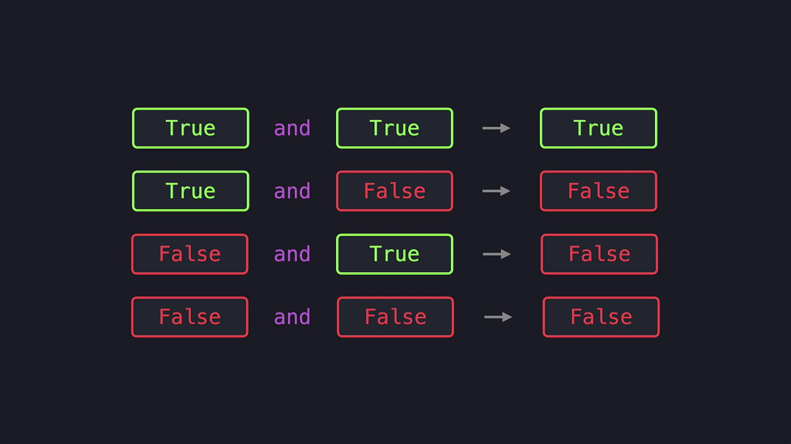
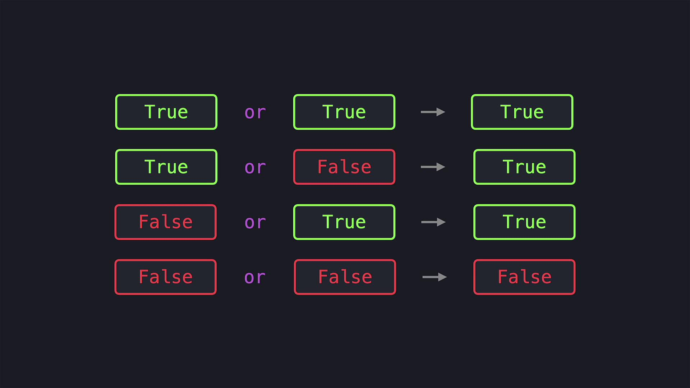

# Long form
bit1 = bit1 & 22
bit1 = bit1 | 22
bit1 = bit1 ^ 22

# Abbreviated form
bit1 &= 22
bit1 |= 22
bit1 ^= 22
```

Bit shifting

Bit shifting moves bits left or right by a specified number of positions and is equivalent to multiplication or integer division by powers of two for non-negative integers.

* Right shift (`>>`): shifts bits to the right. Each shift right by 1 divides the integer by 2 using floor division for non-negative values.
* Left shift (`<<`): shifts bits to the left. Each shift left by 1 multiplies the integer by 2.

Examples with 22 (binary 10110):

```python theme={null}
print(22 >> 1)  # 11   (10110 >> 1 -> 1011)
print(22 >> 2)  # 5    (10110 >> 2 -> 101)
print(22 << 1)  # 44   (10110 << 1 -> 101100)
```

Equivalent arithmetic:

```python theme={null}
print(22 // 2)  # 11
print(22 >> 1)  # 11
print(22 // 4)  # 5
print(22 >> 2)  # 5
print(22 * 2)   # 44
print(22 << 1)  # 44
print(22 * 4)   # 88
print(22 << 2)  # 88
```

<Frame>
  >. The operator names are highlighted in different colors." />
</Frame>

<Callout icon="lightbulb">
  Bitwise operators are useful for flags, masks, and efficient low-level manipulations. Remember that Python integers are unbounded and bitwise operations follow two's‑complement logic, so \~n equals -n - 1.
</Callout>

Recap

* Logical operators (`and`, `or`, `not`) operate on boolean expressions and return boolean results — useful for control flow and conditions.
* Bitwise operators (`&`, `|`, `^`, `~`) operate at the bit level on integers and return integer results reflecting bitwise changes.
* Bit shifts (`<<`, `>>`) move bits left or right and correspond to multiplication or integer division by powers of two for non-negative integers.

Links and references

* [Python Numeric Types — bitwise operations](https://docs.python.org/3/library/stdtypes.html#bitwise-operations-on-integer-types)
* [Two's complement explanation (Wikipedia)](https://en.wikipedia.org/wiki/Two%27s_complement)

<CardGroup>
  <Card title="Watch Video" icon="video" href="https://learn.kodekloud.com/user/courses/python-basics/module/24b7c33f-d6b5-4346-9b97-739cf4a7e698/lesson/c69cf016-3d7e-42ac-9a20-3097cea2c14f" />
</CardGroup>


# Operators

Source: https://notes.kodekloud.com/docs/Python-Basics/Logic-and-Bit-Operations/Operators/page

This article explains the use of logical operators in Python to compare variables and control program flow based on conditions.

When developing Python programs, it is essential to verify that certain conditions hold true. In this lesson, we compare two variables, age1 and age2, which represent ages, and then display corresponding messages to the console based on their values. This example demonstrates the use of logical operators to control the program flow.

For instance, if both ages are 18 or older, the program prints "You are both adults". If only one of the ages is 18 or older, it prints "One of you is an adult". Otherwise, it shows "You are both children".

Below is the complete Python code that illustrates these conditional checks using logical operators:

```python theme={null}
age1 = 24
age2 = 16

if age1 >= 18 and age2 >= 18:
    print("You are both adults")
elif age1 >= 18 or age2 >= 18:
    print("One of you is an adult")
else:
    print("You are both children")
```

The first condition uses the `and` operator to determine if both `age1` and `age2` are greater than or equal to 18. The `and` operator returns True only when both conditions are met; otherwise, it yields False, and the following code blocks are evaluated accordingly.

<Frame>
  
</Frame>

The next condition employs the `or` operator. This operator returns True if at least one of the conditions is True. In this scenario, if either `age1` or `age2` is 18 or older, the program will execute the corresponding code block. Only when both conditions are False does the program fall through to the final block.

<Frame>
  
</Frame>

<Callout icon="lightbulb">
  Logical operators like `and`, `or`, and `not` are fundamental in programming. They help you combine or invert conditions to build complex decision-making logic in your code.
</Callout>

Another useful logical operator in Python is `not`. This operator reverses the truth value of a boolean expression. For example, if we want to display "You are not hungry" when the variable `is_hungry` is False, we can check this condition as follows:

```python theme={null}
is_hungry = False
if not is_hungry:
    print("You are not hungry")
```

Since `is_hungry` is False, the expression `not is_hungry` evaluates to True, and the message is printed.

That’s all for this lesson. Happy coding, and see you in the next article!

<CardGroup>
  <Card title="Watch Video" icon="video" href="https://learn.kodekloud.com/user/courses/python-basics/module/24b7c33f-d6b5-4346-9b97-739cf4a7e698/lesson/bcb63a16-5dd1-4ba2-b360-ed842918f1cd" />
</CardGroup>
