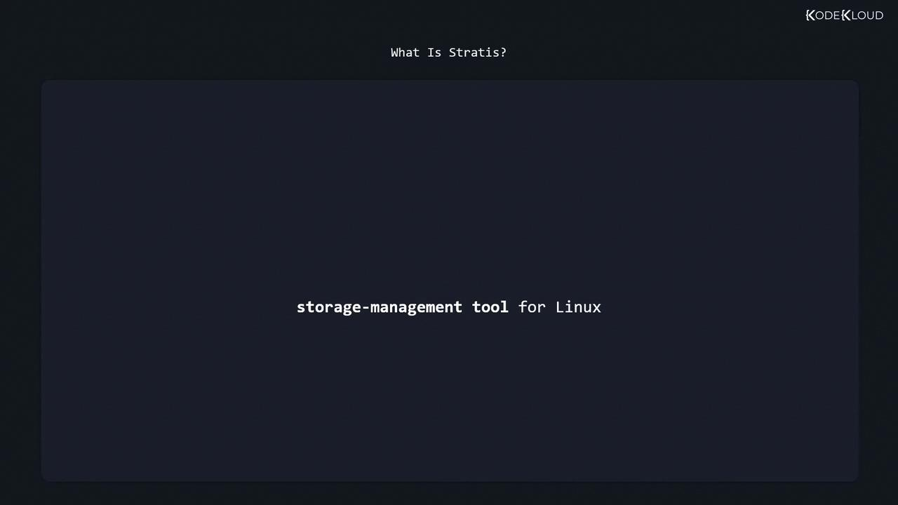
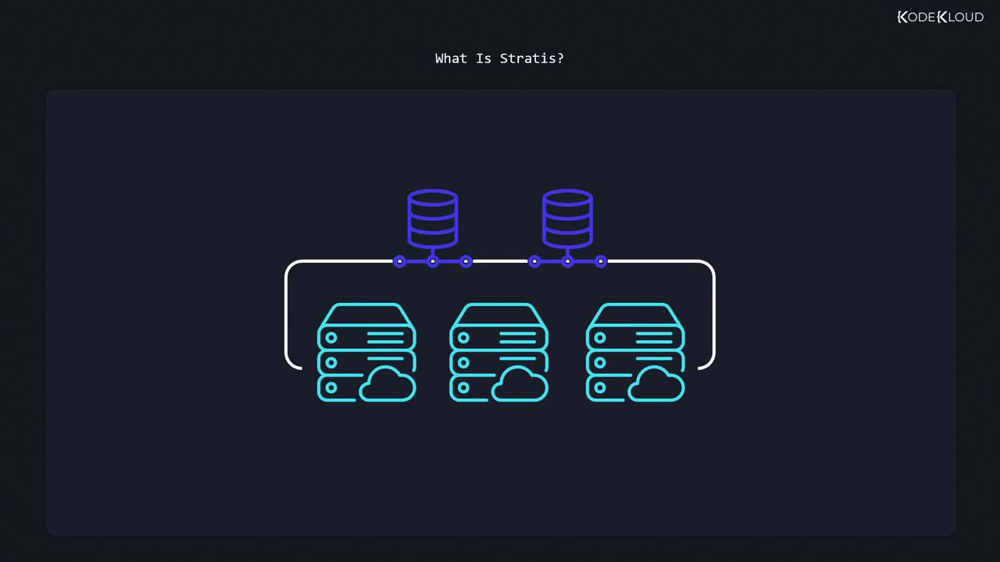
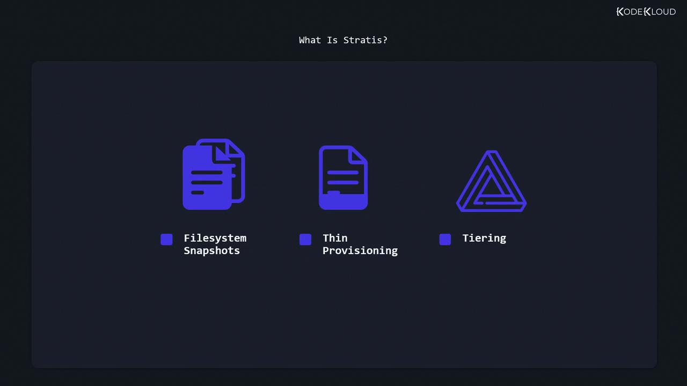
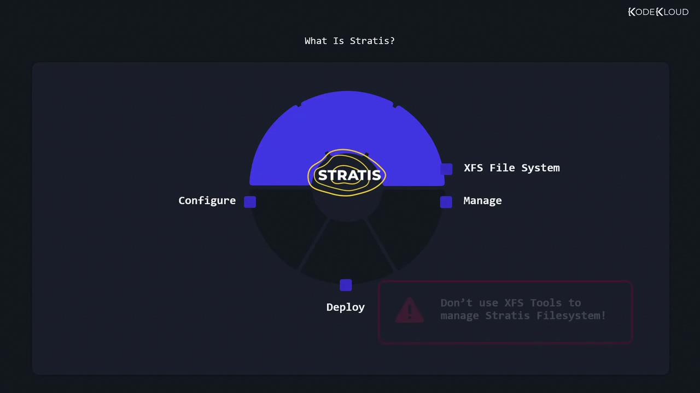

# In fdisk:
#   Type 'T' to change partition type
#   Then choose 'b' for W95 FAT32
```

<Callout icon="lightbulb">
  Always verify that you are working on the correct device and have backed up your important data before modifying disk partitions.
</Callout>

## Step 2: Creating the VFAT File System

After partitioning, create the VFAT file system using the mkfs.vfat command. For example, to format the partition `/dev/vdb1` as VFAT, execute:

```bash theme={null}
sudo mkfs.vfat /dev/vdb1
```

VFAT file systems are typically created with either a 12-bit or 16-bit file allocation table. To support partitions larger than 2GB, include the `-F 32` flag, which creates a 32-bit file system. With a 4096-byte sector size, this configuration can theoretically support partitions up to 16 terabytes.

## Step 3: Mounting the VFAT File System

Mounting VFAT is straightforward. First, create a directory to serve as your mount point, then mount the partition to the directory:

```bash theme={null}
sudo mkdir /myvfat
sudo mount /dev/vdb1 /myvfat/
```

## Step 4: Configuring Automatic Mounting at Boot

To ensure that the VFAT file system mounts automatically at boot, add an entry to the `/etc/fstab` file. Open the file with your preferred text editor:

```bash theme={null}
sudo vi /etc/fstab
```

Add the following line to associate `/dev/vdb1` with the mount point `/myvfat` using default VFAT options:

```bash theme={null}
/dev/vdb1 /myvfat vfat defaults 0 0
```

<Callout icon="lightbulb">
  For added stability, consider using the partition's UUID instead of the device name in the `/etc/fstab` file, especially if device names might change between boots.
</Callout>

## Step 5: Unmounting the VFAT File System

When it's time to unmount the VFAT file system, use the `umount` command. You can specify either the mount point or the device:

```bash theme={null}
sudo umount /myvfat   # or
sudo umount /dev/vdb1
```

## Quick Reference Table

| Command           | Action                                     | Example Command                                        |
| ----------------- | ------------------------------------------ | ------------------------------------------------------ |
| fdisk             | Partition the storage device               | sudo fdisk /dev/vdb                                    |
| mkfs.vfat         | Create a VFAT file system                  | sudo mkfs.vfat /dev/vdb1                               |
| mkdir & mount     | Create mount point and mount the partition | sudo mkdir /myvfat <br />sudo mount /dev/vdb1 /myvfat/ |
| Update /etc/fstab | Configure the file system to mount at boot | /dev/vdb1 /myvfat vfat defaults 0 0                    |
| umount            | Unmount the file system                    | sudo umount /myvfat                                    |

For additional insights on Linux file systems and partitioning, check out the [Linux Documentation](https://www.kernel.org/doc/html/latest/).

<CardGroup>
  <Card title="Watch Video" icon="video" href="https://learn.kodekloud.com/user/courses/red-hat-certified-system-administrator-rhcsa/module/eb65d854-5137-4776-8ff8-73e274c43a0c/lesson/8a52fd2e-125e-443a-924c-eb8272dc8b25" />
</CardGroup>


# Manage layered storage

Source: https://notes.kodekloud.com/docs/Red-Hat-Certified-System-AdministratorRHCSA/Create-and-Configure-File-Systems/Manage-layered-storage/page

Learn to manage layered storage using Stratis, an advanced Linux storage management tool that simplifies configuration and deployment of complex storage scenarios.

In this lesson, you will learn how to manage layered storage using Stratis—an advanced storage management tool for Linux. Stratis simplifies working with pools of physical storage, making it easier to configure, deploy, and manage complex storage scenarios.

<Frame>
  
</Frame>

Stratis efficiently handles pools of disks or partitions (block devices) and allows you to create volumes within those pools. These pools enable powerful features such as filesystem snapshots, thin provisioning, and tiering.

<Frame>
  
</Frame>

<Frame>
  
</Frame>

While similar to LVM, Stratis offers a simpler and more straightforward approach. It utilizes the XFS filesystem for managing file systems.

<Callout icon="triangle-alert">
  Do not use traditional XFS command-line tools on filesystems managed by Stratis, as this may lead to unexpected behavior.
</Callout>

<Frame>
  
</Frame>

## Installing and Starting Stratis

If Stratis is not yet installed on your machine, you can easily add it using YUM. Install both the `stratisd` daemon and the `stratis-cli` command-line interface. Then, start and enable the Stratis service to run automatically at boot time:

```bash theme={null}
sudo yum install stratisd stratis-cli
sudo systemctl enable --now stratisd.service
```

## Creating a Storage Pool

After installation, verify that you have one or more available block devices (unmounted and not in use) for creating a storage pool. Use the commands below to create a pool.

To create a pool from a single block device:

```bash theme={null}
sudo stratis pool create my-pool /dev/vdc
```

To create a pool using multiple block devices (for example, `/dev/vdc` and `/dev/vdd`), list them on the same command line:

```bash theme={null}
sudo stratis pool create my-pool /dev/vdc /dev/vdd
```

Verify your pool and review its properties:

```bash theme={null}
sudo stratis pool list
```

## Creating a Filesystem

Before storing data, you need to create a filesystem within the pool. In the example below, a filesystem named `myfs1` is created in the pool `my-pool`:

```bash theme={null}
sudo stratis fs create my-pool myfs1
```

After creation, inspect the filesystem details:

```bash theme={null}
sudo stratis fs
```

This command displays useful information such as the pool name, filesystem name, space usage, creation timestamp, and the device path (commonly in the format `/dev/stratis/<pool>/<filesystem>`).

## Mounting the Filesystem

To access and use the new filesystem, follow these steps:

1. Create a mount directory:

   ```bash theme={null}
   sudo mkdir /mnt/mystratis
   ```

2. Open the `/etc/fstab` file with a text editor (for example, vi):

   ```bash theme={null}
   sudo vi /etc/fstab
   ```

3. Add the following line to ensure the filesystem mounts automatically at boot time:

   ```text theme={null}
   /dev/stratis/my-pool/myfs1 /mnt/mystratis xfs x-systemd.requires=stratisd.service 0 0
   ```

4. Mount all filesystems defined in `/etc/fstab`:

   ```bash theme={null}
   sudo mount -a
   ```

You can now use your mounted Stratis filesystem. For instance, to copy a file (`/home/aaron/mydata.txt`) to the mounted location:

```bash theme={null}
sudo cp /home/aaron/mydata.txt /mnt/mystratis
```

## Expanding the Storage Pool

When you need additional space, Stratis allows you to add new block devices to an existing pool easily. For example, to add the block device `/dev/vdd` to the pool `my-pool`, execute:

```bash theme={null}
sudo stratis pool add-data my-pool /dev/vdd
```

Check the updated pool information after adding the new data device:

```bash theme={null}
sudo stratis pool list
```

Stratis automatically manages filesystem size adjustments when new storage is incorporated.

## Creating and Restoring Filesystem Snapshots

Stratis supports the creation of snapshots for filesystems, providing an effective method for backups and recovery. To create a snapshot of `myfs1` in the pool `my-pool`, run:

```bash theme={null}
sudo stratis fs snapshot my-pool myfs1 myfs1-snapshot
```

Verify the snapshot creation by listing the filesystem details:

```bash theme={null}
sudo stratis fs
```

Both the original filesystem (`myfs1`) and its snapshot (`myfs1-snapshot`) should appear.

### Using Snapshots for Data Recovery

<Callout icon="lightbulb">
  Filesystem snapshots are a powerful tool for quickly recovering lost or accidentally deleted data.
</Callout>

If you accidentally delete data (for example, `/mnt/mystratis/mydata.txt`), follow these steps to restore from the snapshot:

1. Remove the deleted file (if not already deleted):

   ```bash theme={null}
   rm /mnt/mystratis/mydata.txt
   ```

2. Rename the current filesystem (e.g., to `myfs1-old`):

   ```bash theme={null}
   sudo stratis fs rename my-pool myfs1 myfs1-old
   ```

3. Rename the snapshot to use the original filesystem name:

   ```bash theme={null}
   sudo stratis fs rename my-pool myfs1-snapshot myfs1
   ```

4. Unmount and then remount the filesystem:

   ```bash theme={null}
   sudo umount /mnt/mystratis
   sudo mount /mnt/mystratis
   ```

5. Verify the recovery:

   ```bash theme={null}
   sudo stratis fs
   ls /mnt/mystratis
   ```

You should now see that `mydata.txt` has been restored as part of the recovered filesystem. Stratis snapshots offer an efficient method to back up data and ensure swift recovery in critical situations.

This concludes our lesson on managing layered storage with Stratis. For more detailed information and advanced usage, consider reviewing the Stratis documentation and additional Linux storage management resources.

<CardGroup>
  <Card title="Watch Video" icon="video" href="https://learn.kodekloud.com/user/courses/red-hat-certified-system-administrator-rhcsa/module/eb65d854-5137-4776-8ff8-73e274c43a0c/lesson/6f4d3101-8933-491c-a888-3a4c799de6ec" />

  <Card title="Practice Lab" icon="installation" href="https://learn.kodekloud.com/user/courses/red-hat-certified-system-administrator-rhcsa/module/eb65d854-5137-4776-8ff8-73e274c43a0c/lesson/999010c5-2e07-46ad-a331-cceb9a0e14b0" />
</CardGroup>
