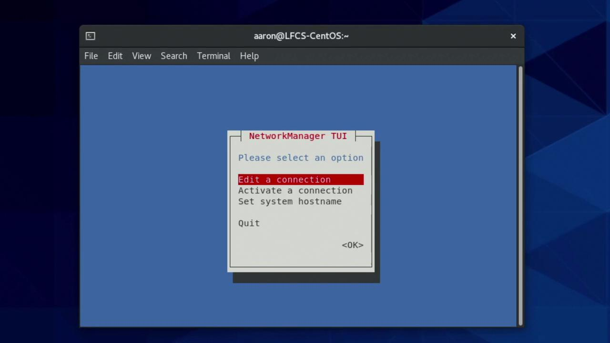
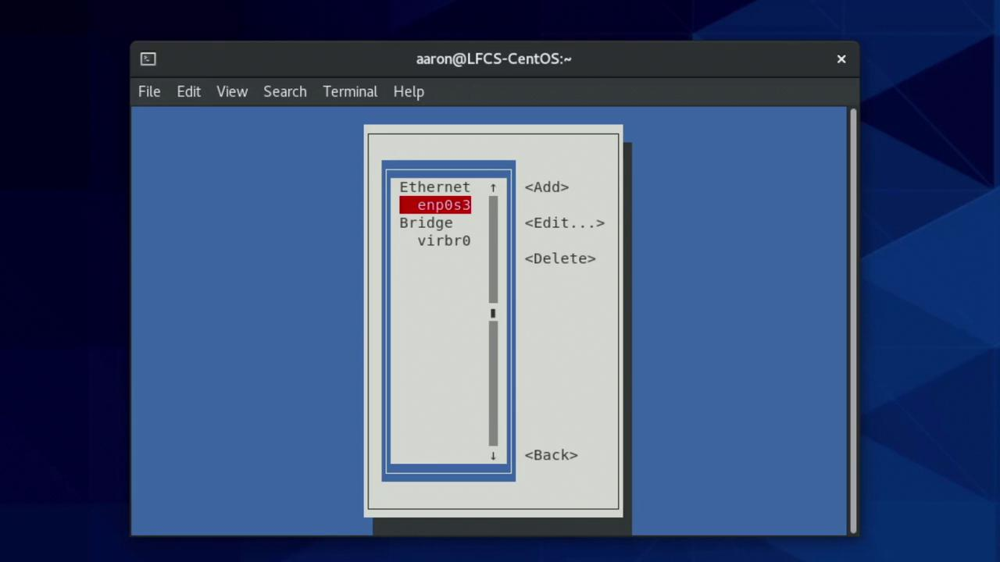
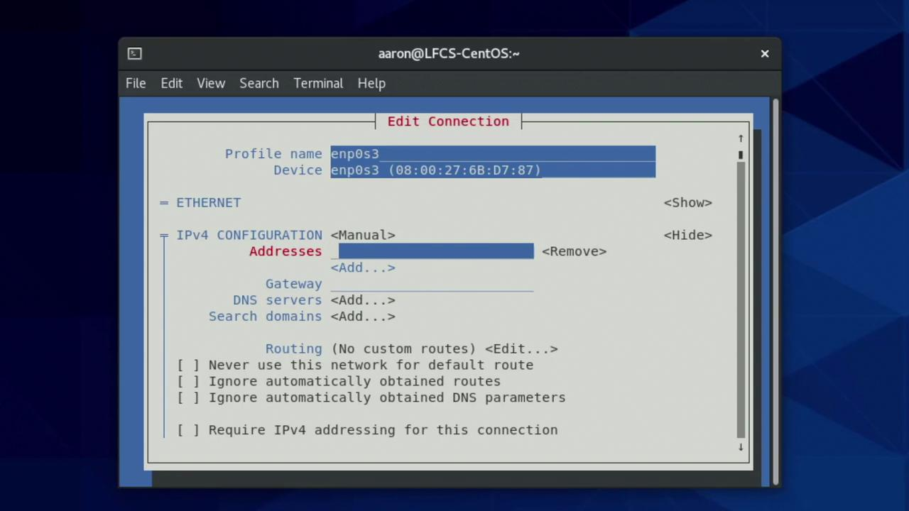
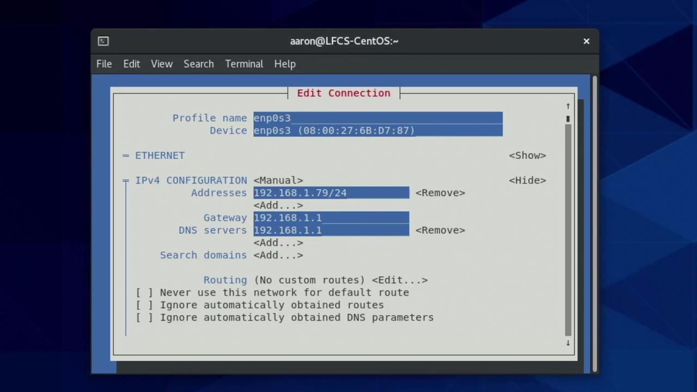

# Generated by NetworkManager
nameserver 192.168.1.1
[aaron@LFCS-CentOS ~]$
```

Each line beginning with `nameserver` signifies a valid DNS resolver. It is common to configure multiple resolvers for redundancy. The automatic appearance of these settings suggests they were assigned via DHCP or a similar mechanism.

***

## Network Configuration Files in Red Hat-Based Systems

On Red Hat-based distributions, networking configuration files are stored in the `/etc/sysconfig/network-scripts/` directory. Files often follow the naming scheme `ifcfg-<interface>`. For example, the configuration file for the enp0s3 interface might be:

```bash theme={null}
[aaron@LFCS-CentOS ~]$ ls /etc/sysconfig/network-scripts/
ifcfg-enp0s3  route-enp0s3
[aaron@LFCS-CentOS ~]$
```

Viewing the contents of the interface configuration file is simple:

```bash theme={null}
cat /etc/sysconfig/network-scripts/ifcfg-enp0s3
```

A typical file using DHCP might look like:

```bash theme={null}
TYPE=Ethernet
PROXY_METHOD=none
BROWSER_ONLY=no
BOOTPROTO=dhcp
DEFRROUTE=yes
IPV4_FAILURE_FATAL=no
IPV6INIT=yes
IPV6_AUTOCONF=yes
IPV6_DEFROUTE=yes
IPV6_FAILURE_FATAL=no
NAME=enp0s3
UUID=fadff03a-8b55-4b81-b582-3e84b50fa8f5
DEVICE=enp0s3
ONBOOT=yes
```

Notice that `BOOTPROTO=dhcp` signifies a dynamic configuration. For a static setup, change this value to `none` and manually assign the IP address, gateway, and DNS details.

***

## Using NetworkManager Tools: nmtui and nmcli

NetworkManager is the default network management tool on most Red Hat-based systems. Two key utilities provided are:

* **nmtui**: A text-based user interface.
* **nmcli**: A command-line interface.

### Editing a Connection with nmtui

Launch nmtui by executing:

```bash theme={null}
sudo nmtui
```

You will see an interface similar to the following:

<Frame>
  
</Frame>

Select "Edit a connection" and choose the network connection corresponding to enp0s3:

<Frame>
  
</Frame>

Within the editor, use the Tab and arrow keys to navigate between fields. The profile name can be arbitrary, but the "Device" field must exactly match the network interface (e.g., enp0s3). By default, the IPv4 and IPv6 settings use DHCP. To configure IPv4 with a static IP, change the method from "automatic" to "manual" and specify your desired static address (e.g., 192.168.1.79/24) along with the default gateway and DNS information.

<Frame>
  
</Frame>

After entering the static settings, navigate to the "OK" button to save your changes:

<Frame>
  
</Frame>

<Callout icon="triangle-alert">
  If you are connected remotely (e.g., via SSH), saving these changes may temporarily disrupt your network connection. It is advisable to test the new configuration locally before applying it to remote systems.
</Callout>

It is also possible to combine both DHCP and manual assignments. In such a hybrid configuration, the system obtains a primary IP via DHCP, while additional manual IP addresses are applied upon connection restart or system boot.

To apply the changes immediately, use nmcli. For example, if your network interface is correctly identified as enp0s3, run:

```bash theme={null}
sudo nmcli device reapply enp0s3
```

If you mistype the device name, you will receive an error such as:

```bash theme={null}
sudo nmcli device reapply enp03
```

which produces:

```bash theme={null}
# Error: Device 'enp03' not found.
```

After verifying the correct device name with `ip link show`, reapply using:

```bash theme={null}
sudo nmcli device reapply enp0s3
```

A successful operation returns:

```bash theme={null}
Connection successfully reapplied to device 'enp0s3'.
```

***

## Hostname Resolution

Hostname resolution is essential for converting human-friendly domain names into IP addresses. When you run a command like:

```bash theme={null}
ping google.com
```

the system resolves google.com to an IP address (e.g., 142.251.33.46) and sends ICMP packets to it. A sample ping output could be:

```bash theme={null}
[aaron@LFCS-CentOS ~]$ ping google.com
PING google.com (142.251.33.46) 56(84) bytes of data.
64 bytes from dfw28s31-in-f14.le100.net (142.251.33.46): icmp_seq=1 ttl=116 time=14.9 ms
64 bytes from dfw28s31-in-f14.le100.net (142.251.33.46): icmp_seq=2 ttl=116 time=15.7 ms
64 bytes from dfw28s31-in-f14.le100.net (142.251.33.46): icmp_seq=3 ttl=116 time=13.9 ms
^C
--- google.com ping statistics ---
3 packets transmitted, 3 received, 0% packet loss, time 201ms
rtt min/avg/max/mdev = 13.880/14.825/15.741/0.760 ms
[aaron@LFCS-CentOS ~]$
```

This dynamic resolution relies on the DNS server configured earlier (in this case, 192.168.1.1).

### Static Hostname Resolution via /etc/hosts

Static hostname resolution bypasses DNS by using the local `/etc/hosts` file. Open the file using a text editor with elevated privileges:

```bash theme={null}
sudo vim /etc/hosts
```

A sample file might contain:

```text theme={null}
127.0.0.1       localhost localhost.localdomain localhost4 localhost4.localdomain4
::1             localhost localhost.localdomain localhost6 localhost6.localdomain6
192.168.0.18    LFCS-CentOS2
```

To add a new static mapping—for instance, for a database server—append a new line:

```text theme={null}
192.168.1.82    dbserver
```

After saving the file, verify the static mapping by pinging the new hostname:

```bash theme={null}
ping dbserver
```

Expected output (even if the host is unreachable) will confirm that the hostname is resolving to 192.168.1.82:

```bash theme={null}
[aaron@LFCS-CentOS ~]$ ping dbserver
PING dbserver (192.168.1.82) 56(84) bytes of data.
From LFCS-CentOS (192.168.1.79) icmp_seq=1 Destination Host Unreachable
From LFCS-CentOS (192.168.1.79) icmp_seq=2 Destination Host Unreachable
From LFCS-CentOS (192.168.1.79) icmp_seq=3 Destination Host Unreachable
^C
--- dbserver ping statistics ---
5 packets transmitted, 0 received, +3 errors, 100% packet loss, time 4133ms
pipe 3
[aaron@LFCS-CentOS ~]$
```

This ensures that commands like:

```bash theme={null}
ssh aaron@dbserver
```

will use the static IP mapping, making it easier to connect without remembering complex IP addresses.

If you need reminders on available commands, simply type:

```bash theme={null}
ip
```

Press the Tab key twice to view available commands, and similarly for `nmcli`. A sample output for the `ip` command might be:

```bash theme={null}
[aaron@LFCS-CentOS ~]$ ip
address      l2tp        mroute      nexthop    tap         xfrm
addrlabel    link        mrule       ntable     tcpmetrics  token
fou          macsec      neighbour   ntbl       route       tunnel
help         maddress    netconf     rule       ila         monitor
netns        sr          vrf
```

***

## Conclusion

This guide has covered essential topics for configuring networking and hostname resolution on Linux both statically and dynamically. The areas discussed include:

| Topic                            | Key Task                                | Example Command/Action                                     |
| -------------------------------- | --------------------------------------- | ---------------------------------------------------------- |
| Identifying interfaces           | Listing network devices                 | `ip link show` or `ip a`                                   |
| Viewing addresses                | Displaying IP configuration             | `ip address show`                                          |
| Reviewing routes                 | Checking the system's routing table     | `ip route show` or `ip r`                                  |
| Dynamic vs. Static configuration | Configuring via DHCP or manual settings | Editing `/etc/sysconfig/network-scripts/ifcfg-<interface>` |
| Hostname resolution              | Mapping names to IP; dynamic or static  | Using DNS or `/etc/hosts` file                             |
| NetworkManager tools             | Using nmtui and nmcli for configuration | `sudo nmtui`, `sudo nmcli device reapply enp0s3`           |

By carefully following these steps, you can seamlessly manage network settings and hostname resolution on your Linux system. Continue exploring and practicing these configurations to ensure robust and reliable network management.

Happy networking!

<CardGroup>
  <Card title="Watch Video" icon="video" href="https://learn.kodekloud.com/user/courses/red-hat-certified-system-administrator-rhcsa/module/5f16da06-6c71-4058-bfc5-6f4dd8754e9f/lesson/b4ec4b4f-e6b3-47cb-bc38-60b9223c570d" />
</CardGroup>


# Configure time service clients

Source: https://notes.kodekloud.com/docs/Red-Hat-Certified-System-AdministratorRHCSA/Manage-Basic-Networking/Configure-time-service-clients/page

This guide explains how to synchronize time on Linux systems using the Chrony daemon for accurate server operations.

Maintaining an accurate system clock is essential for many server operations. Hardware clocks can drift over time, causing discrepancies that might affect scheduling, logging, and security operations. In this guide, you'll learn how to synchronize time on Linux systems using network peers and the Chrony daemon.

Chrony is the default time synchronization tool in modern CentOS systems. It regularly updates the system clock by retrieving time data from trusted internet servers. For example, even a small drift—where your server shows 6 seconds past midnight while the actual time is 5 seconds—can result in noticeable inaccuracies over prolonged periods.

## Verify Chrony Service

To confirm that Chrony is running correctly, execute the following command:

```bash theme={null}
$ systemctl status chronyd.service
Selected source 185.82.232.254 (2.centos.pool.ntp.org)
System clock was stepped by -0.000844 seconds
```

Ensure that the Chrony service is active, enabled, and free from errors. If the service appears inactive or displays errors, refer to the troubleshooting steps in the official [Chrony documentation](https://chrony.tuxfamily.org/).

## Checking System Time Settings

You can inspect the current system time configuration with the `timedatectl` command:

```bash theme={null}
$ timedatectl
Local time: Mon 2021-12-20 01:02:20 CST
Universal time: Mon 2021-12-20 07:02:20 UTC
RTC time: Mon 2021-12-20 07:02:20
Time zone: America/Chicago (CST, -0600)
System clock synchronized: no
NTP service: inactive
RTC in local TZ: no
```

<Callout icon="lightbulb">
  An unsynchronized clock can lead to issues in log management and automated tasks. Always verify that the system time is accurate.
</Callout>

## Configuring Time Zone

Before setting up Chrony, it's important to configure the correct time zone for your server. For instance, to set your server's time zone to New York time, use:

```bash theme={null}
$ sudo timedatectl set-timezone America/New_York
```

To view a list of all available time zones, run:

```bash theme={null}
$ timedatectl list-timezones
America/Adak
America/Anchorage
America/Anguilla
America/Antigua
America/Araguaina
America/Argentina/Buenos_Aires
America/Argentina/Catamarca
America/Argentina/Cordoba
```

## Installing and Enabling Chrony

If Chrony is not already installed on your system, follow these steps:

1. **Install Chrony using the package manager:**

   ```bash theme={null}
   $ sudo dnf install chrony
   ```

2. **Start the Chrony service:**

   ```bash theme={null}
   $ sudo systemctl start chronyd.service
   ```

3. **Enable Chrony to start automatically at boot:**

   ```bash theme={null}
   $ sudo systemctl enable chronyd.service
   Created symlink /etc/systemd/system/multi-user.target.wants/chronyd.service → /usr/lib/systemd/system/chronyd.service.
   ```

## Verifying Time Synchronization

After installing Chrony, check again using `timedatectl`:

```bash theme={null}
$ timedatectl
Local time: Mon 2021-12-20 01:22:49 CST
Universal time: Mon 2021-12-20 07:22:49 UTC
RTC time: Mon 2021-12-20 07:22:46
Time zone: America/Chicago (CST, -0600)
System clock synchronized: yes
NTP service: active
RTC in local TZ: no
```

If you find that the system clock is still not synchronized, force synchronization by running:

```bash theme={null}
$ sudo systemctl set-ntp true
```

<Callout icon="lightbulb">
  For additional details on troubleshooting time synchronization issues, please refer to the [Chrony Troubleshooting Guide](https://chrony.tuxfamily.org/documentation.html).
</Callout>

## Conclusion

By following the aforementioned steps, your server will maintain the correct time automatically, enhancing the reliability of server processes. Accurate timekeeping is crucial for server security, logging, and overall performance.

Now, let's get started with some hands-on labs.

<CardGroup>
  <Card title="Watch Video" icon="video" href="https://learn.kodekloud.com/user/courses/red-hat-certified-system-administrator-rhcsa/module/5f16da06-6c71-4058-bfc5-6f4dd8754e9f/lesson/75246eb4-0b66-4d9e-abb8-6dceb2f8b4c0" />

  <Card title="Practice Lab" icon="installation" href="https://learn.kodekloud.com/user/courses/red-hat-certified-system-administrator-rhcsa/module/5f16da06-6c71-4058-bfc5-6f4dd8754e9f/lesson/56e15344-ad6d-47f3-aaa4-2e905001fd44" />
</CardGroup>
