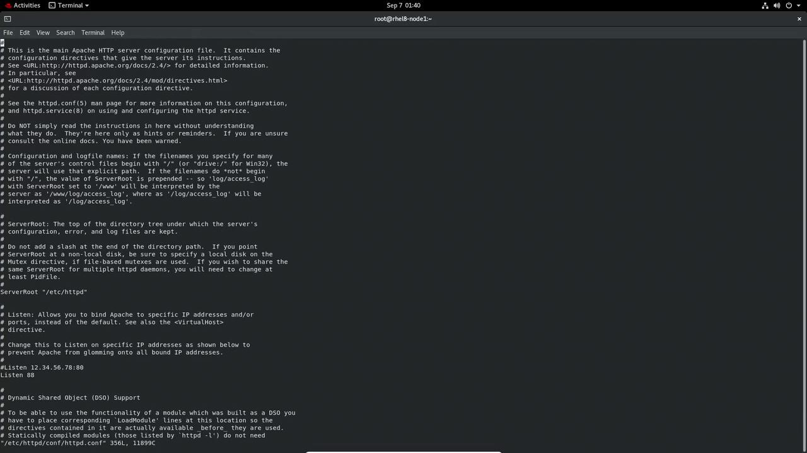

# DocumentRoot: The directory out of which you will serve your documents.
DocumentRoot "/kodedu"

# Further configuration...
```

<Frame>
  
</Frame>

After updating the configuration, create the new document root directory and add a simple HTML file:

```bash theme={null}
mkdir /kodedu
echo "KodeKloud" > /kodedu/kodekloud.html
```

Restart Apache to apply the changes:

```bash theme={null}
systemctl restart httpd.service
```

When you access `http://127.0.0.1:88/kodekloud.html`, you might receive a "Forbidden" error. This error indicates that SELinux is denying access because the file contexts are incorrect. Check the current SELinux labels with:

```bash theme={null}
ls -laZ /kodedu/
```

Files in `/kodedu` often have a generic context (e.g., `default_t`) instead of the required `httpd_sys_content_t`.

<Callout icon="lightbulb">
  To resolve this, use the `semanage` command to assign the proper context.
</Callout>

Apply the correct file context with:

```bash theme={null}
semanage fcontext -a -t httpd_sys_content_t '/kodedu(/.*)?'
```

Then, run the following command to update the file contexts recursively:

```bash theme={null}
restorecon -R /kodedu/
```

Confirm the updated context by checking again:

```bash theme={null}
ls -laZ /kodedu/
```

Finally, verify that the Apache default page is accessible:

```bash theme={null}
curl 127.0.0.1:88/kodekloud.html
```

The output should display the expected HTML ("KodeKloud") content.

***

## Summary

In this lesson, you learned how to:

* Use Boolean values at boot time to modify SELinux behavior.
* Diagnose SELinux policy violations through `systemctl` and `journalctl`.
* Generate and apply local SELinux policy modules.
* Correct file contexts using `semanage` and `restorecon` to resolve access issues with Apache.

Proceed to your next lab or lecture with these troubleshooting techniques to ensure a secure and smoothly functioning SELinux environment.

<CardGroup>
  <Card title="Watch Video" icon="video" href="https://learn.kodekloud.com/user/courses/red-hat-certified-system-administrator-rhcsa/module/5935b82f-37ac-4f4e-b619-0a6f8824088b/lesson/f0b8a7df-876c-4dc6-b244-5646249e9b1e" />

  <Card title="Practice Lab" icon="installation" href="https://learn.kodekloud.com/user/courses/red-hat-certified-system-administrator-rhcsa/module/5935b82f-37ac-4f4e-b619-0a6f8824088b/lesson/cd35f9c8-f07f-423e-bf97-73b96b18d76f" />
</CardGroup>


# Configure PAM

Source: https://notes.kodekloud.com/docs/Red-Hat-Certified-System-AdministratorRHCSA/Manage-Users-and-Groups/Configure-PAM/page

This article provides a guide on configuring Pluggable Authentication Modules (PAM) for user authentication in various scenarios.

Welcome to this detailed guide on configuring Pluggable Authentication Modules (PAM). In this article, you'll learn the fundamentals of authentication, explore the PAM configuration files, and see how to modify them for various authentication scenarios.

## Understanding Authentication with su

When you run a command like `su`, it prompts for the root user's password. Entering the correct password proves your identity and grants you the privileges of the root user. For example:

```bash theme={null}
[aaron@LFCS-CentOS ~]$ su
Password:
[aaron@LFCS-CentOS ~]$
```

This simple interaction demonstrates how authentication works. Not only do humans authenticate, but programs also use authentication to verify and share confidential data with one another.

## Introducing PAM

Pluggable Authentication Modules (PAM) provide a flexible mechanism for authenticating users. With PAM, you can plug in different authentication methods, customize utilities like `su`, and even require specific actions like plugging in a USB security token for authentication.

PAM's configuration files can be found in the `/etc/pam.d` directory. To inspect the directory contents, run:

```bash theme={null}
[aaron@LFCS-CentOS ~]$ ls /etc/pam.d/
atd                     gdm-launch-environment  remote
chfn                    gdm-password            runuser
chsh                    gdm-pin                 runuser-l
cockpit                 gdm-smartcard           smartcard-auth
config-util             login                   smtp
crond                   other                   sssd
cups                    passwd                  sssd-shadowutils
fingerprint-auth        password-auth           su
gdm-autologin           polkit-1                sudo
gdm-fingerprint         postlogin               sudo-i
                       system-auth             su-l
```

Notice the `su` file in the directory, which defines the PAM modules for the `su` utility. Let’s take a closer look at its contents.

```bash theme={null}
[aaron@LFCS-CentOS ~]$ ls /etc/pam.d/
atd                    gdm-launch-environment   gdm-password            gdm-pin
gdm-smartcard         login                    other                  passwd
fingerprint-auth      password-auth            polkit-1               postlogin
gdm-autologin
```

In this demonstration, after providing the necessary password for authentication, we modify the configuration. Below is an example snippet from the PAM configuration file:

```plaintext theme={null}
#%PAM-1.0
auth      required      pam_env.so
auth      sufficient    pam_rootok.so
