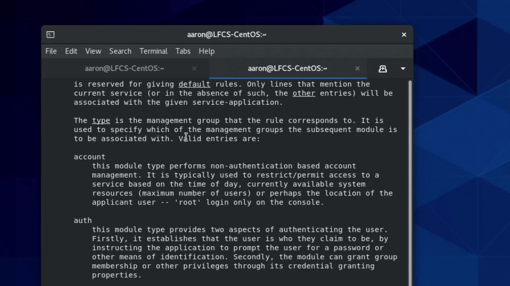
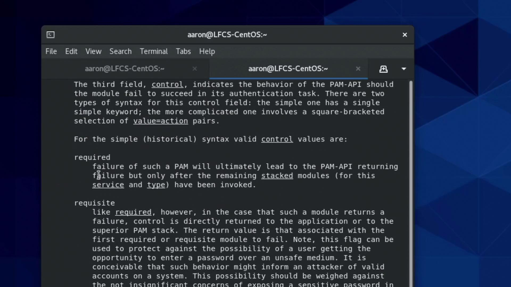
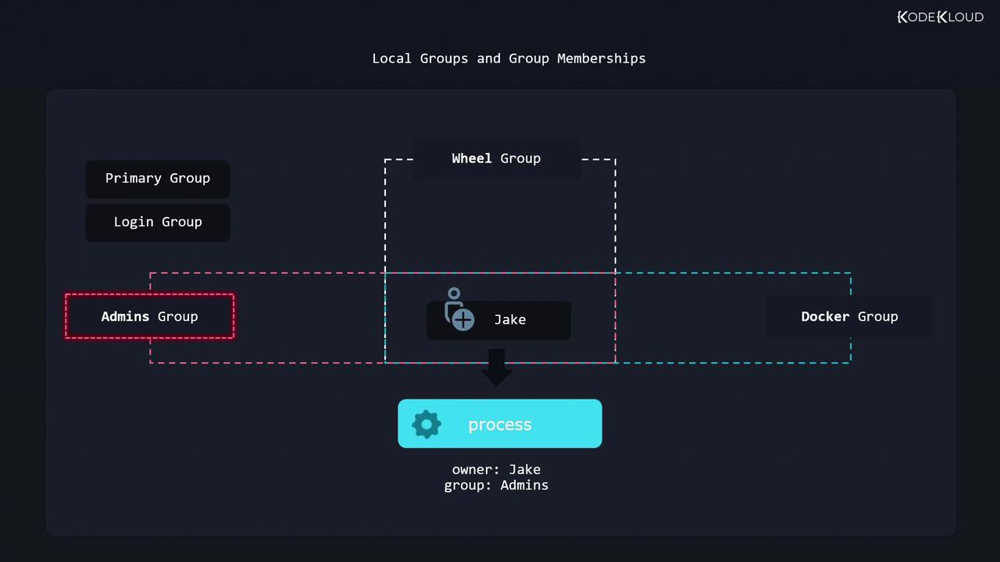

# Uncomment the following line to implicitly trust users in the "wheel" group.
auth      sufficient    pam_wheel.so trust use_uid
# Uncomment the following line to require a user to be in the "wheel" group.
#auth      required      pam_wheel.so use_uid
auth      substack      system-auth
auth      include       postlogin
account   sufficient    pam_succeed_if.so uid = 0 use_uid quiet
account   include       system-auth
password  include       system-auth
session   include       system-auth
session   include       postlogin
session   optional      pam_xauth.so
```

By uncommenting the line containing `pam_wheel.so trust use_uid`, an additional authentication module is activated. When you execute `su`, the modules are processed in the specified order, each serving its distinct purpose.

<Callout icon="lightbulb">
  PAM modules are categorized into four types:

  * **auth modules**: Verify the identity of a user.
  * **account modules**: Manage tasks related to user accounts.
  * **password modules**: Handle password updates.
  * **session modules**: Prepare the user's session after authentication.
</Callout>

### How PAM Modules Work

The control fields (e.g., required, sufficient, requisite) in the configuration determine how each module's result affects the overall authentication process:

* **required**: Every module marked as required runs, even if one fails. All must pass for authentication to succeed.
* **requisite**: If a module fails, the process halts immediately.
* **sufficient**: If a module passes, remaining modules may be skipped.

For example, the `pam_rootok.so` module allows the root user to bypass password authentication if the module returns a success.

Here’s the improved configuration snippet with proper alignment for clarity:

```plaintext theme={null}
#%PAM-1.0
auth            required        pam_env.so
auth            sufficient      pam_rootok.so
# Uncomment the following line to implicitly trust users in the "wheel" group.
auth            sufficient      pam_wheel.so    trust use_uid
# Uncomment the following line to require a user to be in the "wheel" group.
#auth           required        pam_wheel.so    use_uid
auth            substack        system-auth
auth            include         postlogin
account         sufficient      pam_succeed_if.so    uid = 0 use_uid quiet
account         include         system-auth
password        include         system-auth
session         include         system-auth
session         include         postlogin
session         optional        pam_xauth.so
```

For more detailed information about these modules and their control flags, consult the PAM configuration manual:

```bash theme={null}
man pam.conf
```

<Frame>
  
</Frame>

### Choosing the Right Control Flags

Consider a scenario where you want the user to authenticate only if they provide both a personal USB security token and a password. In such a case, both modules should be set as required. If only one authentication method succeeds, the overall authentication will fail. Alternatively, if you wish to allow access when either method is successful, you would configure both modules as sufficient.

The difference between control flags like required, requisite, and sufficient can significantly alter the authentication flow. For instance, a failing requisite module halts the process immediately, whereas a failing required module still lets subsequent modules run to log the attempt or perform other tasks.

Below is another display of the detailed PAM configuration:

```plaintext theme={null}
#%PAM-1.0
auth        required      pam_env.so
auth        sufficient    pam_rootok.so
# Uncomment the following line to implicitly trust users in the "wheel" group.
auth        sufficient    pam_wheel.so    trust use_uid
# Uncomment the following line to require a user to be in the "wheel" group.
#auth       required      pam_wheel.so    use_uid
auth        substack      system-auth
auth        include       postlogin
account     sufficient    pam_succeed_if.so uid = 0 use_uid quiet
account     include       system-auth
password    include       system-auth
session     include       system-auth
session     include       postlogin
session     optional      pam_xauth.so
```

Additional documentation on the PAM API and its control fields is available in the module manual pages.

<Frame>
  
</Frame>

### Exploring PAM Modules with man

To see an overview of available PAM modules, execute:

```bash theme={null}
[aaron@LFCS-CentOS ~]$ man pam
```

This command displays manual pages for modules such as `pam_unix`, `pam_wheel`, and others. For an in-depth look at the configuration details, try:

```bash theme={null}
man pam.conf
```

This will list modules with their functionalities. A typical output might resemble:

```bash theme={null}
[aaron@LFCS-CentOS ~]$ man pam.conf
pam
pam_access          pam_keyinit        pam_lastlog
pam.conf           pam_limits        pam_listfile
pam_console        pam_localuser     pam_loginit
pam_console_apply   pam_loginuid      pam_mail
pam.d              pam_mkhomedir     pam_motd
pam_debug          pam_namespace      pam_nologin
pam_env.conf       pam_oddjob_mkhomedir  pamon
pam_failedt       pam_permit        pam_postgresok
pam_faillock       pam_pwistory      pam_pwquality
pam_filter         pam_rhosts        pam_rootok
pam_exec          pam_security      pam_succeed_if
pam_deny           pam_selinux       pam_sepermit
pam_echo           pam_shells        pam_ssh_add
pam_env            pam_sss          pam_sss_gss
pam_issue          pam_systemd       pam_time
pam_exec           pam_timestamp     pam_timestamp_check
pam_failetd       pam_tty_audit     pam_umask
pam_unix           pam_userdb        pam_usertype
pam_warn           pam_wheel        pam_xauth
```

This command is an excellent way to explore and understand the numerous options available with each PAM module.

## Testing the New PAM Configuration

After modifying your PAM configuration for the `su` command, confirm that your user is a member of the `wheel` group with:

```bash theme={null}
[aaron@LFCS-CentOS ~]$ groups
aaron wheel family
```

Since the configuration now includes the `pam_wheel.so trust use_uid` module, being part of the `wheel` group should let you switch to the root user without needing a password:

```bash theme={null}
[aaron@LFCS-CentOS ~]$ su
[root@LFCS-CentOS aaron]#
```

To exit the root session, simply type:

```bash theme={null}
[aaron@LFCS-CentOS ~]$ exit
exit
[aaron@LFCS-CentOS ~]$
```

## Summary

In this article, we explored how PAM allows you to configure authentication modules in a specific sequence, with diverse control flags that influence the authentication process. We reviewed the syntax of PAM configuration files, observed key modules like `pam_rootok.so` and `pam_wheel.so`, and tested the changes using the `su` command.

For further information, remember to consult these resources:

* [man pam.conf](https://linux.die.net/man/8/pam.conf)
* [man pam](https://linux.die.net/man/8/pam)

Proceed to your next demo or lecture for more in-depth coverage of system authentication strategies.

<CardGroup>
  <Card title="Watch Video" icon="video" href="https://learn.kodekloud.com/user/courses/red-hat-certified-system-administrator-rhcsa/module/c2d7d0cc-a429-484c-b81b-674ff5fadc7e/lesson/dcca6371-1022-4760-9ebf-0594df308f3e" />

  <Card title="Practice Lab" icon="installation" href="https://learn.kodekloud.com/user/courses/red-hat-certified-system-administrator-rhcsa/module/c2d7d0cc-a429-484c-b81b-674ff5fadc7e/lesson/e2697162-3126-48e1-b5cc-144e7f26d186" />
</CardGroup>


# Create delete and modify local groups and group memberships

Source: https://notes.kodekloud.com/docs/Red-Hat-Certified-System-AdministratorRHCSA/Manage-Users-and-Groups/Create-delete-and-modify-local-groups-and-group-memberships/page

Managing local groups and memberships on Linux for role assignment and permissions management, including creating, deleting, and modifying groups and users.

Managing local groups and their memberships on a Linux system is essential for efficient role assignment and permissions management. By organizing users into groups, you can easily grant or restrict access to files, directories, and system functions. For example, when multiple developers work on a shared project, creating a group (e.g., Developers) and assigning the relevant users to that group simplifies file ownership and permission adjustments.

Groups also grant specific system privileges. Users in the wheel or sudo groups can perform administrative tasks, while members of the Docker group have permissions to manage Docker containers. Every user has a primary group (or login group) assigned at login, and can additionally belong to multiple secondary or supplementary groups.

<Callout icon="lightbulb">
  When a user launches a program or creates a file, the system uses their primary group to determine default file ownership and process privileges. Secondary groups provide additional access without changing the primary group context.
</Callout>

Below are two common scenarios illustrating the role of primary groups:

1. When a user launches a program, the process runs with the privileges of their account and primary group.

<Frame>
  
</Frame>

2. When a user creates a file, it is automatically owned by their user account and their primary (login) group.

If you want to follow along with the exercises, start by creating a user called John and a new group named Developers. Use the following commands:

```bash theme={null}
sudo useradd john
sudo groupadd developers
```

Next, add user John to the Developers group using the gpasswd command. Although the command name hints at password management, it is primarily used nowadays for modifying group memberships:

```bash theme={null}
sudo gpasswd --add john developers
```

To confirm John’s group memberships, use the groups command. Notice that the first group listed is his primary (login) group while any additional groups are secondary:

```bash theme={null}
groups john
