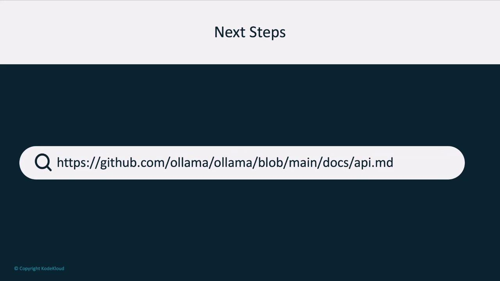
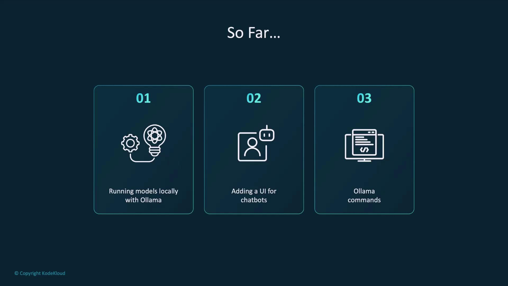
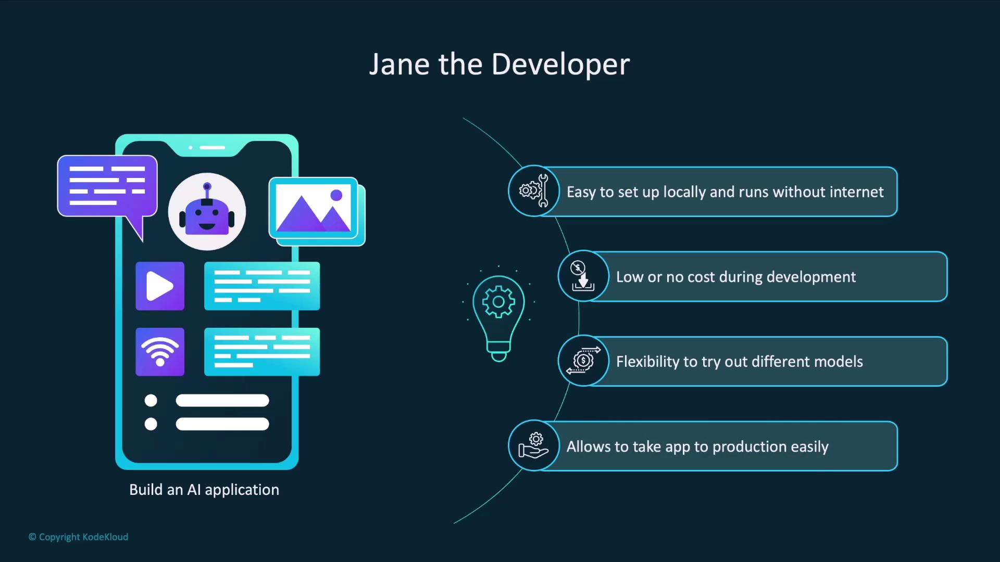
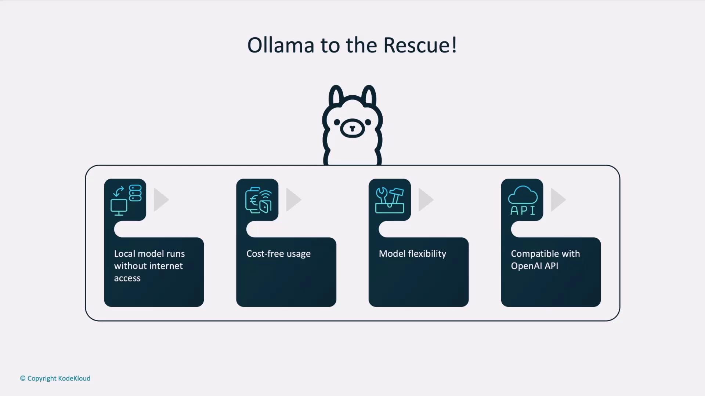
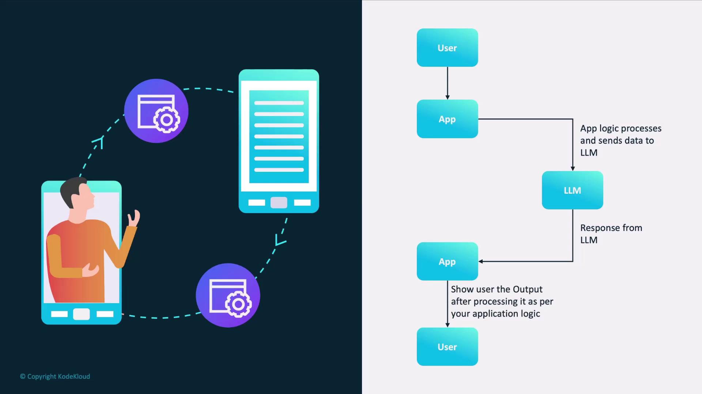
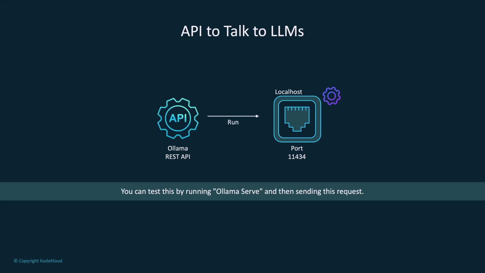

# Copy a model locally
curl http://localhost:11434/api/copy -d '{
  "source": "llama3.2",
  "destination": "llama3-copy"
}'

# Delete a model (use with caution)
curl -X DELETE http://localhost:11434/api/delete -d '{
  "model": "llama3:13b"
}'

# Pull a model from the Ollama library
curl http://localhost:11434/api/pull -d '{
  "model": "llama3.2"
}'
```

<Callout icon="triangle-alert">
  Deleting a model is irreversible. Ensure you specify the correct model name to avoid accidental data loss.
</Callout>

***

## Full API Reference

For a complete list of endpoints and detailed parameters, see the [official API documentation][api-docs].

<Frame>
  
</Frame>

***

Next, we'll demonstrate how to call these endpoints programmatically using an OpenAI-compatible client library. Stay tuned!

## Links and References

* [Official Ollama API Docs][api-docs]
* [GitHub Repository](https://github.com/jmorganca/ollama)

[api-docs]: https://github.com/jmorganca/ollama/blob/main/docs/api.md

<CardGroup>
  <Card title="Watch Video" icon="video" href="https://learn.kodekloud.com/user/courses/running-local-llms-with-ollama/module/8df2f2d5-d3c5-433d-b5f5-f553b040b2e7/lesson/f2bce596-2a70-46cd-838c-d3bb91586835" />
</CardGroup>


# Ollama REST API Introduction

Source: https://notes.kodekloud.com/docs/Running-Local-LLMs-With-Ollama/Building-AI-Applications/Ollama-REST-API-Introduction/page

This tutorial teaches how to launch and interact with Ollama’s REST API for AI applications.

In this tutorial, you’ll learn how to launch and interact with Ollama’s REST API. We’ll cover:

* Running the API server locally
* Sending requests via HTTP
* Interpreting responses for seamless integration into your applications

<Frame>
  
</Frame>

***

## Why Use the Ollama REST API?

Imagine you’re Jane, a developer building an AI-powered app. Your goals include:

* Quick local setup without internet access
* Zero costs during experimentation
* Easy swapping of LLM models
* A simple transition to production with hosted APIs

<Frame>
  
</Frame>

Ollama checks all these boxes:

| Benefit                  | Description                                                             |
| ------------------------ | ----------------------------------------------------------------------- |
| Offline Usage            | Run models locally without internet after pulling them once.            |
| Free & No Sign-Up        | No credit card required to explore and prototype.                       |
| Model Flexibility        | Compare and switch between different LLMs with a single CLI command.    |
| Production Compatibility | Swap your local endpoint for the OpenAI API when you’re ready to scale. |

<Frame>
  
</Frame>

<Callout icon="lightbulb">
  When it’s time for production, simply update your API base URL and credentials to point at [OpenAI’s API]("https://platform.openai.com/docs/api-reference")—your code stays the same.
</Callout>

***

## How an AI Application Interacts with an LLM

A typical AI workflow involves:

1. User submits input to your app.
2. App pre-processes the text (e.g., tokenization).
3. App sends a request to the LLM endpoint.
4. LLM generates and returns a response.
5. App post-processes the output (e.g., formatting).
6. App displays results to the user.

<Frame>
  
</Frame>

To implement this flow, you need a REST endpoint for both requests and responses. That’s exactly what `ollama serve` provides.

***

## Getting Started: Launching the Ollama Server

By default, Ollama’s REST API runs on port `11434`. Start the server with:

```bash theme={null}
ollama serve
```

Once the service is up, you can send HTTP requests to `http://localhost:11434/api`.

<Frame>
  
</Frame>

<Callout icon="triangle-alert">
  Ensure port `11434` is not used by other services. If it is, stop those processes or choose a different port using `--port <PORT>`.
</Callout>

***

## Example: Generating a Poem with `curl`

Here’s how to call the `llama3.2` model to compose a poem:

```bash theme={null}
curl http://localhost:11434/api/generate -d '{
  "model": "llama3.2",
  "prompt": "Compose a poem on LLMs",
  "stream": false
}'
```

Sample JSON response:

```json theme={null}
{
  "model": "llama3.2",
  "created_at": "2025-01-08T06:19:15.039927Z",
  "response": "In silicon halls, where data reigns\nA new breed of mind, with logic gains\n...A future where language, is a tool for all\nNot a gatekeeper, that stands at the wall\nSo let us nurture these models with care\nAnd guide them gently, through the digital air\nFor in their potential, we find our own\nA world of wonder, where knowledge is sown.",
  "done": true,
  "done_reason": "stop"
}
```

### Response Fields

| Field        | Description                                                      |
| ------------ | ---------------------------------------------------------------- |
| model        | The name of the model that generated the output.                 |
| created\_at  | ISO 8601 timestamp when processing finished.                     |
| response     | The generated text from the model.                               |
| done         | Boolean indicating whether the generation completed.             |
| done\_reason | Explanation for why generation stopped (e.g., `stop`, `length`). |

Additional diagnostic fields (token counts, timing metrics) appear in the payload for performance tuning but are optional for most production use cases.

***

## Next Steps

You’ve now set up the Ollama REST API and tested a simple `generate` endpoint. In the following lessons, we’ll explore:

* Streaming responses for real-time applications
* Custom prompts and system messages
* Advanced endpoints for embeddings, classifications, and more

## Links and References

* [Ollama CLI Reference](https://ollama.com/docs/cli)
* [OpenAI API Reference](https://platform.openai.com/docs/api-reference)
* [Large Language Models Overview](https://en.wikipedia.org/wiki/Large_language_model)

<CardGroup>
  <Card title="Watch Video" icon="video" href="https://learn.kodekloud.com/user/courses/running-local-llms-with-ollama/module/8df2f2d5-d3c5-433d-b5f5-f553b040b2e7/lesson/850e3bf8-9451-41aa-8539-272bc7a9d49d" />
</CardGroup>
