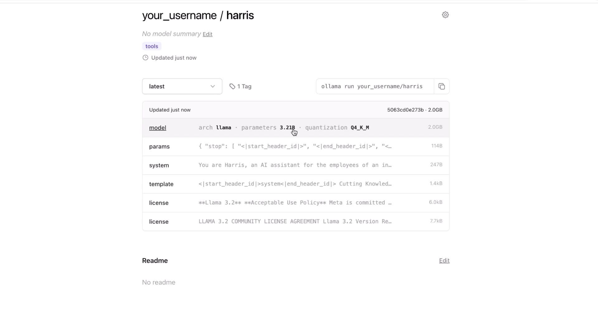
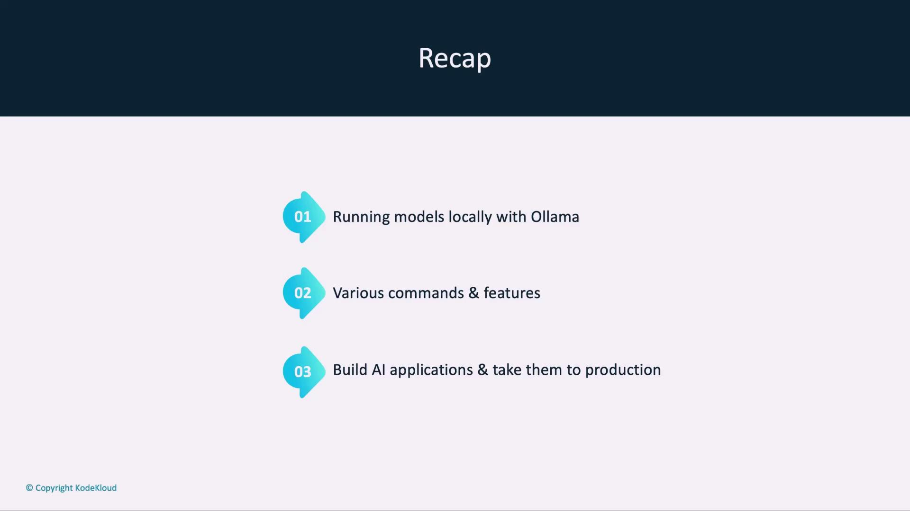
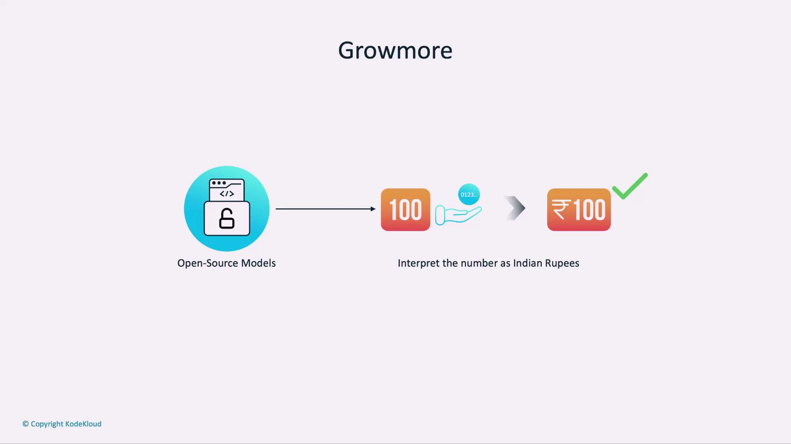
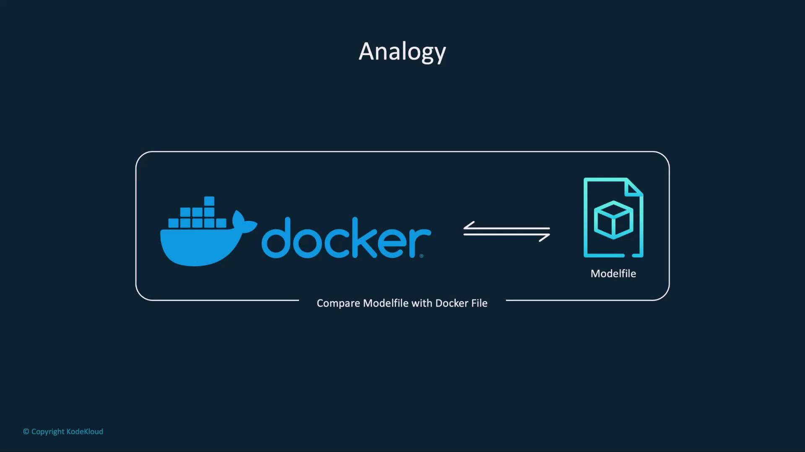
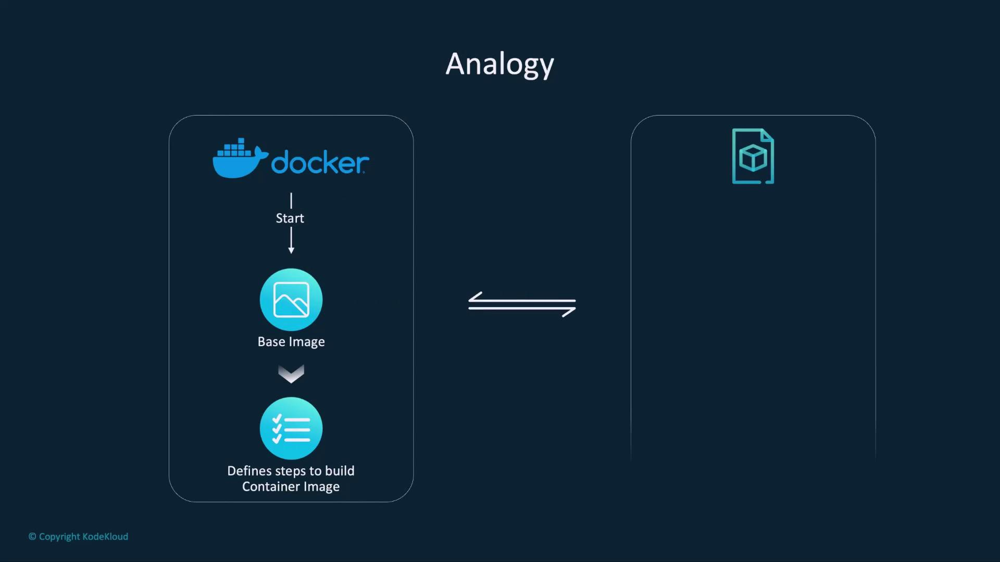
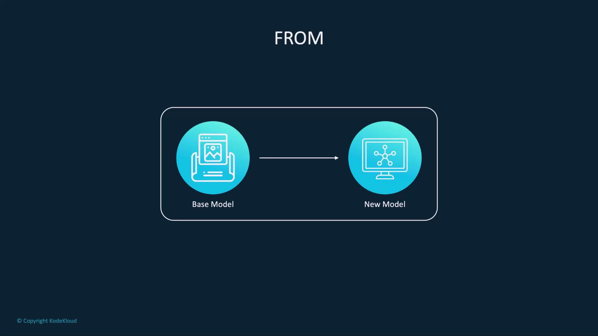
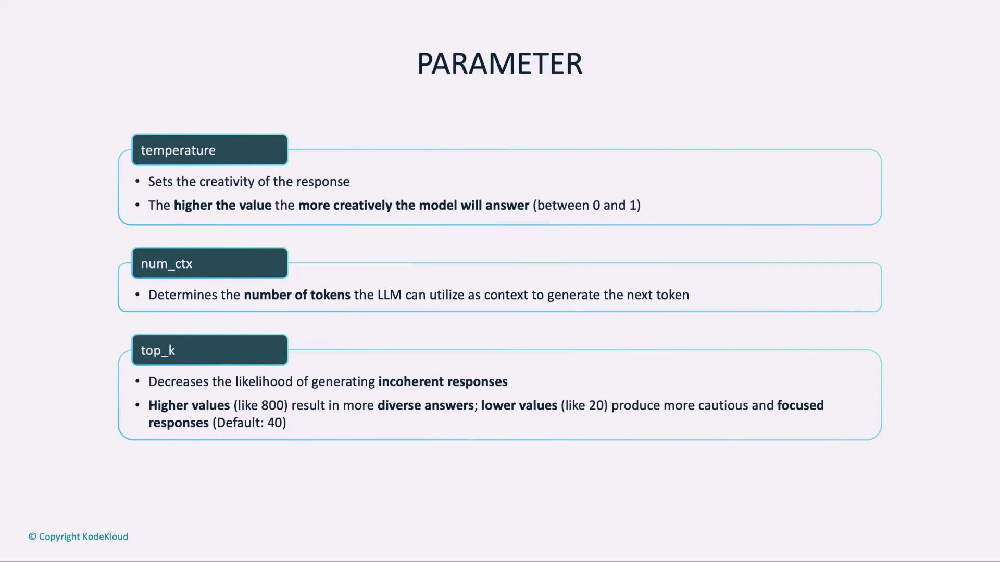

# Example output:
# ssh-ed25519 [SECRET_REDACTED]
```

5. Paste the key into your Ollama **Ollama Key** field and save.

<Callout icon="lightbulb">
  Once added, Ollama will recognize and authenticate your machine for publishing.
</Callout>

***

## 2. Tag and Copy Your Local Model

First, list your existing local models:

```bash theme={null}
ollama ls
```

Example output:

```bash theme={null}
NAME            ID              SIZE    MODIFIED
harris:latest   267a012ab49f    2.0 GB  5 days ago
phi3:latest     4f2222927938    2.2 GB  5 days ago
llama3.2:latest a80c4f17acd5    2.0 GB  6 days ago
```

Next, create a tagged copy under your Ollama username:

```bash theme={null}
ollama copy harris your_username/harris:latest
```

Replace `your_username` with your actual Ollama account name. Verify the new entry:

```bash theme={null}
ollama ls
```

Expected result:

```bash theme={null}
NAME                        ID              SIZE    MODIFIED
your_username/harris:latest 267a012ab49f    2.0 GB  just now
harris:latest               267a012ab49f    2.0 GB  5 days ago
phi3:latest                 4f2222927938    2.2 GB  5 days ago
llama3.2:latest             2.0 GB  6 days ago
```

***

## 3. Push Your Model to the Registry

Push the tagged model to make it available on Ollama:

```bash theme={null}
ollama push your_username/harris:latest
```

Sample output:

```bash theme={null}
retrieving manifest
pushing dd5aaa3fc5ff... 100%
pushing 966de95ca8a6... 100%
...
pushing manifest
success

You can find your model at:
https://ollama.com/your_username/harris
```

Visit the URL to view details such as architecture, parameter count, quantization, and any custom system instructions.

<Frame>
  
</Frame>

***

## 4. Pull and Verify the Custom Model

Anyone with access can now pull and run your personalized model:

```bash theme={null}
ollama pull your_username/harris:latest
```

***

## Quick Reference: Ollama CLI Commands

| Command                    | Description                           | Example                                          |
| -------------------------- | ------------------------------------- | ------------------------------------------------ |
| `ollama ls`                | List all local models                 | `ollama ls`                                      |
| `ollama copy <src> <dest>` | Tag and copy a model for the registry | `ollama copy harris your_username/harris:latest` |
| `ollama push <repo>:<tag>` | Push tagged model to the registry     | `ollama push your_username/harris:latest`        |
| `ollama pull <repo>:<tag>` | Pull a model from the registry        | `ollama pull your_username/harris:latest`        |

***

## Conclusion

Uploading custom models to the Ollama Model Registry simplifies sharing, version control, and collaboration. Experiment with tagging, pushing, and pulling your own models to integrate this workflow into your development process.

<CardGroup>
  <Card title="Watch Video" icon="video" href="https://learn.kodekloud.com/user/courses/running-local-llms-with-ollama/module/5785c7c7-5088-4ac3-b82f-8835e72b66d0/lesson/83650bbf-180c-4956-b5be-cd6560320385" />
</CardGroup>


# Modelfile Introduction

Source: https://notes.kodekloud.com/docs/Running-Local-LLMs-With-Ollama/Customising-Models-With-Ollama/Modelfile-Introduction/page

This article explains Modelfiles and their use in customizing open-source models with Ollama.

In this lesson, you’ll discover what a Modelfile is and how to tailor open-source models using Ollama. We’ve already covered running models locally, explored Ollama’s commands and features, built AI applications, and switched from Ollama to OpenAI keys for production deployments.

## Recap

* Running models locally with Ollama
* Key commands and features
* Building AI-powered applications for production

<Frame>
  
</Frame>

***

## Use Case: Gromor’s Customized Model

Gromor, an investment and portfolio management firm, wants its AI assistant to interpret monetary values in Indian rupees. By creating a Modelfile, Gromor can instruct the base model to output “₹100” instead of “100” when dealing with rupees.

<Frame>
  
</Frame>

***

## Modelfile vs. Dockerfile

A Modelfile is to Ollama what a Dockerfile is to Docker.

<Frame>
  
</Frame>

<Callout icon="lightbulb">
  Both files start from a base image and layer on custom instructions to produce a final artifact.
</Callout>

### Dockerfile Workflow

<Frame>
  
</Frame>

1. `FROM ubuntu:20.04`
2. `RUN apt-get update && apt-get install -y python3`
3. Other build steps…

### Modelfile Workflow

1. `FROM <model name>:<tag>`
2. `PARAMETER` declarations
3. `SYSTEM` and `MESSAGE` instructions

***

## Common Modelfile Fields

Below are the most frequently used instructions in a Modelfile:

### 1. FROM

Specifies the base model image to extend:

<Frame>
  
</Frame>

```dockerfile theme={null}
FROM facebook/opt-1.3b:latest
```

### 2. PARAMETER

Declare hyperparameters that control the model’s output:

<Frame>
  
</Frame>

| Parameter   | Purpose                                  | Example           |
| ----------- | ---------------------------------------- | ----------------- |
| temperature | Creativity vs. precision (0–1)           | `0.2` for factual |
| num\_ctx    | Max tokens in context                    | `512`             |
| top\_k      | Restrict candidate tokens per generation | `50`              |

```modelfile theme={null}
