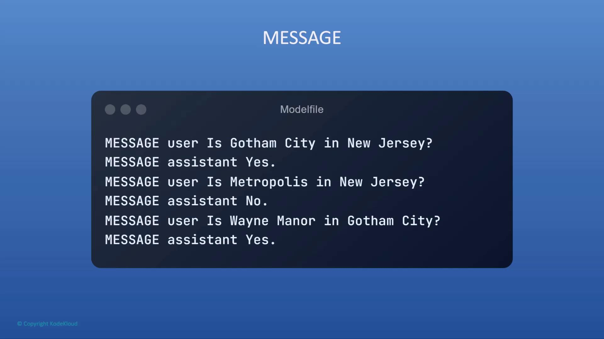

# Lower temperature yields more factual outputs
PARAMETER temperature 0.2
```

<Callout icon="triangle-alert">
  Setting `temperature` too high (e.g., ≥0.9) can produce overly creative or inconsistent responses.
</Callout>

### 3. SYSTEM

Define a high-level system message to steer the model’s role:

```modelfile theme={null}
SYSTEM "You are a financial assistant fluent in INR notation."
```

### 4. MESSAGE

Provide dialogue history to establish context:

<Frame>
  
</Frame>

```modelfile theme={null}
MESSAGE user "Where is Wayne Manor?"
MESSAGE assistant "Wayne Manor is in Gotham City, New Jersey."
```

***

## Next Steps

You now know how to build a Modelfile with `FROM`, `PARAMETER`, `SYSTEM`, and `MESSAGE` instructions.\
For a comprehensive list of Modelfile directives, see the [Ollama Modelfile documentation](https://github.com/ollama/ollama#modelfile).

<CardGroup>
  <Card title="Watch Video" icon="video" href="https://learn.kodekloud.com/user/courses/running-local-llms-with-ollama/module/5785c7c7-5088-4ac3-b82f-8835e72b66d0/lesson/551844ed-0abb-4927-b877-12471ff771fc" />
</CardGroup>


# Section Introduction

Source: https://notes.kodekloud.com/docs/Running-Local-LLMs-With-Ollama/Customising-Models-With-Ollama/Section-Introduction/page

This article covers customizing pre-trained models using a Modelfile for tailored performance and functionality.

Welcome to the final section of this course on Ollama model customization. In this module, you’ll discover how to use the Modelfile—a declarative blueprint that makes it easy to tailor pre-trained models to your unique requirements.

## What Is a Modelfile?

A Modelfile is a configuration file, conceptually similar to a [Dockerfile](https://www.docker.com/), that defines:

* The base model image to start from
* Custom layers or modifications
* Dependencies and environment setup

<Callout icon="lightbulb">
  If you’re familiar with Docker, you’ll recognize the same concepts—base images, commands, and dependency management—when working with a Modelfile.
</Callout>

## Why Customize Models?

Customizing models empowers you to:

* Optimize performance for specialized domains
* Incorporate proprietary datasets during fine-tuning
* Add custom preprocessing or tokenization steps

| Benefit           | Description                                             |
| ----------------- | ------------------------------------------------------- |
| Domain Adaptation | Align models with industry-specific terminology         |
| Efficiency Tuning | Prune or quantize for faster, leaner inference          |
| Feature Extension | Integrate custom modules (e.g., sentiment analysis, QA) |

## Hands-On Demo

In this demo, we’ll:

1. Pull a pre-trained model from the Ollama Registry
2. Write and configure a Modelfile to customize its behavior
3. Build and run the customized model locally

## Publishing to the Ollama Model Registry

Once your model is configured and tested, you’ll publish it to the Ollama Model Registry so others can:

```bash theme={null}
ollama push your-custom-model
ollama pull your-custom-model
```

<Callout icon="triangle-alert">
  Before publishing, make sure you’re authenticated with the Ollama CLI. Run `ollama login` to set up credentials.
</Callout>

## Learning Outcomes

By the end of this lesson, you will be able to:

* Define and configure a Modelfile
* Customize a base model to suit real-world use cases
* Publish your custom model to the Ollama Model Registry

Let’s get started!

## Links and References

* [Ollama Documentation](https://ollama.com/docs)
* [Docker Official Site](https://www.docker.com/)
* [Model Customization Best Practices](https://ollama.com/docs/customization)

<CardGroup>
  <Card title="Watch Video" icon="video" href="https://learn.kodekloud.com/user/courses/running-local-llms-with-ollama/module/5785c7c7-5088-4ac3-b82f-8835e72b66d0/lesson/6443f852-536d-4209-af13-555954dc8f1a" />
</CardGroup>
