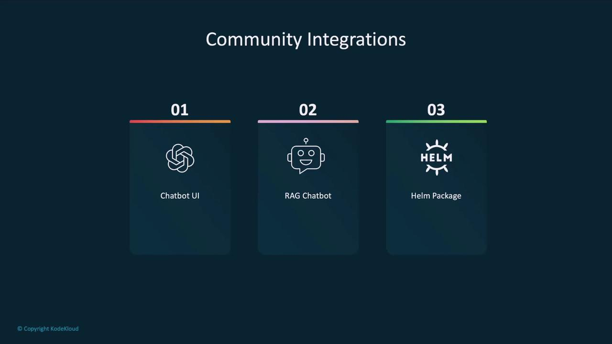
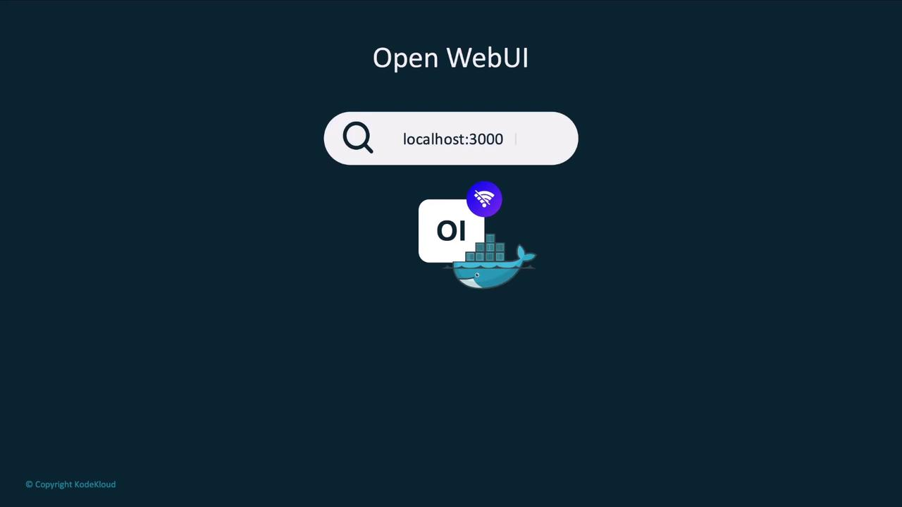
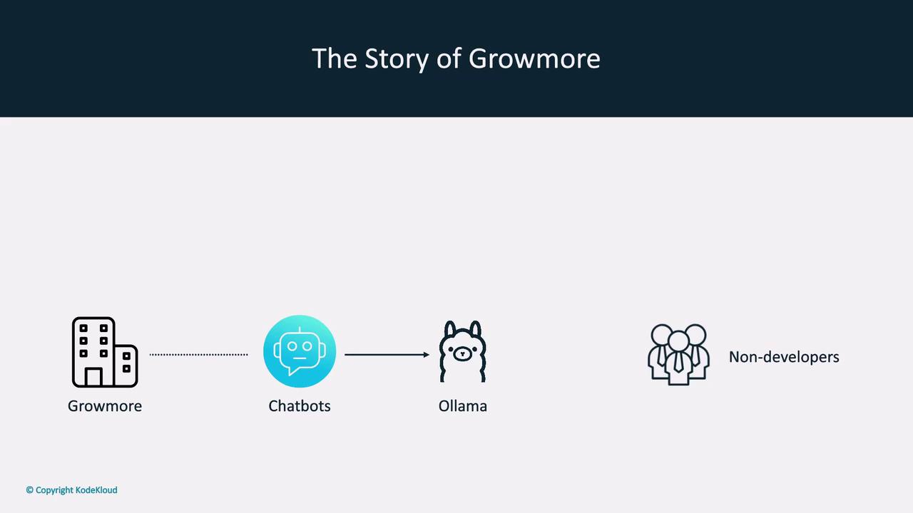
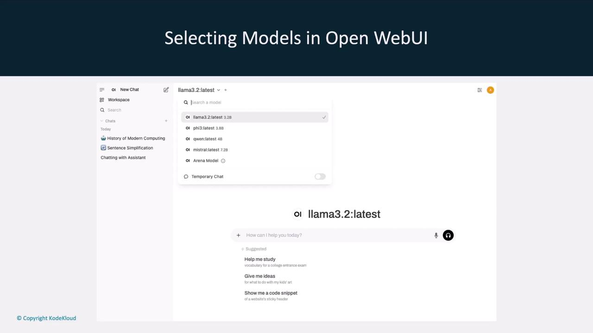
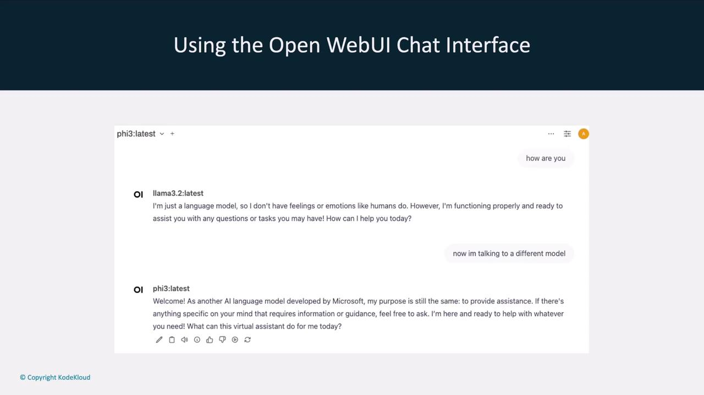

# Community Integrations for Ollama

Source: https://notes.kodekloud.com/docs/Running-Local-LLMs-With-Ollama/Getting-Started-With-Ollama/Community-Integrations-for-Ollama/page

This guide explores community integrations for Ollama, focusing on setting up Open Web UI, a ChatGPT-like interface for local language models.

Ollama is an open-source platform ([Ollama GitHub]) for running local large language models (LLMs) such as Llama. Thanks to a thriving community, you can extend Ollama with interfaces like Chatbot UIs, RAG chatbots, and Kubernetes Helm charts. This guide explores these community integrations and walks through setting up **Open Web UI**, a ChatGPT-like interface for your local models.

## Community Integration Categories

The Ollama community maintains several integration types to enhance your local LLM workflow:

| Integration Category | Purpose                                             | Example Project   |
| -------------------- | --------------------------------------------------- | ----------------- |
| Chatbot UI           | Web-based chat interface for local models           | Open Web UI       |
| RAG Chatbot          | Retrieval-Augmented Generation with PDF/file upload | ollama-rag-ui     |
| Helm Package         | Deploy Ollama and models via Kubernetes Helm charts | ollama-helm-chart |

<Frame>
  
</Frame>

Later in this article, we’ll link to each project. First, let’s focus on **Open Web UI**, a widely adopted ChatGPT-like interface for any local model managed by Ollama.

## Installing and Running Open Web UI

Open Web UI runs inside a Docker container and auto-detects your Ollama agent and locally downloaded models. By default, it listens on port 3000, but you can adjust it as needed.

<Callout icon="lightbulb">
  * Docker installed on your machine
  * Ollama set up with at least one local model
  * Port **3000** available (or choose another port)
</Callout>

### Launching with Docker

Run the following command to start Open Web UI:

```bash theme={null}
docker run -d \
  -p 3000:8080 \
  --add-host=host.docker.internal:host-gateway \
  -v open-webui:/app/backend/data \
  --name open-webui \
  --restart always \
  ghcr.io/open-webui/open-webui:main
```

If the image isn’t present locally, Docker will pull it automatically:

```bash theme={null}
Unable to find image 'ghcr.io/open-webui/open-webui:main' locally
main: Pulling from open-webui/open-webui
...
Status: Downloaded newer image for ghcr.io/open-webui/open-webui:main
```

You can now access the UI at `http://localhost:3000`.

<Frame>
  
</Frame>

## Use Case: Growmore Investment Firm

Consider **Growmore**, an investment firm that values AI productivity without risking sensitive client data to the cloud. Their non-developer staff prefer a familiar chat interface over a terminal.

<Frame>
  
</Frame>

<Callout icon="triangle-alert">
  Running models locally with Ollama ensures that sensitive data never leaves your network. Combine this with community UIs for a secure and user-friendly experience.
</Callout>

By pairing Ollama’s local execution with Open Web UI, Growmore achieves both **data privacy** and a **cloud-like interface** similar to [ChatGPT] or [Claude].

## Exploring Local Models

Once Open Web UI is live, it lists all models available to your Ollama agent. You can effortlessly switch between models like `llama3.2`, `llama2-5.3`, `Qwen`, and `Mistral`.

<Frame>
  
</Frame>

## Interactive Chat Interface

The chat window allows you to converse with any selected model and even change the model mid-conversation. For example, ask **llama3.2** one question, then switch to **llama2-5.3** for a follow-up.

<Frame>
  
</Frame>

This flexibility streamlines your local LLM workflow, letting you compare responses and choose the best model for each task.

## Next Steps and References

In upcoming sections, we’ll dive into other community integrations—such as RAG chatbots and Helm charts—and provide step-by-step setup guides.

## Links and References

* [Ollama GitHub]
* [Open Web UI]
* [ChatGPT]
* [Claude]

[Ollama GitHub]: https://github.com/ollama/ollama

[Open Web UI]: https://github.com/open-webui/open-webui

[ChatGPT]: https://chat.openai.com

[Claude]: https://www.anthropic.com

<CardGroup>
  <Card title="Watch Video" icon="video" href="https://learn.kodekloud.com/user/courses/running-local-llms-with-ollama/module/836a96fe-9951-42b6-83ba-a602299c87c9/lesson/308f1fd2-8248-40a1-9b18-63cf157371e6" />
</CardGroup>
