# At the prompt, type:
show info
```

<Frame>
  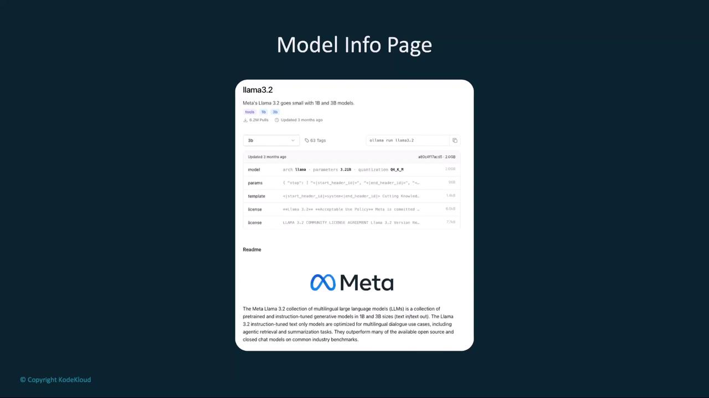
</Frame>

Understanding these terms will help you select a model that aligns with your application’s requirements and hardware constraints. Let’s break them down.

## Architecture

A model’s architecture is its blueprint, defining the core design and the family it belongs to. For example, LLaMA 3.1, 3.2, and 3.3 all share the **LLaMA** architecture—Meta’s transformer-based model line.

<Callout icon="lightbulb">
  If you’ve already built pipelines around one architecture, sticking with the same family ensures consistent behavior.
</Callout>

<Frame>
  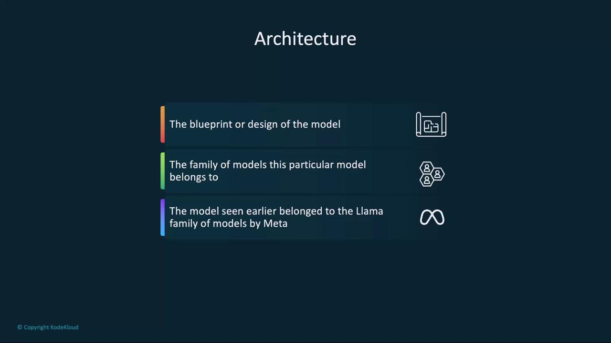
</Frame>

Learn more about transformers in the [Kubernetes Basics](https://kubernetes.io/docs/concepts/overview/what-is-kubernetes/) documentation.

## Parameters

Parameters are the “knowledge” learned during training, stored as numerical weights. Think of a model as a library: each parameter is like a book on the shelf. More parameters = more books = more stored information.

* **3.2 B parameters** means 3.2 billion “books.”
* For comparison, **GPT-3** has **175 B parameters**.

<Frame>
  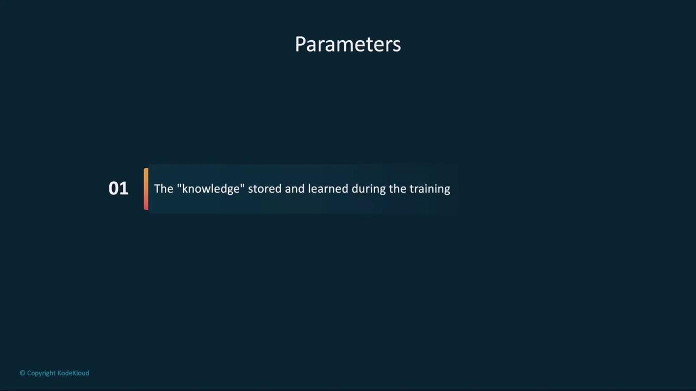
</Frame>

Larger models typically yield better accuracy but require more memory and compute power.

<Callout icon="triangle-alert">
  High-parameter models can exceed your machine’s RAM and slow down inference. Choose a smaller model if you have limited resources.
</Callout>

<Frame>
  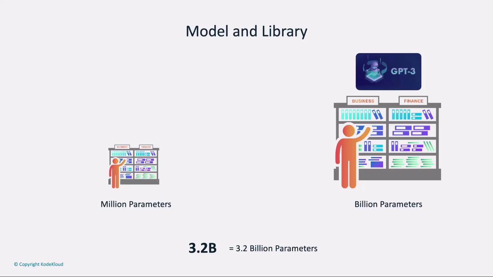
</Frame>

## Weights

Weights determine the strength of connections within the neural network. During training, these values are optimized—much like refining a recipe by adjusting ingredient ratios to get the best flavor.

* Each input feature is an ingredient.
* The weight assigns its importance in the final prediction.

<Frame>
  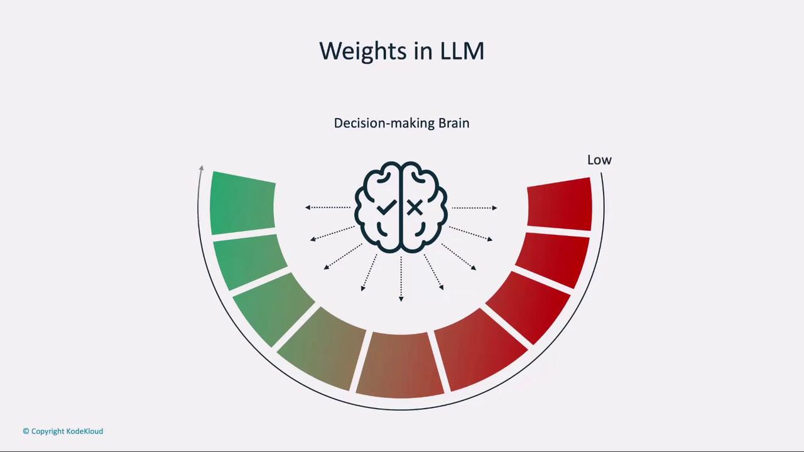
</Frame>

Once training finishes, weights are fixed. If the model “knows” that 2 + 2 = 4, that pathway has a high weight compared to incorrect routes.

## Context Length

Context length (or context window) is the maximum number of tokens the model can process at once. Think of it as how much of your book you can feed to the model at a time.

* **131,072 tokens** ≈ 100K–130K words.

<Frame>
  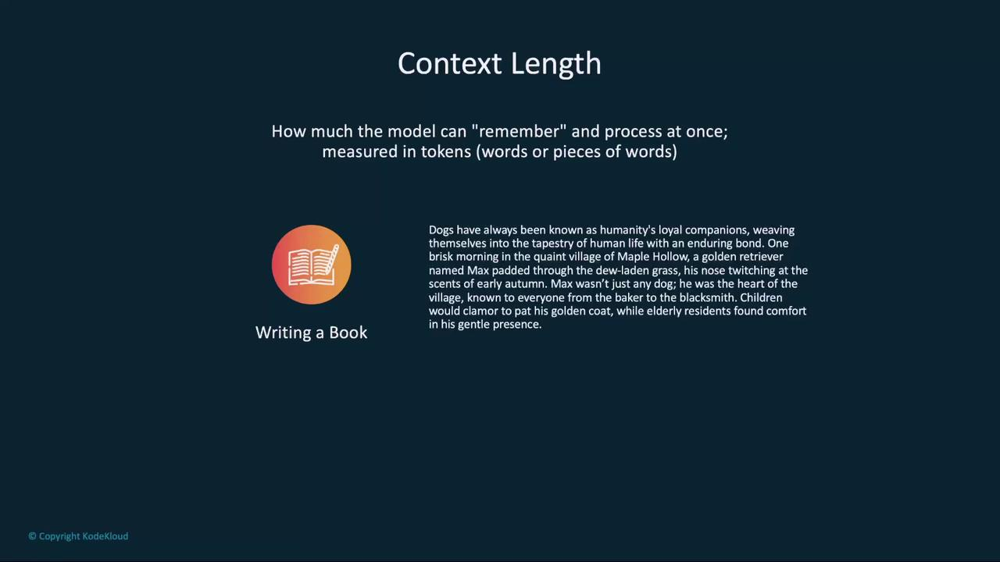
</Frame>

Larger context lengths maintain coherence over longer documents or conversations but also increase memory usage.

<Frame>
  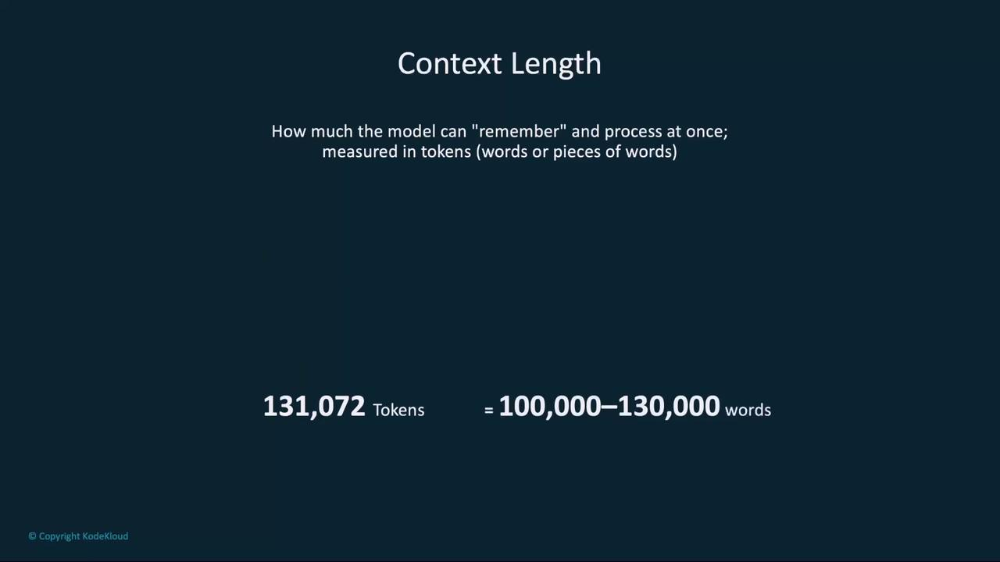
</Frame>

<Callout icon="lightbulb">
  For long transcripts or codebases, choose a model with an extended context window to avoid cutting off important information.
</Callout>

## Embedding Length

When processing text, each token is converted into a vector of fixed length—this is the embedding length. Larger embeddings capture richer contextual information.

* **3,072-dimensional vector** → each token is represented in 3,072 dimensions.

<Frame>
  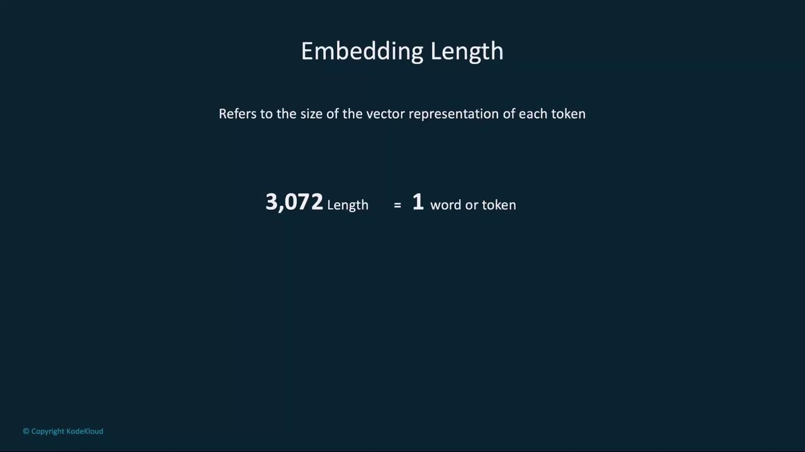
</Frame>

Big embeddings help the model understand subtle nuances but increase computational load.

## Quantization

Quantization reduces numeric precision (e.g., from 32-bit floats to 4-bit integers) to save memory and speed up inference. It’s similar to compressing an image: you lose a bit of detail but gain storage and performance benefits.

<Frame>
  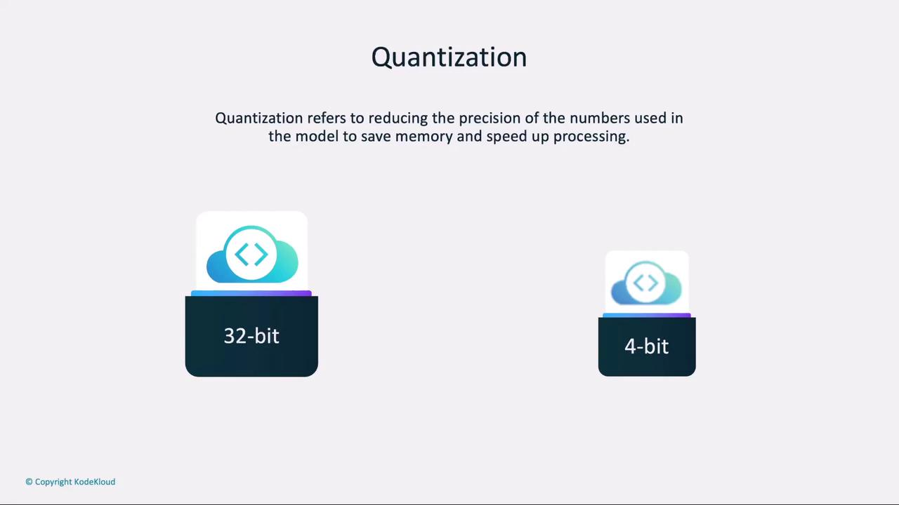
</Frame>

<Callout icon="lightbulb">
  Quantized models (e.g., Q4, Q8) strike a balance between speed and accuracy, ideal for local development.
</Callout>

***

Next, we’ll navigate back to the Ollama website to explore additional models and run a second experiment on our local machine.

<Frame>
  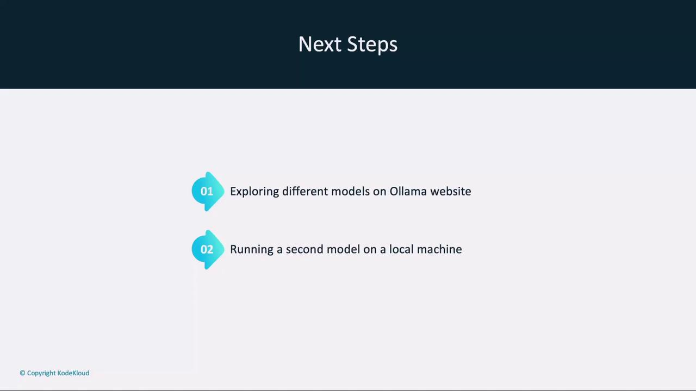
</Frame>

***

## Links and References

* [Ollama Documentation](https://ollama.com/docs/)
* [Transformer Architecture](https://arxiv.org/abs/1706.03762)
* [Quantization Techniques for LLMs](https://www.tensorflow.org/model_optimization/quantization)
* [Kubernetes Basics](https://kubernetes.io/docs/concepts/overview/what-is-kubernetes/)

<CardGroup>
  <Card title="Watch Video" icon="video" href="https://learn.kodekloud.com/user/courses/running-local-llms-with-ollama/module/836a96fe-9951-42b6-83ba-a602299c87c9/lesson/1c40541c-995a-42a4-b393-e99e3cb97b17" />
</CardGroup>


# Ollama Introduction

Source: https://notes.kodekloud.com/docs/Running-Local-LLMs-With-Ollama/Getting-Started-With-Ollama/Ollama-Introduction/page

This guide introduces Ollama, an open-source solution for running and developing large language models locally, addressing AI development challenges.

Welcome to this guide on Ollama, the open-source solution for running and developing large language models (LLMs) locally. We’ll start by examining the challenges in AI development today, then see how Ollama addresses them without vendor lock-in or high cloud costs.

## Current AI Development Challenges

As AI adoption grows, developers face multiple hurdles when building and testing LLM-powered applications:

1. **Complex local setup**\
   Traditional apps spin up a local database, but most LLMs run on remote servers, complicating offline development.

<Frame>
  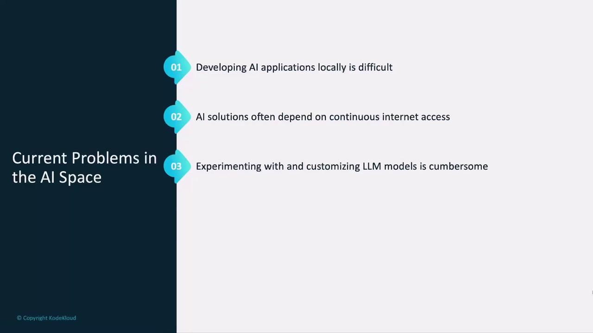
</Frame>

2. **Internet dependency & vendor lock-in**\
   Relying on an external LLM service means constant connectivity, shared billing info, and limited flexibility when new models appear.

<Frame>
  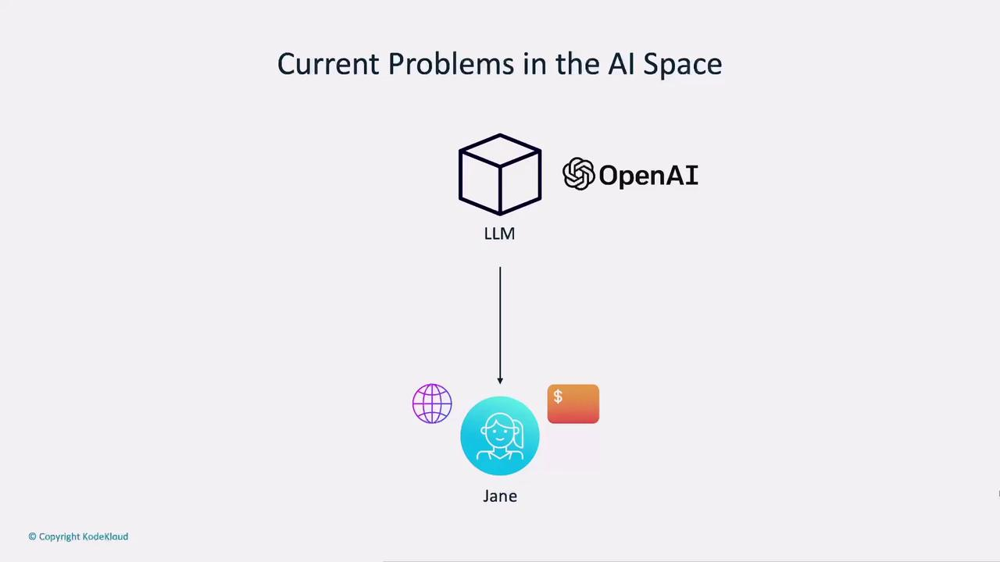
</Frame>

3. **DIY cloud infrastructure is costly**\
   Hosting your own GPU-backed servers requires significant time, expertise, and budget.

<Frame>
  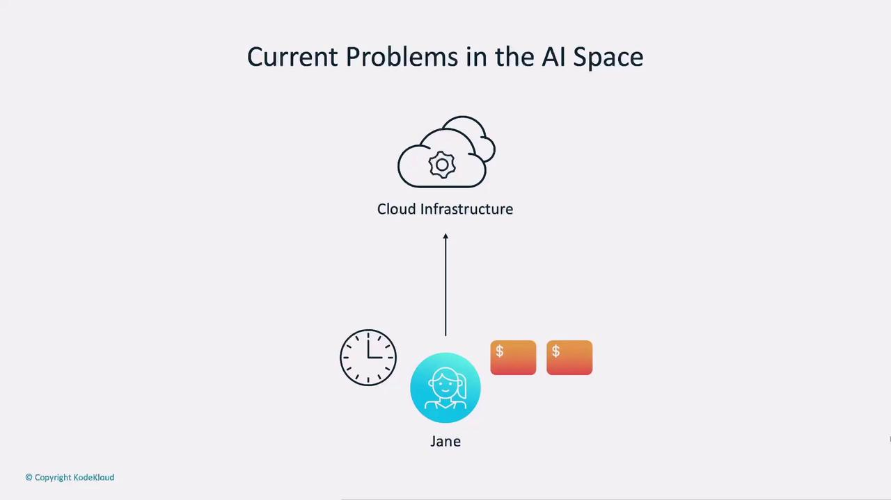
</Frame>

4. **High compute costs & compliance risks**\
   Cloud GPUs rack up bills quickly, and sending sensitive data externally can conflict with GDPR or HIPAA requirements.

<Frame>
  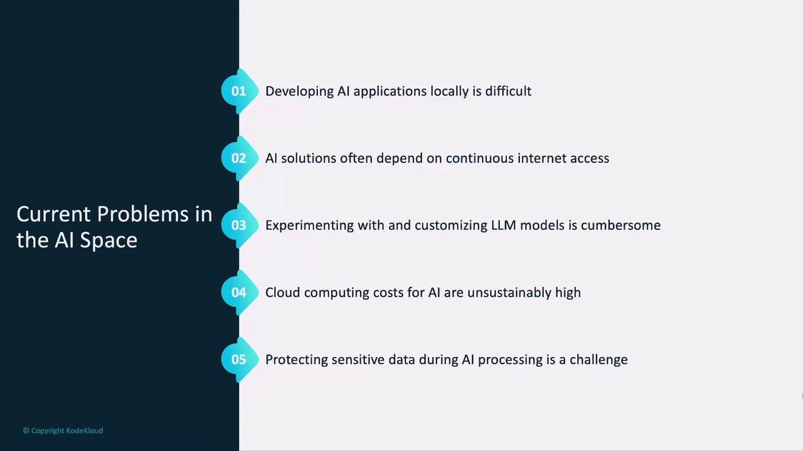
</Frame>

Now that these pain points are clear, let’s explore how Ollama provides a seamless local LLM workflow.

## What Is Ollama?

Ollama is an open-source CLI and API that lets you run, experiment with, and fine-tune LLMs on your own machine. It supports macOS, Windows, Linux, and Docker:

* Access models from various vendors—no single-source lock-in
* Interact via an OpenAI-compatible API for easy integration
* Leverage a growing community of plugins and integrations

<Frame>
  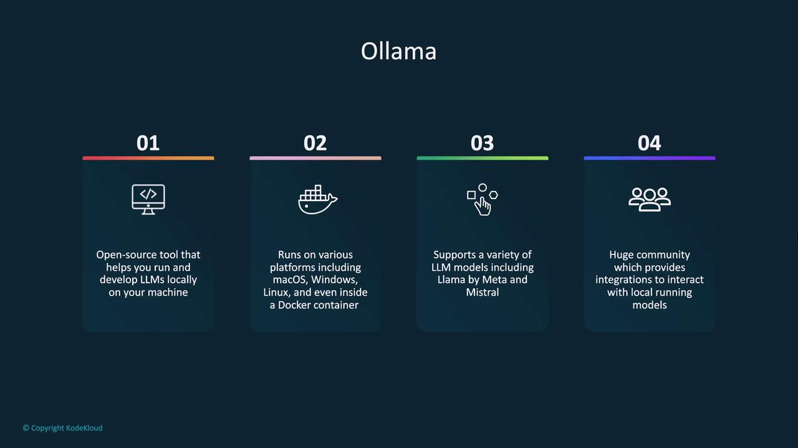
</Frame>

In short, Ollama replaces costly cloud services or DIY infrastructure with a local, secure, and flexible environment for AI development.

## Use Cases

### 1. Developing AI Applications

Build and test AI features entirely offline, free from API charges and data egress:

* No upfront payment or account setup
* Full data privacy—everything runs on your device
* Smooth production transition via OpenAI-compatible endpoints

<Frame>
  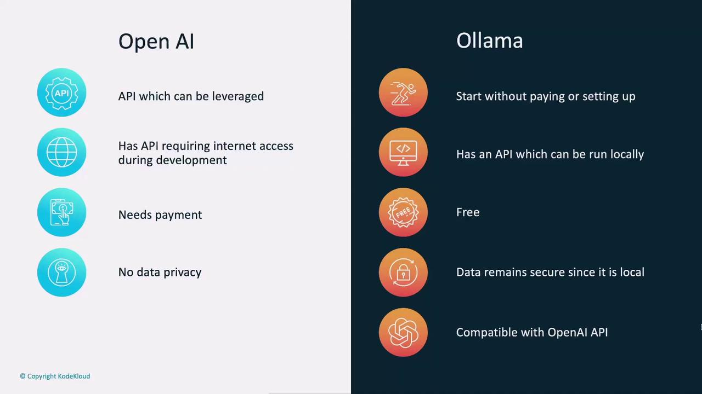
</Frame>

Ollama also supports fine-tuning, enabling you to customize models for:

| Use Case           | Description                       |
| ------------------ | --------------------------------- |
| Chatbots           | Domain-specific conversational AI |
| Virtual Assistants | Task automation and scheduling    |
| Content Generators | Blog posts, marketing copy, more  |
| Code Analyzers     | Static analysis, code completion  |

<Frame>
  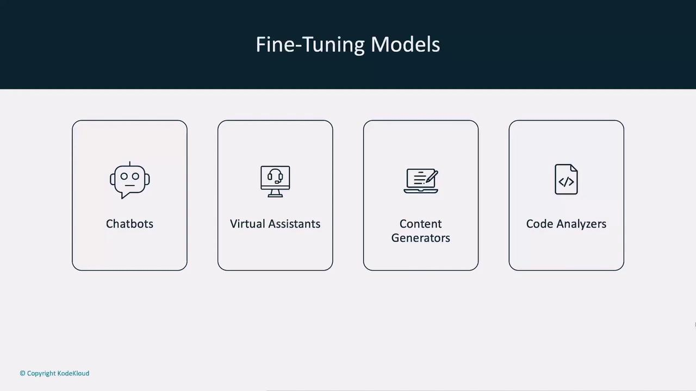
</Frame>

<Callout icon="lightbulb">
  With Ollama’s offline mode, your app’s performance is consistent—no more flakey internet. Switch models on the fly, from code-focused to image-capable, and find the best fit.
</Callout>

<Frame>
  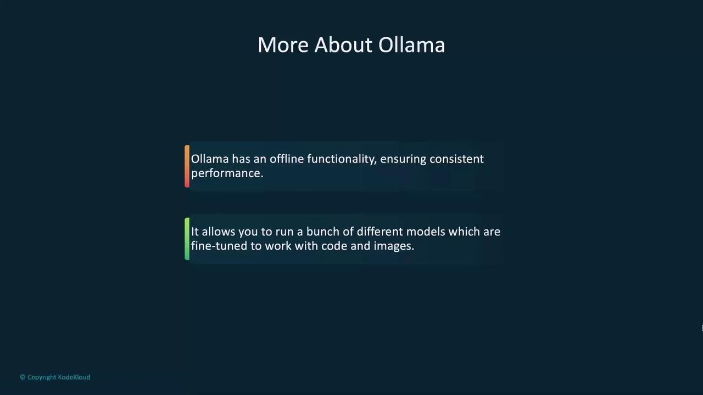
</Frame>

### 2. Privacy-Centric Platforms

Organizations like Growmore handle highly sensitive data and require in-house AI solutions. Ollama enables:

* Local or on-prem deployment
* GDPR & HIPAA compliance by keeping data internal
* Secure employee-facing chatbots without external API calls

<Frame>
  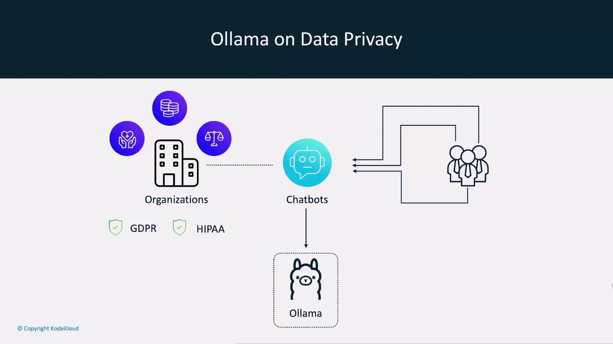
</Frame>

### 3. Exploring AI Advancements

Stay ahead of the curve by testing new models as they emerge:

* Benchmark performance across architectures
* Fine-tune for niche tasks and industries
* Compare behavior side by side to pick the ideal model

<Frame>
  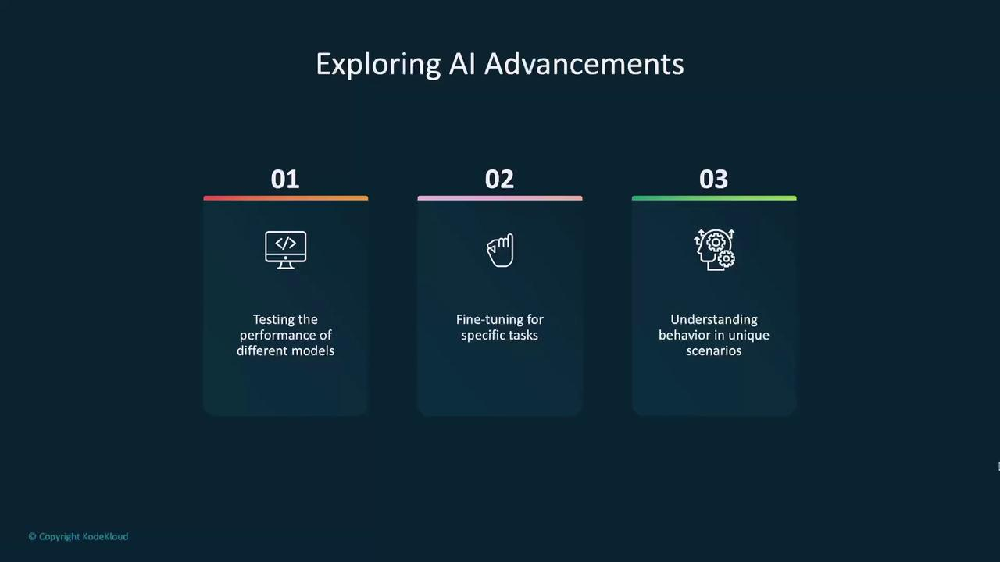
</Frame>

## Benefits of Ollama

| Benefit        | Why It Matters                                       |
| -------------- | ---------------------------------------------------- |
| Secure         | Keeps all data and inference on your local machine   |
| Cost-effective | Free, open source, and no hidden cloud charges       |
| Efficient      | Quick setup, rapid model swaps, and zero vendor lock |

<Frame>
  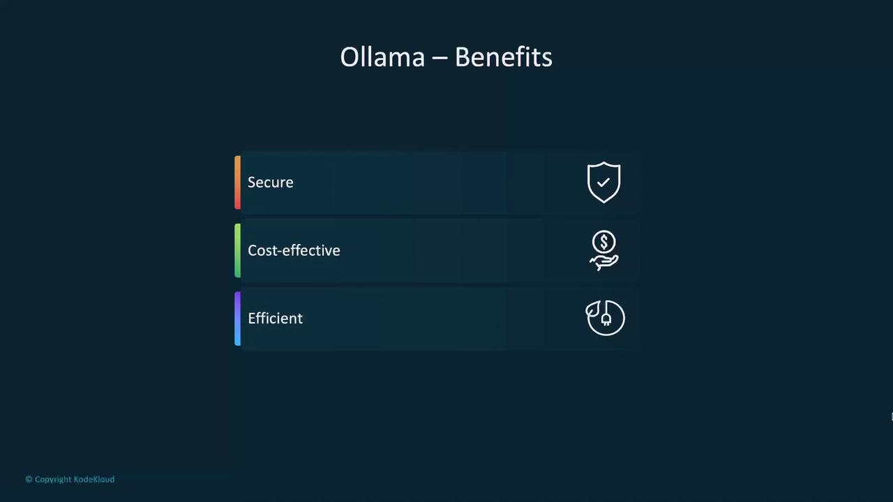
</Frame>

## Get Started

To begin running LLMs locally with Ollama, download the installer for your platform at [ollama.com](https://ollama.com) and follow the setup guide. In the next section, we’ll walk through installing Ollama and launching your first local model. Happy coding!

## Links and References

* [OpenAI service](https://openai.com)
* [GDPR](https://gdpr.eu)
* [HIPAA](https://www.hhs.gov/hipaa/index.html)
* [Ollama Official Website](https://ollama.com)

<CardGroup>
  <Card title="Watch Video" icon="video" href="https://learn.kodekloud.com/user/courses/running-local-llms-with-ollama/module/836a96fe-9951-42b6-83ba-a602299c87c9/lesson/7dc953fc-f816-41ad-8e06-66127d2b72d2" />
</CardGroup>
