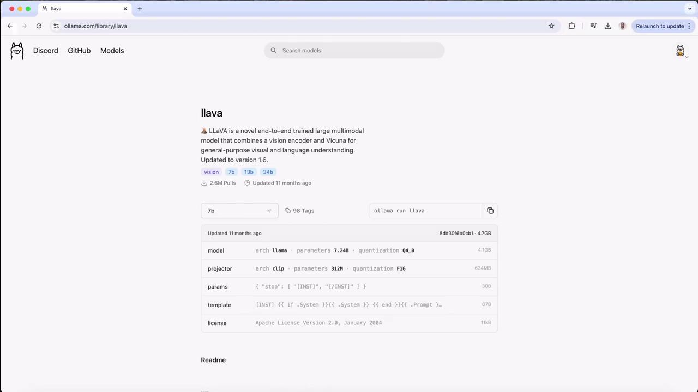
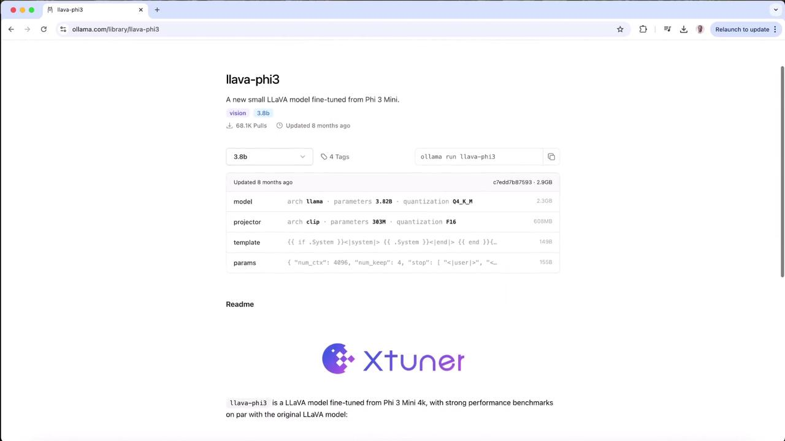
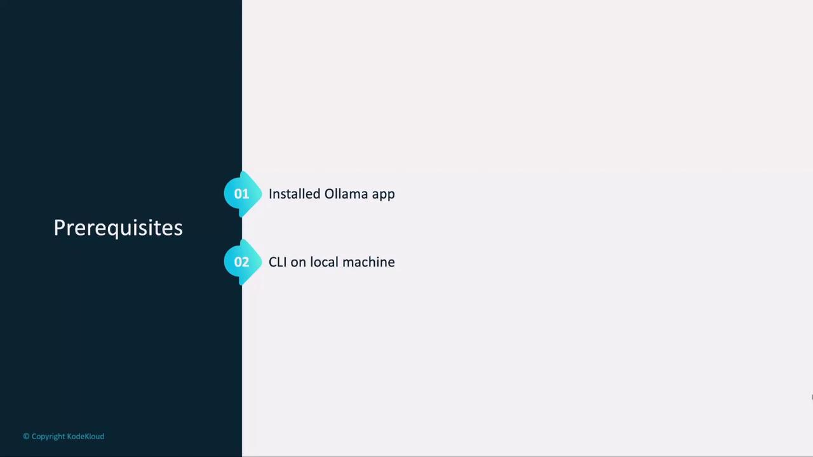
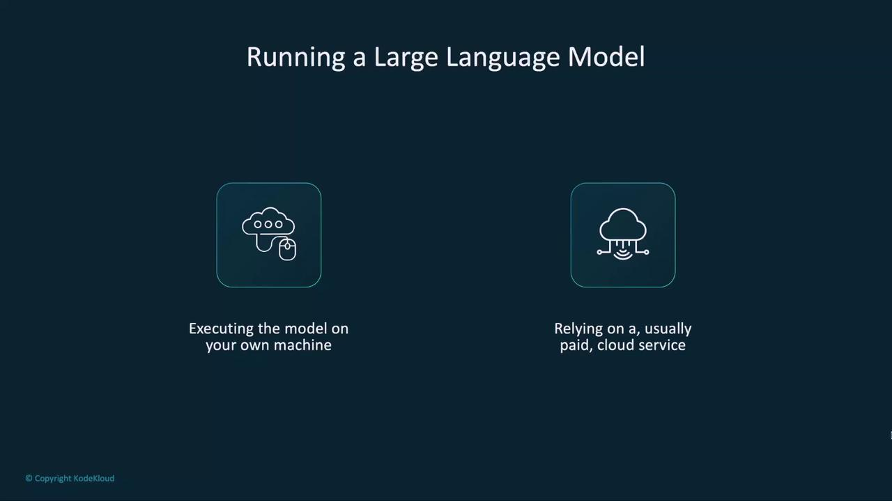
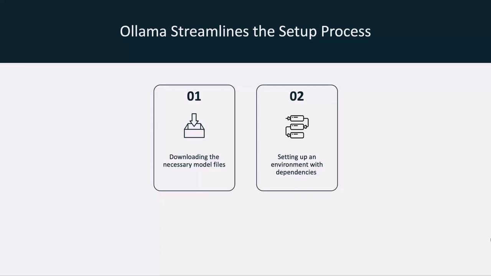
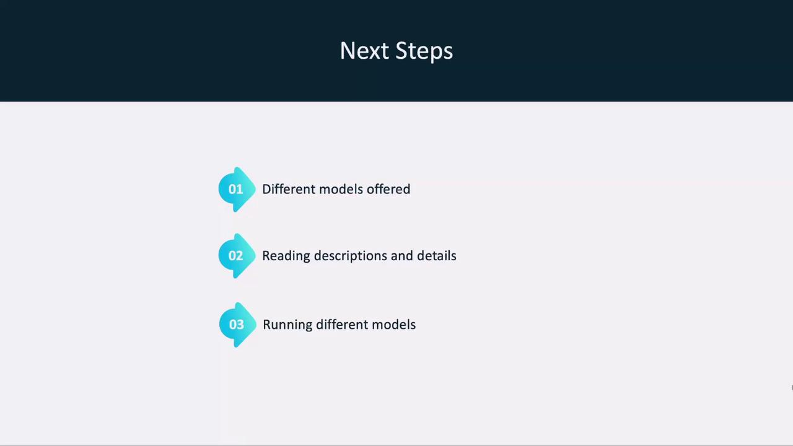

# Launch LLaVA in interactive mode
$ ollama run llava
>>> send a message (/1 for help)
>>> What's in this image? /Users/jmorgan/Desktop/smile.png
The image features a yellow smiley face, which is likely the central focus of the picture.
```text

### Local API Call

```bash
# Send a base64-encoded image via curl
$ curl http://localhost:11434/api/generate -d '{
  "model": "llava",
  "prompt": "What is in this picture?",
  "images": ["[SECRET_REDACTED]"]
}'
```text

---

## 4. Run the Model Locally

If you haven’t pulled LLaVA yet, Ollama will download it when you first run:

<Frame>

</Frame>

```bash
$ ollama run llava
>>> send a message (/1 for help)
```text

Once the prompt appears, test it with your own image—here’s an example using a local `logo.jpeg` file:

```bash
$ ollama run llava
>>> what is there in this image? ./logo.jpeg
Added image './logo.jpeg'
The image features a logo with the text "KodeKloud" in lowercase letters. Above it, there’s an icon representing a cloud or hosting service. To the left of the text "KodeKloud," there’s a stylized cube symbol suggesting programming or technology.
```text

You can continue the conversation:

```bash
>>> what colors are there in the image?
The image features:
1. Blue for the cloud icon and part of the cube.
2. Black or dark gray for the "KodeKloud" text.
3. White/light gray for the background.
>>> /bye
````

***

## 5. Explore Other Image-Capable Models

Ollama’s registry includes smaller or specialized vision models—like a compact LLaVA fine-tuned from Phi 3 Mini:

<Frame>
  
</Frame>

Compare models by size, speed, and accuracy to find the best fit for your project.

***

## Next Steps

* Try different models under the **Vision** category
* Experiment with batch API calls for automated workflows
* Review [Ollama CLI Documentation](https://ollama.com/docs) for advanced usage

Happy local inference!

<CardGroup>
  <Card title="Watch Video" icon="video" href="https://learn.kodekloud.com/user/courses/running-local-llms-with-ollama/module/836a96fe-9951-42b6-83ba-a602299c87c9/lesson/c03ca7a5-857f-446f-bac0-5b628164bc55" />
</CardGroup>


# Running Your First Model

Source: https://notes.kodekloud.com/docs/Running-Local-LLMs-With-Ollama/Getting-Started-With-Ollama/Running-Your-First-Model/page

This guide helps you set up and run your first Large Language Model on your local machine using Ollama, covering prerequisites and setup processes.

In this guide, you'll set up and run your first Large Language Model (LLM) on your local machine using Ollama. We’ll cover prerequisites, compare local versus cloud deployments, walk through Ollama’s setup process, and demonstrate how to chat with a model—all offline and without usage fees.

## Prerequisites

Before you begin, make sure you have:

* The Ollama app installed on your computer
* Access to the Ollama CLI (`ollama` command)

<Frame>
  
</Frame>

<Callout icon="lightbulb">
  Ensure your machine meets the [Ollama system requirements](https://ollama.com/docs/installation) for smooth performance.
</Callout>

## Local vs. Cloud Deployment

You have two options for running LLMs:

| Deployment Type | Pros                             | Cons                                |
| --------------- | -------------------------------- | ----------------------------------- |
| Local           | No usage fees, full data control | Requires disk space, RAM            |
| Cloud Service   | Instant scale, managed infra     | Ongoing costs, data sent externally |

<Frame>
  
</Frame>

## Ollama Setup Process

Ollama automates:

1. Downloading the model files
2. Installing dependencies and preparing the environment

<Frame>
  
</Frame>

## Running a Model with Ollama

We’ll start with **LLaMA 3.2**, Meta’s open-source LLM. To launch:

```bash theme={null}
ollama run llama3.2
```

If the model isn’t already on your system, Ollama will:

1. Pull the manifest and layers
2. Verify the SHA-256 digest
3. Cache metadata for faster future starts
4. Launch the model

Example output:

```bash theme={null}
$ ollama run llama3.2
pulling manifest
pulling 633fc5be925f... 100% 2.2 GB
pulling fa8235e5b48f... 100% 1.1 KB
pulling 542b217f179c... 100%
verifying digest
writing manifest
✔ model llama3.2 ready
```

<Callout icon="triangle-alert">
  The first download can take several minutes depending on your internet speed and disk performance.
</Callout>

## Chatting with Your Model

Once loaded, Ollama drops you into an interactive chat:

```bash theme={null}
$ ollama run llama3.2
>>> hey! how are you?
I'm just a language model, so I don't have emotions or feelings like humans do, but thank you for asking! How can I help you today? Is there something on your mind that you'd like to chat about or ask for assistance with? I'm all ears (or rather, all text).
>>> /bye
```

Type `/bye` to close the session. You now have a fully offline LLM chat interface.

## Next Steps

In the next lesson, we’ll:

* Explore other models supported by Ollama
* Read model descriptions and metadata
* Run additional LLMs locally

<Frame>
  
</Frame>

***

## Links and References

* [Ollama Documentation](https://ollama.com/docs)
* [Meta LLaMA 3 Release Notes](https://ai.meta.com/)
* [Local LLM Best Practices](https://ollama.com/blog/local-llm-guide)

<CardGroup>
  <Card title="Watch Video" icon="video" href="https://learn.kodekloud.com/user/courses/running-local-llms-with-ollama/module/836a96fe-9951-42b6-83ba-a602299c87c9/lesson/be4d479f-8938-4024-84c3-bf3335697501" />
</CardGroup>
